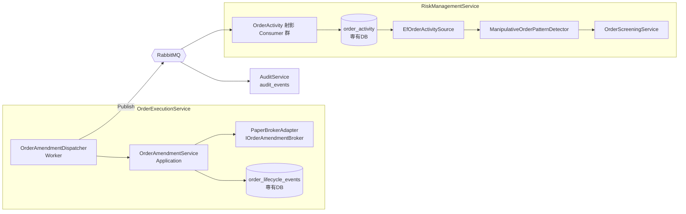

# 仕様書: 注文履歴テレメトリ（Issue #154）

## 起点となる計画書（トレーサビリティ）

- 機能要求: **FR-19**（相場操縦とみなされ得る発注パターンの禁止）／**FR-05**（発注執行）／FR-11（全イベントの時系列記録）
- ユースケース: UC-01（通常の取引サイクル）／UC-02（損切り執行）
- 関連 ADR: ADR-0001（Database per Service）／ADR-0002（証券会社アダプタ）／ADR-0003（承認済み注文のみ発注）
- 関連 IADR: IADR-0006・IADR-0040（相場操縦検知）／IADR-0018（台帳射影）／IADR-0019（監査台帳）／IADR-0016（安全既定ペーパー）／**IADR-0067（本作業の決定）**
- Issue: #154（本体）／Refs #49（前提解錠）／親 #6

## 目的・背景

#49（FR-19）の相場操縦検知アルゴリズムは IADR-0040 で実装済みだが、**本番 DI 登録されていない**。入力である `IOrderActivitySource`（直近の注文アクティビティ窓）に実データを供給する経路が無いためである。

見せ玉・過剰訂正取消・自己レイヤリングは、いずれも**取消・訂正の履歴**が無ければ検知できない。ところが `Shared.Contracts.Events` には注文ライフサイクルのうち発注（`OrderApproved`）と終端結果（`OrderExecuted`）しか無く、**訂正・取消のイベント契約が存在しない**。`InMemoryOrderActivitySource` は誰も `Record` を呼ばないため常に空窓を返し、最小標本ガードで常に無嫌疑になる。

本作業はこの欠落を埋め、「訂正・取消が発生したら、発行され・永続化され・Risk へ供給される」**配管**を通す。

## 対象範囲

### 対象（(d) に厳密限定）

- (d-1) `Shared.Contracts/Events` へ `OrderCancelled` / `OrderModified` を**追加**する（既存イベントの契約は変更しない・追加のみ）
- (d-2) OrderExecutionService で訂正・取消を**発行＋EF 永続化**する（Migration 追加）
- (d-3) AuditService の `AuditEntryFactory` に新イベントの写像と監査 Consumer を追加する（`AuditConsumerCoverageTests` 緑）
- (d-4) Risk の実 `IOrderActivitySource` 実装（永続化された注文アクティビティを供給）
- (d-5) Risk `Worker/Program.cs` での DI 登録（`OrderScreeningService` の `GetService` null 許容設計を尊重し、登録により有効化する）

### 対象外（境界・重要）

- **取消・訂正の駆動元（実ユースケース）**。本作業は配管まで。トリガの実装は各 issue に残す:
  - 時限取消・自動リコンサイル基点 → **#141**
  - pause による強制取消 → **#152**
- 実 OpenD への `TrdModifyOrder` 配線 → 後続・E2E（#82 系）。既定で実接続しない
- コード中の陳腐化した `#13/#17` 参照の全面是正 → **#155**（ただし本作業の実配線に伴い自然に更新される箇所は本 PR で更新する）
- `ManipulationDetectionSettings` の設定ストア化（IADR-0040 のフォローアップのまま）

## 設計

### 全体像



トリガ（#141/#152）は `OrderAmendmentDispatcher` を呼ぶだけでよい状態にする。本 PR では呼び出し元を実装しない。

### (d-1) イベント契約（追加のみ）

```csharp
// FR-05, FR-19: 発注済み注文が訂正された（数量・価格の変更）
public record OrderModified(
    Guid DecisionId, string OrderId,
    int PreviousQuantity, decimal PreviousPrice,
    int Quantity, decimal Price,
    string Reason, DateTimeOffset ModifiedAt);

// FR-05, FR-19: 発注済み注文が取り消された
public record OrderCancelled(
    Guid DecisionId, string OrderId,
    string Reason, DateTimeOffset CancelledAt);
```

- `DecisionId` を相関キーにする。既存注文系イベント（`OrderApproved`/`OrderExecuted`）と同一の相関系に載せ、Risk 側で銘柄・方向を `OrderApproved` から補完できるようにする（`OrderExecuted` と同じ設計・IADR-0018）。
- 訂正前後の値を両方持たせる。監査（FR-11）で「何がどう変わったか」がイベント単体で読めるようにするため。
- `Reason` は自由文字列。トリガ（#141/#152）が理由を書き込む。列挙にするとトリガ側の理由体系を先取りしてしまうため、境界を守って文字列にする。

### (d-2) OrderExecution 側

- **`IOrderAmendmentBroker`（新ポート・`Shared.Contracts.Ports`）**: `ModifyOrderAsync` / `CancelOrderAsync`。`IBrokerAdapter` は**変更しない**（既存実装者を壊さない）。`PaperBrokerAdapter` のみが実装する。`MoomooBrokerAdapter` は実装しない＝**実ブローカー選択時は訂正・取消の口が存在しない**（fail-safe を型で担保・IADR-0067）。
- **`PaperBrokerAdapter` の非終端状態（最小の仕組み）**: 現状は `PlaceOrderAsync` が常に即時 `Filled`/`Rejected`（終端）を返すため、取消も訂正も構造的に成立しない。コンストラクタに `bool immediateFill = true` を追加し、**既定は現挙動と完全に同一**とする。`false` のときのみ発注は `Accepted`（非終端）に留まり、訂正・取消が成立する。本 PR で `false` を使うのはテストのみで、本番配線の既定は不変。
- **`OrderAmendmentService`（Application）**: ブローカ操作 → 永続化 → イベントを**返す**（Application は MassTransit を参照しない既存レイヤリングを維持）。
- **`OrderAmendmentDispatcher`（Worker）**: Application を呼び、`IPublishEndpoint` で発行する。#141/#152 の呼び出し口。
- **永続化**: 追記専用テーブル `order_lifecycle_events`（`Id`, `DecisionId`, `OrderId`, `Kind`, `PreviousQuantity?`, `PreviousPrice?`, `Quantity?`, `Price?`, `Reason`, `OccurredAt`）。Migration を追加する。`OrderId`・`OccurredAt` にインデックス。

### (d-3) 監査

`AuditEntryFactory.From(OrderModified)` / `From(OrderCancelled)` を追加し、相関は `DecisionId`（既存注文系と同様）。`Symbol` は持たないため `null`（`OrderExecuted` と同じ）。対応する Consumer を `AuditEventConsumers` へ追加し、`AuditConsumerCoverageTests` を緑に保つ。

### (d-4) Risk 側の実供給 ← **設計の要**

`IOrderActivitySource.GetRecentActivity` は**同期契約**（`RiskEvaluator` が同期純関数）であり、かつ発注審査のホットパス上にある。したがって OrderExecution への同期 HTTP 照会（sizing-context / open-positions の型）は採れない。**Risk 専有 DB への射影**とする（ADR-0001・IADR-0018 の先行事例と同型）。決定の詳細は IADR-0067。

- **`order_activity` テーブル（新規・Risk 専有 DB）**: `DecisionId`(PK), `Symbol`, `Market`, `Side`, `PlacedAt`, `Quantity`, `FilledQuantity`, `Status`, `AmendmentCount`, `TerminalAt?`。`(Symbol, Market, PlacedAt)` に複合インデックス（窓照会の形）。
- 既存の `approved_orders` / `trade_fills`（#63 台帳）は**再利用しない**。台帳は `Filled` のみを載せる設計であり、本用途が必要とする「約定ゼロで取り消された注文」を構造的に捨てている。関心も寿命も異なるため別テーブルとする。
- **射影 Consumer 群**（`IOrderActivityStore` 経由）:
  | イベント | 射影 |
  | --- | --- |
  | `OrderApproved` | 行を新規作成（`PlacedAt=ApprovedAt`, `Status=Accepted`）。既存は無視（冪等） |
  | `OrderExecuted` | `Status`/`FilledQuantity` を更新、終端なら `TerminalAt` を設定 |
  | `OrderModified` | `AmendmentCount` を +1、`Quantity` を訂正後で更新 |
  | `OrderCancelled` | `Status=Cancelled`・`TerminalAt` を設定 |
- `PlacedAt` は `OrderApproved.ApprovedAt` で近似する。承認から発注までは同期的に連続しており、窓長（既定単位は分〜時間）に対して誤差は無視できる。厳密な発注時刻は `OrderExecuted` にも無く、本 PR で新契約を足すのはスコープ外。
- **`EfOrderActivitySource`**: `order_activity` から `[asOf - lookback, asOf]` の行を読み、`OrderActivityWindow` を組む。行が無ければ空窓（最小標本ガードで無嫌疑＝fail-safe）。
- `InMemoryOrderActivitySource` は**削除しない**（Application 層の既存テストが使用）。位置づけコメントのみ実態に合わせて更新する。

### (d-5) DI 登録

`RiskManagementService.Worker/Program.cs` に以下を追加する（#81 と隣接する箇所・最終段で develop 取り込みリベース）:

```csharp
builder.Services.AddScoped<IOrderActivityStore, EfOrderActivityStore>();
builder.Services.AddScoped<IOrderActivitySource, EfOrderActivitySource>();
builder.Services.AddSingleton(TradingDefaults.CreateManipulationDetectionSettings());
builder.Services.AddScoped<IManipulativeOrderPatternDetector, ManipulativeOrderPatternDetector>();
```

`OrderScreeningService` の `sp.GetService<IManipulativeOrderPatternDetector>()` は変更不要。登録されたことで非 null になり、相場操縦判定が本番経路で有効になる（既存設計を尊重）。併せて「未登録の理由」を述べた陳腐化コメント（#13/#17 参照）は、事実でなくなるため本 PR で更新する。

## 受け入れ基準

- [x] `Shared.Contracts/Events` に `OrderModified`・`OrderCancelled` が追加され、既存イベントの契約が不変である
- [x] `OrderAmendmentService` が訂正・取消をブローカへ適用し `order_lifecycle_events` へ永続化する（Migration あり）
- [x] `OrderAmendmentDispatcher` が `OrderModified`/`OrderCancelled` を発行する
- [x] `AuditEntryFactory` に両イベントの写像があり、監査 Consumer が存在する（`AuditConsumerCoverageTests` 緑）
- [x] `EfOrderActivitySource` が `order_activity` から窓を供給する（Migration あり）
- [x] 射影 Consumer 群が承認・約定・訂正・取消を `order_activity` へ反映する（再送で冪等）
- [x] Risk `Worker/Program.cs` で実 `IOrderActivitySource` と検出器が DI 登録され、相場操縦判定が本番経路で有効になる
- [x] `PaperBrokerAdapter` の既定挙動（即時全量約定）が不変である（回帰テストで固定）
- [x] `MoomooBrokerAdapter` に訂正・取消の口が生えていない（実接続しない・型で担保）
- [x] `dotnet build` / `dotnet test` / `dotnet format` が緑（CI 相当 `Category!=Integration` 全緑）

## テスト方針

TDD（失敗するテストを先に書く）。

| 層 | テスト |
| --- | --- |
| `PaperBrokerAdapter` | 既定 `immediateFill=true` で従来どおり即時 `Filled`（**既定不変の回帰固定**）／`false` で `Accepted` に留まる／非終端の取消・訂正が成立／終端注文の取消・訂正は `InvalidOperationException`／未知 ID は `InvalidOperationException` |
| `OrderAmendmentService` | 取消・訂正でブローカ適用＋行の永続化＋正しいイベントを返す／ブローカ失敗時に永続化しない（不整合を作らない） |
| `OrderAmendmentDispatcher` | `ITestHarness` で `OrderModified`/`OrderCancelled` が発行される |
| `EfOrderLifecycleStore` | 追記・照会（EF InMemory） |
| `AuditEntryFactory` | 両イベントの写像（相関・Summary・Detail 全量 JSON） |
| `AuditConsumerCoverageTests` | 既存テストが緑（新イベント追加に追随） |
| Risk 射影 Consumer | 承認→約定/取消/訂正の各射影／再送の冪等／相関する承認が無いイベントは無視 |
| `EfOrderActivitySource` | 窓内のみ返す／窓外は刈る／行なしは空窓／`OrderActivityRecord` の導出（`IsCancelledWithoutFill`・`Lifetime`）が成立 |
| 結線 | Risk Worker の DI で `IOrderActivitySource`・`IManipulativeOrderPatternDetector` が解決できる |

実基盤（RabbitMQ/PostgreSQL/OpenD）に依存するテストは書かない。CI は既存の分離方針（IADR-0049）に従い、実コンテナ E2E は #82 系に残す。

## 計画書との差異

- 差異: なし

## 未決事項

- なし（`immediateFill` の本番利用可否は本 PR では既定 `true` 固定とし、判断を先送りしない＝現挙動維持）
