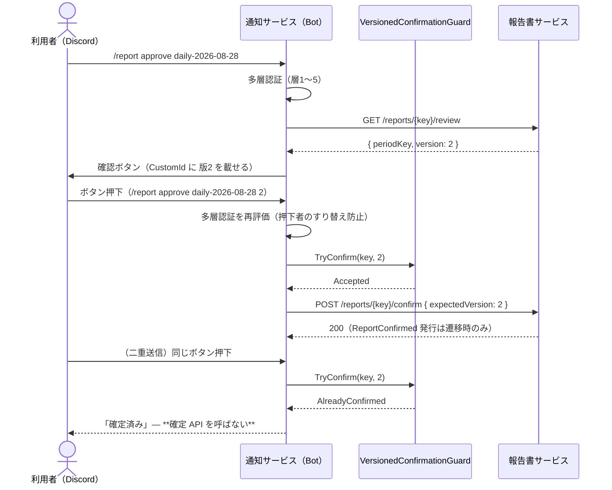

# 仕様書: Discord Bot・通知の再実装（#341）

> 本仕様書は実装着手前に作成した。**#341 は「ゼロからの再実装」ではない。**
> 通知サービスには Gateway 常駐・多層認証・確認ステップ・冪等機構が既に実装済みであり、
> 本作業は **issue の要求と現行コードのギャップを洗い出して差分実装する**ものである。

## 起点となる計画書（トレーサビリティ）

- 機能要求（FR）: **FR-09**（報告書の確定・取引の実行・エラー・リスク統制の発動を Discord に通知できる）／
  **FR-14**（Discord から対話 — 報告書の質疑・修正指示・確定、kill switch 起動、新規発注の一時停止/再開。
  **設定値の変更は参照のみ**とし kill switch と pause/resume のみを例外とする）
- ユースケース（UC）: UC-03〜05（報告書のレビュー・確定）・UC-06（統制操作）
- 画面（SC）: なし（**破壊的統制操作は Discord Bot へ一元化し専用画面を作らない**）
- 関連 ADR: ADR-0009（pause/resume と統制の優先順位）・ADR-0003（確定は利用者のみ）・ADR-0028（GFV 停止の解除）
- 計画書リンク: [07_discord-bot-design](https://github.com/endazon/project-planning/blob/main/projects/ai-stock-trading/06_technical/07_discord-bot-design.md)（fixed）・
  [01_requirements](https://github.com/endazon/project-planning/blob/main/projects/ai-stock-trading/02_requirements/01_requirements.md)（fixed）

## 目的・背景

#341 は **自動株取引システムの唯一の緊急停止操作面**（kill switch）を含む。したがって本作業の第一目的は
「既にあるものを壊さないこと」であり、第二目的が「issue の受け入れ基準を実際に担保するテストと、
欠けている経路の実装を足すこと」である。

## ギャップ分析（現状 → 要求 → 差分）

### 母集合の引き直し（`.claude/rules/traceability.repo.md` 規則 9・10）

**「通知すべき事象」を記憶で挙げない。** 3 軸で走査した生の出力を以下に置く（`head` 等で切っていない）。

**軸 1 — 契約イベント型の全数**（`grep -rhoP "^public record \K\w+" backend/Shared/AiStockTrading.Shared.Contracts/Events/*.cs | sort`）: **33 件**

```
AssumptionsChanged / BacktestEvaluated / BorrowFeeAccrualUnavailable / BorrowFeeAccrued /
BrokerAccountObserved / BrokerAvailabilityObserved / BrokerPositionsObserved / BuyInInferred /
CostThresholdReached / DailyPolicyUnconfirmed / FxRateSourceFellBack / FxRateSourcePrimaryRestored /
FxRateStale / GoodFaithViolationRecorded / GoodFaithViolationsCleared / InformationCollected /
LlmCostIncurred / MaintenanceMarginReductionExecuted / OrderApproved / OrderCancelled / OrderExecuted /
OrderModified / OrderRejected / PositionCloseRequested / PositionClosedWithStaleFxRate /
PositionReconciliationDrift / PriceMovementDetected / ReportConfirmed / ReportDraftPresented /
StageTransitioned / StopLossTriggered / TradeDecisionMade / WithdrawalTriggered
```

**軸 2 — 現に通知しているイベント型**（`grep -oP "public Task Handle\(\K\w+" NotificationHandlers.cs | sort`）: **16 件**

```
AssumptionsChanged / BuyInInferred / CostThresholdReached / DailyPolicyUnconfirmed /
FxRateSourceFellBack / FxRateSourcePrimaryRestored / FxRateStale / MaintenanceMarginReductionExecuted /
OrderExecuted / OrderRejected / PositionClosedWithStaleFxRate / PositionReconciliationDrift /
ReportConfirmed / ReportDraftPresented / StopLossTriggered / WithdrawalTriggered
```

**軸 3 — 詳細設計07 §通知設計（FR-09）の表**: 7 行（取引実行／損切り執行／リスク統制の発動／報告書ドラフト提示／
報告書確定／システム異常／費用警告）。

**差集合（軸1 − 軸2）＝ 17 件**を 1 件も飛ばさず判定した表が次である。**除外は理由まで書く**（規則 6）。

| 未通知イベント | 詳細設計07 の該当行 | 判定 | 理由 |
| --- | --- | --- | --- |
| **GoodFaithViolationRecorded** | リスク統制の発動（**ガード違反**） | **本 PR で通知を足す** | **発行された時点でガードをすり抜けた買付が現に約定している**（契約コメントが明記）。累積で新規取引が止まり、**停止の解除窓口は Discord の `/gfv clear` だけ**（ADR-0028 決定3）。通知が無ければ「止まったこと」も「解除が要ること」も利用者に届かない |
| GoodFaithViolationsCleared | （該当なし） | 除外 | **利用者自身の Discord 操作の結果**であり、窓口で応答として既に見えている。監査は AuditService が購読済み |
| BorrowFeeAccrualUnavailable | システム異常（収集失敗） | **除外（後続）** | 該当はする。ただし **空売り建玉 × 取引日** で発生し得るのに**同種イベントの集約（バッチ化）機構が本サービスに無い**（詳細設計07 §通知設計は「同種イベントの連発は集約」を前提にしている）。集約なしで足すと通知が埋もれ、損切り・統制発動の通知の可視性を下げる。**#341 の射程外として環流候補に挙げる**（後述「計画書との差異」） |
| BrokerAvailabilityObserved | システム異常（OpenD 切断） | 除外 | **発行＝到達できた事実**であり、停止は「発行しないこと」で表す設計（契約コメント）。**通知に使えない**（沈黙を通知にはできない）。死活の通知は NFR-03 のとおり**基盤の可観測性スタックの別系統**である |
| BrokerAccountObserved / BrokerPositionsObserved | — | 除外 | 定期観測の正常系。連発する |
| InformationCollected | — | 除外 | 1 巡回の**成功**通知。正常系・連発 |
| LlmCostIncurred / BorrowFeeAccrued | 費用警告 | 除外 | 逐次計上の正常系。**しきい値到達は CostThresholdReached が通知済み**（表の「費用警告」はこちらが担う） |
| OrderApproved / TradeDecisionMade / PriceMovementDetected / PositionCloseRequested | — | 除外 | 判断・要求の中間状態。**結果は OrderExecuted / OrderRejected が通知する**。連発する |
| OrderCancelled / OrderModified | 取引実行（約定） | 除外 | 注文の終端・変更は `OrderExecuted` の `Status`（Filled 以外は Warning）として既に通知経路に乗る |
| StageTransitioned | — | 除外 | 段階遷移は**利用者本人の承認操作**でのみ起き、窓口で応答が返る。自動の安全側発火は `WithdrawalTriggered` が通知済み |
| BacktestEvaluated | — | 除外 | バックテスト評価（FR-15）。詳細設計07 の通知表に対応行が無い |

> 🔴 **軸 3 の「システム異常（API障害・OpenD 切断・構成ドリフト警告）」に対応する契約イベントは、走査の結果
> 本リポジトリに存在しない。** 上表のとおり `BrokerAvailabilityObserved` は沈黙で停止を表す設計であり使えない。
> **「エラー通知が無い」のではなく「エラーを表すイベントが供給されていない」**のが実態である。
> 現に届いているのは劣化の通知（`FxRateStale` / `FxRateSourceFellBack`）と乖離の通知
> （`PositionReconciliationDrift`）であり、死活は NFR-03 が別系統と定めている。
> **本 PR ではイベントの新設を行わない**（供給側は他サービスであり #341 の射程外）。環流候補とする。

### 対話（FR-14）のギャップ

| 観点 | 現状（実測） | issue #341 の要求 | 差分 |
| --- | --- | --- | --- |
| kill switch 起動/解除 | `KillSwitchCommandHandler` ＋ 確認ボタン ＋ 確認フレーズ（起動・解除とも） | 同左 | **なし**（充足） |
| pause / resume | `PauseCommandHandler` ＋ 確認ボタン | 同左 | **なし**（充足） |
| 段階の昇格承認 | `StageGateCommandHandler` ＋ 確認ボタン ＋ 引き下げ警告 | 多層認証を通らない昇格承認が拒否される | 実装は充足。**否定形テストは既存**（`StageGateCommandHandlerTests`） |
| GFV 停止の解除 | `GoodFaithViolationCommandHandler` ＋ 確認フレーズ ＋ 理由必須 | 同左 | **なし**（充足） |
| **報告書の確定（冪等）** | `VersionedConfirmationGuard` が**存在するがどこからも呼ばれていない**。`/report` コマンドは parser にも Gateway にも無い | **報告書の確定・修正指示を Discord から行い、二重送信で方針が二重適用されない** | 🔴 **最大のギャップ。本 PR で実装する** |
| 設定変更は参照のみ | parser が未知コマンドを `Unknown` に倒す（実装上は満たす） | **否定形テストで固定** | 🔴 **テストが無い。本 PR で足す** |
| 多層認証 | 層 1〜5（DM/Guild/Channel/許可リスト/Keycloak）＋層 6（確認フレーズ） | 同左 | **なし**（充足） |

### 受け入れ基準に対する担保のギャップ

| 受け入れ基準 | 現状 | 差分 |
| --- | --- | --- |
| 冪等確定（二重送信で二重適用されない） | `VersionedConfirmationGuardTests` が**機構だけ**を固定。**確定経路に結線されていない** | 🔴 経路を実装し、経路上で固定する |
| 多層認証を通らない kill switch・昇格承認の拒否 | `KillSwitchCommandHandlerTests` / `StageGateCommandHandlerTests` にあり | 充足（本 PR は `/report` にも同型を足す） |
| **設定変更が参照のみ**（否定形） | **無し** | 🔴 足す |
| 通知テンプレートの**ゴールデンテスト**（必須項目の欠落検知） | `NotificationFormatterTests` は個別項目の部分一致。**全文固定は無く、テンプレートを 1 本足しても検査は増えない** | 🔴 全文ゴールデン＋**母集合をリフレクションで引く網羅テスト**を足す |
| 秘密情報の非出力（否定形） | Webhook URL は `DiscordWebhookHttpClientTests` が固定。**Bot トークン・確認フレーズは無し** | 🔴 足す |

## 対象範囲

- **対象**:
  1. `/report show` / `/report approve` / `/report request-changes`（版番号付き冪等確定・多層認証）
  2. `GoodFaithViolationRecorded` の通知テンプレートとハンドラ
  3. 受け入れ基準 4 種のテスト（冪等・設定変更の参照のみ・ゴールデン・秘密情報の非出力）
- **対象外**:
  - **実 Discord サーバ・Bot トークンでの疎通**（`docs/blocked-tasks.md` **A-7a**。本 PR はフェイク／テストダブルで基準を満たす。
    **実接続で確認していないことを「確認した」と書かない**）
  - **#318（漏えいした Webhook URL の失効・再発行）**。人間の操作を要する
  - 自然文リプライの AI 分析サービスへの中継（`MessageContent` Intent と #14 側の対話 API を要し、詳細設計07 も
    「Bot は薄いフロントエンド」と定める。本 PR は**版番号付きレビュー操作の窓口**に限る）
  - 通知のバッチ化（集約）機構。**未実装であることを本書に明記して残す**
  - イベントの新設（供給側は他サービス）

## 設計

### 1. 報告書レビューの窓口（FR-14・詳細設計07 §二重実行防止）



- **権威は報告書サービス**（確定 API は版番号付き冪等）。Bot の Guard は**窓口での多重押下を弾く前段**である。
  二重適用は 2 層で防がれる。
- **Guard の予約は失敗時に解放する**（`Release`）。解放しないと確定 API がネットワーク障害で失敗したとき
  **同じ版を二度と確定できなくなる**（唯一の確定窓口であるため運用上の詰みになる）。
- **`/report show` は版番号だけを返し、報告書本文を取りに行かない。** 要約は `ReportDraftPresented` 通知が
  既に届けており、その経路は発行側でサニタイズ済みである（IADR-0116 決定3/4）。Bot が生本文を直接取ると
  **そのサニタイズを迂回する**。
- **`ReviewState`（enum）を読まない。** Risk 側と同じく数値/文字列いずれの JSON 表現にも結合しない
  （IADR-0081 決定1 と同型）。Bot が要るのは版番号だけである。
- **`periodKey` は `^[a-z0-9-]{1,32}$` に限定する。** そのまま URL パスへ載るため、書式外は parser で
  `Unknown` に倒す（パス・トラバーサルを構造的に作らない）。

### 2. GFV 違反の通知（FR-09・FR-19）

`NotificationFormatter.From(GoodFaithViolationRecorded)` を足し、`Critical` で通知する。本文には契約が
「取り違えるな」と明記した限界（**自らのガードの失敗回数**であってブローカのカウンタの写しではない）と、
**解除の窓口が Discord だけであること**を書く。**停止したとは断定しない**（停止のしきい値は Risk 側が持ち、
本イベントは件数を運ばない）。`SettledCashInBase` の `null` は **「未供給」と表示し 0 と書かない**（#424 の表示規約）。

### 3. テスト（受け入れ基準の担保）

| 新規テスト | 何を固定するか |
| --- | --- |
| `ReportCommandHandlerTests` | 冪等確定（二重送信で確定 API が 1 回だけ）・版落ち（Stale）・多層認証の否定形・失敗時の予約解放 |
| `HttpReportReviewControllerTests` | GET review / POST confirm / POST request-changes の呼び先・本文・失敗を成功に見せないこと |
| `DiscordSettingsAreReadOnlyTests` | **設定変更コマンドが 1 つも解釈されず、どのコントローラも呼ばれない**（否定形） |
| `NotificationTemplateGoldenTests` | 全テンプレートの**全文ゴールデン**＋**母集合をリフレクションで引く網羅**（テンプレートを足してゴールデンを書かなければ落ちる） |
| `SecretRedactionTests` | **Bot トークン・確認フレーズ・Webhook URL がログへ出ない**（否定形） |
| `VersionedConfirmationGuardTests`（追記） | `Release` の境界（他版は解放しない・未登録の解放は無害） |

統制系の 3 点セット（境界値テーブル・プロパティベース・否定形）は `ReportCommandHandlerTests` で満たす
（版番号の境界テーブル・任意の送信回数で確定 API 呼び出しが 1 回に収束するプロパティ・認証否定形）。

## 受け入れ基準

- [x] 冪等確定: 同一 `periodKey + 版番号` の二重送信で確定 API が 1 回しか呼ばれない
- [x] 多層認証を通らない kill switch・昇格承認・報告書確定が拒否される（否定形）
- [x] 設定変更が Discord からは参照のみである（否定形）
- [x] 通知テンプレートのゴールデンテスト（必須項目の欠落検知）
- [x] 秘密情報（Bot トークン・確認フレーズ・Webhook URL）がログへ出力されない（否定形）
- [x] `dotnet build` / `dotnet test` / `dotnet format --verify-no-changes` と文書系検査器が通る

## テスト方針

すべて **xUnit v3 ＋ AwesomeAssertions**、`using Xunit;`。フェイク／テストダブルのみを用い、
実 Discord・実ネットワークへは一切接続しない。テストのコメントに起点 ID（FR-09 / FR-14）を残す。

## 計画書との差異

- 差異: **あり（不足 2 件。いずれも環流候補）**
  1. **詳細設計07 §通知設計「システム異常」に対応する契約イベントが存在しない。** OpenD 切断・API 障害・
     構成ドリフト警告を表すイベントの供給元が無く、通知経路を作れない（`BrokerAvailabilityObserved` は
     沈黙で停止を表す設計のため使えない）。**供給側は他サービスであり #341 の射程外**。
  2. **詳細設計07 §通知設計が前提にする「同種イベントの集約（バッチ化）」機構が未実装である。**
     集約が無いため `BorrowFeeAccrualUnavailable` のような高頻度になり得る事象を通知経路へ載せられない。

  いずれも**本 PR では起票しない**（起票前に既存 issue の検索が要る。報告で環流候補として挙げる）。

## 未決事項

- **実 Discord での疎通は未検証**（A-7a）。本 PR の成果はすべてフェイク／テストダブル上の検証である。
- #318（Webhook URL の失効・再発行）は人間の操作待ちであり、本 PR は扱わない。
