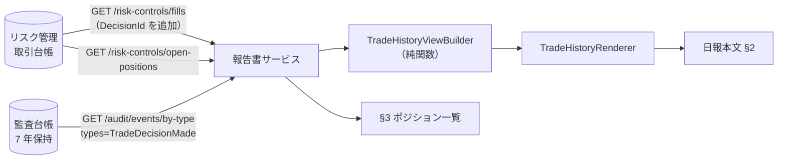

# 仕様書: 日報の取引履歴・取引詳細・見送り判断・ポジション一覧の結線と供給経路（#563）

## 起点となる計画書（トレーサビリティ）

- 機能要求（FR）: FR-16（テンプレート準拠・**数値はコード集計であり LLM に計算させない**）・FR-06（報告書の階層管理）・FR-11（監査記録）
- ユースケース（UC）: UC-05（日報）
- 画面（SC）: なし
- 関連 ADR: ADR-0003（完全無人での方針変更を行わない）
- 関連 IADR: [IADR-0042](../adr/IADR-0042_report-review-state-machine-and-detail-rendering.md)（明細を独立純関数レンダラにし、**`ReportRenderer` 本文への合流は #63 連携スライスで行う**と明記した）・[IADR-0251](../adr/IADR-0251_report-numeric-aggregation-outside-llm-context.md)・[IADR-0199](../adr/IADR-0199_fx-status-supply-wiring.md)（監査台帳からの期間照会の作法）
- 計画書リンク: `projects/ai-stock-trading/06_technical/04_report-templates.md`（fixed）§日報テンプレート §2・§3

## 目的・背景

`ReportService.Domain.TradeHistoryRenderer` は実装もテストも揃っているが、**本番コードからの呼び出しが 1 件も無い**。
その結果、生成される日報の本文に **§2 取引履歴（全明細）・取引詳細・見送り判断・§3 ポジション一覧**が
**一度も現れていない**（#563）。

IADR-0042 は当時これを意図した後回し（「`ReportRenderer` 本文への明細合流は #63 連携スライスで行う」）として
記録したが、**その後続が実行されないまま**、`TradeHistoryRendererTests`（レンダラ直接呼び出し）が緑であり、
`ReportRenderer` のゴールデンが**節が無い状態を正として凍結していた**ため、誰も気づけなかった。

本作業は「**供給経路を作る → 結線する → ゴールデンを更新する**」の順で、この穴を閉じる。

## 母集合の引き直し（規則 9・10。軸ごとの件数と除外理由）

> 規則 5「軸を 1 本で終わらせない」に従い 6 軸で引いた。**引いた結果と、除外したものとその理由**を以下に残す（規則 6）。
> 走査は**パスの除外だけ**で行い（規則 3・4）、`--include` と行フィルタで絞っていない。

### 軸 1: `TradeHistoryRenderer` とその入力型の参照（誤りの側から引く・規則 1）

```
grep -rn "TradeHistoryRenderer\|TradeHistoryView\|TradeHistoryLine\|TradeDetailBlock\|SkippedDecision\|TradeTrigger" . \
  --exclude-dir=obj --exclude-dir=bin --exclude-dir=.git
```

| ファイル | 件数 | 区分 |
| --- | --- | --- |
| `backend/Services/ReportService/Tests/TradeHistoryRendererTests.cs` | 17 | テスト |
| `backend/Services/ReportService/Domain/TradeHistoryView.cs` | 9 | 定義そのもの |
| `.ai-context/specs/20260711_report-interactive-confirmation-and-detail.md` | 8 | 凍結記録（編集しない） |
| `backend/Services/ReportService/Domain/TradeHistoryRenderer.cs` | 5 | 定義そのもの |
| `.ai-context/specs/20260828_338_reporting-cycle-and-templates.md` | 2 | 凍結記録（編集しない） |
| `.ai-context/specs/20260828_331_order-execution-stop-loss-and-rejection.md` | 2 | 凍結記録（編集しない） |
| `.ai-context/adr/IADR-0042_...md` | 2 | 起草時の記録 |

**本番（`Tests/` 以外かつ定義ファイル以外）の参照は 0 件**であり、issue の実測（VSA 移送前の樹形で採取）を
現在の樹形（`backend/Services/ReportService/{Domain,Features,Infrastructure,Common,Tests}/`）で再現できた。

### 軸 2: 同型事故の広がり（「実装済みだが本番から呼ばれていない」型）

全 `*/Domain/*.cs` について、自ファイルとテストを除いた本番参照数を数えた。

| ファイル | 本番参照 | テスト参照 | 扱い |
| --- | --- | --- | --- |
| `backend/Services/ReportService/Domain/TradeHistoryRenderer.cs` | 0 | 1 | **本作業の対象** |
| `backend/Services/BacktestService/Domain/SymbolAnonymizer.cs` | 0 | 1 | 除外（#563 の射程外・別 issue の領域） |
| `backend/Services/BacktestService/Domain/Stage0Gate.cs` | 0 | 0 | 除外（同上） |
| `backend/Services/BacktestService/Domain/SampleMoments.cs` | 0 | 1 | 除外（同上） |
| `backend/Services/BacktestService/Domain/WalkForwardSplitter.cs` | 0 | 1 | 除外（同上） |
| `backend/Services/InformationCollectionService/Domain/GeneralWebActivation.cs` | 0 | 0 | 除外（同上） |

**除外理由**: いずれも別サービス・別 FR の未結線であり、1 PR = 1 issue（IADR-0116 規約 1）に反する。
**黙って落とさずここに列挙する**。報告に含め、必要なら別 issue とする。

### 軸 3: 「未供給」の既存の描画（新しい表現を発明しないため・#338 / PR #560 の先例）

`backend/Services/ReportService/Domain/` の描画コードから、未供給を表す表示文字列を全数抽出した。

```
grep -h "照会できませんでした\|供給されていません\|未供給\|供給元がありません" \
  <ReportRenderer.cs ReportPolicyYaml.cs TradeHistoryRenderer.cs の着手前の版> \
  | grep -oE '"[^"]*(照会できませんでした|供給されていません|未供給)[^"]*"' | sort -u
```

**着手前（`c6b3ece`）で 13 件**である（内訳は下表の合計 7 + 5 + 1）。

> ⚠️ **本節の数は一度誤った。** 初回は `uniq -c` の出力全体（25 行）を数え、「該当なし」「—」「0」
> といった**未供給ではない**文字列や整形上の断片まで混ぜて「22 件」と書いていた。
> **走査の出力を加工したまま読んだ**のが原因である（規則 7）。上のコマンドで引き直して 13 件に是正した。

| 系統 | 形 | 件数・使用箇所 |
| --- | --- | --- |
| **節レベル**（節の本文 1 行） | `- **<対象>を照会できませんでした（供給元がありません）**: 「<0/なし の言い換え>」とは区別しています。` | **7 件**。強制買戻し / 借株コスト / OpenD 稼働率 / 三者比較 / LLM 利用実績（5 件）＋「（要確認）」版 2 件（維持率割れ・為替情報源） |
| **セルレベル**（表の 1 セル・箇条書きの値） | `**供給されていません**（<0 の言い換え> ではありません）` | **5 件**。日報 §1 サマリ表の 4 行（為替差損益 / OpenD 稼働率 / スキップ回数 / 分割・切り詰め）＋月報 §5 の「Stage 1 の累計算入日数」 |
| **YAML コメント** | `未供給であり「条件なし」ではない。` | **1 件**（`ReportPolicyYaml`） |

- 「該当なし」は**事実として無かった**ことにだけ使われている（統制作動状況・借株料率）。**未供給と混同されていない。**
- `ReportPolicyYaml` は YAML コメントで `未供給であり「条件なし」ではない。` と書く（**`未供給` は既に表示語彙である**）。
- **銘柄の表示は既存の全ての表で「コードのみ」**（空売りの記録・維持率割れの決済建玉）。名称を併記した表は 1 つも無い。

→ **本作業はこの 2 系統と銘柄表記の先例に倣う**。新語を作らない。

### 軸 4: §2 / §3 の各項目の供給可否（コード集計値か記録済みの値か。**LLM に書かせない**）

「引けない」と判断したものは**なぜ引けないかをファイル:行で示す**（後述の表）。

### 軸 5: 節見出し番号に依存する既存資産（renumbering の影響範囲）

```
grep -rn "市況・振り返り\|翌営業日の方針\|## 1\. \|## 2\. \|## 3\. \|## 4\. " --include=*.cs --include=*.md \
  backend/ frontend/ docs/ .ai-context/
```

| 箇所 | 内容 | 影響 |
| --- | --- | --- |
| `ReportRendererTests.cs:50,51` | 日報の `## 2. 市況・振り返り` / `## 3. 翌営業日の方針` | **更新する** |
| `ReportRendererReportingCycleTests.cs:55` | 日報本文で YAML ブロックが `## 3. 翌営業日の方針` より後にあること | **更新する** |
| `ReportBodyStatusTests.cs:26,70` | テスト**入力**の固定文字列（レンダラ出力ではない） | 影響なし（除外） |
| `ReportRendererTests.cs:66-71,84-89` / `ReportDraftServiceTests.cs:63` / `ReportEndpointsTests.cs:266` | 週報・月報の見出し | **変更しない**（週報 / 月報の番号は動かさない） |
| `frontend/` | 0 件 | 影響なし |

### 軸 6: ゴールデンファイル（節が無い状態を凍結していた側）

`backend/Services/ReportService/Tests/Golden/` に 6 件（daily / weekly / monthly × supplied / unsupplied）。
**日報 2 件のみ更新**する。週報・月報 4 件は出力が変わらないため更新しない（＝差分が出たら回帰である）。

## 対象範囲

- **対象**
  - `ReportRenderer` から `TradeHistoryRenderer` を呼ぶ結線（日報のみ）と、§3 ポジション一覧の描画。
  - 判断根拠の供給経路（**監査台帳の `TradeDecisionMade` をそのまま転記**。LLM を介さない）。
  - ポジション一覧の供給経路（`GET /risk-controls/open-positions`）。
  - 台帳の約定に `DecisionId` を載せ、判断記録と**キーで**突き合わせられるようにする。
  - 未供給項目の明示（軸 3 の既存 2 系統に倣う）。
  - ゴールデン更新と「呼ばれていないと落ちる」出口テスト。
- **対象外**
  - **契約イベントの新設をしない**（`Shared.Contracts/Events/` に型を足さない）。したがって 6 レジストリ
    （`AuditEntryFactory` / `AuditEventHandlers` / `AuditCycleCompletenessTests` / `event-schemas.baseline.json` /
    `EventMessageTypeNameTests` / ADR 索引）への追随は不要である。**必要かを先に検討した結果、
    引きたい記録（`TradeDecisionMade`）は既に発行・監査記録されている**ため新設は不要と判断した。
  - 週報・月報への明細の載せ方（計画の粒度対応表では「日別集計」「週別・銘柄別集計」であり、別の集計である）。
  - 見送り判断の**発生源**（`TradeDecisionService` が Hold をイベント化していない。後述）。
  - 取引詳細の 5 項目（選定理由・参照情報・想定シナリオ・結果と評価）の**記録源の新設**。

## 設計

### 1. 日報の節番号（計画への整合）

計画 04_report-templates の日報テンプレートは §2＝取引履歴・§3＝ポジション一覧・§4＝リスク統制である。
現行実装は §2 に散文（市況・振り返り）、§3 に翌営業日の方針を置いており、**§2 が衝突する**。

本作業は**日報のみ**を計画の並びへ寄せる。本実装は既に「**出力順に連番を振り、見出し語は計画から採る**」
という規約で動いている（月報の §5 稼働率 / §6 三者比較 / §7 LLM 実績は計画の §6.2 / §5 / §7 と番号が違う）。
これに従い、日報は次の**連番**になる。

| 番号 | 見出し | 計画の対応 |
| --- | --- | --- |
| 1 | 当日サマリ | §1（一致） |
| 2 | 取引履歴（全明細）＋ 取引詳細 ＋ 見送り判断 | §2（一致・**本作業で新設**） |
| 3 | ポジション一覧（当日終了時点） | §3（一致・**本作業で新設**） |
| 4 | リスク統制の記録 | §4（一致） |
| 5 | 市況・振り返り | §5 市況・特記事項 ＋ §6 振り返り（**実装は 1 節に統合している**） |
| 6 | 翌営業日の方針 | §7（実装が §5・§6 を統合しているぶん 1 つ繰り上がる） |

**週報・月報の並びと番号は変更しない。**

### 2. 供給経路



- **判断根拠**: 監査台帳の `TradeDecisionMade.Rationale`（**判断時に記録された文字列をそのまま**転記する）。
  報告書生成時に LLM へ書かせない（FR-16・IADR-0251）。突き合わせのキーは `DecisionId`。
- **`DecisionId` の追加**: 台帳は `TradeFillRow.DecisionId` を既に保持している
  （`EfPortfolioLedgerStore.AppendFill`）が、`LedgerFill` が公開していないため報告書まで届いていない。
  `LedgerFill` → `/risk-controls/fills` の JSON → `PeriodTradeFill` へ通す。
  **既定値 `default`（= `Guid.Empty`）は「相関できない（旧応答・未供給）」を意味し、判断根拠は未供給になる。**
- **ポジション一覧**: `GET /risk-controls/open-positions`（`OpenPositionView`）。
  **未注入・照会失敗は `null`（未供給）へ倒す**——空列は「建玉なし」という重い事実であり、混同しない
  （`HttpBuyInInferenceRecordSource` と同じ向き。`HttpPeriodFillSource` の「空列へ倒す」とは**逆**である）。

### 3. 供給できる項目 / できない項目

**§2 取引履歴（全明細）**

| 列 | 供給 | 出所 / 引けない理由（ファイル:行） |
| --- | --- | --- |
| # | ✅ | 約定の時系列順の連番 |
| 時刻 | ✅ | `PeriodTradeFill.ExecutedAt` を JST（`ReportSchedule.JstOffset`）で表示。凡例に明記 |
| 市場 | ✅ | `PeriodTradeFill.Market` |
| 銘柄（コード） | ✅ | `PeriodTradeFill.Symbol` |
| 銘柄（名称） | ❌ 未供給 | 台帳が名称を持たない: `LedgerFill.cs:11-20` / `ApprovedOrderRow`（`Symbol` のみ）。既存の全表も**コードのみ**（軸 3） |
| 売買 | ✅ | `PeriodTradeFill.Side` |
| 数量 | ✅ | `PeriodTradeFill.Quantity` |
| 約定単価 | ✅ | `PeriodTradeFill.Price`（基準通貨 USD 換算済み・`HttpPeriodFillSource.ToFill`） |
| 手数料・費用 | ✅ | `CostCalculator.EstimateOneWayCost`（`PnlAggregator.cs:28` と**同じ関数**。概算である旨を凡例に明記） |
| 税 | ❌ 未供給 | 税は**期間合計にのみ**課される: `PnlAggregator.cs:56-58`（`max(0, 実現損益 − 費用合計) × 税率`）。約定単位へ配分する規則が計画にも実装にも無く、按分は**発明**になる |
| 実現損益 | ✅ | `SignedInventory.Apply(...).RealizedPnl`（在庫が減る約定でのみ計上。`PnlAggregator.cs:35-43` と同じ畳み込み） |
| トリガー | ❌ 未供給 | 判断の起点は**記録されていない**。`DecisionTrigger.cs:8-12` の `DecisionTriggerKind` は取引判断サービスの**プロセス内**にしか存在せず、`TradeDecisionMade.cs:6-10`・`OrderIntent.cs:17-27` のいずれにも列が無い。計画の「損切り」区分は機械執行であり、この enum にも無い |
| 判断根拠（要約） | ✅（記録がある約定のみ） | 監査台帳 `TradeDecisionMade.Rationale`。**引けない約定は未供給と表示する**（推測で埋めない） |

**取引詳細（選定・売買の判断理由）**: **節ごと未供給**。
5 項目（銘柄選定の理由 / 売買判断の理由 / 参照した情報 / 想定シナリオ / 結果と評価）を分けて持つ記録が
どこにも無い。`TradeDecisionMade.Rationale` は**単一の自由文**であり、5 項目へ割り付けるのは構造の捏造になる。
**根拠は §2 の「判断根拠（要約）」列にそのまま出す。**

**見送り判断**: **節ごと未供給**。
`TradeDecisionAppService.cs:219`（`return null; // 見送り`）のとおり、Hold は**ログにしか残らず**
イベント化されていない（同ファイル 208-215 のコメントは「永続監査は #17 連携」と書いたまま）。
したがって台帳に見送りの行が 1 件も無く、**「（見送りなし）」と書くと嘘になる**。

**§3 ポジション一覧**

| 列 | 供給 | 出所 / 引けない理由 |
| --- | --- | --- |
| 市場 / 銘柄 / 方向 / 数量 / 平均取得単価 | ✅ | `OpenPositionView`（`/risk-controls/open-positions`。全台帳の射影） |
| 現在値 | ✅（引けた銘柄のみ） | `ReportDraftService` が市場データ源から解決済みの現在値（IADR-0066）。引けない銘柄は未供給 |
| 評価損益 | ✅（現在値があるときのみ） | `(現在値 − 平均取得単価) × 数量`（符号付き）。現在値が無ければ未供給（**0 と書かない**） |
| 損切りライン | ✅ | `OpenPositionView.StopLossPrice`。**取引判断が決めた実値が無い建玉では供給元が近似導出する**（IADR-0030/0035）ため、その旨を凡例に書く |
| 借株料累計 | ❌ 未供給（ショート） / — （ロング） | 引けるのは**当期間の計上額**（`BorrowFeeRecord`）だけで、**建玉開始からの累計ではない**。別物を累計として載せない |
| 保有日数 | ❌ 未供給 | 射影（`PortfolioProjection.ProjectOpenPositions`）は建玉の**開始時刻を持たない**。期間内の約定だけから数えると、期間より前に建てた建玉が誤って短く出る |

### 4. 未供給の表し方（軸 3 の先例に倣う）

- **節レベル**（取引詳細・見送り判断・ポジション一覧が未供給のとき）: 既存の
  `- **<対象>を照会できませんでした（供給元がありません）**: 「<言い換え>」とは区別しています。` に揃える。
- **セルレベル**（表の中の 1 セル）: `**未供給**` を置き、**表の直下の凡例で意味を定義**する
  （セルごとに長文を書くと 12 列 × N 行が読めなくなるため）。凡例は「**「該当なし」「0」とは区別する**」を明示する。
- **約定が 0 件の日**は未供給ではない。既存どおり `（当日の約定なし）` を出す（受け入れ基準 3）。

### 5. 型の変更

- `TradeHistoryLine`: `SymbolName` / `Tax` / `Trigger` / `RationaleSummary` を **nullable** にする（`null` ＝未供給）。
- `TradeHistoryView`: `Details` / `Skipped` を **nullable** にする（`null` ＝未供給・空列＝該当なし）。`Lines` は据え置き
  （約定の供給は「不達なら空列」で確定している。IADR-0115 決定 5）。
- `ReportView`: `TradeHistory`（`TradeHistoryView?`）と `Positions`（`IReadOnlyList<ReportPosition>?`）を追加。
  いずれも `null` ＝未供給。

## 受け入れ基準（issue #563 から転記）

- [ ] `ReportRenderer` が日報生成時に `TradeHistoryRenderer` を呼び、§2 / 取引詳細 / 見送り判断 / §3 が本文に出る
- [ ] 判断根拠・トリガーの供給経路を（LLM を介さずに）用意する。供給できない項目は**未供給として明示**し、
      空欄と「該当なし」を混同しない
- [ ] 約定が 0 件の日でも節ごと消えない（「（当日の約定なし）」を出す）
- [ ] **ゴールデンファイルを更新し、節が出ることを全文で固定する**。あわせて**「呼ばれていないと落ちる」テスト**を置く

## テスト方針

- **出口で固定する**（受け入れ基準 4 の要）。`ReportRenderer.RenderMarkdown` の**全文ゴールデン**
  （`daily-supplied.md` / `daily-unsupplied.md`）に §2 / 取引詳細 / 見送り判断 / §3 を含める。
  **「レンダラが呼ばれた」ことだけを見るテストは置かない**——呼ばれたことと結果が出口へ出たことは別の事実である。
- **否定形には必ず対の肯定形を添える**（不在の表明だけの否定形は弱い）。
  - 例: 「未供給のとき `**未供給**` が出る（肯定）」と「同じ入力で `該当なし` / `0` が出ない（否定）」を対で置く。
  - 例: 「取引詳細が未供給のとき照会不能の 1 行が出る（肯定）」と「`（見送りなし）` が出ない（否定）」を対で置く。
- **境界値**: 約定 0 件 / 1 件 / 複数、判断根拠が一部の約定にだけある、現在値が一部の銘柄にだけある、
  数量 0 の建玉（射影から除外済み）、ロング / ショート。
- **プロパティベース**: 生成した任意の約定列について「§2 の行数 ＝ 約定件数」「実現損益の総和 ＝
  `PnlAggregator` の税引前実現損益」が成り立つこと（**明細と §1 サマリが食い違わない**）。
- **変異試験**: 結線を外す / 供給を空にする変異を当て、赤くなるテスト数を数える。

## 計画書との差異

- 差異: あり。
  1. **日報の §5・§6 を 1 節（`## 5. 市況・振り返り`）に統合しているため、計画 §7 が実装 §6 になる。**
     これは本作業以前からある統合（散文は 1 本の LLM ドラフト）であり、本作業では番号の付け替えのみを行う。
  2. **§2 の「税」列と「トリガー」列、取引詳細の 5 項目、見送り判断、ポジション一覧の「借株料累計」「保有日数」が
     未供給である。** いずれも記録源が存在しないためであり、値を作らずに未供給と明示する。
     **トリガーと見送り判断は、記録源（イベント）を足せば供給できる**——計画側の欠落ではなく実装側の未実装のため、
     planning への環流はせず本リポジトリの後続 issue とする。

## 検証の記録（実走した結果）

### 変異試験（結線・供給を壊して赤くなる件数を数える）

| # | 変異 | 赤くなったテスト |
| --- | --- | --- |
| 1 | `ReportRenderer` の日報分岐から `AppendTradeHistory` の呼び出しを外す（＝#563 の状態へ戻す） | **15 件**（全文ゴールデン 2・出口の焦点 6・自動生成の通し 6・日報サマリ 1） |
| 2 | `TradeHistoryViewBuilder` が判断根拠を常に `null` にする（供給を空にする） | **2 件**（builder 単体 1・自動生成の通し 1） |
| 3 | 判断根拠の供給不達を `null` ではなく空の辞書へ倒す（未供給の向きを反転） | **3 件**（HTTP アダプタの否定形 3） |
| 3b | **既定実装**（`Unsupplied*`）が空の辞書 / 空列を返すようにする | **初回 0 件（穴）→ 検査を足して 1 件** |
| 4 | `AppendPositions` の呼び出しを外す | **14 件** |
| 5 | 台帳（EF / InMemory 両実装）が `DecisionId` を落とす | **2 件** |

**変異 3b は当初 1 件も赤くならなかった。** 配線テストが**型だけ**を見ており、既定実装の**中身**が
空へ倒れても緑になっていた。`TradeHistoryWiringTests.未供給の既定実装はnullを返し空の記録へ倒さない`
を追加して塞いだ（この穴は変異試験でしか見つからない形である）。
各変異のあと `git checkout` で戻し、`git status --short` が空であることを確認している。

### 既存テストの穴（本作業で塞いだもの）

`ReportRendererReportingCycleTests.方針の直後に機械可読なYAMLブロックを併記する` は
`md.IndexOf("## 3. 翌営業日の方針")` の戻り値を比較していた。**見出しが消えると `-1` が返り、
「YAML はそれより後ろにある」が真になる**ため、日報の節番号が動いても（＝節が消えても）緑のままだった。
見出しの実在を先に主張する形へ是正した。同型の検査（`ReportRendererTradeHistoryTests.日報の節は計画の並びで昇順に出る`）
にも同じ防御を入れてある。

## 未決事項

- 取引詳細（5 項目）を将来どこから供給するか。`TradeDecisionMade.Rationale` を構造化するのか、
  別の記録を足すのかは**計画側の裁定が要る**（LLM に書かせない前提を崩さない形が要件）。本作業では未供給のままとする。
