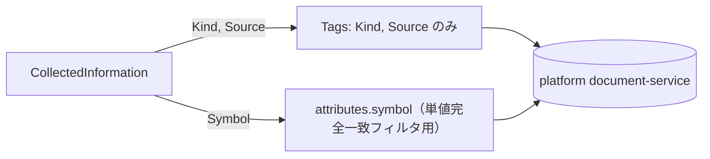

# 仕様書: KB 保存のタグから動的な銘柄コードを外し静的語彙に閉じる

> 本仕様書は実装着手前に作成する。計画書（`project-planning` の `projects/ai-stock-trading/`）を一次情報とし、
> 本書は「この作業で何をどう実装するか」を確定するための作業仕様である。

## 起点となる計画書（トレーサビリティ）

- 機能要求（FR）: FR-01（情報収集）・FR-08（KB 保存・RAG 取得）
- ユースケース（UC）: なし
- 画面（SC）: なし
- 関連 ADR: ADR-0004（情報源の許可リスト）
- 計画書リンク: `/home/user/project-planning/projects/ai-stock-trading/02_requirements/01_requirements.md`
- 起点 issue: [#705](https://github.com/endazon/ai-stock-trading/issues/705)

## 目的・背景

基盤（microservices-platform）`document-service` の `POST /documents` が MSP#635 でタグ辞書検証
（辞書に無いタグ名は 400）を持つに至った。AST の収集側 `KnowledgeBaseWriterSink.ToDocument` は
`Tags` に `Kind`・`Source` に加え `Symbol`（銘柄コード）を載せており、監視銘柄は運用中に無限に増える
動的集合であるため事前登録では原理的に解決しない。この結果、Symbol を持つ収集情報（大半）の KB 保存が
**400 で構造的に全件失敗**していた。

`attributes["symbol"]` に同じ値が既に入っているため、絞り込み手段（単値完全一致フィルタ）は失われない。
報告書側 `ReportKnowledgeMapper` のタグ `["report", <kind>]` は静的であり対象外。

## 対象範囲

- 対象:
  - `KnowledgeBaseWriterSink.ToDocument`（収集側の Tags 写像）
  - `AiStockTrading.Shared.KnowledgeBase.KnowledgeTagVocabulary`（新設。静的語彙の単一情報源）
  - `HttpKnowledgeBaseWriter`（非 2xx 応答本文の警告ログ正規化）
  - `docs/operations/kb-tag-dictionary-runbook.md`（新設。登録手順）
  - `.ai-context/adr/IADR-0315`（本決定の記録）
- 対象外:
  - 基盤（document-service）側のタグ辞書への実登録操作そのもの（基盤の所有物。本リポからは登録
    API の有無を確認できない）
  - タグの動的検証・実行時フィルタ機構の新設（過剰な抽象化。目的は静的語彙の単一情報源化に限る）
  - 実 KB での `KB 保存: N/N` の実測（実環境残件。#627 に依存。`docs/blocked-tasks.md` へ残件登録）

## 設計

### 収集側の写像変更

`KnowledgeBaseWriterSink.ToDocument` の `Tags` 初期化から `if (!string.IsNullOrWhiteSpace(item.Symbol)) tags.Add(item.Symbol);` を削除する。`attributes["symbol"]` の付与ロジックは変更しない。

### 静的タグ語彙（単一情報源）

`AiStockTrading.Shared.KnowledgeBase.KnowledgeTagVocabulary` を新設し、次の 3 群とその和集合 `All` を持つ:

- `CollectionKinds`: `InformationCollectionService.Domain.InformationKind` の全値（`ToString()` 形）
- `CollectionSources`: `InformationCollectionService.Domain.SourceAllowlist.Default` と同一語彙
- `ReportTags`: `"report"` と `ReportService.Domain.ReportKind` の全値（小文字化）の和集合

Shared プロジェクトは Services へ依存できない（IADR-0256）ため、値は文字列リテラルの複製とする。
複製元との一致は `AiStockTrading.Architecture.Tests.KnowledgeTagVocabularyTests`
（ソース静的解析。`RetrievalSourceVocabularyTests` と同じ作法）が機械的に固定する。

🔴 本語彙は実行時の検証・フィルタには使わない。目的は「基盤の辞書へ登録すべきタグ一覧を人・運用が
機械的に取り出せる」ことに限る（過剰な抽象化をしない）。

### 登録経路

基盤側にタグ登録 API があるかは本リポジトリからは確認できない（MSP は参照不可）。したがって:

- 登録すべきタグ一覧の**生成手順**を Runbook（`docs/operations/kb-tag-dictionary-runbook.md`）へ記す
  （`grep` でリテラルを抽出する簡潔な手順。`KnowledgeTagVocabulary.All` と同じ集合を返す）。
- **AST 起動時の自動登録は採らない**（基盤の辞書は基盤の所有物。IADR-0315 決定3）。
- 未知タグで 400 のときの fail-safe 縮退（既存の「未保存に倒す」動作）は変更しない。

### 可観測性（400 応答本文の正規化）

`HttpKnowledgeBaseWriter.SaveAsync` が非 2xx を受けたとき、応答本文（ProblemDetails 等）を
制御文字除去・長さ上限（500 文字）で正規化して警告ログへ含める。読み取り自体の失敗は握りつぶし
`(なし)` を返す（診断ログの都合で保存結果の分岐を変えない）。#708 と同型の正規化。

## 受け入れ基準

- [ ] `KnowledgeBaseWriterSink` が生成する `KnowledgeDocument.Tags` に Symbol の値が一切含まれない
      （既存の「銘柄なしは属性を付けない」との対称で、`attributes["symbol"]` には残る）
- [ ] 任意の Symbol 文字列（プロパティベース: ランダム生成）に対して、`Tags` が
      `KnowledgeTagVocabulary.CollectionKinds ∪ CollectionSources` の部分集合であることを固定する
- [ ] `KnowledgeTagVocabulary` の 3 群が複製元（`InformationKind` / `SourceAllowlist.Default` /
      `ReportKind`+`"report"`）と一致することをアーキテクチャテストで固定する（食い違えば CI が落ちる）
- [ ] `HttpKnowledgeBaseWriter` が非 2xx を受けたとき、応答本文を正規化（制御文字除去・上限切り）して
      警告ログへ含める。応答本文が無い場合も例外を投げない
- [ ] `RetrievalSourceVocabularyTests`（既存）が引き続き緑であること（Source 語彙の一致に影響しない
      ことの回帰確認）
- [ ] `docs/operations/kb-tag-dictionary-runbook.md` に登録すべきタグ一覧の生成手順があること
- [ ] `docs/blocked-tasks.md` に「実 KB での `KB 保存: N/N` 確認」が残件として追記されていること

## テスト方針

- **境界値/否定形**（`InformationCollectionService.Tests`）:
  - 銘柄ありでもタグに Symbol が含まれないこと（否定形）
  - 銘柄なしは従来どおり属性 symbol を付けない・タグに空文字を含めない（既存の回帰）
- **プロパティベース**（`InformationCollectionService.Tests`）:
  - `new Random(705)` で 50 件のランダム銘柄文字列を生成し、各件の `Tags` が
    `KnowledgeTagVocabulary.CollectionKinds ∪ CollectionSources` の部分集合であることを固定する
- **アーキテクチャテスト**（`AiStockTrading.Architecture.Tests`）:
  - `KnowledgeTagVocabulary` の 3 群が複製元のソースコードと一致すること（ソース静的解析）
  - `ReportKnowledgeMapper` が固定タグ `"report"` を付与し続けていること（回帰）
- **HTTP アダプタ**（`AiStockTrading.Shared.KnowledgeBase.Tests`）:
  - 非 2xx の応答本文（改行・タブを含む）が制御文字を除去された形で警告ログに現れること
  - 応答本文が無くても例外を投げず警告ログを残すこと（否定形）
  - 長大な応答本文が上限で切られ「省略」が示されること

## 計画書との差異

- 差異: なし。計画書（FR-01/FR-08）にタグの具体的な語彙は定義されておらず、本作業は実装レベルの
  設計判断（IADR-0315）として扱う。

## 未決事項

- 基盤側にタグ登録 API が存在するかは未確認（MSP は参照不可）。存在すれば Runbook の手順2を
  API 呼び出しへ具体化できるが、本作業では汎用的な「一覧を生成し基盤側の運用へ渡す」までに留める。
- 実 KB での `KB 保存: N/N`（N=N）確認は #627（AST → 基盤の到達性）の解消を待つ
  （`docs/blocked-tasks.md` へ残件登録済み）。
- 基盤側へ環流すべき事項（静的タグの seed 登録・タグ登録 API の有無）は本作業の報告にまとめ、
  起票判断は親（オーケストレーション側）に委ねる。
