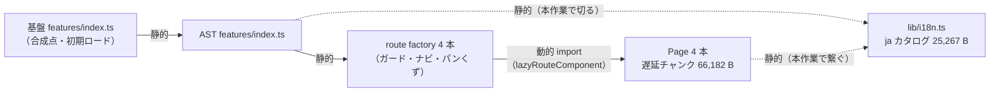

# 仕様書: 文言カタログの登録を画面の遅延チャンク側へ移し、合成時の初期ロードから外す

> 本仕様書は実装着手前に作成する。計画書（`project-planning` の `projects/ai-stock-trading/`）を一次情報とし、
> 本書は「この作業で何をどう実装するか」を確定するための作業仕様である。

## 起点となる計画書（トレーサビリティ）

- 画面（SC）: SC-01 設定 / SC-02 リスク設定 / SC-03 承認・統制状態参照 / SC-04 OpenD 認証操作（**4 画面すべて**）
- 関連 ADR: ADR-0001（基盤の再利用）。非機能は `NFR`（初期ロード量。無採番＝`traceability.repo.md`「`NFR` はレンジを持たない」）
- 基盤（microservices-platform）の計画 ADR: `MSP/ADR-0031`（フロントエンド採用技術＝Lingui を含む）
- 基盤の実装 ADR: `MSP/IADR-0134`（画面はルート単位の遅延チャンクへ分ける）、`MSP/IADR-0124` 決定 1（型付きルート factory）、
  `MSP/IADR-0125` 決定 3（共有 UI と i18n カタログ）、`MSP/IADR-0120`（基盤から AST は直せない）
- 先行する本リポの IADR: IADR-0080（単独リポの自己完結と `@foundation` スタブ）、IADR-0288（型付きルート契約）、
  **IADR-0338 決定 3**（`ja` 単独カタログを合成点へ公開する。**本作業の IADR-0340 が一部を supersede する**）
- 本作業で起草した IADR: **IADR-0340**
- 起点 issue: [#792](https://github.com/endazon/ai-stock-trading/issues/792)

## 目的・背景

#791（4 画面を `@platform/ui` と Lingui へ載せ替え）を基盤へ合成した結果、基盤の初期ロード合計が
**705,386 B → 731,293 B（+25,907 B）** へ増えた（基盤 `scripts/chunk-budget-baseline.json` の
`$comment_initialTotalBytes_20260912_ast-bump`）。

issue #792 はこの増分を「**AST の route factory が `component:` へ画面を直接渡しているため、
4 画面の本体が初期チャンクに入っている**」と帰属し、`lazyRouteComponent` への載せ替えを求めた。

**この前提は事実に反する**（下の「issue との差異」で実測により反証する）。4 画面は #723 / #691 の
時点で既に `lazyRouteComponent` 方式であり、bump の前後どちらの端点でもそうである。
**増分の 97.5% は Lingui の `ja` カタログ 25,267 B である。**

よって本作業は、issue の作業項目 1（載せ替え）ではなく、**issue の意図（合成時の初期ロードを減らす）**
に対して実際に効く 1 点 —— **カタログの登録を初期ロード側から遅延チャンク側へ移すこと** —— を行う。

## 母集合の引き直し（着手前・必須。キット規則 1〜10）

**issue の列挙は母集合ではない。** 引いた結果を以下に置く。走査基準は `7780edc`（= 着手時の HEAD、
develop の先端）と、比較の基準 `3d35c7a`（bump の前の端点）である。**どちらも SHA で固定してあり追試できる。**

### 軸 1 —— issue の前提（誤りの側＝「`component:` へ直接渡している」）から引く

```
git grep -c "lazyRouteComponent" <ref> -- frontend/src/features
```

| 時点 | sc01 | sc02 | sc03 | sc04 | 判定 |
| --- | --- | --- | --- | --- | --- |
| `3d35c7a`（bump 前） | 2 | 2 | 2 | 2 | **4 画面とも既に lazy** |
| `7780edc`（bump 後・着手時） | 2 | 2 | 2 | 2 | **4 画面とも既に lazy** |

導入時期は `git log -S'lazyRouteComponent' -- frontend/src` の実測で **#723（`a5e2fe6`）/ #691（`9324f41`）**。
**bump の前後で形が変わっていない以上、bump の増分を画面本体に帰属させることはできない。**

### 軸 2 —— カタログを初期ロードへ引き込む経路（誤りの側＝`locales/ja/messages` の静的 import から引く）

```
git grep -n "locales/ja/messages" -- frontend        （package-lock を除く）
```

| ヒット | 区分 | 本作業での扱い |
| --- | --- | --- |
| `frontend/src/lib/i18n.ts:2` | **製品コード。`features/index.ts` 経由で初期ロードへ入る唯一の経路** | **対象**（登録を遅延側へ移す） |
| `frontend/e2e/harness/main.tsx:18` | test-only。ハーネスが自前で `i18n.load` している | **対象**（外す。外さないと E2E が新経路を検証しない） |
| `frontend/test/setup.ts:3` | test-only。単独リポのロケール活性化 | **対象外**（vitest は Page 以外の部品も単体で描く。活性化の責務は別） |
| `frontend/lingui.config.ts:13` | コメント（生成物の所在の説明） | 対象外（コードではない） |

### 軸 3 —— 公開面の参照（規則 9: 「追随する文書」を記憶で挙げず、誤りの側の文字列で全走査する）

```
git grep -n "aiStockTradingMessages"                  （リポジトリ全体）
```

| ヒット | 区分 | 扱い |
| --- | --- | --- |
| `frontend/src/lib/i18n.ts:8,18` | 製品コード（定義） | **対象** |
| `frontend/src/features/index.ts:76,78` | 製品コード（合成点への再公開） | **対象**（外す） |
| `.ai-context/adr/IADR-0338…:135,136` | 決定 3 の本文 | **対象**（日付つき追記 ＋ Superseded by。本文プロズは書き換えない） |
| `.ai-context/adr/README.md:368` | 索引行（IADR-0338） | **対象**（追記へ合わせて更新。`check-adr-index-sync.js` が同一差分での更新を要求する） |
| `.ai-context/specs/20260912_frontend-platform-ui-and-lingui.md:159,234` | 先行の作業仕様書 | **対象外** ——`.ai-context/specs/` は **point-in-time の記録**であり、後から表記だけ直すと当時の記述と食い違う（`traceability.repo.md` §除外とその理由の既定と同じ理由）。**決定の更新は IADR-0340 と IADR-0338 の追記が担う** |

基盤（microservices-platform）側の参照（合成点 `src/platform/frontend/src/features/index.ts` と
`chunk-budget-baseline.json` の誤帰属）は **本リポジトリの母集合に入らない**（別リポジトリ）。
**基盤側は触らず、依頼内容を IADR-0340 の残余リスクへ書く**（`MSP/IADR-0120`: 基盤から AST は直せず、逆も同じ）。

### 軸 4 —— `@foundation/i18n` を解決させる先（漏れると「片方だけ通って静かに割れる」）

```
git grep -ln "@foundation" -- frontend/tsconfig.json frontend/tsconfig.standalone.json \
    frontend/vitest.config.ts frontend/e2e/vite.harness.config.ts
```

| ファイル | 現在の解決 | 本作業 |
| --- | --- | --- |
| `frontend/tsconfig.json`（合成時の向き先） | 区分ごとに個別 paths（ワイルドカード 1 本では張れない） | **`@foundation/i18n` を追加**（基盤 `src/lib/i18n`） |
| `frontend/tsconfig.standalone.json` | `@foundation/*` → `./test/foundation-stub/*`（**ワイルドカード**） | **変更不要**（`i18n.ts` を置けば解決する） |
| `frontend/vitest.config.ts` | `@foundation` → `./test/foundation-stub`（**prefix alias**） | **変更不要** |
| `frontend/e2e/vite.harness.config.ts` | 同上（`@foundation/api/apiClient` だけ完全一致で先勝ち） | **変更不要** |

**「4 ファイルすべてに足す」は誤りである。** 3 つは既にワイルドカード／prefix で解決しており、
個別エントリを足すと**同じことを 2 か所で言う**（片方だけ直る事故の種を増やす）。**足すのは 1 つだけ。**

### 軸 5 —— 文言を描く側（`i18n._()` の呼び出し元）の分布

```
git grep -n "from '@lingui/core'" -- frontend/src
```

13 件。内訳は **4 画面の Page が 4 件**、**Page の子部品が 8 件**（`PaperModeBanner` / `QueryPhase` /
`MonitorParametersForm` / `Stage1TradeCountForm` / `WatchlistForm` / `ShortSellingStatusSection` /
`GatewayStateSection` / `VerificationCodeForm`）、**`lib/i18n.ts` の型 import が 1 件**。

**子部品 8 件は初期ロード側から到達できない**（ルート factory・ナビ・パンくずのいずれも import しない。
必ず Page を経由して描かれる）。よって**登録の入口は Page の 4 件で足りる**。

### 軸 6 —— 規則 8・10（自分の記録が母集合へ入る／是正で新たに誤りになる自分の記述を引き直す）

- 本書・IADR-0340 は `.ai-context/` 配下であり、軸 1・2・5 の走査対象（`frontend/`）に入らない。
  **本書を書く行為が上の数を動かすことはない。**
- 規則 10 の引き直し: 本作業で `aiStockTradingMessages` の**再公開をやめる**ため、
  「合成点が `registerUnitMessages(aiStockTradingMessages)` を呼ぶ」と書いた自分の記述が新たに誤りになる。
  これを**是正前の語（`aiStockTradingMessages`）ではなく、是正後に誤りになる語**でも引き直した:
  `git grep -n "registerUnitMessages"` → ヒットは軸 3 と同じ集合（`docs/` には 0 件）。**追加の追随先は無い。**

## 対象範囲

### 対象

- `frontend/src/lib/i18n.ts` —— カタログの**登録**（`registerUnitMessages`）をモジュール評価時に 1 回だけ行う。
  `i18n`（Lingui のシングルトン）を再公開し、Page はここから受け取る。
- `frontend/src/features/index.ts` —— `aiStockTradingMessages` の再公開を**外す**。
- 4 画面の Page（`sc0N-*/components/*Page.tsx`）—— `i18n` の取得元を `@lingui/core` から
  `@ai-stock-trading/lib/i18n` へ変える（**登録を連れてくるのが目的**）。
- `frontend/test/foundation-stub/i18n.ts`（新設）—— 単独リポ用の `registerUnitMessages` スタブ。
- `frontend/tsconfig.json` —— `@foundation/i18n` の paths（合成時の向き先）。
- `frontend/e2e/harness/main.tsx` —— 自前の `i18n.load` を外し、**活性化だけ**残す。
- `frontend/src/features/catalogRegistration.test.ts`（新設）—— 「4 画面の遅延チャンクがカタログ登録を
  連れている」不変条件の固定。**置き場所は `src/lib/` ではなく `src/features/` 直下である**——
  `import/no-restricted-paths` の②（shared 層から features を参照しない。MSP/ADR-0066 決定 2）に
  当たって lint が落ちたため（実測 5 エラー）。`src/features/` 直下は①の target（`src/features/<dir>`）に
  一致しないため、合成点 `index.ts` と同じくゾーンの外である。

### 対象外（理由つき。黙って落とさない）

- **4 画面の route factory** —— **既に `lazyRouteComponent` 方式であり、変えるところが無い**（軸 1）。
- **子部品 8 件の `@lingui/core` import** —— 初期ロード側から到達できず、Page を経由して描かれる（軸 5）。
  **一律に書き換えると「どの import が不変条件を担っているか」が薄まる**ので、入口を 4 か所に閉じる。
- **`frontend/test/setup.ts`** —— 単独リポのロケール活性化であり、Page を経由しない部品の単体テストが依存する（軸 2）。
- **基盤（microservices-platform）のファイル** —— 別リポジトリ（`MSP/IADR-0120`）。依頼内容は IADR-0340 の残余リスクへ。
- **ESLint 規則の追加**（「`@lingui/core` の `i18n` を Page で使わせない」）—— 運用標準「**検査器・規約の追加は
  同型事故 2 回から**」。**1 回目である**。代わりに**テストで不変条件を固定**する（規約ではなく事実の固定）。
- **カタログの画面別分割**（4 本に割る）—— 効果は「1 画面しか開かない利用者が他画面の文言を引かない」だけで、
  4 画面は同一の利用者（`trading-owner`）が使う。**複雑さに見合わない。**

## 設計

### 1. 何が初期ロードに載るかを決めているのは「静的 import の連鎖」である



**切る辺と繋ぐ辺は 1 本ずつである。** 画面本体（`G`）は既に動的辺の向こう側にあり、**触らない**。

### 2. 登録の位置と冪等性

`lib/i18n.ts` のモジュール評価時に `registerUnitMessages({ ja })` を 1 回だけ呼ぶ。

- **モジュールは 1 度しか評価されない**ので、実運用では guard が無くても 1 回である。
  それでも **`vi.resetModules()` による再評価**（テスト）と、**将来の明示呼び出し**に備えて
  モジュール内フラグで閉じる。
- **呼ぶ先は基盤の `registerUnitMessages` のままにする。** 自前で `i18n.load` しないのは、
  **`en` フォールバックの意味論（「そのロケールに未登録の ID だけ ja を流す」＝基盤の英訳を日本語で
  上書きしない）が基盤側にしか無い**ためである。ここを写すと 2 か所に持つことになる。
- **順序は保たれる。** `@foundation/i18n` はモジュール評価時に基盤カタログを `load` / `activate` 済みであり、
  `lib/i18n.ts` はそれを import してから登録する。Page は動的 import の解決後に描画されるので、
  **描画時点で必ず登録済み**である（`i18n._()` は呼び出し時点の表を引く。再描画は要らない）。

### 3. 単独リポ（standalone）の二重解決

`@foundation` と同型の二重性（IADR-0080 決定 2）を i18n にも張る。

| | 合成時 | 単独リポ |
| --- | --- | --- |
| 解決先 | 基盤 `src/lib/i18n`（`tsconfig.json` の paths ／ 基盤 `vite.config.ts` の alias） | `test/foundation-stub/i18n.ts`（ワイルドカード） |
| `registerUnitMessages` | `en` フォールバック込みの実体 | 与えられたロケールを `i18n.load` する薄い実装 |

### 4. E2E ハーネスは「登録されること」を検証する側へ回す

ハーネスが自前で `i18n.load('ja', messages)` を続けると、**登録が壊れても E2E が緑のまま**になる。
`i18n.activate('ja')` だけを残す（Lingui はロケール未活性だと `i18n._()` が例外を投げる）。
カタログは Page の遅延チャンクが連れてくる。

## 受け入れ基準

- [ ] 合成ビルドの初期ロードから AST の `ja` カタログ（442 キー / 25,267 B）が消える
- [ ] 4 画面は引き続き遅延チャンクに出る（`SettingsPage` / `RiskSettingsPage` / `ControlStatusPage` / `OpendAuthPage`）
- [ ] 存在秘匿（`RequireRole` が `GuardedSc0N…` として**同期のまま外側**に在る）が変わらない
- [ ] 単独リポの全ゲートが緑（typecheck / lint / test / i18n 再生成差分なし / e2e:typecheck / e2e）
- [ ] リポ直下の文書・トレーサビリティ検査がすべて緑
- [ ] 「4 画面の Page がカタログ登録を連れている」不変条件がテストで固定されている

## テスト方針

- **不変条件のテスト**（新設 `src/features/catalogRegistration.test.ts`・7 件）: `@foundation/i18n` を
  モックし、`vi.resetModules()` でモジュールレジストリを分けたうえで**4 つの Page モジュールを
  個別に動的 import** し、それぞれで `registerUnitMessages` が `ja` カタログ付きで**1 回**
  呼ばれることを固定する。あわせて次の 3 つを固定する:
  - **冪等性**（2 回呼び直しても登録は 1 回）。
  - **合成点（`features/index.ts`）を評価しても 1 回も呼ばれないこと**＝初期ロードへ引き込んでいないこと。
  - **母集合の一致**: route factory の**実ソース**から `lazyRouteComponent` の動的 import 先を抜き、
    テストが試す 4 本と過不足なく一致すること（規則 1「誤りの側から引く」。Page の改名・追加で
    テストが静かに空回りしない）。
  - 🔴 **逆向きのうち「合成点からの静的辺」は上で捕まえるが、それ以外の経路
    （基盤側の合成の仕方）は単独リポでは見えない** —— 捕まえるのは基盤の `check-chunk-budget` である。
    **単独リポには初期ロードという概念が無い**（ハーネスは単一バンドル）。この非対称を残余リスクへ書く。
- **既存テスト**: `renderWithProviders` 系は Page を直接描くため影響しない。`features/index.test.tsx` は
  ルート経由で描くが、`renderUnitRoute` は既に `findBy*` で待つ（`lazyRouteComponent` は本作業の前から在る）。
- **E2E**: Playwright の auto-wait が Suspense の解決を待つ。**testid を足さない**（役割とテキストで引く既存方針）。

## issue との差異

> **本節は「計画書との差異」ではない。** 計画書（`project-planning`）との差異は無く、
> 食い違っているのは **issue #792 の背景記述**である。区別して書く。

- **差異: あり。** issue #792 は増分を「4 画面の本体が `component:` 直渡しで初期チャンクに入っている」と
  帰属しているが、**4 画面は #723 / #691 の時点で既に `lazyRouteComponent` 方式**であり（軸 1）、
  合成ビルドの成果物でも**独立した遅延チャンクとして出ている**（下の実測）。**画面本体の初期ロードへの寄与は 0 B。**
- **対応**: issue の作業項目 1 は**既済**として扱い、作業項目 3（初期ロードを下げる）に対して
  実際に効く 1 点（カタログの遅延化）を行う。**issue へのコメントと基盤側の記録の訂正は親が行う**
  （本 PR では基盤のファイルを 1 つも触らない）。

## 検証記録（2026-09-12 実測）

### A. 着手前の合成ビルド（基盤 checkout・submodule = `7780edc`）

`src/platform/frontend/dist` は `chunk-budget-baseline.json` の床 **731,293 B** と 1 バイト一致しており、
**現行 submodule の実ビルドである**ことが確認できる。

**初期ロード**（`dist/index.html` の `<script type="module">` ＋ `<link rel="modulepreload">`。CSS は数えない）:

| チャンク | バイト |
| --- | --- |
| `index-x3QoMxE1.js` | 296,953 |
| `vendor-react-C8NUNAFX.js` | 196,828 |
| `vendor-baseui-B3c9JI1O.js` | 114,124 |
| `ui-DbQpoIC7.js` | 77,786 |
| `vendor-query-D-RyhCi4.js` | 45,602 |
| **計** | **731,293** |

**AST の 4 画面（いずれも `index.html` から参照されない＝初期ロード外）**:

| 遅延チャンク | バイト |
| --- | --- |
| `SettingsPage-DZcFqnWw.js` | 8,538 |
| `RiskSettingsPage-TUdW0CkX.js` | 32,960 |
| `ControlStatusPage-CUj9dW8H.js` | 16,158 |
| `OpendAuthPage-DjYjYF13.js` | 8,526 |
| **計** | **66,182（初期ロードへの寄与 0）** |

**`index-*.js` の中の Lingui カタログ literal（`JSON.parse('…')` を全数走査）**:

| literal | キー数 | バイト | 所属 |
| --- | --- | --- | --- |
| 1 本目 | 821 | 46,087 | 基盤（ja ＋ en） |
| 2 本目 | **442** | **25,267** | **AST の ja**（`禁止銘柄はありません。` 等の実在を確認） |

記録された増分は **+25,907 B**。**25,267 / 25,907 = 97.5%** がカタログ 1 本で説明される
（残り約 640 B が lucide・ナビ／パンくず等）。

### B. 本作業後の合成ビルド（実測 1 回・`c23e0ee`）

手順: `git -C src/ai-stock-trading fetch /home/user/ai-stock-trading claude/frontend-ui-ux-improvement-3lwuzw`
→ `checkout FETCH_HEAD` → `cd src && pnpm install && pnpm run build`
→ `node ../scripts/check-chunk-budget.js`。**終了後に submodule を `7780edc5` へ戻し、
`pnpm-lock.yaml` を `git checkout` して `pnpm install` を再実行した**（基盤側のファイルは 1 つもコミットしない）。

🔴 **比較の基準に注意する。** 計測時、基盤の作業ツリーには**別エージェントの進行中の変更（MSP#1438）**が
入っており、同エージェントが床を **731,293 → 731,435 B（+142）** へ引き上げていた。
よって**like-for-like の基準は 731,435 B（＝#1438 あり・本作業なし）**である。
着手前の dist（#1438 の変更が入る前・床と 1 バイト一致）の 731,293 B も併記する。

| 指標 | A（着手前 dist） | A'（#1438 の床＝本作業なし） | B（本作業後・実測） |
| --- | --- | --- | --- |
| 初期ロード合計 | 731,293 | **731,435** | **706,121** |
| 差（B − A'） | | | **−25,314 B（−3.46%）** |

**減った分はすべて `index-*.js` の 1 本である**（296,953 → 271,781 ＝ −25,172 B）。
`vendor-react` 196,828 / `vendor-baseui` 114,124 / `ui` 77,786 / `vendor-query` 45,602 は
**1 バイトも動いていない**（初期ロードの他 4 本は同一）。

**カタログの行き先**（`JSON.parse('…')` の全数走査で追跡）:

| | 着手前 | 本作業後 |
| --- | --- | --- |
| AST の ja カタログ（442 キー / 25,267 B）の所在 | `index-*.js`（**初期ロード**） | **`queries-BMTosZvN.js`（遅延チャンク・35,005 B）** |
| `index-*.js` に残っているか | はい | **いいえ**（文字列走査で不在を確認） |

**4 画面は引き続き遅延チャンクである**（`ControlStatusPage` 16,153 / `OpendAuthPage` 8,516 /
`RiskSettingsPage` 32,975 / `SettingsPage` 8,538。増減は数十バイトで、**移動していない**）。
カタログは 4 画面が共有するため、既存の共有遅延チャンク（`queries-*`）へ合流した
——**チャンク本数は増えていない**（`smallLazyChunks` 10 本のまま）。

**合成時の型検査も通した**: `src/platform/frontend` で `npx tsc -b --noEmit` が exit 0。
これは単独リポの `tsconfig.standalone.json` では確かめられない向き
（`@foundation/i18n` → 基盤 `src/lib/i18n` の実体解決）を検証する。

### C. 単独リポのゲート（すべて緑）

| ゲート | 結果 |
| --- | --- |
| `npm run typecheck` | 緑 |
| `npm run lint` | 緑 |
| `npm run test` | **404 件 / 23 ファイル 合格**（本作業で +7 件・新設 1 ファイル。着手前 397 件） |
| `npm run i18n` → `git diff --exit-code -- src/locales` | **差分なし**（カタログは 1 バイトも動いていない＝文言を変えていない） |
| `npm run e2e:typecheck` | 緑 |
| `npm run e2e` | **60 件 合格** |
| リポ直下: `check-frontend-empty-frames` / `check-trace-blocks` / `check-cross-repo-refs` / `check-plan-id-qualification` / `check-reading-budget` / `check-adr-index-sync` / `check-doc-links` / `gen-knowledge-graph --check` | すべて緑 |
| `node scripts/scripts.test.js` | **340 件 合格** |

### D. 変異試験（テストが本当に落ちることを確かめる）

| 変異 | 結果 |
| --- | --- |
| SC-01 の Page の import を `@lingui/core` へ戻す | **1 失敗 / 5 合格**（当該画面だけが落ちる＝画面ごとに独立して見ている） |
| 合成点（`features/index.ts`）へ `lib/i18n` からの再輸出を足す | **1 失敗 / 5 合格**（「初期ロードへ引き込まない」が落ちる） |
| 登録（`registerAiStockTradingMessages()`）を止めて E2E `sc03-controls.spec.ts` を走らせる | 🔴 **10 合格＝捕まらない**（下の残余リスク） |

## 残余リスク

1. 🔴 **E2E はカタログ登録の破れを捕まえない。** ハーネスは `vite dev` で動き、開発ビルドでは
   `msg` マクロが `message` を残すため、**カタログが無くても日本語が出る**（D の 3 行目で実測）。
   守っているのは `src/features/catalogRegistration.test.ts` である。
   **「E2E が緑だから大丈夫」と読まないこと。**
2. 🔴 **基盤の合成点のコメントは「bump 後に名前付き import へ戻してよい」と書いている。**
   戻された時点で、再公開をやめた本ユニットに対して**基盤の tsc が落ちる**。
   **任意項目読みを維持する**依頼を基盤側へ出す必要がある（IADR-0340 §結果・フォローアップ）。
3. **本ユニットの画面を初めて開く利用者は 25 kB を遅延で引く**（4 画面共有の 1 チャンク）。
   基盤の利用者の大多数（knowledge しか使わない）は払わなくなる——この交換を受け入れる。
4. **Page の import 元が子部品と非対称**である（Page は `lib/i18n`、子部品 8 件は `@lingui/core`）。
   ESLint 規則で閉じていない（運用標準「検査器・規約の追加は同型事故 2 回から」。**1 回目である**）。
   **同型の事故が 2 回目に起きたら規則を足す。**
5. **基盤側の記録（`chunk-budget-baseline.json` の帰属・合成点のコメント）は誤ったままである。**
   本リポジトリからは直せない（`MSP/IADR-0120`）。訂正は親が基盤側で行う。
6. ［2026-09-12 追記 / MSP bump］**母集合テストが `process.cwd()` から実ソースを解決していたため、基盤の合成
   `test:coverage`（cwd = `src/`）で ENOENT になった**（基盤で submodule を `c5cd0de` へ進めた実測。単独では通る）。
   `expect.getState().testPath` 基点へ是正した（`.ai-context/specs/20260912_catalog-test-cwd-independent.md`）。

## 未決事項

- なし（設計は上記で確定。基盤側への依頼は IADR-0340 §残余リスクに列挙し、親が環流する）
