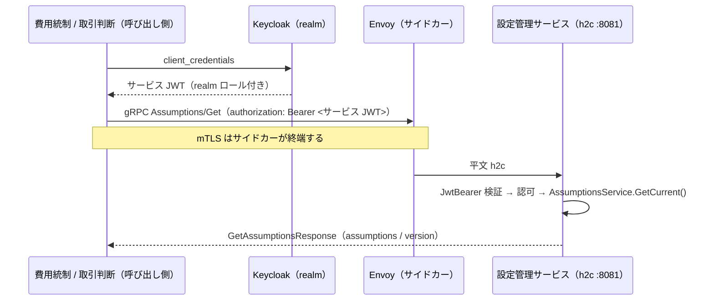

<!-- trace:
ids: [FR-17, UC-06, NFR, FR-10, FR-03, FR-04, FR-06, FR-20, FR-21]
adrs: [ADR-0001, MSP:ADR-0029, MSP:ADR-0075]
iadrs: [IADR-0013, IADR-0046, IADR-0051, IADR-0063, IADR-0264, IADR-0284, IADR-0328, IADR-0331, IADR-0352, IADR-0420, IADR-0427]
specs: [20260911_584_east-west-grpc-foundation, 20260911_745_configuration-assumptions-grpc, 20260925_997_grpc-stage2-risk-read]
issues: [#526, #584, #745, #753, #997]
-->

# 通信仕様書: east-west gRPC（サービス間の同期呼び出し）

> 計画は「サービス間の同期呼び出し（east-west）は gRPC + Protobuf、BFF から画面・外部公開 API
> （north-south）は REST」と定め、移行の順序を**基盤先行**とした。本書は本リポジトリ側の面を書く。
> **規約の正本は基盤（microservices-platform）の実装ガイド** `docs/api/east-west-grpc.md` であり、
> 本リポジトリはそれへ**逐語で揃える**（判断の記録は trace ブロックの実装 ADR にある）。

## 概要

- **プロトコル**: gRPC（HTTP/2）+ Protobuf 3。メッシュ内は **h2c（TLS 無し HTTP/2）** で、mTLS はサイドカーが終端する。
- **対象**: メッシュ内のサービスどうしの**同期**呼び出し。外部 SaaS・IdP・非同期イベントは対象外。
- **状態**: 本書が書くのは**全体前提条件の照会**（本リポジトリが契約を所有する最初の面・§5）と
  **リスク管理の読み取り**（§6）である。基盤が所有する契約を消費する面（テキスト生成）は別の実装記録が持つ。
  **並走中の正は REST** であり、gRPC は構成で opt-in する。残りの経路の移行は段ごとに別 issue で展開する。
- **既定は REST**: 呼び出し元の構成 `Configuration:Grpc` が無ければ 1 バイトも変わらない。
  提供側も `Grpc:Port` が無ければ h2c リスナを立てない。**切り戻しは構成を外すだけ**（コードを変えない）。

## 1. proto の置き場と所有

| 項目 | 規約 |
| --- | --- |
| 所有者 | **呼び出される側**のサービス |
| 置き場（本リポジトリが所有する契約） | 共有プロジェクト `backend/Shared/AiStockTrading.Shared.Grpc/` |
| 置き場（**基盤が所有する契約の写し**） | `backend/Shared/AiStockTrading.Shared.Infrastructure/`（消費するだけ。生成は `GrpcServices="Client"`） |
| パス | `Protos/<unit>/<service>/v<N>/<name>.proto`（`<unit>` は `aistocktrading` ＝自リポ所有 / `platform` ＝基盤所有の写し） |
| 生成 | `<Protobuf Include="Protos/**/*.proto" ProtoRoot="Protos" GrpcServices="Both" />`。**`*.Client` プロジェクトは作らない** |
| 生成物 | `obj/` に落ち、コミットしない |

🔴 **サービスプロジェクトに proto を置いてはならない。** 呼び出し元が生成クライアントを参照できなくなる。
🔴 **`<unit>` にハイフンは書けない**（proto の package は識別子である）。ディレクトリ名も package と一致させる。
🔴 **共有の契約プロジェクト（`AiStockTrading.Shared.Contracts`）へも置けない。** あちらは Domain から
到達してよい共有物であり、**外部ライブラリ依存ゼロ**をアーキテクチャ検査が強制している。名前空間も
`…Shared.Contracts.*` にしない（Domain の許可接頭辞であり、生成型を Domain から使えてしまう）。
判断の記録は trace ブロックの実装 ADR にある。

🔴 **基盤が所有する契約は「写し」であり、追随は人手である。** 本リポジトリは基盤にも計画にも依存しない
（submodule も pin も無い）ので、**正本が変わっても機械は気付かない**。写した proto の冒頭に出所
（正本のパス・写した日）を書き、正本を変更する PR と対で更新すること。契約の破れは実往復で
`UNIMPLEMENTED` や復号不能として現れる（黙って壊れはしないが、CI では捕まらない）。

`Protos/` 直下のユニット名は **allowlist**（`aistocktrading` / `platform`）であり、検査器が
それ以外を落とす —— 通してしまうと、パスと package が一致しているだけの**所有者不明の契約**が静かに増える。

## 2. versioning

| 項目 | 規約 |
| --- | --- |
| package | `<unit>.<service>.v<N>`（小文字。パスと一致） |
| C# 名前空間 | `option csharp_namespace = "AiStockTrading.Shared.Grpc.<Service>.V<N>";` |
| フィールド番号 | **不変**。削除するときは番号と名前を `reserved` に残す |
| 非破壊 | field / message / rpc / enum 値の**追加** |
| 破壊的 | 番号・型・ラベル・名前の変更、削除、rpc の要求／応答型の変更、package・名前空間の変更 |
| メジャー版の上げ方 | **`v<N+1>` のディレクトリと package を並走させる**（in-place で壊さない） |

機械検査は `node scripts/check-proto-contracts.js` が行う（配置と名前の一致・番号の一意・`reserved` の
再利用禁止・baseline との後方互換）。**非破壊の追加でも baseline と差分がある限り赤**になり、`--update` で
差分を PR に載せる。破壊的変更は `scripts/proto-breaking-allowlist.json` の承認エントリで通す ——
ただし**削除時の `reserved` 不在と `reserved` の再利用は承認でも通らない**。

🔴 **proto の破壊的変更はコンパイルで止まらない。** 番号を付け替えても両側が再生成されるのでビルドは
緑のまま通り、**古いピアだけが黙って別のフィールドを読む**。だから機械検査を CI に置く。

## 3. h2c ポート

| 項目 | 規約 |
| --- | --- |
| リスナ | 構成 `Grpc:Port`（環境変数 `Grpc__Port`）で**専用ポート**（既定 8081）に HTTP/2 **だけ**を bind。未設定・0 なら立てない |
| HTTP/1.1 | 8080（REST・`/health/*`・introspection）は**そのまま残す**。共通ヘルパが HTTP 側のポートを再宣言する |
| helm | `services.<name>.grpcPort` を宣言したサービスにだけ描画する。**宣言しないサービスは 1 バイトも変わらない** |
| readiness | **HTTP の `/health/ready`（8080）のまま**。1 プロセスが両ポートを起動時に bind する |

## 4. サービス間トークン（s2s）

| 項目 | 規約 |
| --- | --- |
| メタデータ | `authorization: Bearer <呼び出し側サービス自身の JWT>` |
| トークンの出所 | realm の confidential client の client credentials（`ServiceAuth:ClientId` / `ClientSecret`） |
| 呼び出し先の検証 | 既存の JwtBearer と同じ。読み取りの面には利用者またはサービスのロールを要求する |
| 拒否 | トークン無し → `UNAUTHENTICATED`、ロール不足 → `PERMISSION_DENIED` |
| 🔴 利用者トークン | **メタデータへ載せない**（載せると呼び出し先が「利用者が直接呼んだ」と「サービスが利用者のために呼んだ」を区別できない） |
| 利用者の文脈 | 必要な経路では**本文で運ぶ**（現在の 1 経路は利用者の文脈を取らない） |
| トークン取得失敗 | **メタデータを付けずに送る** → `UNAUTHENTICATED` → 呼び出し元の既存 fail-safe（REST の「ヘッダ無し → 401 → 安全既定」と同じ向き） |

タイムアウト・リトライ・キャッシュ・fail-safe は**呼び出し元**の `Infrastructure` に置く。

## 5. 面: 全体前提条件の照会（`aistocktrading.configuration.v1.Assumptions/Get`）

- 概要: 費用統制・取引判断の 2 サービスが、構成 `Configuration:Grpc`（例 `http://configuration-service:8081`）が
  あるときだけ gRPC で照会し、無ければ REST `GET /assumptions` で照会する。**並走中の正は REST。**
- 認証・認可: 読み取りの面と同じ（利用者またはサービス）。
- 評価器: REST と**同じ**サービス実装（`AssumptionsService.GetCurrent()`）を呼ぶ（評価器を 2 つにしない）。

| rpc | 形 | 対応する REST |
| --- | --- | --- |
| `Assumptions/Get` | unary | `GET /assumptions` |

リクエスト（`GetAssumptionsRequest`）: フィールドなし（REST と同じく引数を取らない）。

レスポンス（`GetAssumptionsResponse`）:

| 名前 | 型 | 説明 |
| --- | --- | --- |
| `assumptions` | TradingAssumptions | 税率・手数料体系・為替スプレッド・最小期待利益倍率・月次費用上限 |
| `version` | int32 | 現在の版。**実在する版は 1 から**。0 は未解決の番兵であり提供側は返さない |

エラー:

| gRPC status | 条件 | 呼び出し側の対応 |
| --- | --- | --- |
| `UNAUTHENTICATED` | サービストークン無し・検証失敗 | 安全側既定へ縮退（最後に取得した版 ＞ 既定値） |
| `PERMISSION_DENIED` | ロール不足 | 同上。**再試行しない** |
| `UNAVAILABLE` | 提供側へ届かない | 同上。**再試行の対象** |
| `DEADLINE_EXCEEDED` | 試行ごとの deadline 超過 | 同上。**再試行の対象** |

### 🔴 proto3 の「未指定」と 10 進数の写し

**proto3 に `decimal` も `null` も無い。** REST の DTO が持つ意味を、呼び出される側と呼び出す側の**両方で
明示的に写す**。写し漏れは例外にならず、意味が静かに変わる形で現れる。

| 契約 | REST | 線上 | 写し |
| --- | --- | --- | --- |
| 税率・手数料率・金額 | `decimal`（JSON 数値・桁を保つ） | `string` | 🔴 **不変文化の 10 進表記**。`double` にすると `0.20315` が 2 進浮動小数へ丸められ、**同じ版なのに REST と gRPC で採算判定・費用上限判定の結果が変わり得る** |
| 未指定の金額 | 項目が無い = 0 | `""` | `"" → 0` |
| 未解決の版 | `Version = 0` | `0` | 提供側は 0 を返さない。呼び出し元は 0 を「取得不可」として扱う |

### 呼び出し元の設定（呼び出し元ごとに置く）

| 構成キー | 既定 | 意味 |
| --- | --- | --- |
| `Configuration:Grpc` | 未設定（＝REST） | gRPC の宛先。**宣言してあるのに使えない値（相対・`https`・非 URL）は起動時に落とす** |
| `Configuration:GrpcTimeoutSeconds` | 5 | **試行ごとの** deadline。REST 実装の `HttpClient.Timeout` と同値 |
| `Configuration:GrpcMaxAttempts` | 1 | 試行回数。**既定は再試行しない**（REST と同じ振る舞い） |
| `Configuration:AssumptionsCacheTtlSeconds` | 300 | キャッシュ TTL（トランスポートに依らず共通） |

🔴 **再試行するのは `UNAVAILABLE` / `DEADLINE_EXCEEDED` だけ**である。権限や不在は待っても変わらず、
聞き直すぶんだけ**安全側既定へ倒れるまでの時間が延びる**（同期クリティカルパスである）。

🔴 **不正な宛先を黙って REST へ戻さない**のは、`Configuration:BaseUrl` の不正値が既定プロバイダへ倒れる
（凍結済みの安全既定）のとは**わざと非対称**にしている —— 新しい鍵で黙って戻ると「切り替えたつもりで
切り替わっていない」が綴り誤りと区別できないためである。

## 6. 面: リスク管理の読み取り（`aistocktrading.riskmanagement.v1.RiskControlsRead`）

- 概要: 報告書・取引判断・市場監視の 3 サービスが、構成 `RiskManagement:Grpc`（例 `http://risk-management-service:8081`）が
  あるときだけ gRPC で照会し、無ければ REST `GET /risk-controls/*` で照会する。**並走中の正は REST。**
- 認証・認可: 読み取りの面と同じ（利用者またはサービス）。REST の読み取り群と同じポリシーを service のクラス属性で持つ。
- 評価器: REST と**同じ**サービス・純関数を呼ぶ（評価器を 2 つにしない）。
- 運ぶ項目: **移した呼び出し元が読む項目だけ**（REST の応答はより多くを持つ）。追加はフィールド追加＝非破壊である。

| rpc | 対応する REST | 呼び出し元 | 取得できないときの呼び出し元の扱い |
| --- | --- | --- | --- |
| `GetOpenPositions` | `GET /risk-controls/open-positions` | 取引判断・市場監視・報告書 | 不明／空列（損切り検知対象なし）／未供給 |
| `GetWorkingEntryOrders` | `GET /risk-controls/working-entry-orders` | 取引判断 | 不明 |
| `GetSizingContext` | `GET /risk-controls/sizing-context` | 取引判断 | 残枠 0 の安全既定 |
| `GetStageGate` | `GET /risk-controls/stage-gate`（現段階だけ） | 報告書 | 未供給 |
| `GetFills` | `GET /risk-controls/fills?from&to` | 報告書 | 空列（数値 0 の報告書） |
| `GetDriftAdoptions` | `GET /risk-controls/drift-adoptions?from&to` | 報告書 | 未供給 |
| `GetBuyInInferences` | `GET /risk-controls/buy-in-inferences?from&to` | 報告書 | 未供給 |
| `GetSessionUptime` | `GET /risk-controls/session-uptime?from&to` | 報告書 | 未供給 |

エラー:

| gRPC status | 条件 | 呼び出し側の対応 |
| --- | --- | --- |
| `UNAUTHENTICATED` / `PERMISSION_DENIED` | サービストークン無し／ロール不足 | 上表の扱いへ縮退。**再試行しない** |
| `INVALID_ARGUMENT` | 期間の `from`・`to` の欠落・書式違い（REST の 400）。強制買戻し・稼働率は逆順も（REST と同じ） | 同上 |
| `UNAVAILABLE` / `DEADLINE_EXCEEDED` | 届かない／試行ごとの deadline 超過 | 同上。**再試行の対象** |

### 🔴 「不明」「無し」「有り」を取り違えない写し

REST の受け手は、項目が欠けた応答（送り手の改名など）を既定値で読まないよう nullable で受けている。
**proto3 の暗黙の既定値（0・空文字・false・列挙の 0）はこの区別を消す**ので、§5 とは違う写しを使う。

| 契約 | 線上 | 写し |
| --- | --- | --- |
| 数量・連敗数・真偽 | `optional` のスカラー | **存在しなければ不明**（0・false と読まない） |
| 金額・率 | `optional string`（不変文化の 10 進） | 🔴 **空・欠落は不明**（§5 の「空＝0」とは違う）。資金・残枠の欠落を 0 と読むと「枠を使い切った」になる |
| 日付・時刻 | `optional string`（`yyyy-MM-dd`／往復書式） | 欠落は不明。時刻は**オフセットごと**運ぶ |
| 列挙（市場・方向・発注先・手法・段階） | `*_UNSPECIFIED = 0` を持つ列挙 | **名前で**写す。未指定・未知は不明。🔴 C# の 0（日本・買い・内蔵 paper など）は線上で 1 以上 |
| 稼働率の日次の一覧 | 存在を持つ入れ物 | 入れ物が無ければ未供給、空の入れ物は「観測された取引日が無かった」 |

提供側は値の無い項目を**設定しない**・在る 0 は**設定する**。行の検証（識別できない行・数量が正でない行・ラインの無い行の扱い）は
REST のアダプタと**同じ 1 つ**を使う。message 名は送り手の型名と同じにしない（送り手の型による契約テストの判定を壊すため）。

### 呼び出し元の設定（呼び出し元ごとに置く）

| 構成キー | 既定 | 意味 |
| --- | --- | --- |
| `RiskManagement:Grpc` | 未設定（＝REST） | gRPC の宛先。**宣言してあるのに使えない値は起動時に落とす**。宣言があれば `RiskManagement:BaseUrl` より優先 |
| `RiskManagement:GrpcTimeoutSeconds` | 報告書 10・取引判断 5・市場監視 5 | **試行ごとの** deadline。各サービスの REST の `HttpClient.Timeout` と同値 |
| `RiskManagement:GrpcMaxAttempts` | 1 | 試行回数。**既定は再試行しない** |

- チャネルは呼び出し元の輸送が所有する（同じサービスの別の面が引く型と衝突させない）。
- 報告書は REST の依存先の門と観測を gRPC でも同じに行う —— 資格情報が整っているのにトークンを取れなければ**送信しない**、
  失敗は HTTP 相当の状態コードへ写して REST と同じ判定で一過性／恒常に分けて記録する（依存先の名前は REST と同じ `risk-ledger`）。

## シーケンス

## 非機能・運用

- **並走の扱い**: 1 経路について REST と gRPC が並走する期間がある。**正は REST**。撤去は最終段の判断である。
- **観測**: gRPC の状態コードは呼び出し側の警告ログに出る。gRPC 専用の計装は展開の issue で扱う。
- **配備**: 既定では有効化しない（helm の既定描画は変えていない）。有効化するときは
  **提供側の `grpcPort` と呼び出し元の宛先を同じ変更で揃える**（片方だけだと常に安全側既定へ倒れる）。

## 未決事項

- 稼働クラスタでの h2c 往復は**未実測**（新イメージの配備を要するため）。
- gRPC ヘルスプロトコル（`grpc.health.v1`）の要否（今は HTTP の readiness で足りる）。

## 関連仕様

- データ仕様書: [全体前提条件](../data/trading-assumptions.md)
- 検査器: [`scripts/README.md`](../../scripts/README.md)
