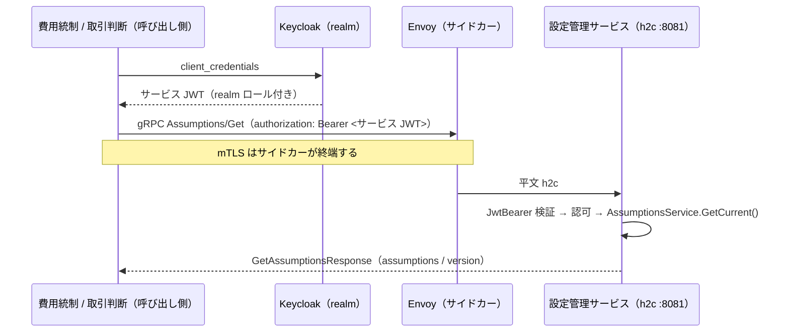

<!-- trace:
ids: [FR-17, UC-06, NFR, FR-10, FR-03, FR-04, FR-06, FR-20, FR-21, FR-11, FR-16, FR-01, FR-02, FR-07, FR-13, FR-15, FR-14, NFR-06]
adrs: [ADR-0001, ADR-0047, ADR-0052, MSP:ADR-0029, MSP:ADR-0075]
iadrs: [IADR-0013, IADR-0046, IADR-0051, IADR-0063, IADR-0264, IADR-0284, IADR-0328, IADR-0331, IADR-0352, IADR-0420, IADR-0427, IADR-0445, IADR-0446, IADR-0448, IADR-0449, IADR-0450, IADR-0463, IADR-0489, IADR-0491]
specs: [20260911_584_east-west-grpc-foundation, 20260911_745_configuration-assumptions-grpc, 20260925_997_grpc-stage2-risk-read, 20260927_1059_grpc-stage3-audit-read, 20260927_1061_grpc-stage4-report-monitor-cost-read, 20260927_753_grpc-stage5-bot-reads, 20260928_753_grpc-stage5-bot-writes, 20260930_1113_entry-blockers-before-llm, 20261004_753_grpc-h2c-measurement-runbook, 20261006_1156_report-regenerate]
issues: [#526, #584, #745, #753, #997, #1059, #1061, #1067, #1113, #1156]
-->

# 通信仕様書: east-west gRPC（サービス間の同期呼び出し）

> 計画は「サービス間の同期呼び出し（east-west）は gRPC + Protobuf、BFF から画面・外部公開 API
> （north-south）は REST」と定め、移行の順序を**基盤先行**とした。本書は本リポジトリ側の面を書く。
> **規約の正本は基盤（microservices-platform）の実装ガイド** `docs/api/east-west-grpc.md` であり、
> 本リポジトリはそれへ**逐語で揃える**（判断の記録は trace ブロックの実装 ADR にある）。

## 概要

- **プロトコル**: gRPC（HTTP/2）+ Protobuf 3。メッシュ内は **h2c（TLS 無し HTTP/2）** で、mTLS はサイドカーが終端する。
- **対象**: メッシュ内のサービスどうしの**同期**呼び出し。外部 SaaS・IdP・非同期イベントは対象外。
- **状態**: 本書が書くのは**全体前提条件の照会**（本リポジトリが契約を所有する最初の面・§5）と
  **リスク管理の読み取り**（§6）・**監査台帳の読み取り**（§7）・**日報の方針・監視銘柄・費用統制の判定の読み取り**（§8）・**Discord ボットの読み取りと書き込み**（§9）である。基盤が所有する契約を消費する面（テキスト生成）は別の実装記録が持つ。
  **並走中の正は REST** であり、gRPC は構成で opt-in する。残りの経路の移行は段ごとに別 issue で展開する。
- **既定は REST**: 呼び出し元の構成 `Configuration:Grpc` が無ければ 1 バイトも変わらない。
  提供側も `Grpc:Port` が無ければ h2c リスナを立てない。**切り戻しは構成を外すだけ**（コードを変えない）。

## 1. proto の置き場と所有

| 項目 | 規約 |
| --- | --- |
| 所有者 | **呼び出される側**のサービス |
| 置き場（本リポジトリが所有する契約） | 共有プロジェクト `backend/Shared/AiStockTrading.Shared.Grpc/` |
| 置き場（**基盤が所有する契約の写し**） | `backend/Shared/AiStockTrading.Shared.Infrastructure/`（消費するだけ。生成は `GrpcServices="Client"`） |
| パス | `Protos/<unit>/<service>/v<N>/<name>.proto`（`<unit>` は `aistocktrading` ＝自リポ所有 / `platform` ＝基盤所有の写し） |
| 生成 | `<Protobuf Include="Protos/**/*.proto" ProtoRoot="Protos" GrpcServices="Both" />`。**`*.Client` プロジェクトは作らない** |
| 生成物 | `obj/` に落ち、コミットしない |

🔴 **サービスプロジェクトに proto を置いてはならない。** 呼び出し元が生成クライアントを参照できなくなる。
🔴 **`<unit>` にハイフンは書けない**（proto の package は識別子である）。ディレクトリ名も package と一致させる。
🔴 **共有の契約プロジェクト（`AiStockTrading.Shared.Contracts`）へも置けない。** あちらは Domain から
到達してよい共有物であり、**外部ライブラリ依存ゼロ**をアーキテクチャ検査が強制している。名前空間も
`…Shared.Contracts.*` にしない（Domain の許可接頭辞であり、生成型を Domain から使えてしまう）。
判断の記録は trace ブロックの実装 ADR にある。

🔴 **基盤が所有する契約は「写し」であり、追随は人手である。** 本リポジトリは基盤にも計画にも依存しない
（submodule も pin も無い）ので、**正本が変わっても機械は気付かない**。写した proto の冒頭に出所
（正本のパス・写した日）を書き、正本を変更する PR と対で更新すること。契約の破れは実往復で
`UNIMPLEMENTED` や復号不能として現れる（黙って壊れはしないが、CI では捕まらない）。

`Protos/` 直下のユニット名は **allowlist**（`aistocktrading` / `platform`）であり、検査器が
それ以外を落とす —— 通してしまうと、パスと package が一致しているだけの**所有者不明の契約**が静かに増える。

## 2. versioning

| 項目 | 規約 |
| --- | --- |
| package | `<unit>.<service>.v<N>`（小文字。パスと一致） |
| C# 名前空間 | `option csharp_namespace = "AiStockTrading.Shared.Grpc.<Service>.V<N>";` |
| フィールド番号 | **不変**。削除するときは番号と名前を `reserved` に残す |
| 非破壊 | field / message / rpc / enum 値の**追加** |
| 破壊的 | 番号・型・ラベル・名前の変更、削除、rpc の要求／応答型の変更、package・名前空間の変更 |
| メジャー版の上げ方 | **`v<N+1>` のディレクトリと package を並走させる**（in-place で壊さない） |

機械検査は `node scripts/check-proto-contracts.js` が行う（配置と名前の一致・番号の一意・`reserved` の
再利用禁止・baseline との後方互換）。**非破壊の追加でも baseline と差分がある限り赤**になり、`--update` で
差分を PR に載せる。破壊的変更は `scripts/proto-breaking-allowlist.json` の承認エントリで通す ——
ただし**削除時の `reserved` 不在と `reserved` の再利用は承認でも通らない**。

🔴 **proto の破壊的変更はコンパイルで止まらない。** 番号を付け替えても両側が再生成されるのでビルドは
緑のまま通り、**古いピアだけが黙って別のフィールドを読む**。だから機械検査を CI に置く。

## 3. h2c ポート

| 項目 | 規約 |
| --- | --- |
| リスナ | 構成 `Grpc:Port`（環境変数 `Grpc__Port`）で**専用ポート**（既定 8081）に HTTP/2 **だけ**を bind。未設定・0 なら立てない |
| HTTP/1.1 | 8080（REST・`/health/*`・introspection）は**そのまま残す**。共通ヘルパが HTTP 側のポートを再宣言する |
| helm | `services.<name>.grpcPort` を宣言したサービスにだけ描画する。**宣言しないサービスは 1 バイトも変わらない** |
| readiness | **HTTP の `/health/ready`（8080）のまま**。1 プロセスが両ポートを起動時に bind する |

## 4. サービス間トークン（s2s）

| 項目 | 規約 |
| --- | --- |
| メタデータ | `authorization: Bearer <呼び出し側サービス自身の JWT>` |
| トークンの出所 | realm の confidential client の client credentials（`ServiceAuth:ClientId` / `ClientSecret`） |
| 呼び出し先の検証 | 既存の JwtBearer と同じ。読み取りの面にはサービスのロール、または利用者のロールかつ呼び出し元のクライアント（`azp`）が Discord ボットの機密クライアントであることを要求する（§9。人の利用者のトークンは gRPC の面を通らない） |
| 拒否 | トークン無し → `UNAUTHENTICATED`、ロール不足 → `PERMISSION_DENIED` |
| 🔴 利用者トークン | **メタデータへ載せない**（載せると呼び出し先が「利用者が直接呼んだ」と「サービスが利用者のために呼んだ」を区別できない） |
| 利用者の文脈 | 必要な経路では**本文で運ぶ**（現在の 1 経路は利用者の文脈を取らない） |
| トークン取得失敗 | **メタデータを付けずに送る** → `UNAUTHENTICATED` → 呼び出し元の既存 fail-safe（REST の「ヘッダ無し → 401 → 安全既定」と同じ向き） |

タイムアウト・リトライ・キャッシュ・fail-safe は**呼び出し元**の `Infrastructure` に置く。

## 5. 面: 全体前提条件の照会（`aistocktrading.configuration.v1.Assumptions/Get`）

- 概要: 費用統制・取引判断の 2 サービスが、構成 `Configuration:Grpc`（例 `http://configuration-service:8081`）が
  あるときだけ gRPC で照会し、無ければ REST `GET /assumptions` で照会する。**並走中の正は REST。**
- 認証・認可: 読み取りの面と同じ（サービス、または呼び出し元がボットの利用者のロール。§4）。
- 評価器: REST と**同じ**サービス実装（`AssumptionsService.GetCurrent()`）を呼ぶ（評価器を 2 つにしない）。

| rpc | 形 | 対応する REST |
| --- | --- | --- |
| `Assumptions/Get` | unary | `GET /assumptions` |

リクエスト（`GetAssumptionsRequest`）: フィールドなし（REST と同じく引数を取らない）。

レスポンス（`GetAssumptionsResponse`）:

| 名前 | 型 | 説明 |
| --- | --- | --- |
| `assumptions` | TradingAssumptions | 税率・手数料体系・為替スプレッド・最小期待利益倍率・月次費用上限 |
| `version` | int32 | 現在の版。**実在する版は 1 から**。0 は未解決の番兵であり提供側は返さない |

エラー:

| gRPC status | 条件 | 呼び出し側の対応 |
| --- | --- | --- |
| `UNAUTHENTICATED` | サービストークン無し・検証失敗 | 安全側既定へ縮退（最後に取得した版 ＞ 既定値） |
| `PERMISSION_DENIED` | ロール不足 | 同上。**再試行しない** |
| `UNAVAILABLE` | 提供側へ届かない | 同上。**再試行の対象** |
| `DEADLINE_EXCEEDED` | 試行ごとの deadline 超過 | 同上。**再試行の対象** |

### 🔴 proto3 の「未指定」と 10 進数の写し

**proto3 に `decimal` も `null` も無い。** REST の DTO が持つ意味を、呼び出される側と呼び出す側の**両方で
明示的に写す**。写し漏れは例外にならず、意味が静かに変わる形で現れる。

| 契約 | REST | 線上 | 写し |
| --- | --- | --- | --- |
| 税率・手数料率・金額 | `decimal`（JSON 数値・桁を保つ） | `string` | 🔴 **不変文化の 10 進表記**。`double` にすると `0.20315` が 2 進浮動小数へ丸められ、**同じ版なのに REST と gRPC で採算判定・費用上限判定の結果が変わり得る** |
| 未指定の金額 | 項目が無い = 0 | `""` | `"" → 0` |
| 未解決の版 | `Version = 0` | `0` | 提供側は 0 を返さない。呼び出し元は 0 を「取得不可」として扱う |

### 呼び出し元の設定（呼び出し元ごとに置く）

| 構成キー | 既定 | 意味 |
| --- | --- | --- |
| `Configuration:Grpc` | 未設定（＝REST） | gRPC の宛先。**宣言してあるのに使えない値（相対・`https`・非 URL）は起動時に落とす** |
| `Configuration:GrpcTimeoutSeconds` | 5 | **試行ごとの** deadline。REST 実装の `HttpClient.Timeout` と同値 |
| `Configuration:GrpcMaxAttempts` | 1 | 試行回数。**既定は再試行しない**（REST と同じ振る舞い） |
| `Configuration:AssumptionsCacheTtlSeconds` | 300 | キャッシュ TTL（トランスポートに依らず共通） |

🔴 **再試行するのは `UNAVAILABLE` / `DEADLINE_EXCEEDED` だけ**である。権限や不在は待っても変わらず、
聞き直すぶんだけ**安全側既定へ倒れるまでの時間が延びる**（同期クリティカルパスである）。

🔴 **不正な宛先を黙って REST へ戻さない**のは、`Configuration:BaseUrl` の不正値が既定プロバイダへ倒れる
（凍結済みの安全既定）のとは**わざと非対称**にしている —— 新しい鍵で黙って戻ると「切り替えたつもりで
切り替わっていない」が綴り誤りと区別できないためである。

## 6. 面: リスク管理の読み取り（`aistocktrading.riskmanagement.v1.RiskControlsRead`）

- 概要: 報告書・取引判断・市場監視の 3 サービスが、構成 `RiskManagement:Grpc`（例 `http://risk-management-service:8081`）が
  あるときだけ gRPC で照会し、無ければ REST `GET /risk-controls/*` で照会する。**並走中の正は REST。**
- 認証・認可: 読み取りの面と同じ（サービス、または呼び出し元がボットの利用者のロール。§4）。REST の読み取り群の判定に呼び出し元の確認を足したポリシーを service のクラス属性で持つ。
- 評価器: REST と**同じ**サービス・純関数を呼ぶ（評価器を 2 つにしない）。
- 運ぶ項目: **移した呼び出し元が読む項目だけ**（REST の応答はより多くを持つ）。追加はフィールド追加＝非破壊である。

| rpc | 対応する REST | 呼び出し元 | 取得できないときの呼び出し元の扱い |
| --- | --- | --- | --- |
| `GetOpenPositions` | `GET /risk-controls/open-positions` | 取引判断・市場監視・報告書 | 不明／空列（損切り検知対象なし）／未供給 |
| `GetWorkingEntryOrders` | `GET /risk-controls/working-entry-orders` | 取引判断 | 不明 |
| `GetEntryBlockers` | `GET /risk-controls/entry-blockers?symbol&market`（銘柄単位の新規建ての可否。審査と同じ述語で、状態から確定する拒否理由を方向別に返す） | 取引判断 | 不明（LLM を呼ぶ。審査は変わらない） |
| `GetSizingContext` | `GET /risk-controls/sizing-context` | 取引判断 | 残枠 0 の安全既定 |
| `GetStageGate` | `GET /risk-controls/stage-gate`（報告書は現段階だけ・ボットは §9 の項目も） | 報告書・Discord ボット | 未供給（ボットは §9） |
| `GetFills` | `GET /risk-controls/fills?from&to` | 報告書 | 空列（数値 0 の報告書） |
| `GetDriftAdoptions` | `GET /risk-controls/drift-adoptions?from&to` | 報告書 | 未供給 |
| `GetBuyInInferences` | `GET /risk-controls/buy-in-inferences?from&to` | 報告書 | 未供給 |
| `GetSessionUptime` | `GET /risk-controls/session-uptime?from&to` | 報告書 | 未供給 |

エラー:

| gRPC status | 条件 | 呼び出し側の対応 |
| --- | --- | --- |
| `UNAUTHENTICATED` / `PERMISSION_DENIED` | サービストークン無し／ロール不足 | 上表の扱いへ縮退。**再試行しない** |
| `INVALID_ARGUMENT` | 期間の `from`・`to` の欠落・書式違い（REST の 400）。新規建ての可否の `symbol`・`market` の欠落も。強制買戻し・稼働率は逆順も（REST と同じ）。処理中の引数の検証失敗も（REST の 400 と同じ。`UNKNOWN` にしない） | 同上 |
| `UNAVAILABLE` / `DEADLINE_EXCEEDED` | 届かない／試行ごとの deadline 超過 | 同上。**再試行の対象** |

### 🔴 「不明」「無し」「有り」を取り違えない写し

REST の受け手は、項目が欠けた応答（送り手の改名など）を既定値で読まないよう nullable で受けている。
**proto3 の暗黙の既定値（0・空文字・false・列挙の 0）はこの区別を消す**ので、§5 とは違う写しを使う。

| 契約 | 線上 | 写し |
| --- | --- | --- |
| 数量・連敗数・真偽 | `optional` のスカラー | **存在しなければ不明**（0・false と読まない） |
| 金額・率 | `optional string`（不変文化の 10 進） | 🔴 **空・欠落は不明**（§5 の「空＝0」とは違う）。資金・残枠の欠落を 0 と読むと「枠を使い切った」になる |
| 日付・時刻 | `optional string`（`yyyy-MM-dd`／往復書式） | 欠落は不明。時刻は**オフセットごと**運ぶ |
| 列挙（市場・方向・発注先・手法・段階） | `*_UNSPECIFIED = 0` を持つ列挙 | **名前で**写す。未指定・未知は不明。🔴 C# の 0（日本・買い・内蔵 paper など）は線上で 1 以上 |
| 稼働率の日次の一覧 | 存在を持つ入れ物 | 入れ物が無ければ未供給、空の入れ物は「観測された取引日が無かった」 |

提供側は値の無い項目を**設定しない**・在る 0 は**設定する**。行の検証（識別できない行・数量が正でない行・ラインの無い行の扱い）は
REST のアダプタと**同じ 1 つ**を使う。message 名は送り手の型名と同じにしない（送り手の型による契約テストの判定を壊すため）。

### 呼び出し元の設定（呼び出し元ごとに置く）

| 構成キー | 既定 | 意味 |
| --- | --- | --- |
| `RiskManagement:Grpc` | 未設定（＝REST） | gRPC の宛先。**宣言してあるのに使えない値は起動時に落とす**。宣言があれば `RiskManagement:BaseUrl` より優先 |
| `RiskManagement:GrpcTimeoutSeconds` | 報告書 10・取引判断 5・市場監視 5 | **試行ごとの** deadline。各サービスの REST の `HttpClient.Timeout` と同値 |
| `RiskManagement:GrpcMaxAttempts` | 1 | 試行回数。**既定は再試行しない** |

- チャネルは呼び出し元の輸送が所有する（同じサービスの別の面が引く型と衝突させない）。
- 報告書は REST の依存先の門と観測を gRPC でも同じに行う —— 資格情報が整っているのにトークンを取れなければ**送信しない**、
  失敗は HTTP 相当の状態コードへ写して REST と同じ判定で一過性／恒常に分けて記録する（依存先の名前は REST と同じ `risk-ledger`）。

## 7. 面: 監査台帳の読み取り（`aistocktrading.audit.v1.AuditEventsRead`）

- 概要: 報告書が、構成 `Audit:Grpc`（例 `http://audit-service:8081`）があるときだけ gRPC で照会し、無ければ REST
  `GET /audit/events/by-type` で照会する。**並走中の正は REST。** 呼び出し元は報告書の 6 つの供給元（為替の情報源・LLM 利用実績・
  借株料・損切りの実行機構の承認・同じく解決結果・判断根拠）で、すべて同じ rpc を使う。
- 認可: REST の当該エンドポイントの判定に、利用者のロールの呼び出し元の確認を足したもの（§4）。同じ監査台帳の利用者専用の照会 2 本（相関 ID・直近）は gRPC に出さない
  （サービス間の呼び出し元が無い）。書き込みは非同期のイベント購読であり、本書の対象外。
- 評価器: REST と**同じ**ストアと**同じ**種別の解析を呼ぶ（repeated の種別はカンマで連結して REST と同じ解析へ渡す）。
- 運ぶ項目: 報告書が読む 3 項目（id・種別・本文）だけ。本文はイベント全量の JSON を書き手の直列化設定のまま運ぶ。

| rpc | 対応する REST | 取得できないときの呼び出し元の扱い |
| --- | --- | --- |
| `GetEventsByType` | `GET /audit/events/by-type?from&to&types` | 未供給（「照会できませんでした」。空＝「事象なし」へ倒さない） |

リクエスト（`GetEventsByTypeRequest`）:

| 名前 | 型 | 説明 |
| --- | --- | --- |
| `from` | string | 期間の始端（含む）。往復書式（オフセットを保つ） |
| `to` | string | 期間の終端（**含まない**。半開区間） |
| `event_types` | repeated string | 引く種別（イベント型名）。空・空白の要素は無視。🔴 名前を `types` にしない（C# の生成で入れ子の型の置き場 `Types` と衝突し `Types_` に化ける） |

レスポンス（`GetEventsByTypeResponse`）: `records`（`LedgerRecord` の一覧・発生時刻の昇順・件数の上限なし）。
`LedgerRecord` は `id`（GUID の `D` 書式）・`event_type`・`detail` の 3 つで、**すべて `optional`**。

エラー:

| gRPC status | 条件 | 呼び出し側の対応 |
| --- | --- | --- |
| `UNAUTHENTICATED` / `PERMISSION_DENIED` | サービストークン無し／ロール不足 | 未供給。**再試行しない** |
| `INVALID_ARGUMENT` | 期間の欠落・書式違い・逆順・空区間、種別が 1 つも無い（REST の 400） | 同上 |
| `UNAVAILABLE` / `DEADLINE_EXCEEDED` | 届かない／試行ごとの deadline 超過 | 同上。**再試行の対象** |

### 🔴 欠けた記録の扱い

受け手は、id・種別・本文のどれかが欠けた記録（読めない id・空の種別を含む）が 1 件でもあれば、**応答全体を未供給**にする。
既定値（空の GUID・空文字）で記録を作らず、その 1 件を黙って捨てもしない —— 種別の欠けた記録を捨てると、1 件しか無い期間が
「事象なし」に化ける。**空の応答は「事象なし」**であり未供給と区別する。本文が JSON として読めない 1 件は REST と同じ解釈で扱う。
照会の窓・引く種別・記録の読み方は REST のアダプタと**同じ 1 つ**を使う。message 名は送り手の型名と同じにしない。

### 呼び出し元の設定（報告書）

| 構成キー | 既定 | 意味 |
| --- | --- | --- |
| `Audit:Grpc` | 未設定（＝REST） | gRPC の宛先。**宣言してあるのに使えない値は起動時に落とす**。宣言があれば `Audit:BaseUrl` より優先 |
| `Audit:GrpcTimeoutSeconds` | 10 | **試行ごとの** deadline。REST の `HttpClient.Timeout` と同値 |
| `Audit:GrpcMaxAttempts` | 1 | 試行回数。**既定は再試行しない** |

- 報告書は REST の依存先の門と観測を gRPC でも同じに行う（依存先の名前は REST と同じ `audit-ledger`）。§6 の輸送と、門・観測・deadline・
  再試行の規則を 1 つで共有する。
- helm: 既定では `services.audit.grpcPort` も `Audit__Grpc` も置かない（既定の描画は変わらない）。有効化の手順は values.yaml のコメントにある。

## 8. 面: 日報の方針・監視銘柄・費用統制の判定の読み取り

提供側ごとに 1 つの service を持ち、いずれも REST の読み取りと同じサービスを通り、認可は REST の判定に利用者のロールの呼び出し元の確認を足したもの（§4）である。**並走中の正は REST。**
運ぶ項目は**移した呼び出し元が読む項目だけ**で、message 名は送り手の型名と同じにしない。

| service / rpc | 対応する REST | 呼び出し元 | 取得できないときの呼び出し元の扱い |
| --- | --- | --- | --- |
| `aistocktrading.report.v1.DailyPolicyRead/GetConfirmedDailyPolicy` | `GET /reports/daily-policy` | 取引判断 | 取引しない |
| `aistocktrading.marketmonitor.v1.WatchlistRead/GetWatchlist` | `GET /monitor/watchlist` | 取引判断（定時サイクル・判断のプロンプト）・情報収集 | 定時サイクルは構成の監視銘柄、プロンプトは不明、情報収集は不明（直前に読めた対象を使い続ける） |
| `aistocktrading.marketmonitor.v1.WatchlistRead/GetWatchlistAsOf` | `GET /monitor/watchlist/as-of?at=` | 取引判断（Stage 0 の記録） | 再構成できない（理由つき・その記録は合否から外れる） |
| `aistocktrading.costcontrol.v1.CostStateRead/GetCostState` | `GET /costs/state` | 情報収集 | 通常（停止せず・1 倍） |

エラーは §6 と同じ（`UNAUTHENTICATED` / `PERMISSION_DENIED` は再試行しない、`UNAVAILABLE` / `DEADLINE_EXCEEDED` は再試行の対象）。
当時の監視銘柄の時刻の欠落・オフセットの欠落・書式違いは `INVALID_ARGUMENT`（REST の 400 と同じ）。

### 🔴 線上の写し

| 契約 | 線上 | 写し |
| --- | --- | --- |
| 日報の方針の未確定 | **`policy` の無い応答**（`NOT_FOUND` にしない） | REST の 404 と同じく警告なしで「取引しない」。未確定は毎朝の平常の状態であり、失敗として記録しない |
| 方針の日付・要約 | `optional string` | 欠落・読めない日付は既定値で作らず「取引しない」 |
| 監視銘柄の市場 | `MARKET_UNSPECIFIED = 0` を持つ列挙 | **名前で**写す。未指定・未知は不明（C# の 0 ＝日本は線上で 1） |
| 当時の一覧 | 可否は `optional bool`、一覧は存在を持つ入れ物 | 入れ物が無ければ「一覧が無い」（空の一覧とは違う） |
| 費用統制の停止・倍率 | `optional bool`・`optional string`（不変文化の 10 進） | 停止の欠落は「分からない」（通常へ倒す）、倍率の欠落・空・非正は 1 倍（REST と同じ写し） |

行の検証（欠けた行・値域外の市場・停止の欠落）は REST のアダプタと**同じ 1 つ**を使う。

### 呼び出し元の設定

| 構成キー | 呼び出し元 | 既定 | 意味 |
| --- | --- | --- | --- |
| `Reports:Grpc` | 取引判断 | 未設定（＝REST） | 日報の方針の gRPC の宛先 |
| `MarketMonitor:Grpc` | 取引判断・情報収集 | 未設定（＝REST） | 監視銘柄の gRPC の宛先（取引判断は当時の一覧も） |
| `CostControl:Grpc` | 情報収集 | 未設定（＝REST） | 費用統制の判定の gRPC の宛先 |
| `<上記>:GrpcTimeoutSeconds` | 〃 | 5 | **試行ごとの** deadline。REST の `HttpClient.Timeout` と同値 |
| `<上記>:GrpcMaxAttempts` | 〃 | 1 | 試行回数。**既定は再試行しない** |

- 宣言してあるのに使えない値は起動時に落とす。宣言があれば同じ提供側の `*:BaseUrl` より優先する。チャネルは呼び出し元の輸送が所有する。
- 呼び出しの規則（deadline・再試行）は呼び出し元サービスごとに 1 つ（同じサービスの他の輸送と共有する）。
- helm: 既定では提供側の `grpcPort` も呼び出し元の宛先も置かない（既定の描画は変わらない）。有効化の手順は values.yaml のコメントにある。

## 9. 面: Discord ボットの読み取りと書き込み

Discord ボット（通知サービス）の**読み取り 6 本と書き込み 13 本**を gRPC でも呼べるようにした（その後、報告書の作り直しの書き込みを 1 本足して 14 本）。構成で宣言したポートは、読み取りと書き込みの**両方**が gRPC になる。**並走中の正は REST。**

- **ボットのトークンはサービスの身元である**（利用者のトークンではない）。ボットは所有者の対応表の機密クライアントで client_credentials のトークンを取り、
  §4 の「呼び出し側サービス自身の JWT」としてメタデータへ載せる。s2s（`trading-service`）のトークンへは替えない。利用者の文脈（誰の操作か）は、書き込みで今どおり本文で運ぶ。
- **提供側の門は呼び出し元のクライアント（`azp`）を確かめる。** `trading-owner` を持つトークンは、`azp` がボットの機密クライアント（構成 `Auth:GrpcOwnerClients`・既定 `ai-stock-trading-owner`）のときだけ通す。
  人の利用者のトークン（`azp` は BFF・ブラウザの公開クライアント）は gRPC の面を通らない。人の利用者は BFF が中継する REST で操作する。
- **所有者限定の読み取りと書き込み**（REST の利用者のみ）は新しい service に分け、門を「所有者 ∧ `azp` がボット」にする（s2s には開かない）。
- **書き込みは REST の端点と同じ処理**（操作者の解決・検証・監査の発行）を通る。利用者の文脈（誰の操作か）は本文の `on_behalf_of` で運び、提供側は信頼するクライアントのトークンに限ってそれを採る。

| service / rpc | 対応する REST | 門 | 取得できないときのボットの扱い |
| --- | --- | --- | --- |
| `aistocktrading.riskmanagement.v1.RiskControlsOwnerRead/GetRiskStatus` | `GET /risk-controls/status` | 所有者 ∧ ボット | 失敗の文言（`/status`） |
| `aistocktrading.riskmanagement.v1.RiskControlsRead/GetStageGate` | `GET /risk-controls/stage-gate` | サービス ∨（所有者 ∧ ボット） | 失敗の文言（`/stage status`） |
| `aistocktrading.report.v1.ReportOwnerRead/GetReportReview` | `GET /reports/{periodKey}/review` | 所有者 ∧ ボット | 失敗の文言（版番号を騙らない） |
| `aistocktrading.report.v1.ReportOwnerRead/ListReportPeriodKeys` | `GET /reports/period-keys` | 所有者 ∧ ボット | 候補なし（入力補完） |
| `aistocktrading.report.v1.ReportOwnerRead/GetWatchlistProposal` | `GET /reports/policy-revisions/watchlist-proposal` | 所有者 ∧ ボット | 失敗の文言（適用しない） |
| `aistocktrading.marketmonitor.v1.WatchlistRead/GetWatchlist` | `GET /monitor/watchlist` | サービス ∨（所有者 ∧ ボット） | 失敗の文言（空の一覧にしない） |

書き込み（門はすべて「所有者 ∧ ボット」）:

| service / rpc | 対応する REST | 繰り返したときの提供側 | 時間切れのボットの扱い |
| --- | --- | --- | --- |
| `…riskmanagement.v1.RiskControlsOwnerWrite/EngageKillSwitch`・`DisengageKillSwitch` | `POST /risk-controls/kill-switch/engage`・`/disengage` | 状態は同じ | 状態は不明 |
| `…RiskControlsOwnerWrite/PauseTrading`・`ResumeTrading` | `POST /risk-controls/pause`・`/resume` | 冪等 | 状態は不明 |
| `…RiskControlsOwnerWrite/ClearGoodFaithViolations` | `POST /risk-controls/good-faith-violations/clear` | 2 回目は受理不能 | 状態は不明 |
| `…RiskControlsOwnerWrite/RequestStageTransition` | `POST /risk-controls/stage-gate/transition` | 2 回目は受理不能 | 状態は不明 |
| `…RiskControlsOwnerWrite/EvaluateWithdrawal` | `POST /risk-controls/stage-gate/withdrawal/evaluate` | 成立時は kill switch を起動する | 状態は不明 |
| `…RiskControlsOwnerWrite/AdoptPositionDrift` | `POST /risk-controls/position-drift/adopt` | 2 回目は受理不能（二重には取り込まない） | 台帳が変わったかは不明 |
| `…report.v1.ReportOwnerWrite/ConfirmReport` | `POST /reports/{periodKey}/confirm` | 版番号付きで冪等 | 結果は不明 |
| `…ReportOwnerWrite/RequestReportChanges` | `POST /reports/{periodKey}/request-changes` | 2 回目は不正な遷移 | 結果は不明 |
| `…ReportOwnerWrite/RevisePolicy` | `POST /reports/policy-revisions` | **冪等でない**（新しい版を作る） | 不明（案が保存されたかもしれない） |
| `…ReportOwnerWrite/RecordWatchlistApplyResult` | `POST /reports/policy-revisions/{attemptId}/watchlist-apply-result` | 1 回だけ | 記録できなかった |
| `…ReportOwnerWrite/RegenerateReport` | `POST /reports/{periodKey}/regenerate` | **冪等でない**（新しい版を作り、1 日の回数を消費する） | 不明（作り直されたかもしれない） |
| `…marketmonitor.v1.WatchlistOwnerWrite/ApplyWatchlistProposal` | `POST /monitor/watchlist/proposal-apply` | 2 回目は楽観排他で拒否 | 不明（適用されたかもしれない） |

- 🔴 **書き込みは再試行しない**（`*:GrpcMaxAttempts` は読み取りだけに効く）。繰り返すと「成功したのに失敗に見える」か二重に実行されるため。REST も再試行しない。
- 🔴 **gRPC が失敗しても REST へ落とさない**（時間切れで実は適用済みのものを REST で再実行しないため）。
- 乖離の取り込みの REST の端点は、人の窓口として gRPC 化の後も残る（ボットの呼び出しだけを gRPC へ移す）。

エラー:

| gRPC status | 条件 | ボットの対応 |
| --- | --- | --- |
| `UNAUTHENTICATED` / `PERMISSION_DENIED` | トークン無し／ボットの所有者トークンでない | 失敗。REST の 401/403 と同じ注記（owner クライアントの設定を確認）。**再試行しない** |
| `NOT_FOUND` | レビュー局面・確定・差し戻しの対象が無い／入れ替え案ではない（REST の 404） | REST の 404 と同じ文言 |
| `FAILED_PRECONDITION` | 入れ替え案の版で確定されていない（読み取りの REST の 409）／書き込みの受理不能（REST の 422: GFV の解除対象なし・乖離の取り込みの受理不能・報告書の作り直しで中核の入力を取得できない） | REST と同じ文言（提供側の説明をそのまま見せる） |
| `ABORTED` | 書き込みの競合（REST の 409: 版の不一致・確定済み・記録済み・案の作成後に監視銘柄が変わった・作り直しの間の改訂） | REST の 409 と同じ扱い（確定していない・1 件も適用していない） |
| `INVALID_ARGUMENT` | 会話キー・版・理由・代理される利用者の誤り（REST の 400） | 失敗（書き込みは提供側の説明を見せる） |
| `RESOURCE_EXHAUSTED` / `INTERNAL` | 方針の改訂・報告書の作り直しの 1 日の上限（REST の 429。別々の枠）／AI の案を作れなかった（REST の 502） | 案なし・作り直していない（提供側の説明を見せる） |
| `UNIMPLEMENTED` | 提供側が古い（配備順の窓） | 失敗＝実行していない（会話キーの一覧は候補なし。REST の旧一覧への退避は持たない） |
| `UNAVAILABLE` / `DEADLINE_EXCEEDED` | 届かない／試行ごとの deadline 超過 | 読み取りは失敗（タイムアウトの文言）で**再試行の対象**。書き込みは上の表の「時間切れの扱い」で、**再試行しない** |

### 🔴 線上の写し

| 契約 | 線上 | 写し |
| --- | --- | --- |
| 稼働状態・段階ゲートの必須の項目 | `optional`・未指定を持つ列挙 | 欠落・未指定の段階は既定値（0・false・Stage 0）で作らず「応答を解釈できない」 |
| 日次発注の上限・ロックアウトの解除日 | `optional string` | 欠落は「分からない／未定」（0 と表示しない）。在るのに読めない値は解釈できない |
| 段階遷移の種別・基準・撤退の理由 | 未指定を持つ列挙 | **名前で**写し、表示のラベルは REST と同じ序数で引く |
| 未供給の入力 | 存在を持つ入れ物 | 入れ物が無ければ注記を出さない（REST の旧版と同じ） |
| 入れ替え案の案を作った時点の監視銘柄 | 存在を持つ入れ物 | 入れ物が無ければ「分からない」（空の一覧とは違う。適用しない） |

表示の整形・並び替え・欠けた項目の扱いは REST のアダプタと**同じ 1 つ**を使う。

### 呼び出し元の設定（通知サービス）

| 構成キー | 既定 | 意味 |
| --- | --- | --- |
| `RiskManagement:Grpc` | 未設定（＝REST） | 稼働状態・段階ゲート・kill switch・一時停止/再開・GFV 解除・段階遷移・撤退評価・乖離の取り込みの gRPC の宛先 |
| `Reports:Grpc` | 未設定（＝REST） | レビュー局面・会話キーの一覧・入れ替え案・確定・差し戻し・方針の改訂・適用の内訳の記録の gRPC の宛先 |
| `MarketMonitor:Grpc` | 未設定（＝REST） | 監視銘柄・入れ替え案の適用の gRPC の宛先 |
| `<上記>:GrpcTimeoutSeconds` | 5 / 5 / 10 | **試行ごとの** deadline。REST の `HttpClient.Timeout` と同値（入れ替え案の照会は台帳の読み取りなのでレビューと同じ 5 秒） |
| `Reports:GrpcPolicyRevisionTimeoutSeconds` | 90 | 方針の改訂と適用の内訳の記録の deadline（REST で 2 つが共用する 90 秒のクライアントと同値。LLM を待つ） |
| `Reports:GrpcRegenerationTimeoutSeconds` | 300 | 報告書の作り直しの deadline（REST の 300 秒のクライアントと同値。期間の入力の取得と散文の LLM を待つ） |
| `<上記>:GrpcMaxAttempts` | 1 | 試行回数。**読み取りだけに効く**（書き込みは再試行しない）。既定は再試行しない |

- メタデータのトークンは REST と同じ `Notifications:Discord:OwnerAuth:*`（ボットの機密クライアント）から取る。3 つの宛先で 1 つの取得器を共有する。資格情報が未構成ならメタデータを付けない（→ `UNAUTHENTICATED` → 失敗）。
- 宣言してあるのに使えない値は起動時に落とす。宣言があれば同じ提供側の `*:BaseUrl` より優先する（読み取りも書き込みも。失敗しても `*:BaseUrl` の REST へ落とさない）。
- helm・compose: 既定では置かない（既定の描画は変わらない）。有効化の手順は values.yaml の notification のコメントにある。

## シーケンス

```mermaid
sequenceDiagram
  participant C as 費用統制 / 取引判断（呼び出し側）
  participant K as Keycloak（realm）
  participant E as Envoy（サイドカー）
  participant S as 設定管理サービス（h2c :8081）
  C->>K: client_credentials
  K-->>C: サービス JWT（realm ロール付き）
  C->>E: gRPC Assumptions/Get（authorization: Bearer <サービス JWT>）
  Note over C,E: mTLS はサイドカーが終端する
  E->>S: 平文 h2c
  S->>S: JwtBearer 検証 → 認可 → AssumptionsService.GetCurrent()
  S-->>C: GetAssumptionsResponse（assumptions / version）
```

## 非機能・運用

- **並走の扱い**: 1 経路について REST と gRPC が並走する期間がある。**正は REST**。撤去は最終段の判断である。
- **観測**: gRPC の状態コードは呼び出し側の警告ログに出る。gRPC 専用の計装は展開の issue で扱う。
- **配備**: 既定では有効化しない（helm の既定描画は変えていない）。有効化するときは
  **提供側の `grpcPort` と呼び出し元の宛先を同じ変更で揃える**（片方だけだと常に安全側既定へ倒れる）。
  呼び出し元の宛先は helm の `services.<呼び出し元>.grpcClients.<提供側>: true` で宣言する（宛先は呼び先の `grpcPort` から導出され、
  片方だけの宣言は描画で止まる）。**`extraEnv` へ `*__Grpc` を足さない** —— 配列は values を重ねると丸ごと置き換わり、既存の env が消える。
  稼働クラスタでの一時的な切り替えと往復の実測は [east-west gRPC（h2c）の往復の実測 Runbook](../operations/grpc-h2c-measurement-runbook.md) で行う。

## 未決事項

- 稼働クラスタでの h2c 往復は**未実測**（新イメージの配備を要するため）。手順は [east-west gRPC（h2c）の往復の実測 Runbook](../operations/grpc-h2c-measurement-runbook.md)。
- gRPC ヘルスプロトコル（`grpc.health.v1`）の要否（今は HTTP の readiness で足りる）。

## 関連仕様

- データ仕様書: [全体前提条件](../data/trading-assumptions.md)
- 検査器: [`scripts/README.md`](../../scripts/README.md)
