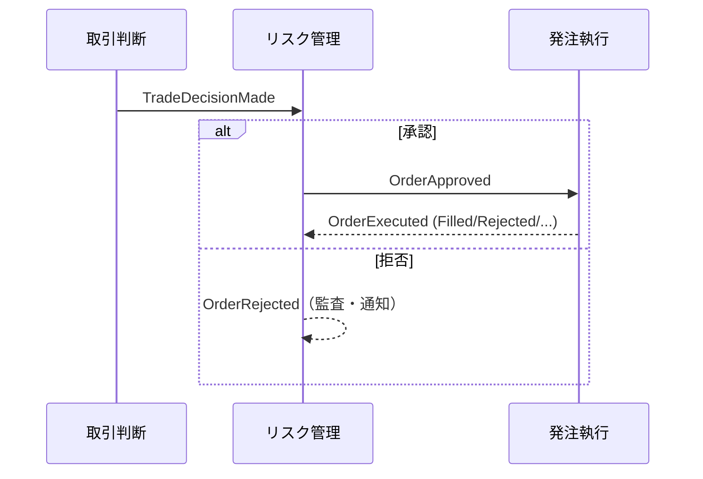

# 通信仕様書: 取引ドメインの通信契約（イベント・ポート）

> 現時点で確定している通信契約は**非同期イベント**（サービス間連携）と**ポート**（外部システムアダプタの
> 抽象）である。同期 HTTP API（kill switch 操作・設定変更等）はリスク管理ホスト（#12）・設定管理（#19）の
> 実装時に発生し、その時点で「エンドポイント一覧」表を本書に追記して `openapi.yaml` を生成する（IADR-0009）。

## 起点となる計画書（トレーサビリティ）

- 機能要求（FR）: FR-04（取引判断）、FR-05（発注執行）、FR-10（リスク統制）、FR-01/03（情報収集・市場監視）、FR-12（ペーパートレード）
- 技術検討 / ADR: `01_architecture-overview.md`、ADR-0001（platform イベント連携）、ADR-0002（証券会社アダプタ）
- 実装 ADR: [IADR-0009](../adr/IADR-0009_async-contract-format.md)（非同期契約の記述形式）

## 通信方式の方針（IADR-0009）

- **非同期イベント**: サービス間は platform のイベント連携（MassTransit / RabbitMQ 想定）で疎結合に連携する。
  イベント契約は本 Markdown 通信仕様で管理し、現段階では AsyncAPI は採用しない（軽量優先。将来必要になれば移行）。
- **同期 API**: `openapi.yaml`（OpenAPI 3.0）は同期 HTTP API 専用。現時点で同期エンドポイントは未実装のため
  `paths` は空。実装時に本書へ「エンドポイント一覧」表（メソッド/パス/概要）を追記すると
  `scripts/gen-openapi-skeleton.js` が雛形を生成する。
- **ポート**: 外部システム（証券会社・情報源）は C# インターフェース（ポート）で抽象化し、実装差し替えで切り替える。

## イベント契約（非同期）

取引サイクルのイベント。すべて不変 record。`DecisionId`（Guid）で 1 取引判断を相関する。

| イベント | 発行元 | 主なフィールド | 用途 |
| --- | --- | --- | --- |
| `TradeDecisionMade` | 取引判断（#11） | DecisionId, Intent(OrderIntent), Rationale, DecidedAt | 売買判断の確定（判断根拠つき） |
| `OrderApproved` | リスク管理（#12） | DecisionId, Intent, ApprovedQuantity, ApprovedAt | 発注前検証を通過し発注執行へ |
| `OrderRejected` | リスク管理（#12） | DecisionId, Intent, Reasons(RejectionReason[]), RejectedAt | 発注前拒否（理由列挙。監査 FR-11・通知 FR-09） |
| `OrderExecuted` | 発注執行（#13） | DecisionId, OrderId, Status(OrderStatus), FilledQuantity, AveragePrice, ExecutedAt | 約定/失注/取消/証券会社拒否の確定 |

市場監視のイベント（FR-03・UC-02）。`EventId`（Guid）で 1 検知を相関する（取引判断サイクルとは別系統。IADR-0014）。

| イベント | 発行元 | 主なフィールド | 用途 |
| --- | --- | --- | --- |
| `PriceMovementDetected` | 市場監視（#10） | EventId, Symbol, Market, Price, BaselinePrice, ChangeRatio, DetectedAt | 変動閾値超過→対象銘柄限定の取引サイクル即時起動（取引判断#11／サイクル#21 が購読） |
| `StopLossTriggered` | 市場監視（#10） | EventId, Symbol, Market, PositionSide(TradeSide), Quantity, Price, StopLossPrice, DetectedAt | 損切りライン到達→リスク管理（#12 Slice C）が LLM 迂回で決済(Close)注文を発行（ADR-0003） |

- `RejectionReason` / `OrderStatus` の値はデータ仕様書を参照。`OrderRejected`（発注前拒否）と
  `OrderExecuted.Status = Rejected`（証券会社拒否）は別事象（IADR-0007）。
- 損切りは市場監視が「検知」してイベント発行、リスク管理が「執行」する責務分離（IADR-0014）。`ChangeRatio` の基準
  `BaselinePrice` は前回 AI 判断時点の価格。
- イベントのエンベロープ（メッセージヘッダ・トピック命名・冪等性キー）は platform 規約（ADR-0001・#22）に合わせる。

運用・ライフサイクルのイベント（情報収集・費用・設定・報告書）。取引サイクルの相関 ID（`DecisionId`）とは別系統で、
主に監査（FR-11）・通知（FR-09）・サイクル起動（FR-02）の購読者向け。

| イベント | 発行元 | 主なフィールド | 用途 |
| --- | --- | --- | --- |
| `InformationCollected` | 情報収集（#9） | EventId, ItemCount, CollectedAt | 1 巡回の収集完了（正規化・KB 保存済み件数）。定時取引サイクル（FR-02）の起点（IADR-0022/0023） |
| `CostThresholdReached` | 費用統制（#23） | Month, Category, Percent, State, OccurredAt | 費用しきい値到達で統制状態が上方遷移（Normal→Throttled→Halted）。通知が購読（IADR-0027） |
| `AssumptionsChanged` | 設定管理（#19） | Version, Actor, Reason, ChangedAt | 全体前提条件が利用者により変更（バージョンつき）。監査・通知が購読（IADR-0021）。消費側は前提条件キャッシュの無効化に購読（`AssumptionsChangedConsumer`・IADR-0064） |
| `ReportConfirmed` | 報告書（#14） | PeriodKey, Kind, Actor, AssumptionsVersion, ConfirmedAt | 報告書の確定（Draft→Confirmed 遷移時のみ）。監査・通知が購読（IADR-0024） |

- これら 4 件は通知サービスが購読して Discord 送信するが、各サービスは Discord を直接呼ばない（IADR-0020）。
- `InformationCollected` は取引サイクル配線（#21・IADR-0023）で定時起動の合図になる。

### イベントフロー

## ポート契約（外部システムアダプタ）

| ポート | 実装 | メソッド | 契約 |
| --- | --- | --- | --- |
| `IBrokerAdapter` | PaperBrokerAdapter（実装済）/ moomoo（#13） | PlaceOrderAsync / GetOrderAsync / CancelOrderAsync | 発注・状態照会・取消。承認済み注文のみ渡す。未知IDの照会は null、取消は例外 |
| `IMarketDataSource` | 各情報源（#9/#10） | GetLatestQuoteAsync(symbol, market) | 現在値取得。取得不可は null |

## 同期 API（未実装・追記予定）

現時点で同期 HTTP エンドポイントは無い。実装時に以下の形式で表を追記する（`gen-openapi-skeleton.js` が
メソッド/パス列を読む）。想定される最初の同期 API はリスク管理ホストの運用操作（UC-06）。

| メソッド | パス | 概要 | 実装 issue |
| --- | --- | --- | --- |
| （例）POST | （例）/risk/kill-switch | kill switch の起動/解除 | #12 |
| （例）PUT | （例）/risk/settings | 取引ガード・上限の設定変更 | #12, #19 |

> 上表は**例示（パスは `/` を含まない全角括弧付き）** であり、実装確定時に実パス（`/...`）へ置き換える。
> 現状は実エンドポイントが無いため `openapi.yaml` の `paths` は空である。

## 受け入れ基準

- [x] 実装済みの非同期イベント契約・ポート契約が通信仕様書に記載される
- [x] 同期 API が未実装であること・追記方針・openapi との関係が明記される（別文書として整備）
- [x] `openapi.yaml` の空理由が説明され、生成器のコメントが本書を指す（IADR-0009）

## 関連仕様

- データ仕様書: [リスク管理ドメインの集約](../data/risk-management-aggregates.md)
- 機能仕様書: [FR-12 ペーパートレード](../functional/FR-12_paper-trade.md)、[FR-19 取引ガード](../functional/FR-19_trading-guard.md)
- 実装ADR: [IADR-0009](../adr/IADR-0009_async-contract-format.md)、[IADR-0007](../adr/IADR-0007_broker-rejection-vs-risk-rejection.md)（拒否の区別）

## 未決事項

- イベントエンベロープ・トピック命名・冪等性の platform 準拠（#22）と連動して詳細化する。
- 同期 API はリスク管理ホスト（#12）・設定管理（#19）実装時に確定・追記する。
