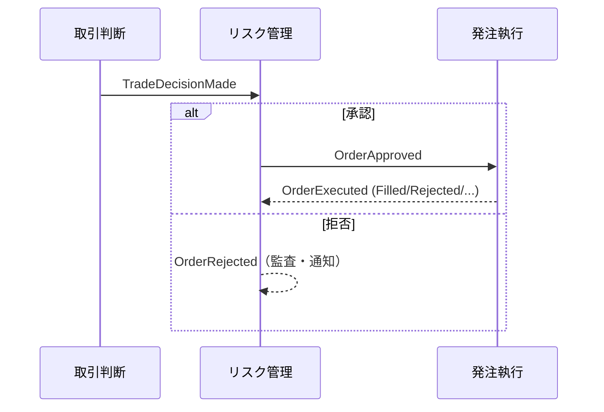

<!-- trace:
ids: [FR-01, FR-02, FR-03, FR-04, FR-05, FR-09, FR-10, FR-11, FR-12, UC-02, UC-06]
adrs: [ADR-0001, ADR-0002, ADR-0003, ADR-0013]
iadrs: [IADR-0007, IADR-0009, IADR-0014, IADR-0020, IADR-0021, IADR-0022, IADR-0023, IADR-0024, IADR-0027, IADR-0037, IADR-0063, IADR-0077, IADR-0078, IADR-0079, IADR-0129, MSP:IADR-0049]
specs: [01_architecture-overview, ADR-0002_broker-selection]
issues: [#9, #10, #11, #12, #13, #14, #19, #21, #22, #23, #253, #354]
-->

# 通信仕様書: 取引ドメインの通信契約（イベント・ポート）

> 現時点で確定している通信契約は**非同期イベント**（サービス間連携）と**ポート**（外部システムアダプタの
> 抽象）である。同期 HTTP API（kill switch 操作・設定変更等）はリスク管理ホスト・設定管理の
> 実装時に発生し、その時点で「エンドポイント一覧」表を本書に追記して `openapi.yaml` を生成する。

## 本書が受け持つ範囲

- 機能要求: 取引判断・発注執行・リスク統制・情報収集・市場監視・ペーパートレード。
- 技術検討 / 計画 ADR: アーキテクチャ概要（`01_architecture-overview.md`）、基盤（platform）のイベント連携、証券会社アダプタの選定。
- 実装 ADR: 非同期イベント契約は Markdown 通信仕様で管理し、OpenAPI は同期 API 専用とする（非同期契約の記述形式）。

## 通信方式の方針

- **非同期イベント**: サービス間は platform のイベント連携（MassTransit / RabbitMQ 想定）で疎結合に連携する。
  イベント契約は本 Markdown 通信仕様で管理し、現段階では AsyncAPI は採用しない（軽量優先。将来必要になれば移行）。
- **同期 API**: `openapi.yaml`（OpenAPI 3.0）は同期 HTTP API 専用。現時点で同期エンドポイントは未実装のため
  `paths` は空。実装時に本書へ「エンドポイント一覧」表（メソッド/パス/概要）を追記すると
  `scripts/gen-openapi-skeleton.js` が雛形を生成する。
- **ポート**: 外部システム（証券会社・情報源）は C# インターフェース（ポート）で抽象化し、実装差し替えで切り替える。

## イベント契約（非同期）

取引サイクルのイベント。すべて不変 record。`DecisionId`（Guid）で 1 取引判断を相関する。

| イベント | 発行元 | 主なフィールド | 用途 |
| --- | --- | --- | --- |
| `TradeDecisionMade` | 取引判断 | DecisionId, Intent(OrderIntent), Rationale, DecidedAt | 売買判断の確定（判断根拠つき） |
| `OrderApproved` | リスク管理 | DecisionId, Intent, ApprovedQuantity, ApprovedAt | 発注前検証を通過し発注執行へ |
| `OrderRejected` | リスク管理 | DecisionId, Intent, Reasons(RejectionReason[]), RejectedAt | 発注前拒否（理由列挙。監査ログと Discord 通知が購読） |
| `OrderExecuted` | 発注執行 | DecisionId, OrderId, Status(OrderStatus), FilledQuantity, AveragePrice, ExecutedAt | 約定/失注/取消/証券会社拒否の確定 |

市場監視のイベント（価格変動監視と、変動トリガーによる取引の起動に対応する）。`EventId`（Guid）で 1 検知を相関する
（取引判断サイクルとは別系統。市場監視は検知してイベントを発行し、損切りの執行はリスク管理が担うという責務境界による）。

| イベント | 発行元 | 主なフィールド | 用途 |
| --- | --- | --- | --- |
| `PriceMovementDetected` | 市場監視 | EventId, Symbol, Market, Price, BaselinePrice, ChangeRatio, DetectedAt | 変動閾値超過→対象銘柄限定の取引サイクル即時起動（取引判断#11／サイクル#21 が購読） |
| `StopLossTriggered` | 市場監視 | EventId, Symbol, Market, PositionSide(TradeSide), Quantity, Price, StopLossPrice, DetectedAt | 損切りライン到達→リスク管理（#12 Slice C）が LLM 迂回で決済(Close)注文を発行 |

- `RejectionReason` / `OrderStatus` の値はデータ仕様書を参照。`OrderRejected`（発注前拒否）と
  `OrderExecuted.Status = Rejected`（証券会社拒否）は別事象。
- 損切りは市場監視が「検知」してイベント発行、リスク管理が「執行」する責務分離。`ChangeRatio` の基準
  `BaselinePrice` は前回 AI 判断時点の価格。
- イベントのエンベロープ（メッセージヘッダ・トピック命名・冪等性キー）は基盤（platform）の規約に合わせる（#22）。

運用・ライフサイクルのイベント（情報収集・費用・設定・報告書）。取引サイクルの相関 ID（`DecisionId`）とは別系統で、
主に監査・通知・サイクル起動の購読者向け。

| イベント | 発行元 | 主なフィールド | 用途 |
| --- | --- | --- | --- |
| `InformationCollected` | 情報収集 | EventId, ItemCount, CollectedAt | 1 巡回の収集完了（正規化・KB 保存済み件数）。定時取引サイクルの起点（定時サイクルとイベント駆動サイクルは取引判断で合流する） |
| `CostThresholdReached` | 費用統制 | Month, Category, Percent, State, OccurredAt | 費用しきい値到達で統制状態が上方遷移（Normal→Throttled→Halted）。通知が購読 |
| `AssumptionsChanged` | 設定管理 | Version, Actor, Reason, ChangedAt | 全体前提条件が利用者により変更（バージョンつき）。監査・通知が購読。消費側は前提条件キャッシュの無効化に購読（`AssumptionsChangedConsumer`。共有クライアントのイベント無効化経路） |
| `ReportConfirmed` | 報告書 | PeriodKey, Kind, Actor, AssumptionsVersion, ConfirmedAt | 報告書の確定（Draft→Confirmed 遷移時のみ）。監査・通知が購読 |

- これら 4 件は通知サービスが購読して Discord 送信するが、各サービスは Discord を直接呼ばない。
- `InformationCollected` は取引サイクル配線（#21）で定時起動の合図になる。

### イベントフロー

## ポート契約（外部システムアダプタ）

| ポート | 実装 | メソッド | 契約 |
| --- | --- | --- | --- |
| `IBrokerAdapter` | PaperBrokerAdapter（実装済）/ moomoo | PlaceOrderAsync / GetOrderAsync / CancelOrderAsync | 発注・状態照会・取消。承認済み注文のみ渡す。未知IDの照会は null、取消は例外 |
| `IMarketDataSource` | 各情報源 | GetLatestQuoteAsync(symbol, market) | 現在値取得。取得不可は null |

## 同期 API（未実装・追記予定）

現時点で同期 HTTP エンドポイントは無い。実装時に以下の形式で表を追記する（`gen-openapi-skeleton.js` が
メソッド/パス列を読む）。想定される最初の同期 API はリスク管理ホストの運用操作。

| メソッド | パス | 概要 | 実装 issue |
| --- | --- | --- | --- |
| （例）POST | （例）/risk/kill-switch | kill switch の起動/解除 | #12 |
| （例）PUT | （例）/risk/settings | 取引ガード・上限の設定変更 | #12, #19 |

> 上表は**例示（パスは `/` を含まない全角括弧付き）** であり、実装確定時に実パス（`/...`）へ置き換える。
> 現状は実エンドポイントが無いため `openapi.yaml` の `paths` は空である。

## 受け入れ基準

- [x] 実装済みの非同期イベント契約・ポート契約が通信仕様書に記載される
- [x] 同期 API が未実装であること・追記方針・openapi との関係が明記される（別文書として整備）
- [x] `openapi.yaml` の空理由が説明され、生成器のコメントが本書を指す

## 関連仕様

- データ仕様書: [リスク管理ドメインの集約](../data/risk-management-aggregates.md)
- 機能仕様書: [ペーパートレード](../functional/FR-12_paper-trade.md)、[取引ガード](../functional/FR-19_trading-guard.md)
- 実装ADR: 非同期イベント契約は Markdown 通信仕様で管理し、OpenAPI は同期 API 専用とする／証券会社拒否は `OrderStatus.Rejected` で表し、リスク事前拒否（`OrderRejected` イベント）と区別する

## 宣言的バインディング（#22・PR-A）

取引サイクルの変換 DAG（発行・購読バインディング）は `deploy/helm/ai-stock-trading/files/pipeline.json` に
宣言し、CI（`scripts/validate-pipeline-config.js`）で検証する（変換 DAG のみを段として表現し、CI 検証と GitOps 適用に載せる方針）。
横断オブザーバ（監査・通知・射影）は段に含めない。実効構成の自己申告（`GET /internal/introspection`）は
`PlatformShim.Foundation.Introspection` が担う（#22 PR-B。無認可・メッシュ内部限定で公開し、有効な段は `pipeline.json` の宣言から導出する）。

## イベント契約の後方互換（#22・PR-C）

`Shared.Contracts.Events` の全イベント record の後方互換（削除・改名・型変更の禁止／追加は許容）を CI 契約テスト
（`AiStockTrading.Shared.Contracts.Tests`・committed snapshot 比較）で機械化する（共通エンベロープ型は上流確定まで繰延とする）。

## wire 識別子（メッセージ識別子）の固定

メッセージの wire 上の識別子は **Wolverine の `ToMessageTypeName()`**（既定は namespace 込みの完全名
`AiStockTrading.Shared.Contracts.Events.<Type>`）である。この文字列が **exchange 名・binding key・封筒の
`message-type` ヘッダ**になる（Wolverine 移行のトポロジ設計＝キュー名にサービス名を前置し、ローカルルーティングを無効化する、の決定 2）。
識別子は**名前空間と型名の双方**から導出されるため、名前空間の移動は型名が不変でも wire 契約を破壊する
（発行側と購読側が別の exchange／キューで待ち合わせ、滞留中・DLQ 内のメッセージが再消費不能になる）。
上記の後方互換テストは snapshot キーが `Type.Name` のため名前空間移動を検出できない。この分担は
`EventMessageTypeNameTests` が担い、全 21 イベントの識別子を固定する（AsyncAPI を採らず共有 C# 契約＋Markdown を続け、
軽量な識別子回帰ガードで補強するという決定に基づく。検出範囲の分担表は後方互換の契約テストを定めた実装 ADR の「既知の限界」にある）。

> 履歴: 本テストの前身は `EventMessageUrnTests`で、MassTransit の正準 URN
> `urn:message:AiStockTrading.Shared.Contracts.Events:<Type>` を固定していた。#354の Wolverine 移行で
> MassTransit の URN は wire 上のどこにも現れなくなったため、第 3 段階で上記の識別子固定テストへ置き換えた
> （守る不変条件＝「識別子が意図せず変わらないこと」は不変）。

## 未決事項

- **共通エンベロープ型・トピック命名・冪等性キー**の platform 準拠（#22・受け入れ基準①）は platform 側でも
  共通エンベロープが繰延中のため導入しない。後方互換の契約テスト（PR-C）までを実装し、
  エンベロープ型は上流確定時に拡張する（`Refs #22`）。
- 同期 API はリスク管理ホスト・設定管理実装時に確定・追記する。
