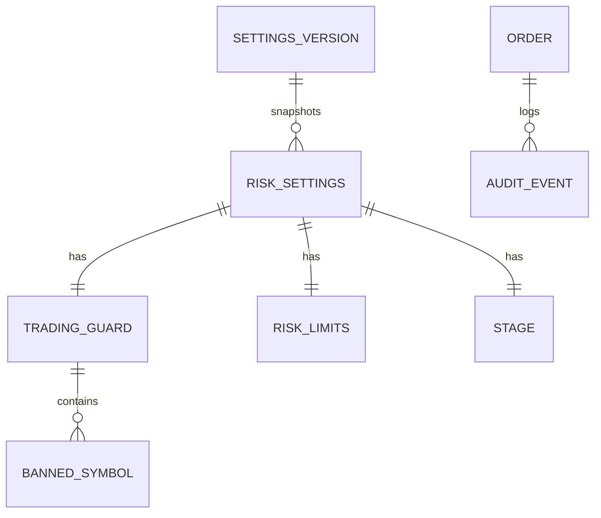

# データ仕様書: リスク管理ドメインの集約（設定・スナップショット・注文）

> 実装済みドメイン型（`RiskManagementService.Domain` / `AiStockTrading.Shared.Contracts.Trading`）の集約境界・
> 属性・永続化方針を定義する。属性 `PositionEffect` / `InvestedCapital` / `UnrealizedPnl` / `OrderStatus.Rejected` 等は
> PR #41・#42・#44（develop にマージ済み）と本 PR に統合済みの #43 で確定したもの。各属性の逆算根拠は
> [IADR-0002](../adr/IADR-0002_trading-defaults-derivation.md)、判定での用途は
> [FR-10 機能仕様](../functional/FR-10_risk-controls.md) を参照する。

## 起点となる計画書（トレーサビリティ）

- 関連機能要求（FR）: FR-10（リスク統制）、FR-12（ペーパートレード）、FR-17（前提条件の一元管理）、FR-19（取引ガード）、FR-20（段階ゲート）
- 技術検討 / ADR: ADR-0001（platform 再利用・Database per Service）、ADR-0007（取引ガード）、ADR-0008（段階ゲート）、IADR-0001（リポ構成）
- 計画書リンク: `05_trading-assumptions.md` §5、`01_architecture-overview.md`

## 概要

リスク管理ドメインは 3 系統のデータを扱う。

1. **設定（`RiskManagementSettings` 集約）**: 取引ガード・リスク上限・段階ゲートの確定値。利用者のみ変更でき、生成AIは
   上書きできない（ADR-0003/0007）。実運用では設定ストア（PostgreSQL）から読み込み、既定値は `TradingDefaults` が提供する。
2. **運用状態スナップショット（`PortfolioSnapshot` 値オブジェクト）**: 判定時点のポートフォリオ・当日損益・kill switch 等。
   永続エンティティではなく、リスク管理ホスト（#12）が保有・約定・損益から**都度組み立てる派生データ**。
3. **注文（`OrderIntent` / `BrokerOrder`）**: 取引判断が生成する注文意図と、証券会社アダプタが返す注文実体。注文・監査ログの
   永続化は後続スライス（#12/#17/#19）で PostgreSQL に実装する。

永続化は platform の **Database per Service**（ADR-0001）に従い、リスク管理サービス専有スキーマに配置する。

## エンティティ定義

### RiskManagementSettings（集約ルート）

設定ストア由来の設定集約。`record RiskManagementSettings(Guard, Limits, Stage)`。

| 属性 | 型 | 必須 | 説明 |
| --- | --- | --- | --- |
| Guard | TradingGuardSettings | ○ | 取引ガード（FR-19） |
| Limits | RiskLimitSettings | ○ | リスク上限（FR-10） |
| Stage | StageSettings | ○ | 段階ゲート（FR-20） |

### TradingGuardSettings（FR-19, ADR-0007）

| 属性 | 型 | 必須 | 既定値 | 説明 |
| --- | --- | --- | --- | --- |
| EnabledProductTypes | Set&lt;ProductType&gt; | ○ | { Cash } | 有効な商品種別。信用は無効（初期資金が最低保証金未満） |
| EnabledMarkets | Set&lt;Market&gt; | ○ | { Japan, UnitedStates } | 市場別の有効/無効。米国株が主 |
| BannedSymbols | Collection&lt;BannedSymbol&gt; | ○ | 利用者登録3件 | 取引禁止銘柄（銘柄+市場で照合） |
| PreventSameDayReentry | bool | | true | 差金決済防止（同日再エントリー禁止） |
| ProhibitManipulativeOrderPatterns | bool | | true | 相場操縦パターン禁止（判定は検出器注入時。IADR-0006） |

### RiskLimitSettings（FR-10。既定値の出所は IADR-0002）

| 属性 | 型 | 既定値 | 制約 | 説明 |
| --- | --- | --- | --- | --- |
| MaxOrderAmount | decimal | 35,000 | > 0 | 1注文金額上限（円）。逆算値 |
| MaxDailyOrderAmount | decimal | 100,000 | > 0 | 1日発注金額上限（円）。逆算値 |
| MaxOpenPositions | int | 3 | ≥ 0 | 保有銘柄数上限。逆算値 |
| DailyLossLimitRatio | decimal | 0.02 | 0〜1 | 日次損失上限（資金比）。§5 明記 |
| PerTradeRiskRatio | decimal | 0.01 | 0〜1 | 1取引リスク（資金比）。§5（0.5〜1%）上限側 |
| MaxDrawdownRatio | decimal | 0.10 | 0〜1 | 最大DD上限。§5（10〜15%）保守側 |
| LosingStreakThreshold | int | 3 | ≥ 1 | 連敗縮小しきい値。§5（3〜5）保守側 |
| LosingStreakSizeFactor | decimal | 0.5 | 0〜1 | 連敗時サイズ縮小係数 |

### StageSettings（FR-20, ADR-0008）

`record StageSettings(Stage, Mode, CapitalCap)`。既定は `(Stage0Verification, Paper, 100,000)`。

| 属性 | 型 | 説明 |
| --- | --- | --- |
| Stage | TradingStage | Stage0Verification / Stage1Paper / Stage2MinimalLive / Stage3ScaledLive |
| Mode | TradeMode | Paper / Live。段階が許可するモードのみ実行可 |
| CapitalCap | decimal | 段階資金上限（円）。累計投入額の上限（IADR-0005） |

### BannedSymbol（FR-19）

`record BannedSymbol(Symbol, Market, Reason, RegisteredOn)`。禁止銘柄は（Symbol, Market）で一意。

### PortfolioSnapshot（値オブジェクト・非永続。判定入力）

| 属性 | 型 | 既定 | 説明 |
| --- | --- | --- | --- |
| Capital | decimal | 必須 | 当日開始時運用資金（固定基準。当日中不変） |
| OpenPositionCount | int | 0 | 保有銘柄数 |
| InvestedCapital | decimal | 0 | 保有取得額合計（コストベース）。段階資金上限の累計判定（#27/IADR-0005） |
| DailyOrderedAmount | decimal | 0 | 当日発注金額累計 |
| DailyRealizedPnl | decimal | 0 | 当日実現損益（負=損失） |
| UnrealizedPnl | decimal | 0 | 含み損益（日次終値評価）。日次損失上限は実現+含みの合算で判定（#31/IADR-0008） |
| DrawdownRatio | decimal | 0 | 資金ピークからのDD率 |
| ConsecutiveLosses | int | 0 | 連敗数（サイジング縮小に使用） |
| SymbolsTradedToday | Set&lt;(Symbol, Market)&gt; | 空 | 当日取引済み銘柄（差金決済防止。市場込み #26） |
| KillSwitchEngaged | bool | false | 全停止スイッチ（利用者のみ操作） |

### OrderIntent / BrokerOrder（FR-04/05/12）

`OrderIntent(Symbol, Market, Side, ProductType, Mode, Quantity, Price, PositionEffect=Open)`。`Notional = Quantity × Price`。
`PositionEffect`（Open/Close）でエントリー/手仕舞いを表す（#25/IADR-0004）。

`BrokerOrder(OrderId, Intent, Status, FilledQuantity, AveragePrice, PlacedAt, CompletedAt?)`。`OrderStatus` は
Accepted / PartiallyFilled / Filled / Expired / Cancelled / **Rejected**（証券会社拒否 #30/IADR-0007）。

## ER 図（永続対象＝設定・注文・監査）

## 永続化方針

| 集約 | 永続化 | 実装 issue | 備考 |
| --- | --- | --- | --- |
| RiskManagementSettings（＋子） | PostgreSQL 設定ストア。バージョン管理（FR-17）で前提条件の履歴を保持 | #12, #17, #19 | 変更は利用者のみ・変更履歴を記録（ADR-0007） |
| PortfolioSnapshot | 非永続（都度算出） | #12 | 保有・約定・損益から組み立てる派生データ |
| BrokerOrder / OrderIntent | PostgreSQL 注文テーブル | #12, #13 | 注文状態遷移（受付→約定/拒否/取消）を追跡 |
| 監査イベント（FR-11） | PostgreSQL 監査ログ（時系列） | #17 | 判定結果・拒否理由・全イベントを記録 |

- Database per Service（ADR-0001）に従い、リスク管理サービス専有スキーマに配置する。他サービスは直接参照せずイベント経由で連携する。
- 設定値は不変オブジェクトとして注入し、生成AI・自動処理は変更できない（ADR-0003/0007）。

## 整合性・制約ルール

- 禁止銘柄・当日取引済み銘柄は（Symbol, Market）で一意に照合する（別市場の同一コードを区別。#26）。
- 金額系（MaxOrderAmount 等）・比率系（*Ratio）は正値。比率は 0〜1。
- `Capital` は当日開始時の固定基準とし、当日損益で自己参照的に縮小させない。

## マイグレーション・初期データ

- 初期データは `TradingDefaults`（§5 の既定値）。設定ストア導入時にシードとして投入する。
- スキーマ変更方針・マイグレーションツールは技術要件書 `docs/tech/tech-requirements.md` と #12 で確定する。

## 関連仕様

- 機能仕様書: [FR-10 リスク統制](../functional/FR-10_risk-controls.md)
- 通信仕様書: [イベント・ポート契約](../api/events-and-ports.md)
- 実装ADR: [IADR-0002](../adr/IADR-0002_trading-defaults-derivation.md)（既定値の逆算）、[IADR-0003](../adr/IADR-0003_position-sizing-responsibility.md)（サイジング責務）、
  [IADR-0004](../adr/IADR-0004_position-effect-entry-scoping.md)（建玉効果）、[IADR-0005](../adr/IADR-0005_stage-capital-cap-definition.md)（段階資金上限）、
  [IADR-0007](../adr/IADR-0007_broker-rejection-vs-risk-rejection.md)（証券会社拒否）、[IADR-0008](../adr/IADR-0008_daily-loss-limit-basis.md)（日次損失基準）

## 未決事項

- 設定ストアの具体スキーマ（テーブル分割・バージョン管理方式）は #12/#17 で確定する。
- 監査ログの保持期間・パーティション方針は運用仕様（`docs/operations/`）と #17 で確定する。
