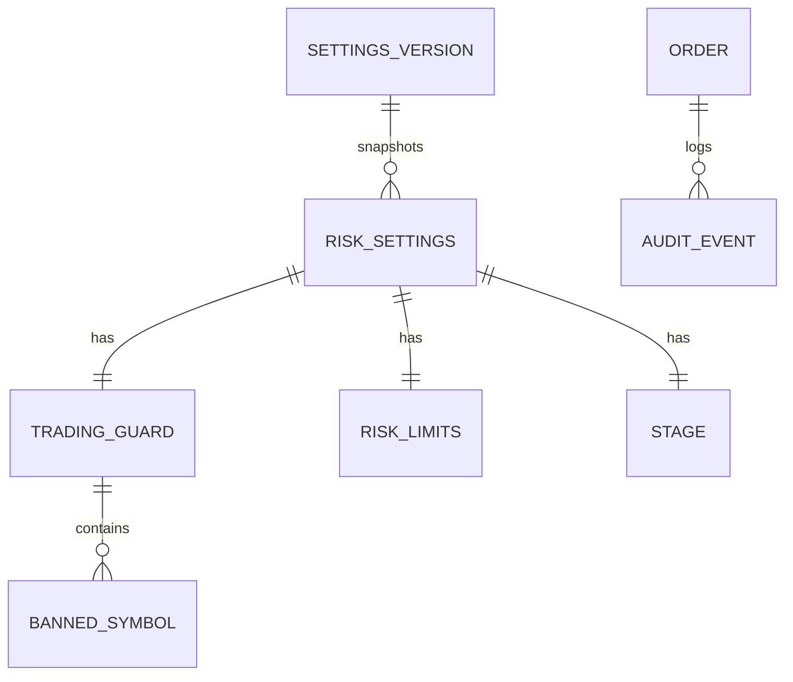

# データ仕様書: リスク管理ドメインの集約（設定・スナップショット・注文）

> 実装済みドメイン型（`RiskManagementService.Domain` / `AiStockTrading.Shared.Contracts.Trading`）の集約境界・
> 属性・永続化方針を定義する。属性 `PositionEffect` / `InvestedCapital` / `UnrealizedPnl` / `OrderStatus.Rejected` 等は
> PR #41・#42・#44（develop にマージ済み）と本 PR に統合済みの #43 で確定したもの。各属性の逆算根拠は
> [IADR-0002](../adr/IADR-0002_trading-defaults-derivation.md)、判定での用途は
> [FR-10 機能仕様](../functional/FR-10_risk-controls.md) を参照する。

## 起点となる計画書（トレーサビリティ）

- 関連機能要求（FR）: FR-10（リスク統制）、FR-12（ペーパートレード）、FR-17（前提条件の一元管理）、FR-19（取引ガード）、FR-20（段階ゲート）
- 技術検討 / ADR: ADR-0001（platform 再利用・Database per Service）、ADR-0003（リスク統制値を決定的コードで強制・AI は上書き不可）、ADR-0007（取引ガード）、ADR-0008（段階ゲート）、IADR-0001（リポ構成）
- 計画書リンク: `05_trading-assumptions.md` §5、`01_architecture-overview.md`

## 概要

リスク管理ドメインは 3 系統のデータを扱う。

1. **設定（`RiskManagementSettings` 集約）**: 取引ガード・リスク上限・段階ゲートの確定値。利用者のみ変更でき、生成AIは
   上書きできない（ガード設定: ADR-0007 / 統制上限: ADR-0003 / 段階設定: ADR-0008）。実運用では設定ストア（PostgreSQL）から読み込み、既定値は `TradingDefaults` が提供する。
2. **運用状態スナップショット（`PortfolioSnapshot` 値オブジェクト）**: 判定時点のポートフォリオ・当日損益・kill switch 等。
   永続エンティティではなく、リスク管理ホスト（#12）が保有・約定・損益から**都度組み立てる派生データ**。
3. **注文（`OrderIntent` / `BrokerOrder`）**: 取引判断が生成する注文意図と、証券会社アダプタが返す注文実体。注文・監査ログの
   永続化は後続スライス（#12/#17/#19）で PostgreSQL に実装する。

永続化は platform の **Database per Service**（ADR-0001）に従い、リスク管理サービス専有スキーマに配置する。

## エンティティ定義

### RiskManagementSettings（集約ルート）

設定ストア由来の設定集約。`record RiskManagementSettings(Guard, Limits, Stage)`。

| 属性 | 型 | 必須 | 説明 |
| --- | --- | --- | --- |
| Guard | TradingGuardSettings | ○ | 取引ガード（FR-19） |
| Limits | RiskLimitSettings | ○ | リスク上限（FR-10） |
| Stage | StageSettings | ○ | 段階ゲート（FR-20） |

### TradingGuardSettings（FR-19, ADR-0007, ADR-0016 決定1。#332 / IADR-0132）

| 属性 | 型 | 必須 | 既定値 | 説明 |
| --- | --- | --- | --- | --- |
| EnabledProductTypes | Set&lt;ProductType&gt; | ○ | { Cash } | 有効な商品種別。**3 値**（`Cash` / `MarginLong` / `ShortSell`）を独立に制御し、既定は現物のみ。**空売りの有効・無効の単一情報源**（IADR-0132 決定2） |
| EnabledMarkets | Set&lt;Market&gt; | ○ | { Japan, UnitedStates } | 市場別の有効/無効。米国株が主 |
| BannedSymbols | Collection&lt;BannedSymbol&gt; | ○ | 利用者登録3件 | 取引禁止銘柄（銘柄+市場で照合。コードは表記差を吸収＝ `BannedSymbol.Matches`） |
| PreventSameDayReentry | bool | | true | 差金決済防止（同日再エントリー禁止）。**適用は日本株 × 現物 × 新規建てのみ**（FR-19・IADR-0132 決定5） |
| ProhibitManipulativeOrderPatterns | bool | | true | 相場操縦パターン禁止（判定は検出器注入時。IADR-0006） |

### RiskLimitSettings（FR-10。既定値は計画 05_trading-assumptions §5 の確定単一値。#329 / IADR-0130）

**金額系は固定額を持たない**（計画 §5 注記）。equity 比で保持し、判定時に
`MaxOrderAmountFor(equity)` / `MaxDailyOrderAmountFor(equity)` で解決する。

| 属性 | 型 | 既定値 | 制約 | 説明 |
| --- | --- | --- | --- | --- |
| MaxOrderAmountRatio | decimal | 0.25 | > 0 | 1 注文あたりの発注金額上限（**equity 比**）。§5 |
| MaxDailyOrderAmountRatio | decimal | 1.50 | > 0 | 1 日あたりの発注金額上限（**equity 比・日次**）。新規建てのみ算入。§5 / #302 |
| MaxOpenPositions | int | 3 | ≥ 0 | 保有**建玉**数上限（「保有銘柄数」では数えない）。§5 / ADR-0016 決定9 |
| DailyLossLimitRatio | decimal | 0.02 | 0〜1 | 日次損失上限（equity 比）。§5 / ADR-0018 |
| PerTradeRiskRatio | decimal | 0.01 | 0〜1 | 1 取引リスク（equity 比・ATR 連動）。§5 / ADR-0018 |
| MaxDrawdownRatio | decimal | 0.10 | 0〜1 | 最大 DD 上限。§5 / ADR-0018 |
| LosingStreakThreshold | int | 5 | ≥ 1 | 連敗縮小しきい値。§5 / ADR-0018（旧レンジの保守側 3 からの是正） |
| LosingStreakSizeFactor | decimal | 0.5 | 0〜1 | 連敗時サイズ縮小係数 |

> **API 契約の破壊的変更（#329・申し送り）**: `PUT /risk-controls/settings/limits` は本レコードをそのまま
> 受けるため、フィールド名が `maxOrderAmount` → `maxOrderAmountRatio`・`maxDailyOrderAmount` →
> `maxDailyOrderAmountRatio` へ変わる。**SC-02（リスク設定画面）は旧名で送るため保存が 400 で拒否される**
> （＝古い画面から誤った単位の値を保存できない安全側の縮退）。画面の追随は
> [#340](https://github.com/endazon/ai-stock-trading/issues/340) の担当であり、比率と「現在 equity での実額」の
> 併記が要る。既存の永続化行（JSON）も旧名のままでは復元できないため、切替計画（#346）で扱う。

### StageSettings（FR-20, ADR-0008）

`record StageSettings(Stage, Mode, CapitalCap)`。既定は
`(Stage0Verification, Paper, TradingDefaults.InitialCapital)`（#329: $3,000 ＝ ¥491,100）。
計画が定める Stage 2 の総資金比 30% 化は [#333](https://github.com/endazon/ai-stock-trading/issues/333) の担当。

| 属性 | 型 | 説明 |
| --- | --- | --- |
| Stage | TradingStage | Stage0Verification / Stage1Paper / Stage2MinimalLive / Stage3ScaledLive |
| Mode | TradeMode | Paper / Live。段階が許可するモードのみ実行可 |
| CapitalCap | decimal | 段階資金上限（円）。累計投入額の上限（IADR-0005） |

### BannedSymbol（FR-19）

`record BannedSymbol(Symbol, Market, Reason, RegisteredOn)`。禁止銘柄は（Symbol, Market）で一意。

### PortfolioSnapshot（値オブジェクト・非永続。判定入力）

| 属性 | 型 | 既定 | 説明 |
| --- | --- | --- | --- |
| Capital | decimal | 必須 | 判定に用いる自己資金（**equity**）＝当日開始時運用資金（前営業日終値時点・当日中不変）。金額系上限もこの値から解決する（#329/IADR-0130） |
| OpenPositionCount | int | 0 | 保有**建玉**数 |
| InvestedCapital | decimal | 0 | 保有取得額合計（コストベース）。段階資金上限の累計判定（#27/IADR-0005） |
| DailyOrderedAmount | decimal | 0 | 当日発注金額累計。**新規建て（Open）の約定のみ**を積む（#302/#329） |
| DailyRealizedPnl | decimal | 0 | 当日実現損益（負=損失） |
| UnrealizedPnl | decimal | 0 | 含み損益（日次終値評価）。日次損失上限は実現+含みの合算で判定（#31/IADR-0008） |
| DrawdownRatio | decimal | 0 | 資金ピークからのDD率 |
| ConsecutiveLosses | int | 0 | 連敗数（サイジング縮小に使用） |
| SymbolsTradedToday | Set&lt;(Symbol, Market)&gt; | 空 | 当日取引済み銘柄（差金決済防止。市場込み #26） |
| KillSwitchEngaged | bool | false | 全停止スイッチ（利用者のみ操作） |

### OrderIntent / BrokerOrder（FR-04/05/12）

`OrderIntent(Symbol, Market, Side, ProductType, Mode, Quantity, Price, PositionEffect=Open)`。`Notional = Quantity × Price`。
`PositionEffect`（Open/Close）でエントリー/手仕舞いを表す（#25/IADR-0004）。

`BrokerOrder(OrderId, Intent, Status, FilledQuantity, AveragePrice, PlacedAt, CompletedAt?)`。`OrderStatus` は
Accepted / PartiallyFilled / Filled / Expired / Cancelled / **Rejected**（証券会社拒否 #30/IADR-0007）。

### 取引台帳（`ApprovedOrderRow` / `TradeFillRow`・永続。IADR-0018）

`PortfolioSnapshot` の運用状態を実データ化するための追記専用台帳（PR #63・#12）。`OrderApproved`/`OrderExecuted` を
購読して記録し、`PortfolioProjection`（符号付き在庫・平均取得単価法の純関数）が `PortfolioState` を都度射影する。
`OrderExecuted` は銘柄・方向を持たないため、承認 Intent を `DecisionId` で相関して補完する。

`approved_orders`（承認済み注文の Intent。主キー `DecisionId`）:

| 属性 | 型 | 説明 |
| --- | --- | --- |
| DecisionId | Guid (PK) | 判断/損切りイベント由来の一意キー（冪等）。通常経路・損切り機械執行の両承認を記録 |
| Symbol / Market / Side / ProductType / PositionEffect / Mode | 各列挙・文字列 | 承認 Intent の写し（約定に銘柄・方向・建玉効果を補完するための権威情報） |
| Quantity / Price | int / decimal | 承認数量・参照価格 |
| ApprovedAt | DateTimeOffset | 承認時刻 |

`trade_fills`（約定。主キー `OrderId`）:

| 属性 | 型 | 説明 |
| --- | --- | --- |
| OrderId | string (PK) | 発注執行が採番した注文ID（冪等）。`Status==Filled` かつ `FilledQuantity>0` のみ記録 |
| DecisionId | Guid (index) | `approved_orders` との相関キー。DB 強制 FK は張らず、整合性はアプリ層で担保（`AppendFill` が承認存在を確認） |
| FilledQuantity / AveragePrice | int / decimal | 約定数量・約定単価 |
| ExecutedAt | DateTimeOffset | 約定時刻（取引日境界は JST 固定オフセットで解釈。IADR-0018） |

> 部分約定の累積更新（実ブローカー）は #13/moomoo 後続でゲート済み（IADR-0016）。含み損益・DD の日次終値マークは市場データ
> 連携まで対象外（`UnrealizedPnl`/`DrawdownRatio` は射影上 0。IADR-0008 の #12 後続）。

### 借株料の日次計上（`BorrowFeeAccrualRow` / `BorrowFeeUnavailableDayRow`・永続。#465 / ADR-0027 / [IADR-0183](../adr/IADR-0183_borrow-fee-accrual-recording.md)）

ADR-0027 が「借株料の累計」の作り方（計上のタイミング・単位・期間の境界・料率変動・供給元）を確定させたことに伴う記録側。
**計上の単位は「建玉 × 取引日」**であり、銘柄別・口座全体・月次は**すべて本表の合算で導出する**（決定2「別々に積まない」）。

#### `borrow_fee_accruals`（**計上できた日**）

| 属性 | 型 | 必須 | 説明 |
| --- | --- | --- | --- |
| Symbol | string(32) | ○ | 銘柄コード。**主キーの一部** |
| Market | Market | ○ | 市場。**主キーの一部**。(Symbol, Market) が建玉の一次識別子（決定2） |
| TradingDay | DateOnly | ○ | 計上の帰属日。**主キーの一部**。**按分しない**——この日が属する日・月へ帰属する（決定3） |
| RateAnnual | decimal | ○ | **計上日に照会した**年率（比率）。建玉時の料率ではない（決定4） |
| PositionValueUsd | decimal | ○ | 計上の基礎となった建玉評価額（USD） |
| AmountUsd | decimal | ○ | その日の計上額（USD）＝ `RateAnnual × PositionValueUsd ÷ 365`。**丸めない**（丸め規則は計画に無い） |
| AccruedAtUtc | DateTimeOffset | ○ | 計上を記録した時刻 |

#### `borrow_fee_unavailable_days`（**料率が取得できなかった日**）

| 属性 | 型 | 必須 | 説明 |
| --- | --- | --- | --- |
| Symbol / Market / TradingDay | — | ○ | 上表と同じ複合主キー |
| Reason | string(512) | ○ | 取得できなかった理由（診断用） |
| ObservedAtUtc | DateTimeOffset | ○ | 未供給を記録した時刻 |

🔴 **2 表に分けるのはスキーマ設計上の意図である。** `borrow_fee_accruals` に `AmountUsd` を null 許容で持たせて
1 表に畳むと、**合計を取る SQL / LINQ が未供給の日を 0 として扱う経路が自然に書ける**。
ADR-0027 決定4 は「取得できなかった日を **0 として計上しない**」と明示しており、
**0 を積むと「その日は費用が発生しなかった」と読める**（Stage 1 の「借株料は 1 円も掛かっていない」という誤読）。
**未供給の表は金額の欄そのものを持たない**ため、その経路は書けない。

- **主キーによる冪等**: 同じ建玉の同じ取引日を二度計上しても行は増えず、金額が狂わない。
- **既存行は更新しない**: 後から別の料率で上書きすると、監査へ残した日次の内訳（`BorrowFeeAccrued`）と食い違う。
- **索引**: `TradingDay`（月報の月次合計・日報の当日分を期間で引く）。
- 🔴 **供給はまだ始まっていない**（ADR-0027 決定6・ADR-0026 PoC 項目 9）。表は存在するが、
  日次の料率照会もスケジューラも実装していないため**行は書かれない**。

## ER 図（永続対象＝設定・注文・監査）

## 永続化方針

| 集約 | 永続化 | 実装 issue | 備考 |
| --- | --- | --- | --- |
| RiskManagementSettings（＋子） | PostgreSQL 設定ストア。バージョン管理（FR-17）で前提条件の履歴を保持 | #12, #17, #19 | 変更は利用者のみ・変更履歴を記録（ガード設定: ADR-0007 / 統制上限: ADR-0003 / 段階設定: ADR-0008） |
| PortfolioSnapshot | 非永続（都度算出） | #12 | 保有・約定・損益から組み立てる派生データ |
| 取引台帳（`approved_orders` / `trade_fills`） | PostgreSQL 追記専用（専有 DB） | #12（PR #63） | `OrderApproved`/`OrderExecuted` を記録し `PortfolioState` を射影（IADR-0018）。`DecisionId`/`OrderId` で冪等 |
| BrokerOrder / OrderIntent | PostgreSQL 注文テーブル | #12, #13 | 注文状態遷移（受付→約定/拒否/取消）を追跡 |
| 監査イベント（FR-11） | PostgreSQL 監査ログ（時系列） | #17 | 判定結果・拒否理由・全イベントを記録 |

- Database per Service（ADR-0001）に従い、リスク管理サービス専有スキーマに配置する。他サービスは直接参照せずイベント経由で連携する。
- 設定値は不変オブジェクトとして注入し、生成AI・自動処理は変更できない（ガード設定: ADR-0007 / 統制上限: ADR-0003 / 段階設定: ADR-0008）。

## 整合性・制約ルール

- 禁止銘柄・当日取引済み銘柄は（Symbol, Market）で一意に照合する（別市場の同一コードを区別。#26）。
- 金額系（MaxOrderAmount 等）・比率系（*Ratio）は正値。比率は 0〜1。
- `Capital` は当日開始時の固定基準とし、当日損益で自己参照的に縮小させない。

## マイグレーション・初期データ

- 初期データは `TradingDefaults`（§5 の既定値）。設定ストア導入時にシードとして投入する。
- スキーマ変更方針・マイグレーションツールは技術要件書 `docs/tech/tech-requirements.md` と #12 で確定する。

## 関連仕様

- 機能仕様書: [FR-10 リスク統制](../functional/FR-10_risk-controls.md)
- 通信仕様書: [イベント・ポート契約](../api/events-and-ports.md)
- 実装ADR: [IADR-0002](../adr/IADR-0002_trading-defaults-derivation.md)（既定値の逆算）、[IADR-0003](../adr/IADR-0003_position-sizing-responsibility.md)（サイジング責務）、
  [IADR-0004](../adr/IADR-0004_position-effect-entry-scoping.md)（建玉効果）、[IADR-0005](../adr/IADR-0005_stage-capital-cap-definition.md)（段階資金上限）、
  [IADR-0007](../adr/IADR-0007_broker-rejection-vs-risk-rejection.md)（証券会社拒否）、[IADR-0008](../adr/IADR-0008_daily-loss-limit-basis.md)（日次損失基準）、
  [IADR-0018](../adr/IADR-0018_portfolio-ledger-projection.md)（取引台帳射影＝運用状態の実データ化）

## 未決事項

- 設定ストアの具体スキーマ（テーブル分割・バージョン管理方式）は #12/#17 で確定する。
- 監査ログの保持期間・パーティション方針は運用仕様（`docs/operations/`）と #17 で確定する。
