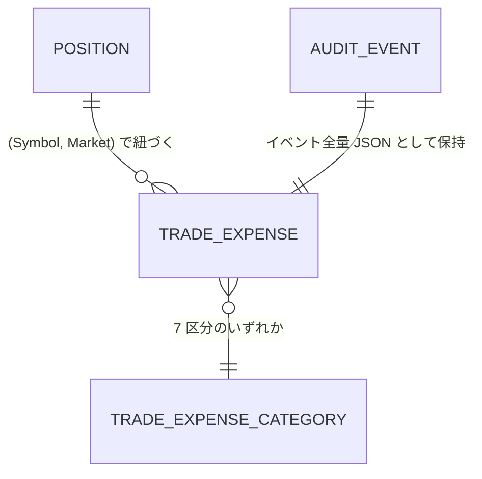

<!-- trace:
ids: [FR-11, UC-07, NFR-08, NFR-09, NFR-10, NFR-11]
adrs: [ADR-0016, ADR-0027]
iadrs: [IADR-0226, IADR-0228]
specs: [20260828_339_audit-and-trade-records]
issues: [#339]
-->

# データ仕様書: 取引記録の経費区分（trade expenses）

> 取引にかかった費用を**区分ごと**に、**建玉単位**で記録するためのデータである。
> 集計機能そのものは対象外であるが、**集計は後から作れても記録は遡って復元できない**ため、
> 記録の設計を先に確定させる。

## 本書が受け持つ範囲

- 機能要求: 監査・時系列記録（取引記録の経費区分・建玉単位の紐づけ・後から集計可能な粒度）
- ユースケース: 取引履歴・判断根拠の参照
- 非機能要件: 業務台帳・監査証跡の 7 年保持（自動パージの対象外）

## 概要

経費は**明細 1 行 = 1 件の費用（または実現損益）**として記録する。
明細は永続の専用テーブルを持たず、**イベントとして監査台帳へ記録される**。
監査台帳はイベント全量を JSON で 7 年保持し、相関・種別 × 期間の照会を備えるため、
経費台帳として必要な性質（追記専用・冪等・期間照会・相関照会）をそのまま満たす。

- **建玉の一次識別子は `(Symbol, Market)` の組**である。銘柄別・口座全体の値は**合算で導出する** ——
  別に積むストアは作らない。
- **銘柄別の合計を別に持たない**ため、積む側と合計側が食い違う経路そのものが生まれない。

## エンティティ定義

### TradeExpense（経費明細・値オブジェクト）

| 属性 | 型 | 必須 | 制約（一意/既定値/範囲） | 説明 |
| --- | --- | --- | --- | --- |
| Symbol | string | ○ | — | 銘柄コード |
| Market | Market | ○ | 列挙 | 市場。`Symbol` との組が建玉の一次識別子 |
| Category | TradeExpenseCategory | ○ | 7 区分（下表） | 経費区分 |
| AmountUsd | decimal | ○ | 費用は正／実現損益は符号付き | 金額（USD。統制・集計の基準通貨） |
| OccurredOn | DateOnly | ○ | — | 帰属日。**按分しない**（この日の属する日・月へ帰属する） |
| SourceId | string | ○ | — | 発生元の識別子（注文 ID・日次計上のキー等）。**秘匿情報を入れない** |
| RecordedAt | DateTimeOffset | ○ | — | 台帳へ記録した時刻 |

### 経費区分（7 区分・序数固定）

| 序数 | 区分 | 性質 | 説明 |
| --- | --- | --- | --- |
| 0 | `Realized` | 実現損益 | **費用ではない**（唯一の損益区分）。損失は負 |
| 1 | `BorrowFee` | 譲渡費用 | 借株料 |
| 2 | `MarginInterest` | 譲渡費用 | 信用金利 |
| 3 | `DividendInLieu` | 譲渡費用 | **配当相当額の支払い。🔴 配当の受取ではない**（税務上は譲渡費用に近い扱い） |
| 4 | `Commission` | 譲渡費用 | 売買手数料 |
| 5 | `Fee` | 譲渡費用 | 手数料以外の諸費用 |
| 6 | `FxCost` | 譲渡費用 | 為替コスト |

> 🔴 **序数を書き換えない。** 区分は永続（監査台帳の JSON）と HTTP 経路で往来し得るため、
> 既存メンバの間へ挿入すると**過去に記録した経費の意味が変わる**。追加は常に末尾へ行う。

> 🔴 **本区分に「受け取った配当」は無い。** 収入側の性質そのものが存在せず、
> 配当相当額の支払いを収入として記録する置き場が型の上に無い。

### 集計（導出・永続しない）

| 型 | 内容 |
| --- | --- |
| `TradeExpenseCategoryTotal` | 1 区分の合計。**金額と明細件数を必ず一緒に運ぶ**（「0 円だった」と「1 件も計上されていない」を区別する） |
| `PositionExpenseSummary` | 建玉 1 件の集計。**常に 7 区分ぶん**を区分の宣言順で持つ。費用合計に `Realized` を含めず、`DividendInLieu` を含める |

## ER 図

## キー・インデックス・関連

| 種別 | 対象 | 説明 |
| --- | --- | --- |
| 冪等キー | 監査記録の `Id`（メッセージ ID） | 再送で重複記録しない |
| 相関キー | `trade-expense:{Symbol}:{Market}` から導出した決定的 GUID | **建玉 1 件ぶんの経費が 1 本の相関で時系列に引ける** |
| 銘柄 | 監査記録の `Symbol` 列 | 銘柄で絞り込める（市場は本文 JSON にある） |
| インデックス | 監査台帳の `CorrelationId` / `OccurredAt` | 相関照会と期間照会 |

- 相関は**建玉ごとに分ける**。固定の相関にすると全建玉の経費が 1 本に混ざり、
  「建玉単位で紐づけられる」が成立しない。

## 整合性・制約ルール

- **追記専用**（更新・削除しない）。
- **符号の約束**: 譲渡費用の 6 区分は**費用額を正で**持つ。`Realized` のみ符号付き。
  費用を負で書くと「費用が戻った」ように読め、合計が実費より小さく出る。
- **費用合計に実現損益を混ぜない。** 混ぜると費用が損益で相殺されて見え、実費が過小に出る。
- **配当相当額は費用側に入り、実現損益の合計を動かさない。**
- **未知の区分は既定値へ倒さず例外にする。** 黙って「実現損益でも費用でもない何か」として
  集計から漏れるのが最悪の壊れ方である。

## 永続化方針

| 集約 | 永続化 | 備考 |
| --- | --- | --- |
| 経費明細 | **監査台帳（`audit_events`）にイベント全量 JSON として保持** | 専用テーブルを作らない（同じ事実の権威が 2 つになるため） |

### 保持・パージ

- 監査台帳は**7 年保持**であり、**自動パージの対象外**である。
- 自動パージしてよいのは重複排除メタデータ（`processed_messages` /
  `order_dispatch_reservations` の終端行）だけであり、**宣言に無いストアはすべてパージされない**。
- パージ処理は**既定で無効**（オプトイン）である。

## マイグレーション・初期データ

- **スキーマ変更なし。** 監査台帳の既存テーブルをそのまま用いる。
- 初期データなし。

## 対象外（後続）

- **実費の供給**（手数料・信用金利・配当相当額の照会）。現時点で実費が供給されている区分は 1 つも無く、
  約定イベントは手数料を運ばない。借株料の日次計上は記録側だけが実装済みで、供給は証券会社の
  検証（借株料率の単位確定）待ちである。**概算値を実費として積まない。**
- 期間集計・画面表示・報告書への記載。

## 関連仕様

- [監査イベント（audit_events）データ仕様書](audit-events.md)
- [費用エントリ（cost_entries）データ仕様書](cost-entries.md)
- [運用仕様書](../operations/operations.md)
