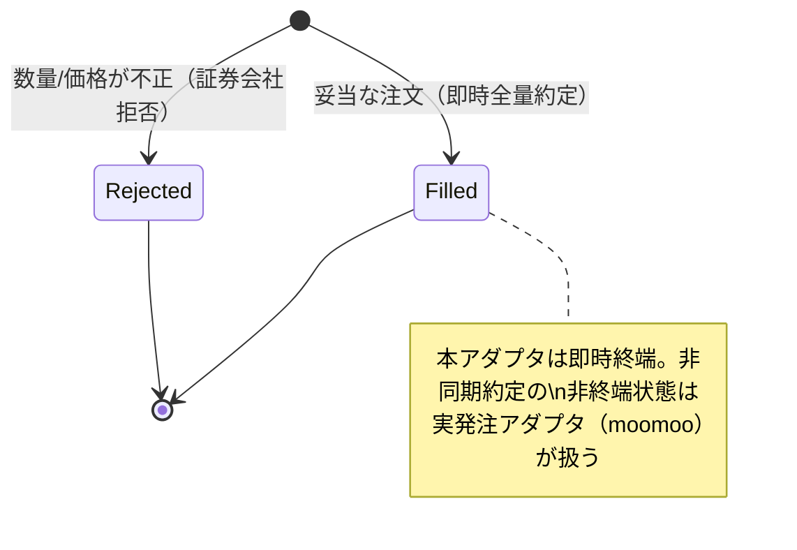

# 機能仕様書: ペーパートレード（FR-12）

> 実発注せず、判断・記録・報告のフローは実発注（moomoo アダプタ）と**完全に同一**とする仮想ブローカー
> （`PaperBrokerAdapter`）。証券会社アダプタのポート `IBrokerAdapter` を実装し、実装差し替えで実発注へ切り替える
> （ADR-0002）。Stage 0/1 の検証の中核。

## 起点となる計画書（トレーサビリティ）

- 機能要求（FR）: FR-12（ペーパートレード）。横断: FR-05（発注執行・注文状態追跡）
- ユースケース（UC）: UC-01/UC-02（取引サイクル）
- 計画書リンク: `01_requirements.md`、ADR-0002

## 機能詳細

`PaperBrokerAdapter : IBrokerAdapter`。板寄せせず参照価格（`OrderIntent.Price`）で即時全量約定する。注文は
メモリ内（`ConcurrentDictionary`）で状態追跡する。時刻は `TimeProvider` 注入でテスト可能。

| 操作 | 入力 | 振る舞い | 出力 |
| --- | --- | --- | --- |
| PlaceOrderAsync | OrderIntent | 数量>0 かつ 価格>0 を検証。妥当なら参照価格で即時 `Filled`、不正なら `Rejected`（約定せず） | BrokerOrder |
| GetOrderAsync | OrderId | 注文状態を照会。未知IDは null | BrokerOrder? |
| CancelOrderAsync | OrderId | 終端状態（Filled/Cancelled/Rejected）は取消不可（例外）。未知IDは例外 | — |

- **入力検証**（#30。IADR-0007）: 実ブローカーが拒否する不正注文（数量 0 以下・価格 0 以下）をペーパーでも
  約定させず `OrderStatus.Rejected`（FilledQuantity=0, AveragePrice=0）として記録する。例外にせず終端の Rejected を
  返すことで、実発注と同一の「拒否も終端状態の一つ」フローを保つ。
- **証券会社拒否とリスク事前拒否の区別**: `OrderStatus.Rejected` は注文がブローカーへ到達後に拒否された終端状態。
  リスク管理サービスによる発注前拒否（`Events.OrderRejected`。注文はブローカーへ到達しない）とは別事象。

## 注文状態遷移

## 例外・エラー処理

| 条件 | 振る舞い |
| --- | --- |
| 数量 0 以下・価格 0 以下 | 約定せず `Rejected` を返す |
| 終端状態の注文の取消 | `InvalidOperationException` |
| 未知の注文IDの取消 | `InvalidOperationException` |
| 未知の注文IDの照会 | null |

## 受け入れ基準

- [x] 発注→即時約定→状態照会が一貫して動作する
- [x] 不正な数量/価格の注文がペーパーで約定しない（Rejected）
- [x] 判断・記録・報告のフローが実発注と同一（拒否も終端状態として扱う）

## 関連仕様

- 機能仕様書: [FR-10 リスク統制](FR-10_risk-controls.md)
- データ仕様書: [リスク管理ドメインの集約](../data/risk-management-aggregates.md)
- テスト仕様書: [FR-10 リスクガードコア](../tests/FR-10_risk-guard-core-tests.md)
- 通信仕様書: [イベント・ポート契約](../api/events-and-ports.md)
- 実装ADR: [IADR-0007](../adr/IADR-0007_broker-rejection-vs-risk-rejection.md)（証券会社拒否とリスク事前拒否の区別）

## 未決事項

- moomoo アダプタ（実発注）は ADR-0002 の PoC 後に実装（#13）。非同期約定の非終端状態遷移・値幅制限等の
  実ブローカー固有の拒否理由はそこで拡張する。
