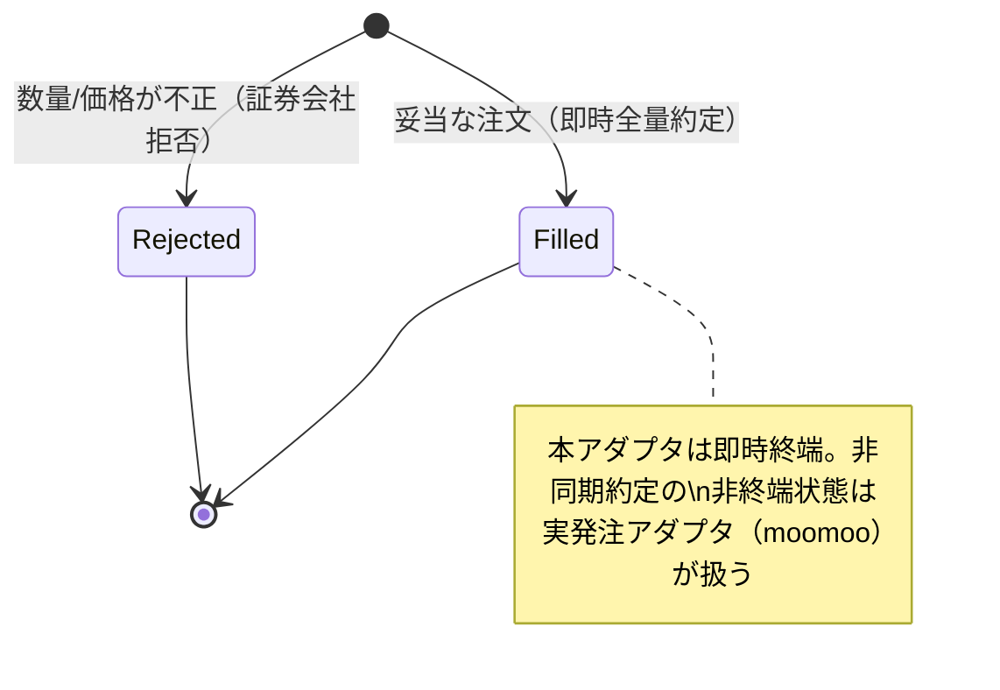

<!-- trace:
ids: [FR-05, FR-12, FR-13, FR-20, SC-01, SC-02, SC-03, UC-01, UC-02, UC-06]
adrs: [ADR-0002]
iadrs: [IADR-0007, IADR-0111, IADR-0140, IADR-0142]
specs: [01_requirements, 01_screens, 06_daytrading-review, 20260805_334_broker-provider-axis, ADR-0002_broker-selection, FR-12_paper-trade-tests, FR-20_staged-gates, IADR-0140_broker-provider-axis, IADR-0142_stage1-simulate-only-aggregation, INDEX]
issues: [#13, #30, #334]
-->

# 機能仕様書: 内蔵 `paper`（擬似約定）と警告表示

> 実発注せず、判断・記録・報告のフローは実発注（moomoo アダプタ）と**完全に同一**とする仮想ブローカー
> （`PaperBrokerAdapter`）。証券会社アダプタのポート `IBrokerAdapter` を実装し、実装差し替えで実発注へ切り替える
> 。
>
> **2026-08-05改定。** 計画（ペーパートレードの要求・INDEX 決定 46）は本モードを**デバッグ・開発用途**と定め、
> **Stage 1 の検証手段ではない**と明記した（Stage 1 は moomoo `SIMULATE` によるデモ取引）。
> 内蔵 `paper` は発注先（Broker Provider）の 3 値のうちの 1 つであり、**外部へ一度も発注しない**。
>
> **用語**（画面設計の共通規約）: `SIMULATE` を「ペーパー」と呼ばない。内蔵 `paper` を「SIMULATE」
> 「デモ取引」と呼ばない。**「ペーパー」の語を単独で使わない。**

## 本書が受け持つ範囲

- 機能要求: ペーパートレード。横断するのは発注執行（注文状態の追跡）である
- ユースケース: 定時取引サイクル・価格変動トリガー取引
- 計画書: 要求定義、および証券会社連携の計画 ADR

## 機能詳細

### 1. 発注先としての内蔵 `paper`（#334・発注先を独立した軸として導入し `TradeMode` を廃止した）

`BrokerProvider.InternalPaper`（序数 0）。運用段階とは独立した軸であり、リスク設定画面から選べる
（詳細は [段階ゲートの機能仕様書](FR-20_staged-gates.md) §0・§1-2）。**安全な方向への切替であるため、
実弾切替と違って明示的な確認操作は求めない。**

### 2. 内蔵 `paper` 稼働中の警告表示（画面設計の共通規約）

**設定画面・リスク設定画面・統制状態参照画面のすべてで、画面上部に常時表示する。** 文言には次の 2 点を必ず含める
（`frontend/src/features/shared/paperMode.ts` の定数が単一の出所であり、画面とテストが同じ定数を参照する）。

| 定数 | 文言 |
| --- | --- |
| `PAPER_BANNER_DEBUG_MESSAGE` | 「デバッグモードです。外部へ発注していません」 |
| `PAPER_BANNER_EXCLUSION_MESSAGE` | 「この期間は Stage 1 の実績に算入されません」 |
| `PAPER_REFERENCE_LABEL` | 統制状態のカード類に付す `paper・参考値` ラベル |

- **発注先が判らない場合はバナーを出さない。** 出すと「外部へ発注していません」という**事実でない断定**を
  画面が行うことになり、実弾稼働をデバッグ稼働と誤認させる。
- 計画本文の注意: バナーの見た目は **リスク設定画面のモックアップにのみ描かれている**。
  **モックアップの見た目だけを頼りにすると設定画面・統制状態参照画面の実装を落とす。**

### 3. Stage 1 集計からの除外（#334・合格集計から内蔵 `paper` を構造的に排除し、除外営業日数を別掲する）

内蔵 `paper` の約定・稼働日数は **Stage 1 の合格判定に算入しない**。`paper` 稼働により算入されなかった
営業日は**除外日数として別掲**し、統制状態参照画面が進捗表示に併記する。詳細は
[段階ゲートの機能仕様書](FR-20_staged-gates.md) §4-2。

### 4. 擬似約定アダプタ

`PaperBrokerAdapter : IBrokerAdapter`。板寄せせず参照価格（`OrderIntent.Price`）で即時全量約定する。注文は
メモリ内（`ConcurrentDictionary`）で状態追跡する。時刻は `TimeProvider` 注入でテスト可能。

| 操作 | 入力 | 振る舞い | 出力 |
| --- | --- | --- | --- |
| PlaceOrderAsync | OrderIntent | 数量>0 かつ 価格>0 を検証。妥当なら参照価格で即時 `Filled`、不正なら `Rejected`（約定せず） | BrokerOrder |
| GetOrderAsync | OrderId | 注文状態を照会。未知IDは null | BrokerOrder? |
| CancelOrderAsync | OrderId | 終端状態（Filled/Cancelled/Rejected）は取消不可（例外）。未知IDは例外 | — |

- **入力検証**（#30）: 実ブローカーが拒否する不正注文（数量 0 以下・価格 0 以下）をペーパーでも
  約定させず `OrderStatus.Rejected`（FilledQuantity=0, AveragePrice=0）として記録する。例外にせず終端の Rejected を
  返すことで、実発注と同一の「拒否も終端状態の一つ」フローを保つ。
- **証券会社拒否とリスク事前拒否の区別**: `OrderStatus.Rejected` は注文がブローカーへ到達後に拒否された終端状態。
  リスク管理サービスによる発注前拒否（`Events.OrderRejected`。注文はブローカーへ到達しない）とは別事象。

## 注文状態遷移

## 例外・エラー処理

| 条件 | 振る舞い |
| --- | --- |
| 数量 0 以下・価格 0 以下 | 約定せず `Rejected` を返す |
| 終端状態の注文の取消 | `InvalidOperationException` |
| 未知の注文IDの取消 | `InvalidOperationException` |
| 未知の注文IDの照会 | null |

## 受け入れ基準

- [x] 発注→即時約定→状態照会が一貫して動作する
- [x] 不正な数量/価格の注文がペーパーで約定しない（Rejected）
- [x] 判断・記録・報告のフローが実発注と同一（拒否も終端状態として扱う）
- [x] 内蔵 `paper` 稼働中、設定画面・リスク設定画面・統制状態参照画面のすべてで必須 2 文言のバナーが表示される
- [x] 内蔵 `paper` でないとき（moomoo `SIMULATE` / `REAL`）はバナーも `paper` ラベルも表示されない
- [x] 発注先を取得できない場合はバナーを表示せず、各画面本来の機能は動く
- [x] 統制状態のカード類に `paper・参考値` ラベルが付く
- [x] 内蔵 `paper` の約定・稼働日数が Stage 1 の進捗に算入されない

## 関連仕様

- 機能仕様書: [リスク統制](FR-10_risk-controls.md)
- データ仕様書: [リスク管理ドメインの集約](../data/risk-management-aggregates.md)
- テスト仕様書: [リスクガードコア](../tests/FR-10_risk-guard-core-tests.md)
- 通信仕様書: [イベント・ポート契約](../api/events-and-ports.md)
- 実装ADR: 証券会社拒否は `OrderStatus.Rejected` で表し、リスク事前拒否（`OrderRejected` イベント）と区別する

## 未決事項

- **発注先の設定値（`RiskManagementSettings.BrokerProvider`）はまだ発注経路を動かさない。**
  実際に `PaperBrokerAdapter` が使われるかは起動時の構成（`Broker:Provider`。ブローカー選択は
  provider × environment の直交 2 軸で表現する）が決める。結線は別 issue。
- moomoo アダプタ（実発注）は証券会社連携の計画 ADR が定める PoC の後に実装する。非同期約定の非終端状態遷移・値幅制限等の
  実ブローカー固有の拒否理由はそこで拡張する。
