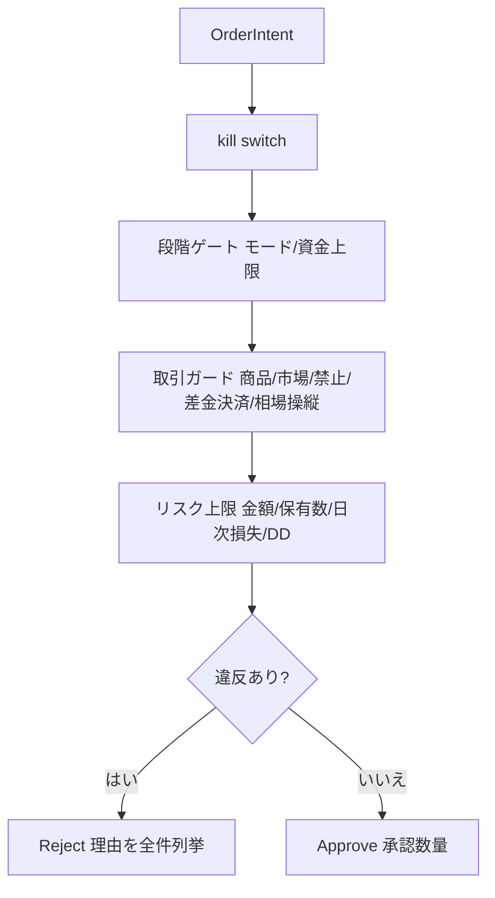

# 機能仕様書: 取引ガード（FR-19）

> 取引ガード（商品種別可否・市場別有効/無効・取引禁止銘柄・差金決済防止・相場操縦パターン禁止・**口座種別に依存する統制**）を
> 発注前に決定的コード（`RiskEvaluator`）で強制する。ガード設定は利用者のみ変更でき、生成AIは上書きできない
> （ADR-0007）。本書は `RiskEvaluator` の**全違反理由の判定マトリクス**（FR-10/19/20 横断）も収録する。
>
> **2026-08-04 改訂（#332・[IADR-0132](../adr/IADR-0132_product-type-tri-state-and-guard-scope.md)）**:
> 商品種別を **3 値**（現物 / 信用買い / 空売り）へ改め（ADR-0016 決定1）、
> 商品種別ガードの適用を**新規建てのみ**に、差金決済防止ガードの適用を**日本株の現物取引のみ**に絞った。
>
> **2026-08-06 改訂（#375・[ADR-0021](../../planning/projects/ai-stock-trading/07_adr/ADR-0021_us-account-type-dual-support.md)・[IADR-0153](../adr/IADR-0153_broker-account-type-supply-and-fail-closed.md)）**:
> 米国口座の**現金口座**に対応した。口座種別を**ブローカーへ照会した結果**で切り替え、差金決済防止ガードの
> 適用範囲を口座種別で分岐させ（**#332 の日本株現物限定は巻き戻していない**）、GFV 回避ガード・GFV 回数の停止・
> 信用系の設定不能化を加え、**照会できない／設定値と食い違うときは新規建てを止める**（fail-closed）。
>
> **2026-08-07 改訂（#425・[ADR-0025](../../planning/projects/ai-stock-trading/07_adr/ADR-0025_settled-cash-poc-and-gfv-counting.md) 決定2・[IADR-0165](../adr/IADR-0165_gfv-self-counting-and-settled-cash-source-ban.md)）**:
> **GFV 発生回数を自前で計数する**ようにした（moomoo API に該当フィールドが存在しないため。手入力は計画が却下）。
> **★ 数えているのは「自らのガードをすり抜けた買付」であり、ブローカーが GFV と判定した件数ではない。両者が一致する保証はない。**
> 供給元はブローカー照会（`BrokerAccountState`）ではなく**自前の追記台帳**であり、未供給は従来どおり新規建てを止める。
> **現金口座はなお選べない**——決済済み資金の供給元が無いため（ADR-0025 決定1 の PoC 項目 8 待ち）。

## 起点となる計画書（トレーサビリティ）

- 機能要求（FR）: FR-19（取引ガード）。横断: FR-10（リスク統制）、FR-20（段階ゲート）
- ユースケース（UC）: UC-01/UC-02（取引サイクル）、UC-06（設定変更）
- 業務フロー（04_workflows）: 取引サイクル（発注前判定）
- 計画書リンク: `05_trading-assumptions.md` §5、`06_daytrading-review.md` §2、ADR-0007、ADR-0016（決定1・8・13）

## 機能詳細（取引ガード項目）

| ガード | 入力 | 判定 | 拒否理由 | 適用範囲 |
| --- | --- | --- | --- | --- |
| 商品種別可否 | `EnabledProductTypes`（3 値） | **実効**商品種別が有効集合に無い | `ProductTypeDisabled` | **エントリーのみ**（#332） |
| 市場別有効/無効 | `EnabledMarkets` | 注文の Market が有効集合に無い | `MarketDisabled` | 全注文 |
| 取引禁止銘柄 | `BannedSymbols`（銘柄+市場） | (Symbol, Market) が禁止リストに一致 | `BannedSymbol` | 全注文 |
| 差金決済防止 | `PreventSameDayReentry`, `SymbolsTradedToday`, **観測された口座種別** | **現物**かつ（**日本株** ‖ **現金口座**）で同日に (Symbol, Market) を取引済み | `SameDayReentry` | エントリーのみ |
| 相場操縦パターン禁止 | `ProhibitManipulativeOrderPatterns`, 検出器 | 検出器が該当と判定（注入時のみ） | `ManipulativeOrderPattern` | 全注文 |
| **口座種別の確認**（#375・ADR-0021 決定3） | `PortfolioSnapshot.Account`, `Guard.ConfiguredAccountType` | 照会結果が無い（未供給・失敗・不明・失効）／照会結果が設定値と食い違う | `BrokerAccountTypeUnverified` | エントリーのみ（**内蔵 paper は対象外**） |
| **GFV 回避**（#375・ADR-0021 決定4-2） | `Account.SettledCashInBase`, `DailyOrderedAmount` | **現金口座**の買付で「当日の新規建て累計 ＋ 本注文 > 決済済み資金」／決済済み資金が未供給 | `CashAccountSettlementHold` | エントリー × Buy のみ |
| **GFV 回数の停止**（#375 / **#425**・ADR-0021 決定4-3・ADR-0025 決定2） | **`PortfolioSnapshot.GoodFaithViolations`（自前計数。ブローカー照会ではない）** | **現金口座**で回数 ≧ 2 ／回数が未供給 | `GoodFaithViolationLimitReached` | エントリーのみ |

### 商品種別（3 値。ADR-0016 決定1・#332）

| 値 | 内容 | 損失の上限 | 既定 |
| --- | --- | --- | --- |
| `Cash`（現物） | 自己資金で買う | あり（投資額まで） | **有効** |
| `MarginLong`（信用買い） | 資金を借りて買う | あり（投資額まで） | 無効 |
| `ShortSell`（空売り） | 株を借りて売る | **なし（理論上無限）** | 無効 |

- **3 値はそれぞれ独立に有効・無効を設定でき、既定はいずれも「現物のみ有効」**（FR-19・§5）。
- **空売りの有効・無効はここが単一情報源**である（IADR-0132 決定2。専用フラグを別に持たない）。
  有効化しても空売り専用統制 8 規則（[FR-10 機能仕様](FR-10_risk-controls.md)）は上乗せで効く。
- **照合するのは実効商品種別**（IADR-0132 決定3）。新規売り建て（`Sell` × `Open`）は申告値によらず
  `ShortSell` として扱う。申告を信じると AI の自己申告でガードを解除できてしまう。
- 序数（0/1/2）は設定 JSON・画面と結合しているため**並べ替えない**（IADR-0132 決定1）。
- 段階別の可否（Stage 1＝3 種／Stage 2＝現物のみ／Stage 3＝条件付き解禁。ADR-0016 決定8）の**強制は
  FR-20（#333）の担当**であり、本ガードの有効集合と AND で効かせる（厳しい方が効く）。

### 差金決済防止の適用範囲（FR-19 本文・§5・#332・**#375**）

適用条件は**現物の新規建て**であり、かつ次の **2 系統の論理和**である（単一情報源は
`AccountTypePolicy.AppliesSameDayReentry`。IADR-0153 決定6）。

```
適用する = 実効商品種別 == Cash
        && ( Market == Japan          // 日本の差金決済規制（金商法 161 条の 2・06_daytrading-review §2.1）
           || 口座種別 == Cash )       // Good Faith Violation（ADR-0021 決定4-1）
```

- **日本株の現物**: 日本の差金決済規制に対応する。**口座種別に依存しない**。
  #332 / IADR-0132 決定5 が確定したのはこちらであり、**#375 は巻き戻していない**。
- **米国株の現物**: **現金口座でのみ**適用する。信用口座（既定）では売却代金を決済前に再利用できるため
  Good Faith Violation が発生せず、回転数は**1 日の発注金額上限（equity の 150%/日）と保有建玉数上限（3）**で管理する。
- 信用（信用買い・空売り）は同一保証金での同日無制限回転が可能なため常に対象外である。

> **計画本文の注意**: FR-19 本文・`05_trading-assumptions` §5・`06_daytrading-review` §2.2 には
> 「米国株は信用口座で運用するため GFV が発生しない」という**無条件の記述**が残っている。
> ADR-0021 決定4-1 により、これは**信用口座に条件づけられた命題**である。計画側へ環流済み
> （`feedback/20260806_adr0021-rejection-reasons-and-settled-cash.md`）。

### 口座種別に依存する統制（#375・ADR-0021・IADR-0153）

口座種別は**ブローカーへ照会した結果を正とする**（決定3）。利用者設定（`Guard.ConfiguredAccountType`・
既定＝信用口座）は**食い違いの検知にのみ**使う。供給は発注執行の定期 probe（5 分）が発行する
`BrokerAccountObserved` であり、リスク管理は**最新 1 件のみを有効期間 30 分で保持する**（永続化しない）。

| 状態 | 挙動 |
| --- | --- |
| 観測が無い（未供給・照会失敗・`TrdAccType_Unknown`・失効・プロセス再起動直後） | **新規建てを拒否**（`BrokerAccountTypeUnverified`） |
| 観測はあるが設定値と食い違う | **新規建てを拒否**（同上） |
| 観測がある・設定値と一致 | 観測された種別で統制を切り替える |
| 手仕舞い（Close）・損切り | **止めない**（ADR-0009 の不変条件・ADR-0007 2026-08-04 追補） |
| 発注先が内蔵 `paper` | 口座種別を要求しない（外部へ一度も発注せずブローカー口座が存在しない。IADR-0153 決定2） |

**「不明なら信用口座とみなす」は採らない。** 現金口座なのに GFV 回避ガードが無効のまま回ることが、
決定3 が防ごうとしている当の事故である（3 回の違反で 90 日の口座制限・事後にしか分からない）。

口座種別ごとに**成立し得る商品種別**が異なる（決定4-4・決定5）。

| 口座種別 | 対応する商品種別 | ADR-0016（空売り統制群） |
| --- | --- | --- |
| 信用口座（既定） | 現物 / 信用買い / 空売り | 評価する |
| **現金口座** | **現物のみ**（株を借りられない） | **評価しない**（全決定が適用対象外・決定5） |

- 発注側は実効値「**利用者設定 ∩ 口座が対応する種別**」で判定し、`ProductTypeDisabled` で拒否する。
- 設定側（`PUT /risk-controls/settings/guard`）も、口座が対応しない商品種別の有効化を **400** で拒否し、
  **設定も履歴も変えない**（計画は「選べなくする」と定めている）。観測が無いときは設定側では制限しない
  （安全性は発注側が担保する）。
- **適用は新規建てのみ**。口座種別を切り替えた瞬間に既存の信用建玉が閉じられなくなることを防ぐ。

### GFV 発生回数の自前計数（#425・ADR-0025 決定2・IADR-0165）

**GFV 発生回数は moomoo API から取得できない**（`GoodFaith` / `Violation` / `Gfv` はアセンブリ全体で 0 件。
IADR-0153 決定4 の実測）。計画は 2026-08-07 に**自前で計数する**ことを決めた（手入力は却下——自動売買の
回転速度に追随できず、監査証跡にも乗らないため）。

> **★ この計数が何であるかを取り違えないこと（ADR-0025 §理由）**
>
> 自前で数えられるのは**自らのガードをすり抜けた買付**だけであり、**ブローカー側が独自に GFV と判定した
> 事象は捕捉できない**。したがって本計数は「**ブローカーの GFV カウンタの写し**」ではなく
> 「**自らのガードの失敗回数**」である。**両者が一致する保証はない。**
> **ブローカーが先に 3 回目を計上して口座制限（90 日）が掛かる事態は、本計数では防げない。**

| 項目 | 内容 |
| --- | --- |
| 数える事象 | **未決済資金による買付**（＝ GFV 回避ガードが拒否しようとする事象そのもの）。判定式は `AccountTypePolicy.ExceedsSettledCash` が**単一情報源**であり、発注前のガードと事後の計数が同じ述語を呼ぶ |
| 検出点 | **約定**（`OrderExecuted`）。発注審査の時点では述語が真なら注文が拒否されるため、すり抜けは観測できない |
| 検出の条件 | 約定がある × **現金口座の観測がある** × **新規建ての買い** × 決済済み資金で説明できない。**口座種別が不明なら数えない**（不明を現金口座とみなすと信用口座の通常の売買が違反として積み上がる） |
| 計上単位 | **1 注文 1 件**（追記台帳の主キーが `OrderId`）。部分約定の進行・メッセージ再送で二重計上しない |
| 記録先 | 追記専用台帳 `good_faith_violations`（**永続**。プロセス内だと再起動 1 回で統制が解ける）＋ 中央監査台帳（FR-11・`GoodFaithViolationRecorded`） |
| 供給 | `PortfolioSnapshot.GoodFaithViolations`（`GoodFaithViolationTally?`）。**ブローカー照会（`BrokerAccountState`）には載せない**——同じ欄に載せると「ブローカーが報告した件数」と読まれる |
| 未供給の扱い | **新規建てを拒否**（`GoodFaithViolationLimitReached`・fail-closed）。**`Observed(0)`（数えた結果 0 件）とは別物である** |
| 失効 | **設けていない**（累計）。計画が失効の期間も手段も定めておらず、自動失効は fail-open であるため実装で値を発明しない（IADR-0165 決定4・計画へ環流済み） |

**ガードが正しく働けば計数は 0 のままである。** 1 件でも記録された時点で、発注前の GFV 回避ガードを
すり抜けた買付が現に約定したということであり、**ガードの不具合または口座観測の欠落を示す**。

#### 決済済み資金の代替値は使わない（構造で遮断する）

ADR-0025 が**採ってはならない候補**を名指しした。

- `Funds.AvlWithdrawalCash` / `Funds.MaxWithdrawal` は**出金可能額**であり決済済み資金とは別概念である。
- **`MaxTrdQtys.MaxCashBuy` はもっとも危険である。** 現金買付余力は現金口座では**未決済の売却代金を含む**のが
  通例であり、**それこそが GFV を引き起こす当の資金である。これを分母に据えると GFV 回避ガードが GFV を許可する。**

担保は 2 層である。**コメントでの注意書きだけでは足りない**（次の実装者が「決済済み資金の供給元」を
探すときには読まれない）。

1. **機械的検査**: `scripts/check-banned-settled-cash-sources.js`（CI ジョブ `banned-settled-cash-sources`）が
   `backend/**/*.cs` の**コードとしての参照**を検出して落とす。コメント・XML ドキュメント中の言及は誤検出しない。
2. **型の否定形テスト**: `BrokerAccountState` がこれらの欄を持たないこと。

> **⚠️ 現時点で現金口座は実運用できない。** **決済済み資金**の情報源が moomoo API に存在せず
> （SDK 全走査による実測。IADR-0153 決定4）、fail-closed により現金口座の買付は常に
> `CashAccountSettlementHold` で止まる。**#425 で GFV 発生回数の供給経路はできたが、現金口座が選べるように
> なったわけではない**（ADR-0025 決定3。決済済み資金の導出は同 決定1 の **PoC 項目 8**・期限 2026-08-31 待ち）。
> 詳細は [blocked-tasks](../blocked-tasks.md)「実装済みだが実際には発動しない機能」。

- 禁止銘柄・差金決済は（Symbol, Market）で照合する（別市場の同一コードを区別。#26）。
- 禁止銘柄の銘柄コードは**前後空白・大文字小文字の差を吸収**して照合する（`BannedSymbol.Matches`。
  IADR-0132 決定6。表記差だけで禁止＝クラス C を迂回させない）。
- 計画が登録済みとする禁止銘柄は **6457 グローリー / 6902 デンソー / 6502 東芝（旧。再上場時に適用）**
  （いずれも日本株・理由と登録日つき。§5・INDEX 決定 20）。
- 相場操縦の拡張点（設定フラグ・理由コード・判定ポート `IManipulativeOrderPatternDetector`）は #28（IADR-0006）で用意。
  検知アルゴリズム本体（見せ玉・過剰訂正取消・自己レイヤリングを自口座の直近発注統計から検知）は #49（IADR-0040）で実装した
  （`ManipulationPatternAnalyzer`＋`ManipulativeOrderPatternDetector`）。検出器未注入時は判定をスキップする。本番 DI 登録は
  実注文履歴テレメトリ（発注・訂正・取消イベントの永続化 #13/#17）からの供給確定後（切り分け）。

## 判定マトリクス（違反理由 × エントリー/手仕舞い適用）

`RiskEvaluator.Evaluate` は違反を最初の1件で打ち切らず全件列挙する（FR-11 監査）。エントリー/手仕舞いは
建玉効果 `PositionEffect`（Open/Close）で判定する（売買方向ではない。#25。IADR-0004）。

| 違反理由 | 起点 | エントリー(Open) | 手仕舞い(Close) |
| --- | --- | --- | --- |
| KillSwitchActive | FR-10 | 適用 | 非適用（フェイルセーフ） |
| StageProhibitsLiveTrading | FR-20 | 適用（モードは効果非依存） | 適用（モードは効果非依存） |
| StageCapitalCapExceeded | FR-20 | 適用（累計投入額。#27） | 非適用 |
| ProductTypeDisabled | FR-19 | 適用 | **非適用**（#332・ADR-0009。無効な種別の建玉を手仕舞えなくしない） |
| MarketDisabled | FR-19 | 適用 | 適用 |
| BannedSymbol | FR-19 | 適用 | 適用 |
| SameDayReentry | FR-19 | 適用（**現物 && (日本株 ‖ 現金口座)**。#332 / **#375**） | 非適用 |
| BrokerAccountTypeUnverified | FR-19 | 適用（**内蔵 paper を除く**。#375） | **非適用**（ADR-0009。口座種別が分からないことを理由に建玉を閉じられなくしない） |
| CashAccountSettlementHold | FR-19 | 適用（**現金口座 × Buy** のみ。#375） | **非適用** |
| GoodFaithViolationLimitReached | FR-19 | 適用（**現金口座**のみ。#375 / **#425**＝自前計数。未供給も適用） | **非適用** |
| PerOrderAmountExceeded | FR-10 | 適用 | 非適用 |
| DailyOrderAmountExceeded | FR-10 | 適用 | 非適用 |
| MaxPositionsExceeded | FR-10 | 適用 | 非適用 |
| DailyLossLimitReached | FR-10 | 適用（実現+含み損の合算。#31） | 非適用 |
| MaxDrawdownReached | FR-10 | 適用 | 非適用 |
| ManipulativeOrderPattern | FR-19 | 適用 | 適用 |

- **フェイルセーフの原則**（NFR / ADR-0003 / ADR-0009）: 新規建て（Open）は止めるが、保有ポジションの
  手仕舞い（Close）はブロックしない。損切り監視は最後まで維持する。
  **商品種別は 3 値化（#332）に伴い Close 非適用へ改めた**——既定では空売りが無効であり、
  Close にも適用すると**空売り建玉の買い戻し**（`Buy` × `Close` × `ShortSell`）が拒否され、
  損失に上限が無い建玉を閉じられなくなるためである（IADR-0132 決定4）。
  モード（Paper/Live）・市場・禁止銘柄・相場操縦は建玉効果に依存しない性質のため Close にも適用する
  （禁止銘柄・市場の Close 適用は **【✅ 裁定済み 2026-08-04・ADR-0007 追補（質問票 第 1 回 Q3・Q4・project-planning#179）】** **選択肢 A＝全注文適用で確定**。
  理由は**インサイダー取引は売付けも対象**であり、AI が利用者の関知しないタイミングで規制対象銘柄を
  自動売却する経路を残さないため。#380 / [IADR-0132](../adr/IADR-0132_product-type-tri-state-and-guard-scope.md)）。
  **この非対称は意図である。** ADR-0007 追補は「ガードごとに適用範囲が異なるのは**各ガードの目的が異なるためであり、揃えるべき不整合ではない**」と明示している。**揃える方向の変更を提案しないこと。**
  **保有中の建玉を手仕舞う必要が生じた場合の手順は [禁止銘柄の一時解除 Runbook](../operations/banned-symbol-unlock-runbook.md) を正とする。**
- FR-10 の各上限の詳細は [FR-10 機能仕様](FR-10_risk-controls.md) を参照。

## 処理フロー



## 例外・エラー処理

| 条件 | 振る舞い | 記録 |
| --- | --- | --- |
| いずれかのガードに違反 | 該当理由を列挙して Reject | `OrderRejected` イベント（監査 FR-11・通知 FR-09） |
| ガード設定の変更 | 利用者のみ可・変更履歴を記録 | 設定ストア（#12/#19） |

## 受け入れ基準

- [x] 禁止銘柄・無効商品種別・無効市場・差金決済該当の注文が拒否され理由が記録される
- [x] 差金決済・禁止銘柄は（銘柄, 市場）で照合し、別市場の同一コードを誤拒否しない
- [x] 相場操縦ガードは設定・理由コード・判定ポートを持ち、無効化時／検出器未注入時はスキップする
- [x] 手仕舞い（Close）はエントリー専用ガードの対象外（フェイルセーフ）
- [x] **商品種別が 3 値であり、それぞれ独立に有効・無効を設定できる**（既定＝現物のみ有効）
- [x] **差金決済防止ガードが日本株の現物取引に適用され、信用口座の米国株には適用されない**（#332）
- [x] **現金口座では差金決済防止ガードが米国株にも適用される**（#375・ADR-0021 決定4-1。両方向をテストで固定）
- [x] **口座種別を照会できない／設定値と食い違うとき、新規建てが止まり手仕舞いは止まらない**（#375・決定3）
- [x] **現金口座で決済済み資金を超える買付・未供給が拒否される**（#375・決定4-2。境界値を含む）
- [x] **現金口座で GFV 発生回数 2 件・未供給のとき新規建てが止まる**（#375・決定4-3）
- [x] **GFV 発生回数を自前で計数し、記録が監査ログ（FR-11）に残る**（#425・ADR-0025 決定2）
- [x] **計数の 0 件と未供給が区別され、未供給は新規建てを止める**（#425。`CashAccountSettlementHold` へ写像しない）
- [x] **`MaxCashBuy` / `AvlWithdrawalCash` / `MaxWithdrawal` が決済済み資金として使われていない**（#425。機械的検査＋型の否定形）
- [x] **自前計数を供給しても、決済済み資金が無い限り現金口座の買付は止まる**（#425・ADR-0025 決定3 の維持）
- [x] **現金口座で信用買い・空売りを設定する経路と発注する経路がいずれも塞がれている**（#375・決定4-4）
- [x] **3 種の新拒否理由がクラス C（統制違反）に計上されない**（#375・決定4-5）
- [x] **禁止銘柄が理由と登録日を伴って登録され、表記差・商品種別の変更で迂回できない**
- [ ] 段階別の商品種別強制（Stage 2 は現物のみ）… **FR-20 / #333**

## 関連仕様

- 機能仕様書: [FR-10 リスク統制](FR-10_risk-controls.md)、[FR-20 段階ゲート](FR-20_staged-gates.md)
- データ仕様書: [リスク管理ドメインの集約](../data/risk-management-aggregates.md)
- テスト仕様書: [FR-19 取引ガード（再実装）](../tests/FR-19_trading-guards-tests.md)、[FR-10 リスクガードコア](../tests/FR-10_risk-guard-core-tests.md)、[FR-19 相場操縦パターン検知](../tests/FR-19_manipulation-detection-tests.md)
- 実装ADR: [IADR-0165](../adr/IADR-0165_gfv-self-counting-and-settled-cash-source-ban.md)（**GFV の自前計数と決済済み資金の代替値の遮断**・#425）、[IADR-0153](../adr/IADR-0153_broker-account-type-supply-and-fail-closed.md)（**口座種別の供給と fail-closed**・#375）、[IADR-0132](../adr/IADR-0132_product-type-tri-state-and-guard-scope.md)（商品種別 3 値化・ガードの適用範囲）、[IADR-0131](../adr/IADR-0131_short-selling-controls-fail-closed.md)（空売り統制）、[IADR-0004](../adr/IADR-0004_position-effect-entry-scoping.md)（建玉効果）、[IADR-0006](../adr/IADR-0006_manipulation-guard-extension-point.md)（相場操縦拡張点）、[IADR-0038](../adr/IADR-0038_order-decomposition-position-effect.md)（ドテン/部分決済の注文分解）、[IADR-0040](../adr/IADR-0040_manipulation-detection-algorithm.md)（相場操縦検知アルゴリズム）
- 作業仕様書: [20260807_425_gfv-self-counting](../specs/20260807_425_gfv-self-counting.md)（#425）、[20260806_375_cash-account-support](../specs/20260806_375_cash-account-support.md)（#375）、[20260804_332_trading-guards](../specs/20260804_332_trading-guards.md)（#332）、[20260711_manipulation-detector](../specs/20260711_manipulation-detector.md)（#49）

## 未決事項

- **禁止銘柄・市場ガードの手仕舞い適用**（#332 未決事項 1）: 禁止銘柄へ登録した瞬間に既存建玉を
  手仕舞えなくなる。商品種別と違い「登録は利用者の明示的な意思」であり、ADR-0007 が
  「登録されたものを確実に強制する」と定めているため実装判断では緩めない。計画側の裁定を要する。
- **信用買い（`MarginLong`）の建玉表現**: 3 値化は有効・無効の制御までであり、信用金利・必要証拠金・
  建玉の区別は未実装（実弾解禁は Stage 3。#332 未決事項 3）。
- **GFV 違反記録の失効が計画に無い**（#425 / IADR-0165 決定4）: `GoodFaithViolationLimitReached` の解除条件は
  「違反記録の失効」だが、**期間も手段も定義されていない**。自動失効は fail-open であるため実装では累計のままとし、
  **1 件でも記録されれば 2 件目で恒久的に現金口座の新規建てが止まる**。計画へ環流済み
  （[feedback/20260807_adr0025-gfv-counting-open-points.md](../../feedback/20260807_adr0025-gfv-counting-open-points.md)）。
- **自前計数の限界を運用手順へ落とす先が未定**（#425・ADR-0025 §結果のフォローアップ）: ブローカー側の GFV 表示との
  目視突合の頻度・不一致時の行動が決まっていない。同じ環流記録で計画へ返した。
- 相場操縦検知の具体閾値（IADR-0040 の初期値）は運用データで較正する（フォローアップ）。本番 DI 登録は実注文履歴テレメトリ（#13/#17）確定後。
- 回転売買・ドテン/部分決済の注文分解方針は [IADR-0038](../adr/IADR-0038_order-decomposition-position-effect.md)（符号付きポジションのゼロ跨ぎで Close+Open に分解）で確定済み。分解ロジックの実装結線は信用有効化スライスで行う（後続）。
