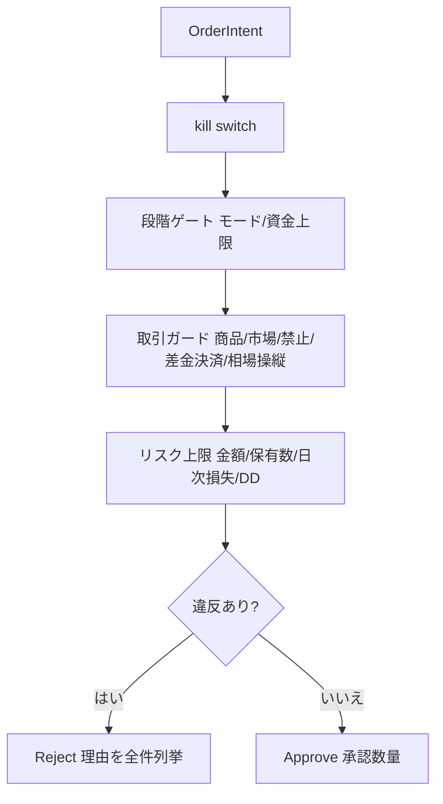

# 機能仕様書: 取引ガード（FR-19）

> 取引ガード（商品種別可否・市場別有効/無効・取引禁止銘柄・差金決済防止・相場操縦パターン禁止）を
> 発注前に決定的コード（`RiskEvaluator`）で強制する。ガード設定は利用者のみ変更でき、生成AIは上書きできない
> （ADR-0007）。本書は `RiskEvaluator` の**全違反理由の判定マトリクス**（FR-10/19/20 横断）も収録する。

## 起点となる計画書（トレーサビリティ）

- 機能要求（FR）: FR-19（取引ガード）。横断: FR-10（リスク統制）、FR-20（段階ゲート）
- ユースケース（UC）: UC-01/UC-02（取引サイクル）、UC-06（設定変更）
- 業務フロー（04_workflows）: 取引サイクル（発注前判定）
- 計画書リンク: `05_trading-assumptions.md` §5、ADR-0007

## 機能詳細（取引ガード項目）

| ガード | 入力 | 判定 | 拒否理由 | 適用範囲 |
| --- | --- | --- | --- | --- |
| 商品種別可否 | `EnabledProductTypes` | 注文の ProductType が有効集合に無い | `ProductTypeDisabled` | 全注文 |
| 市場別有効/無効 | `EnabledMarkets` | 注文の Market が有効集合に無い | `MarketDisabled` | 全注文 |
| 取引禁止銘柄 | `BannedSymbols`（銘柄+市場） | (Symbol, Market) が禁止リストに一致 | `BannedSymbol` | 全注文 |
| 差金決済防止 | `PreventSameDayReentry`, `SymbolsTradedToday` | 同日に (Symbol, Market) を取引済み | `SameDayReentry` | エントリーのみ |
| 相場操縦パターン禁止 | `ProhibitManipulativeOrderPatterns`, 検出器 | 検出器が該当と判定（注入時のみ） | `ManipulativeOrderPattern` | 全注文 |

- 禁止銘柄・差金決済は（Symbol, Market）で照合する（別市場の同一コードを区別。#26）。
- 相場操縦の拡張点（設定フラグ・理由コード・判定ポート `IManipulativeOrderPatternDetector`）は #28（IADR-0006）で用意。
  検知アルゴリズム本体（見せ玉・過剰訂正取消・自己レイヤリングを自口座の直近発注統計から検知）は #49（IADR-0037）で実装した
  （`ManipulationPatternAnalyzer`＋`ManipulativeOrderPatternDetector`）。検出器未注入時は判定をスキップする。本番 DI 登録は
  実注文履歴テレメトリ（発注・訂正・取消イベントの永続化 #13/#17）からの供給確定後（切り分け）。

## 判定マトリクス（違反理由 × エントリー/手仕舞い適用）

`RiskEvaluator.Evaluate` は違反を最初の1件で打ち切らず全件列挙する（FR-11 監査）。エントリー/手仕舞いは
建玉効果 `PositionEffect`（Open/Close）で判定する（売買方向ではない。#25。IADR-0004）。

| 違反理由 | 起点 | エントリー(Open) | 手仕舞い(Close) |
| --- | --- | --- | --- |
| KillSwitchActive | FR-10 | 適用 | 非適用（フェイルセーフ） |
| StageProhibitsLiveTrading | FR-20 | 適用（モードは効果非依存） | 適用（モードは効果非依存） |
| StageCapitalCapExceeded | FR-20 | 適用（累計投入額。#27） | 非適用 |
| ProductTypeDisabled | FR-19 | 適用 | 適用 |
| MarketDisabled | FR-19 | 適用 | 適用 |
| BannedSymbol | FR-19 | 適用 | 適用 |
| SameDayReentry | FR-19 | 適用 | 非適用 |
| PerOrderAmountExceeded | FR-10 | 適用 | 非適用 |
| DailyOrderAmountExceeded | FR-10 | 適用 | 非適用 |
| MaxPositionsExceeded | FR-10 | 適用 | 非適用 |
| DailyLossLimitReached | FR-10 | 適用（実現+含み損の合算。#31） | 非適用 |
| MaxDrawdownReached | FR-10 | 適用 | 非適用 |
| ManipulativeOrderPattern | FR-19 | 適用 | 適用 |

- **フェイルセーフの原則**（NFR / ADR-0003）: 新規建て（Open）は止めるが、保有ポジションの手仕舞い（Close）は
  ブロックしない。損切り監視は最後まで維持する。モード（Paper/Live）・商品種別・市場・禁止銘柄・相場操縦は
  建玉効果に依存しない性質のため、Close にも適用する。
- FR-10 の各上限の詳細は [FR-10 機能仕様](FR-10_risk-controls.md) を参照。

## 処理フロー

## 例外・エラー処理

| 条件 | 振る舞い | 記録 |
| --- | --- | --- |
| いずれかのガードに違反 | 該当理由を列挙して Reject | `OrderRejected` イベント（監査 FR-11・通知 FR-09） |
| ガード設定の変更 | 利用者のみ可・変更履歴を記録 | 設定ストア（#12/#19） |

## 受け入れ基準

- [x] 禁止銘柄・無効商品種別・無効市場・差金決済該当の注文が拒否され理由が記録される
- [x] 差金決済・禁止銘柄は（銘柄, 市場）で照合し、別市場の同一コードを誤拒否しない
- [x] 相場操縦ガードは設定・理由コード・判定ポートを持ち、無効化時／検出器未注入時はスキップする
- [x] 手仕舞い（Close）はエントリー専用ガードの対象外（フェイルセーフ）

## 関連仕様

- 機能仕様書: [FR-10 リスク統制](FR-10_risk-controls.md)、[FR-20 段階ゲート](FR-20_staged-gates.md)
- データ仕様書: [リスク管理ドメインの集約](../data/risk-management-aggregates.md)
- テスト仕様書: [FR-10 リスクガードコア](../tests/FR-10_risk-guard-core-tests.md)、[FR-19 相場操縦パターン検知](../tests/FR-19_manipulation-detection-tests.md)
- 実装ADR: [IADR-0004](../adr/IADR-0004_position-effect-entry-scoping.md)（建玉効果）、[IADR-0006](../adr/IADR-0006_manipulation-guard-extension-point.md)（相場操縦拡張点）、
  [IADR-0037](../adr/IADR-0037_manipulation-detection-algorithm.md)（相場操縦検知アルゴリズム）
- 作業仕様書: [20260711_manipulation-detector](../specs/20260711_manipulation-detector.md)（#49）

## 未決事項

- 相場操縦検知の具体閾値（IADR-0037 の初期値）は運用データで較正する（フォローアップ）。本番 DI 登録は実注文履歴テレメトリ（#13/#17）確定後。
- 信用有効化時の回転売買・ドテンの注文分解方針は発注執行スライスで確定する。
