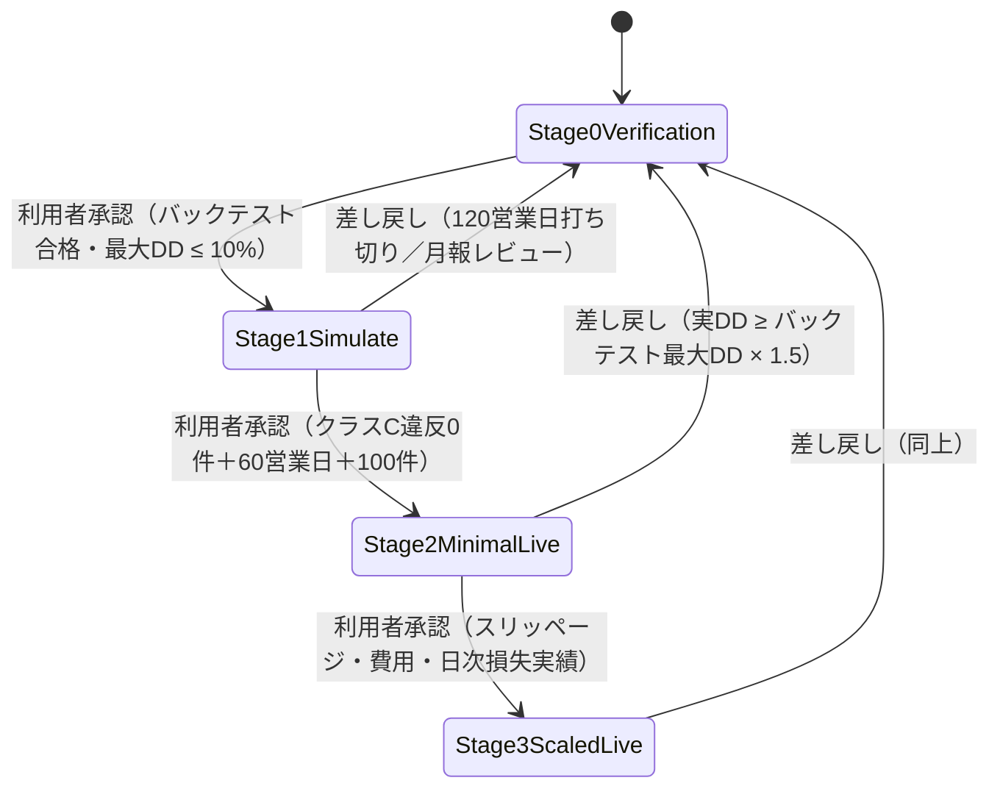

# 機能仕様書: 段階ゲート（FR-20）

> 運用段階（Stage 0〜3）ごとに動作モード（実弾の可否）・**発注可能額**・**取引できる商品種別**を強制する。
> 段階の遷移（昇格・差し戻し）は合格・撤退基準に基づき**利用者の承認**で行う（ADR-0008）。
>
> **2026-08-04（#333）で計画の確定規則へ全面追随した。** 変更点は「本改定で変わった前提」を参照。

## 起点となる計画書（トレーサビリティ）

- 機能要求（FR）: **FR-20**（段階ゲート）。横断: FR-15（Stage 0＝バックテスト）・FR-10（統制上限）・FR-19（取引ガード）・FR-11（監査）
- ユースケース（UC）: **UC-06**（設定変更・段階遷移の承認）
- 計画書リンク: [06_daytrading-review §4・§4.1〜§4.3](../../planning/projects/ai-stock-trading/06_technical/06_daytrading-review.md) ／
  [05_trading-assumptions §5](../../planning/projects/ai-stock-trading/06_technical/05_trading-assumptions.md)「運用段階（Stage）」「取引可能な商品種別」「空売りの実弾解禁条件」 ／
  [INDEX 決定 34・42](../../planning/projects/ai-stock-trading/INDEX.md) ／ ADR-0008 / ADR-0016 決定8・14 / ADR-0018 決定2

## 本改定で変わった前提（#333）

| 論点 | 改定前 | **改定後（計画確定）** |
| --- | --- | --- |
| Stage 1 の呼称 | `Stage1Paper`（内蔵ペーパー） | **`Stage1Simulate`**（moomoo `SIMULATE`。内蔵 `paper` はデバッグ用で検証手段としない） |
| Stage 2 の発注可能額 | 固定額 35,000 円 | **総資金比 0.30**（$3,000 で $900） |
| Stage 1→2 の合格基準 | 「乖離が説明可能」＋「統制違反 0 件」 | **クラス C 統制違反 0 件 ＋ 60 営業日 ＋ 100 件**（旧基準は計画が削除） |
| 件数不足時 | 規定なし | **期間を延長し件数は下げない。累計 120 営業日で打ち切り Stage 0 へ差し戻す** |
| 段階別の商品種別 | 規定なし | **Stage 1＝3 種すべて／Stage 2＝現物のみ／Stage 3 で解禁**（新規建てのみ） |
| Stage 0 の合格 DD | 0.15 | **0.10**（運用の DD 停止ラインと同値） |

## 機能詳細

### 1. 運用段階と段階設定

| 段階 | 動作モード | 発注可能額（総資金比） | 商品種別（新規建て） |
| --- | --- | --- | --- |
| `Stage0Verification` | Paper | 1.00（段階としての絞りなし） | 制限なし（実弾なし） |
| `Stage1Simulate` | Paper | 1.00 | **3 種すべて検証**（現物 / 信用買い / 空売り） |
| `Stage2MinimalLive` | Live | **0.30** | **現物のみ** |
| `Stage3ScaledLive` | Live | 1.00（最大 100%。増額は月報レビュー時） | 現物・信用買い・空売り（**条件付き**） |

`StageSettings(Stage, Mode, CapitalCapRatio)`。発注可能額は `OrderableCapFor(equity)` で解決する
（固定額では持たない。[IADR-0136](../adr/IADR-0136_stage-orderable-cap-ratio.md)）。
**`TradingStage` の数値（0〜3）は不変**であり、`Stage1Simulate` は旧 `Stage1Paper` と同値の 1 である。

### 2. 発注前の強制（`RiskEvaluator`）

| 判定 | 入力 | 条件 | 拒否理由 | 適用範囲 |
| --- | --- | --- | --- | --- |
| 動作モード | `intent.Mode`, `Stage.Mode` | 注文が Live かつ段階が Live を許可しない | `StageProhibitsLiveTrading` | 全注文（モードは建玉効果非依存） |
| 発注可能額 | `InvestedCapital`, `intent.NotionalInBase`, `Stage.CapitalCapRatio`, `snapshot.Capital` | 投入中資金＋当該注文額 > equity × 比率 | `StageCapitalCapExceeded` | **エントリー（Open）のみ** |
| 段階別の商品種別 | `Stage.Stage`, 実効 `ProductType` | その段階が当該商品種別の新規建てを許さない | `StageProductTypeProhibited` | **エントリーのみ** |
| 空売りの実弾解禁 | `Stage.Stage`, equity, Stage 0 再充足の verdict | Stage 3 だが解禁条件（2 条件 AND）が未充足 | `StageShortSellReleaseUnmet` | **エントリーのみ** |

- **発注可能額は累計（投入中資金＋当該注文額）で判定する**（単一注文額のみでは累計超過を防げない。#27・IADR-0005）。
- **段階制約と FR-10 の統制上限は両方を満たす必要がある**（常に厳しい方が効く。計画 §5 注記）。
  equity $3,000 の Stage 2 では発注可能額 $900 が 1 注文上限 $750 より先に効き、保有建玉数上限 3 を
  満たすには 1 建玉あたり $300 が実効上限になる。
- **段階別の商品種別強制は取引ガードの設定（`Guard.EnabledProductTypes`）とは別の規則**である。
  設定で有効にしても段階が許さなければ通らない（拒否理由も分ける）。
- **手仕舞い（Close）・損切りは段階制約で止めない**（project-planning#179・ADR-0009・
  [IADR-0139 決定1](../adr/IADR-0139_stage-product-type-enforcement.md)）。段階を上げる前に建てた
  信用買い・空売りの建玉を閉じられなくなると、損失に上限が無い建玉を凍結させることになる。
- 照合は**実効商品種別**で行う（新規売り建てを `Cash` と申告して段階制約を迂回できない）。

### 3. Stage 3 の空売り実弾解禁条件（ADR-0016 決定8・決定14）

次の **2 条件をともに**満たさない限り、Stage 3 でも空売りの新規建ては開かない。

1. **自己資金 $5,000 以上**（＝1 銘柄あたりの空売り上限 $500 以上と等価。決定 2(a) より上限は equity の 10%）
2. **空売りを含む戦略で Stage 0 の 7 条件を再度満たす**（決定14）

条件 2 の verdict を確認する経路が無い場合は**開かない**（フェイルクローズ）。

### 4. 昇格の合格基準（06_daytrading-review §4・§4.1）

| 現段階 | 機械判定の合格基準 | 未充足時の理由 |
| --- | --- | --- |
| Stage 0 | バックテスト合格（7 条件。**最大 DD ≤ 10%**。ADR-0018 決定2） | `BacktestNotPassed` |
| Stage 1 | **クラス C 統制違反 0 件** | `ControlViolationsPresent` |
| Stage 1 | **実際に取引できた日数 ≥ 60 営業日** | `Stage1TradingDaysInsufficient` |
| Stage 1 | **取引件数 ≥ 100 件** | `Stage1TradeCountInsufficient` |
| Stage 1 | （累計 120 営業日を経て件数不足なら打ち切り） | `Stage1ExtensionExhausted` |
| Stage 2 | 実効スリッページ・費用が想定内 | `SlippageOrCostExceeded` |
| Stage 2 | 日次損失上限の運用実績（違反なし） | `DailyLossLimitViolated` |

- **「統制違反 0 件」はクラス C 限定**（`BannedSymbol` / `ManipulativeOrderPattern`）。空売りの拒否理由 9 種
  （クラス A）と段階制約による拒否（クラス B）は**計上しない**。分類の単一情報源は
  `RejectionReasonClassification`（§4.1・ADR-0016 決定10）。
- **計上単位は 1 回の発注拒否につき 1 件**（1 回の拒否で複数理由が返っても 1 件）。
- 条件 4・5（ZDR の有効化・信用取引の必要額 $2,500）は「作業が完了しているか」の**昇格時チェックリスト**で
  あり機械判定ではない（§4.1）。実装は評価しない。
- **旧基準「バックテストとの乖離が説明可能な範囲」は計画が合格基準から削除した**（§4.1）。
  検証の観点は月報の三者比較（バックテスト / SIMULATE / 実弾）へ移設されている。

### 5. Stage 1 の期間カウント規則（§4.2・INDEX 決定 34）

| 項目 | 規則 |
| --- | --- |
| 起算点 | Stage 1 遷移日 |
| 目標日数 | **60 営業日**（3 か月相当） |
| 数え方 | **実際に取引できた日数**（経過日数ではない） |
| 1 日として数える条件 | その日の実際の通常取引時間の **50% 以上**が稼働（**ちょうど 50% は算入**） |
| 分母 | **その日の実際の通常取引時間**（通常日 390 分／半日取引日 210 分）。固定の 6.5 時間を用いない |
| 判定の基準時刻 | **米国東部時間**（DST 切替・半日取引日に対応） |
| 除外 | OpenD の停止・ブローカー側の障害・市場休場 |

実装は `Stage1TradingDayObservation(SessionDateEasternTime, RegularSessionMinutes, OperationalMinutes)` を
**観測記録として受け取る**。**半日取引日カレンダーも TZ 変換も実装が持たない**——計画が判定源を
述べていないため（[IADR-0137 決定1](../adr/IADR-0137_stage1-trading-day-counting.md)・
[環流記録](../../feedback/20260804_fr20-stage1-session-calendar.md)）。市場休場は分母 0、
OpenD 停止・ブローカー障害は分子（稼働分数）の減少として表れる。

### 6. 件数不足時の扱い（§4.3・INDEX 決定 42）

| 状態 | 条件 | 扱い |
| --- | --- | --- |
| `InProgress` | 営業日 < 60 | 昇格しない |
| `Extended` | 営業日 ≥ 60・件数 < 100・営業日 < 120 | **昇格しない。期間を延長する（件数は引き下げない）** |
| `Promotable` | 営業日 ≥ 60・件数 ≥ 100 | §4.1 の他の条件を満たせば昇格できる |
| `Exhausted` | 営業日 ≥ 120・件数 < 100 | **打ち切り。Stage 0 へ差し戻す** |

**打ち切り事由は「120 営業日を経ても件数に届かない」ことであり、期間の超過そのものではない。**
件数を満たしていれば 120 営業日を超えても昇格できる。

### 7. 撤退（差し戻し）基準

| 段階 | 条件 | 自動停止 | 提案 |
| --- | --- | --- | --- |
| Stage 2 / Stage 3 | 実DD ≥ バックテスト最大DD × **1.5**（ADR-0008） | **する**（kill switch 起動） | Stage 0 へ差し戻し |
| Stage 1 | 累計 120 営業日を経て件数不足（§4.3） | しない（SIMULATE のため） | Stage 0 へ差し戻し |

段階の実降格は**提案に留め**、確定は承認付き `RequestTransition` を要する（自動＝停止・承認＝段階変更。IADR-0041）。
Stage 1 の「月報の三者比較を読んだ利用者による差し戻し」は**機械判定ではなく**、承認付き遷移で行う
（降格方向は合格基準不問で受理される）。

## 処理フロー / 状態遷移

## 例外・エラー処理

| 条件 | 振る舞い | 記録 |
| --- | --- | --- |
| 承認者が空の遷移要求 | 拒否（**承認なしに段階は遷移しない**） | `NoUserApproval` |
| 段階を飛ばす昇格 | 拒否 | `PromotionMustBeSequential` |
| 遷移先が現段階 | 拒否 | `TargetIsCurrentStage` |
| 段階が許可しないモードの注文 | 拒否 | `StageProhibitsLiveTrading` |
| 累計投入額が発注可能額を超過 | **新規建てのみ**拒否 | `StageCapitalCapExceeded` |
| 段階が許さない商品種別の新規建て | 拒否（**手仕舞いは拒否しない**） | `StageProductTypeProhibited` |
| Stage 3 で空売り解禁条件が未充足 | 拒否（フェイルクローズ） | `StageShortSellReleaseUnmet` |
| 実績の供給が無い（既定 0 / false） | **昇格しない**（fail-safe） | 未充足基準を列挙 |

## 受け入れ基準

- [x] 段階の呼称が `Stage0Verification` / `Stage1Simulate` / `Stage2MinimalLive` / `Stage3ScaledLive` である
- [x] Stage 0/1 では実弾モードの注文が拒否される
- [x] 保有投入額を含む累計が段階の発注可能額（総資金比）を超える新規注文が拒否される（手仕舞いは対象外）
- [x] Stage 2 の発注可能額が総資金の 30% として解決される（equity に比例する）
- [x] Stage 0 の合格基準の最大 DD が 10% である（0.15 への退行を検知する）
- [x] 稼働率 50% ちょうどの日が 1 日として算入され、49.9% は算入されない
- [x] 半日取引日でも分母がその日の実際の通常取引時間になる
- [x] 期間 60 営業日を満たしても件数 100 件に届かなければ昇格しない
- [x] 累計 120 営業日で打ち切られ、Stage 0 差し戻しが提案される
- [x] クラス A / クラス B の拒否は「統制違反 0 件」に計上されない
- [x] Stage 2 で信用買い・空売りの新規建てが拒否され、**手仕舞いは拒否されない**
- [x] Stage 3 の空売り実弾が equity $5,000 未満・Stage 0 再充足なしでは開かない
- [x] 段階遷移が利用者承認で行われ、遷移履歴が記録される

## 実装状況（発動しない部分）

| 判定 | 供給元 | 既定の振る舞い |
| --- | --- | --- |
| Stage 0 合格 verdict | **未接続**（米国株の日足 OHLC 履歴源が未確定。ADR-0023・[#382](https://github.com/endazon/ai-stock-trading/issues/382)） | `BacktestPassed = false` → 昇格しない |
| Stage 1 の営業日数・取引件数 | **未実装**（稼働監視ドライバ・約定件数の集計が無い） | 0 → 昇格しない |
| クラス C 統制違反件数 | **未実装**（拒否イベントからの集計が無い） | 0 → 昇格を妨げない |
| Stage 3 の空売り解禁 verdict | **未実装**（`BacktestEvaluated` に該当属性が無い） | `null` → 空売りは開かない |
| 段階別の商品種別強制・発注可能額 | — | **実効する**（`RiskEvaluator` 経路） |

## 関連仕様

- 機能仕様書: [FR-10 リスク統制](FR-10_risk-controls.md)・[FR-15 バックテスト](FR-15_backtest.md)・[FR-19 取引ガード](FR-19_trading-guard.md)
- テスト仕様書: [FR-20 段階ゲート](../tests/FR-20_staged-gates-tests.md)・[FR-10 リスクガードコア](../tests/FR-10_risk-guard-core-tests.md)
- 実装ADR: [IADR-0136](../adr/IADR-0136_stage-orderable-cap-ratio.md)（発注可能額の総資金比化）・
  [IADR-0137](../adr/IADR-0137_stage1-trading-day-counting.md)（期間カウント・打ち切り）・
  [IADR-0138](../adr/IADR-0138_stage0-drawdown-tolerance-tightening.md)（Stage 0 の DD 厳格化）・
  [IADR-0139](../adr/IADR-0139_stage-product-type-enforcement.md)（段階別の商品種別強制）・
  [IADR-0005](../adr/IADR-0005_stage-capital-cap-definition.md)・[IADR-0041](../adr/IADR-0041_stage-gate-transitions.md)
- 作業仕様書: [20260804_333 段階ゲートの再実装](../specs/20260804_333_stage-gate.md)

## 未決事項

- **段階と発注先（Broker Provider）の 2 軸分離**は [#334](https://github.com/endazon/ai-stock-trading/issues/334) の担当。
  本仕様の `TradeMode` は段階に従属したままであり、内蔵 `paper` と moomoo `SIMULATE` を区別しない。
- **Stage 1 の稼働分数の判定源**（半日取引日カレンダー）は計画が沈黙している
  （[環流記録](../../feedback/20260804_fr20-stage1-session-calendar.md)）。
- **Stage 3 の段階的増額の運用**（FR-17 設定での逐次引き上げ）は未実装であり、現状は Stage 3 昇格時点で
  FR-10 の上限まで開く。
