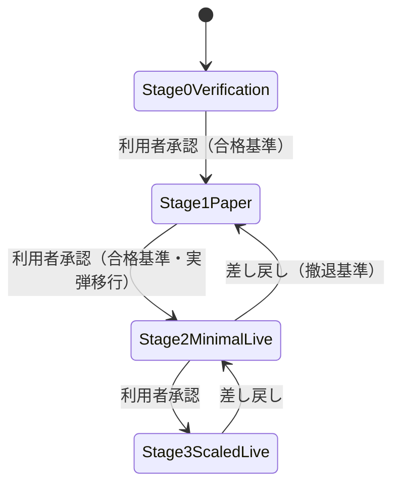

# 機能仕様書: 段階ゲート（FR-20）

> 運用段階（Stage 0〜3）ごとに動作モード（ペーパー/実弾）と資金上限を強制する。段階の遷移は合格・撤退基準に
> 基づき**利用者の承認**で行う（ADR-0008）。本スライスは判定コア（`RiskEvaluator`）でのモード・資金上限の
> 強制を実装済み。遷移管理（承認による昇格・差し戻し）は #20 で実装する。

## 起点となる計画書（トレーサビリティ）

- 機能要求（FR）: FR-20（段階ゲート）。横断: FR-10（資金上限）
- ユースケース（UC）: UC-06（設定変更・段階遷移の承認）
- 計画書リンク: `05_trading-assumptions.md` §5（運用段階）、ADR-0008

## 機能詳細

| 段階 | 想定モード | 説明 |
| --- | --- | --- |
| Stage0Verification | Paper | 検証（既定の開始段階） |
| Stage1Paper | Paper | ペーパー運用 |
| Stage2MinimalLive | Live | 最小実弾 |
| Stage3ScaledLive | Live | 拡大実弾 |

`StageSettings(Stage, Mode, CapitalCap)` を設定として保持する。既定は `(Stage0Verification, Paper, 100,000円)`。

| 判定 | 入力 | 条件 | 拒否理由 | 適用範囲 |
| --- | --- | --- | --- | --- |
| 動作モード | `intent.Mode`, `Stage.Mode` | 注文が Live かつ段階が Live を許可しない | `StageProhibitsLiveTrading` | 全注文（モードは建玉効果非依存） |
| 段階資金上限 | `InvestedCapital`, `intent.Notional`, `Stage.CapitalCap` | 投入中資金＋当該注文額 > 上限 | `StageCapitalCapExceeded` | エントリー(Open)のみ |

- **資金上限は累計（投入中資金＝保有取得額合計＋当該注文額）で判定する**（単一注文額のみでは累計超過を防げない。
  #27。IADR-0005）。コストベース（取得額）で判定し時価では判定しない。
- 手仕舞い（Close）は投入資金を減らす方向のため資金上限の対象外（フェイルセーフ。#25/IADR-0004）。
- モード判定は建玉効果に依存しない（Stage 0/1 でショート決済であっても Live 注文は許可されない）。

## 処理フロー / 状態遷移（段階遷移は #20 で実装）

## 例外・エラー処理

| 条件 | 振る舞い | 記録 |
| --- | --- | --- |
| 段階が許可しないモードの注文 | 拒否 | `StageProhibitsLiveTrading` |
| 累計投入額が段階資金上限を超過 | 新規建てを拒否 | `StageCapitalCapExceeded` |
| 段階遷移（昇格/差し戻し） | 利用者承認が必要（#20） | 遷移履歴を記録 |

## 受け入れ基準

- [x] Stage 0/1 では実弾モードの注文が拒否される（ペーパーのみ許可）
- [x] 保有投入額を含む累計が段階資金上限を超える新規注文が拒否される（手仕舞いは対象外）
- [ ] 段階遷移が利用者承認で行われ、遷移履歴が記録される（#20 で実装）

## 関連仕様

- 機能仕様書: [FR-10 リスク統制](FR-10_risk-controls.md)、[FR-19 取引ガード](FR-19_trading-guard.md)
- データ仕様書: [リスク管理ドメインの集約](../data/risk-management-aggregates.md)
- テスト仕様書: [FR-10 リスクガードコア](../tests/FR-10_risk-guard-core-tests.md)
- 実装ADR: [IADR-0005](../adr/IADR-0005_stage-capital-cap-definition.md)（段階資金上限の定義）、[IADR-0004](../adr/IADR-0004_position-effect-entry-scoping.md)（建玉効果）

## 未決事項

- 段階ごとの CapitalCap の具体値（Stage2/3）は運用実績を踏まえ #20 で確定する。
- 合格・撤退基準（勝率・DD・試行数）の数値は計画側（ADR-0008 / バックテスト #16）と連動して確定する。
