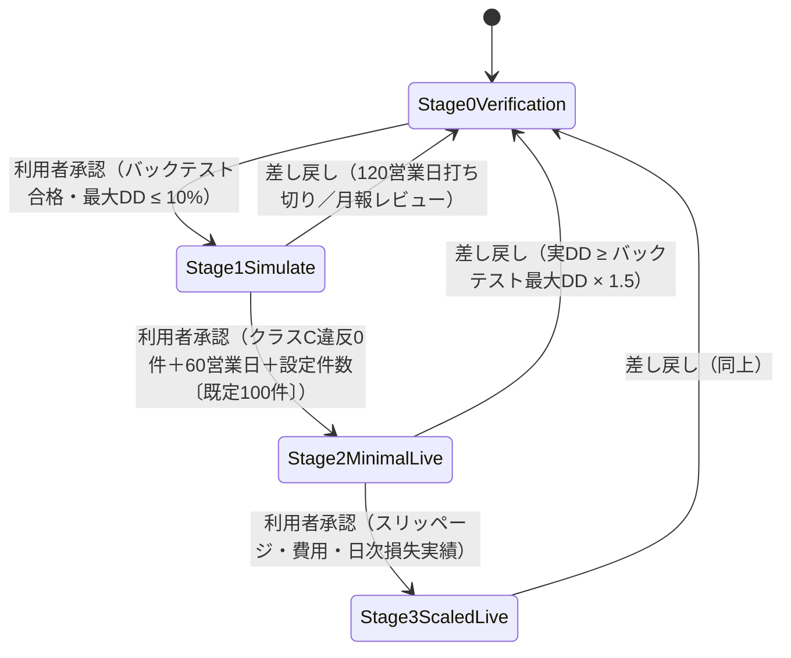

<!-- trace:
ids: [FR-10, FR-11, FR-12, FR-13, FR-15, FR-19, FR-20, SC-01, SC-02, SC-03, UC-06]
adrs: [ADR-0008, ADR-0016, ADR-0018, ADR-0023]
iadrs: [IADR-0005, IADR-0041, IADR-0105, IADR-0111, IADR-0113, IADR-0136, IADR-0137, IADR-0138, IADR-0139, IADR-0140, IADR-0141, IADR-0142, IADR-0148, IADR-0149, IADR-0150, IADR-0154, IADR-0161, IADR-0163, IADR-0164, IADR-0180, IADR-0187]
specs: [20260804_333_stage-gate, 20260805_334_broker-provider-axis, 20260805_386_stage1-trade-count, 20260805_387_class-c-violation-count, FR-10_risk-controls, FR-15_backtest, FR-19_trading-guard, FR-20_staged-gates-tests, IADR-0136_stage-orderable-cap-ratio, IADR-0137_stage1-trading-day-counting, IADR-0138_stage0-drawdown-tolerance-tightening, IADR-0139_stage-product-type-enforcement, IADR-0140_broker-provider-axis, IADR-0141_live-switch-explicit-confirmation, IADR-0142_stage1-simulate-only-aggregation, IADR-0148_control-violation-supply-and-unavailable-state, IADR-0149_stage1-trade-count-supply]
issues: [#27, #333, #334, #382, #385, #386, #387, #407, #422, #423, #431, #466]
-->


# 機能仕様書: 段階ゲート

> 運用段階（Stage 0〜3）ごとに動作モード（実弾の可否）・**発注可能額**・**取引できる商品種別**を強制する。
> 段階の遷移（昇格・差し戻し）は合格・撤退基準に基づき**利用者の承認**で行う。
>
> **2026-08-04で計画の確定規則へ全面追随した。** 変更点は「本改定で変わった前提」を参照。
>
> **2026-08-05で運用段階と発注先（Broker Provider）を独立した 2 軸へ分離した。**
> 段階が定める動作モードは**既定の組み合わせを示すにとどまる**（INDEX 決定 46・段階ゲートの要求）。
>
> **2026-08-07で段階ゲートの要求の追記 (1)(2)(3) へ追随した。**
> **設定は保存できるが、発注は段階が実弾を既定とするまで拒否される**（(1)。その旨をリスク設定画面の警告モーダルに出す）／
> 「REAL」の照合規則が計画側で確定した（(2)）／**発注先の初期値＝内蔵 `paper`** であり、
> **設定ストアの旧行・未知値も同じ既定へ落とす**（(3)。発注先は allow-list で解決し、解決できない値はすべて内蔵 `paper` へ落とす）。

## 本書が受け持つ範囲

- 機能要求: **段階ゲート**。横断するのはバックテスト（Stage 0）・リスク統制（統制上限）・取引ガード・監査ログである。
- ユースケース: **設定変更・段階遷移の承認**。
- 計画書: デイトレード方針レビュー §4・§4.1〜§4.3 ／
  全体前提条件 §5「運用段階（Stage）」「取引可能な商品種別」「空売りの実弾解禁条件」 ／
  INDEX 決定 34・42 ／ 段階ゲート運用の計画 ADR ／ 空売り段階解禁の計画 ADR（決定 8・14）／ リスク統制既定値の計画 ADR（決定 2）

## 本改定で変わった前提

| 論点 | 改定前 | **改定後（計画確定）** |
| --- | --- | --- |
| Stage 1 の呼称 | `Stage1Paper`（内蔵ペーパー） | **`Stage1Simulate`**（moomoo `SIMULATE`。内蔵 `paper` はデバッグ用で検証手段としない） |
| Stage 2 の発注可能額 | 固定額 35,000 円 | **総資金比 0.30**（$3,000 で $900） |
| Stage 1→2 の合格基準 | 「乖離が説明可能」＋「統制違反 0 件」 | **クラス C 統制違反 0 件 ＋ 60 営業日 ＋ 100 件**（旧基準は計画が削除） |
| 件数不足時 | 規定なし | **期間を延長し件数は下げない。累計 120 営業日で打ち切り Stage 0 へ差し戻す** |
| 段階別の商品種別 | 規定なし | **Stage 1＝3 種すべて／Stage 2＝現物のみ／Stage 3 で解禁**（新規建てのみ） |
| Stage 0 の合格 DD | 0.15 | **0.10**（運用の DD 停止ラインと同値） |

## 本改定で変わった前提（#334・2 軸分離）

| 論点 | 改定前 | **改定後（計画確定）** |
| --- | --- | --- |
| 発注先の軸 | 無し（`TradeMode` Paper/Live が段階に従属） | **`BrokerProvider`（3 値）を新設し `TradeMode` を廃止**。現在値は `RiskManagementSettings.BrokerProvider` が段階と独立に保持 |
| Stage 1 の既定発注先 | `Paper`（内蔵擬似約定） | **`MoomooSimulate`**（デイトレード方針レビュー §4 の表） |
| 発注先の変更 | 手段なし | **リスク設定画面から変更可**（理由必須・監査ログ・版の対象）。実弾は明示確認が要る |
| Stage 1 の集計対象 | 区別不能 | **moomoo `SIMULATE` の実績のみ**。内蔵 `paper` は除外日数として別掲 |

## 本改定で変わった前提（#422。段階ゲートの要求の 2026-08-07 追記）

| 論点 | 改定前 | **改定後（計画確定）** |
| --- | --- | --- |
| 保存と発注の関係 | 実装は既に発注を止めていたが、**計画に明文が無く画面は「段階ゲートを飛ばす」としか書いていなかった** | **設定は保存できるが、発注は段階が実弾を既定とするまで拒否される。この旨をリスク設定画面の警告モーダルにも含める**（(1)） |
| 「REAL」の照合規則 | **計画は沈黙**（実弾切替の明示確認の決定 2 で実装側が決めていた） | **計画が確定**: 前後空白のみを除いた完全一致・大文字小文字を区別する（(2)。実装の規則を追認） |
| 発注先の初期値 | **計画は述べていない**（発注先軸の導入の決定 4 が内蔵 `paper` を選んでいた） | **計画が確定**: 内蔵 `paper`。**設定ストアの旧行（本項目を持たない場合）も同じ既定へ落とす**（(3)） |
| 発注先の読み取り | `?? 既定`（**deny-list**。未知の序数は素通り・文字列は例外） | **allow-list**（3 値の明示一致のみ。他はすべて内蔵 `paper`） |

## 機能詳細

### 0. 運用段階と発注先の 2 軸（INDEX 決定 46・#334）

| 軸 | 値 | 保持場所 | 変更手段 |
| --- | --- | --- | --- |
| 運用段階（Stage） | `Stage0Verification` / `Stage1Simulate` / `Stage2MinimalLive` / `Stage3ScaledLive` | `RiskManagementSettings.Stage` | 段階ゲートの承認（Discord Bot） |
| **発注先（Broker Provider）** | `InternalPaper`（0） / `MoomooReal`（1） / `MoomooSimulate`（2） | `RiskManagementSettings.BrokerProvider` | **リスク設定画面のみ**（理由必須・監査・版） |

**段階を変更しても発注先は自動で変わらず、発注先を変更しても段階は自動で変わらない。**
序数 0 / 1 は旧 `TradeMode.Paper` / `TradeMode.Live` の意味を保存する（HTTP・イベント本文・台帳列が整数で
往来するため。発注先軸の導入の決定 2）。

### 1. 運用段階と段階設定

| 段階 | **既定の発注先**（動作モード） | 発注可能額（総資金比） | 商品種別（新規建て） |
| --- | --- | --- | --- |
| `Stage0Verification` | `InternalPaper` | 1.00（段階としての絞りなし） | 制限なし（実弾なし） |
| `Stage1Simulate` | **`MoomooSimulate`** | 1.00 | **3 種すべて検証**（現物 / 信用買い / 空売り） |
| `Stage2MinimalLive` | `MoomooReal` | **0.30** | **現物のみ** |
| `Stage3ScaledLive` | `MoomooReal` | 1.00（最大 100%。増額は月報レビュー時） | 現物・信用買い・空売り（**条件付き**） |

`StageSettings(Stage, Mode, CapitalCapRatio)`。発注可能額は `OrderableCapFor(equity)` で解決する
（固定額では持たない。段階の発注可能額を固定額から総資金比へ改めた）。
**`TradingStage` の数値（0〜3）は不変**であり、`Stage1Simulate` は旧 `Stage1Paper` と同値の 1 である。
**本表の発注先は「その段階で通常選ぶ既定の組み合わせ」であり、現在の発注先そのものではない。**

### 1-2. 発注先の変更（リスク設定画面からの設定変更。実弾への切替は明示的な確認操作をサーバ側でも強制する）

変更要求は `BrokerProviderChange.Evaluate` が単独で受理可否を決める（画面とサーバが同じ規則を使う）。

| 条件 | 内容 |
| --- | --- |
| 変更理由 | **1 文字以上**（空白のみは不可）。欠ければ `ReasonRequired` |
| 実弾（`MoomooReal`）への切替 | **同意フラグ**と**「REAL」の文字入力**の両方。欠ければ `LiveAcknowledgementMissing` / `LivePhraseMismatch` |
| 照合規則 | 前後空白を除いた完全一致・**大文字小文字を区別する**（**段階ゲートの要求の追記 (2) が確定させた規則**。実装側の決定 2 を追認。`real` / `Real` / `ＲＥＡＬ`〔全角〕は受理しない） |
| 段階との組み合わせ | **保存を妨げない。** 段階の既定が実弾でなければ `SkipsStageGate` を**警告**として返す |
| 未定義の発注先 | `UnknownProvider`（既定値 0 へ暗黙に倒さない） |

受理しない場合は**設定も履歴も変えない**（拒否された要求を履歴へ積むと、起きていない変更が監査上の事実になる）。
受理時は `SettingsChangeType.BrokerProviderChanged`（序数 7）で日時・変更前後・理由を記録する。

**保存できることは発注できることを意味しない**（同追記 (1)・#422）。Stage 1 のまま実弾を選ぶ操作は
**保存は受理され、発注は `StageProhibitsLiveTrading` で拒否される**（下記 §2）。両者は同時に成り立つ。
リスク設定画面の警告モーダルと一覧警告には**「段階が実弾を既定とするまで発注は行われない」旨**を出す
（段階が既に実弾なら出さない——実際に発注されるため嘘になる。allow-list 解決の決定 4）。

### 1-3. 発注先の解決（allow-list・#422。解決できない値はすべて内蔵 `paper` へ落とす）

**発注先の初期値は内蔵 `paper`**（段階ゲートの要求の追記 (3)）。永続行からの解決は `BrokerProviderResolution`（allow-list）だけを通す。

| 入力 | 解決結果 |
| --- | --- |
| `InternalPaper` / `MoomooReal` / `MoomooSimulate`（明示一致） | その値 |
| 文字列 `"0"` / `"1"` / `"2"` / 正準名（前後空白のみ除去・`Ordinal`） | 対応する値 |
| **設定ストアの旧行（キーが無い）・`null`** | **内蔵 `paper`** |
| **未知の序数**（`3` / `7` / `-1` / `int` 超過） | **内蔵 `paper`** |
| **未知の文字列・大小文字違い**（`"MOOMOO REAL"` / `"moomooReal"` / `"REAL"`） | **内蔵 `paper`** |
| **別の型**（真偽値・オブジェクト・配列） | **内蔵 `paper`**（例外を投げない） |

- **`?? 既定`（deny-list）で書かない。** 「`null` だけを弾く」形では未知の値が素通りする——
  計画が「読めない行は実弾」と名指しした失敗である。形は
  バックテストの実過去データ源の `HistoricalBarSourceFactory.ResolveProvider` に揃える。
- **`Enum.IsDefined` に置き換えない。** 4 値目を末尾へ足した瞬間に未検討の値が黙って通る。
- **旧行はマイグレーションで書き換えない。** 設定は単一行 JSON であり、既定値は**読み取り時**に与える。
- **読み取りは黙って倒し、書き込み（変更要求）は `UnknownProvider` で拒否する**（非対称は意図的）。

#### 適用範囲 — **設定行の同じ型の項目すべて**（#431。allow-list の適用範囲を定めた決定 1）

設定ストア（単一行 JSON）には `BrokerProvider` 型の項目が **2 つ**ある。**両方**が上表の allow-list を通る。

| 項目 | 意味 | 経路 |
| --- | --- | --- |
| `brokerProvider` | **現在の**発注先（独立した軸） | `SettingsDto.BrokerProvider` |
| `stage.mode` | **段階の既定**発注先（「その段階で通常選ぶ発注先」であり現在値ではない） | `StageDto.Mode` |

- `stage.mode` はドメイン型 `StageSettings` の一部だが、**`StageSettings` へ `[JsonConverter]` を直付けしない**
  （永続化の関心がドメインへ漏れる。同型は HTTP 応答・イベントでも往復する）。`GuardDto` と同じ形で
  **`StageDto` を挟む**。
- 解決できない `stage.mode` は内蔵 `paper` へ倒れ、`Stage.Mode != MoomooReal` により**実弾は止まる**
  （§2 の `StageProhibitsLiveTrading`）。**新しい既定を発明しない**。
- **DTO → ドメインの写像で二重に `Resolve` を呼ばない。** 解決の単一情報源は converter であり、
  二重化すると「属性を外す」変異がテストで検知できなくなる。
- 片方だけを塞いだ状態では、**未知の文字列・別の型が `JsonException` になって設定行全体が読めなくなる**
  （統制値・ガード・段階もろとも失われ `GetCurrent` が 500 を返す）。到達経路は現在の発注先と同一である。

### 2. 発注前の強制（`RiskEvaluator`）

| 判定 | 入力 | 条件 | 拒否理由 | 適用範囲 |
| --- | --- | --- | --- | --- |
| 動作モード | `intent.Mode`, `Stage.Mode` | 注文が Live かつ段階が Live を許可しない | `StageProhibitsLiveTrading` | 全注文（モードは建玉効果非依存） |
| 発注可能額 | `InvestedCapital`, `intent.NotionalInBase`, `Stage.CapitalCapRatio`, `snapshot.Capital` | 投入中資金＋当該注文額 > equity × 比率 | `StageCapitalCapExceeded` | **エントリー（Open）のみ** |
| 段階別の商品種別 | `Stage.Stage`, 実効 `ProductType` | その段階が当該商品種別の新規建てを許さない | `StageProductTypeProhibited` | **エントリーのみ** |
| 空売りの実弾解禁 | `Stage.Stage`, equity, Stage 0 再充足の verdict | Stage 3 だが解禁条件（2 条件 AND）が未充足 | `StageShortSellReleaseUnmet` | **エントリーのみ** |

- **発注可能額は累計（投入中資金＋当該注文額）で判定する**（単一注文額のみでは累計超過を防げない。#27）。
- **段階制約とリスク統制の上限は両方を満たす必要がある**（常に厳しい方が効く。計画 §5 注記）。
  equity $3,000 の Stage 2 では発注可能額 $900 が 1 注文上限 $750 より先に効き、保有建玉数上限 3 を
  満たすには 1 建玉あたり $300 が実効上限になる。
- **段階別の商品種別強制は取引ガードの設定（`Guard.EnabledProductTypes`）とは別の規則**である。
  設定で有効にしても段階が許さなければ通らない（拒否理由も分ける）。
- **手仕舞い（Close）・損切りは段階制約で止めない**（3 統制の優先順位を定めた計画 ADR と、
  段階別の商品種別強制を新規建てのみへ課す実装側の決定による）。段階を上げる前に建てた
  信用買い・空売りの建玉を閉じられなくなると、損失に上限が無い建玉を凍結させることになる。
- 照合は**実効商品種別**で行う（新規売り建てを `Cash` と申告して段階制約を迂回できない）。

### 3. Stage 3 の空売り実弾解禁条件（空売り段階解禁の計画 ADR の決定 8・決定 14）

次の **2 条件をともに**満たさない限り、Stage 3 でも空売りの新規建ては開かない。

1. **自己資金 $5,000 以上**（＝1 銘柄あたりの空売り上限 $500 以上と等価。決定 2(a) より上限は equity の 10%）
2. **空売りを含む戦略で Stage 0 の 7 条件を再度満たす**（同 ADR の決定 14）

条件 2 の verdict を確認する経路が無い場合は**開かない**（フェイルクローズ）。

### 4. 昇格の合格基準（デイトレード方針レビュー §4・§4.1）

| 現段階 | 機械判定の合格基準 | 未充足時の理由 |
| --- | --- | --- |
| Stage 0 | バックテスト合格（7 条件。**最大 DD ≤ 10%**。リスク統制既定値の計画 ADR の決定 2） | `BacktestNotPassed` |
| Stage 1 | **クラス C 統制違反 0 件**（供給済みで 0 件） | `ControlViolationsPresent` |
| Stage 1 | **統制違反件数の集計が供給されていること**（#387） | `ControlViolationCountUnavailable` |
| Stage 1 | **実際に取引できた日数 ≥ 60 営業日** | `Stage1TradingDaysInsufficient` |
| Stage 1 | **取引件数 ≥ 設定値（既定 100 件・値域 1〜1000）**（計上単位は約定した新規建て注文 1 件。#386／設定化は #423） | `Stage1TradeCountInsufficient` |
| Stage 1 | （累計 120 営業日を経て件数不足なら打ち切り） | `Stage1ExtensionExhausted` |
| Stage 2 | 実効スリッページ・費用が想定内 | `SlippageOrCostExceeded` |
| Stage 2 | 日次損失上限の運用実績（違反なし） | `DailyLossLimitViolated` |

- **「統制違反 0 件」はクラス C 限定**（`BannedSymbol` / `ManipulativeOrderPattern`）。空売りの拒否理由 9 種
  （クラス A）と段階制約による拒否（クラス B）は**計上しない**。分類の単一情報源は
  `RejectionReasonClassification`（§4.1・空売り段階解禁の計画 ADR の決定 10）。
- **計上単位は 1 回の発注拒否につき 1 件**（1 回の拒否で複数理由が返っても 1 件）。
  実装では観測ログ `order_screening_observations` の主キー（`DecisionId`）がこの単位を担保する。
- **「未供給」と「0 件」を区別する**（#387。クラス C 統制違反件数を発注審査の観測から集計し、「未供給」を 0 件と別の状態として判定する）。
  段階ゲートの他の入力（営業日数・取引件数）の 0 は「未充足＝昇格しない」に倒れるが、**違反件数の 0 だけは
  「合格」を意味する**。集計が供給されていない状態は `ControlViolationCountUnavailable` として
  **条件未充足に倒す**（`ControlViolationsPresent` とは別の理由。供給経路の欠落と AI の抵触記録では打つ手が違う）。
- 条件 4・5（ZDR の有効化・信用取引の必要額 $2,500）は「作業が完了しているか」の**昇格時チェックリスト**で
  あり機械判定ではない（§4.1）。実装は評価しない。
- **旧基準「バックテストとの乖離が説明可能な範囲」は計画が合格基準から削除した**（§4.1）。
  検証の観点は月報の三者比較（バックテスト / SIMULATE / 実弾）へ移設されている。

### 4-1. クラス C 統制違反件数の供給（#387。発注審査の観測から集計する）

**件数は発注審査の観測ログから集計する。**

- `OrderScreeningService.Screen` が**承認・拒否のいずれでも**観測（`OrderScreeningObservation`）を返し、
  `TradeDecisionMadeHandler` が観測ログへ記録する（`DecisionId` で冪等）。
- **承認された審査も記録する**——拒否だけを記録すると「違反 0 件」を主張する根拠が無く、未供給と区別できない。
- 算入する発注先は **moomoo `SIMULATE` の許可制**（Stage 1 集計の決定 2 の再利用。段階ゲートの要求は経過営業日数・取引件数・
  統制違反件数のいずれも `SIMULATE` のみで数えると定める）。
- 集計は `ControlViolationAggregation.Tally`。**算入対象の観測が 1 件も無ければ `null`（未供給）**を返す。
- **観測窓は受理された段階遷移で区切る**（計画「集計期間は Stage 1 の全期間」）。区切った直後は未供給＝昇格しない。

### 4-1-2. 取引件数の供給（#386。取引件数は「実発注したアダプタの発注先」つき約定から集計し、計上単位を新規建て 1 注文に定める）

**件数は約定の観測ログから集計する。**

- `OrderExecutedStage1FillHandler` が `OrderExecuted` を購読し、観測ログ（`stage1_fill_observations`）へ
  記録する（`DecisionId` で冪等）。`StageGateService` が判定の直前に `StagePerformance` へ件数を重ねる。
- **発注先は「実際に発注したアダプタ」の値**（`OrderExecuted.Provider`）である。取引判断が運ぶ
  `OrderIntent.Mode` は**段階が定める既定の発注先**であって現在の発注先ではない（発注先軸の導入の決定 3・4）。
  Stage 1 の `Stage.Mode` は常に `MoomooSimulate` であるため、`intent.Mode` を用いると内蔵 `paper` で
  稼働していても `SIMULATE` として計上されてしまう。
- **計上単位は「算入対象の発注先で約定が成立した新規建て（`Open`）注文 1 件」**（`DecisionId` で一意）。
  分割約定の続報・イベント再送でも 1 件である（`OrderExecuted` の `FilledQuantity` は累積値であり、
  moomoo は同一注文について複数回発行する）。手仕舞い（`Close`）は数えない。
  **計上単位は計画に明記が無く、実装が計画の他の記述から読み取った前提である**
  （環流記録に残す）。
- 記録しない条件はいずれも**算入しない側（fail-safe）**へ倒す: 約定していない結果（`FilledQuantity <= 0`）／
  承認台帳に相関が無い（建玉効果が不明）。
- 算入する発注先は **moomoo `SIMULATE` の許可制**（Stage 1 集計の決定 2 の再利用）。
- **観測窓は受理された段階遷移で区切る**（起算点＝Stage 1 遷移日・§4.2）。区切った直後は 0 件＝昇格しない。
- **「未供給」と「0 件」は区別しない。** 取引件数の 0 は「条件未充足＝昇格しない」に倒れる fail-safe であり、
  統制違反件数のような区別に意味が無い。

### 4-1-3. 最小取引件数は**設定値**である（#423。最小取引件数の設定化）

2026-08-07 の利用者裁定（質問票 第 13 回 Q6 の追加指示）により、§4.1 条件 3 の件数は
**[リスク設定画面](../screens/20260718_SC-02_risk-settings.md) から変更できる設定値**になった。

| 項目 | 値 | 備考 |
| --- | --- | --- |
| 既定 | **100 件** | §4.1 条件 3。「既定値は 100 件のまま維持する」（裁定） |
| 値域 | **1〜1000**（いずれも含む） | 0 以下では条件 3 が無条件に成立し**期間だけで昇格できてしまう** |
| 統計的根拠の下限 | **100 件** | §4.3。**下回る設定は警告の対象であり、拒否の対象ではない** |

- **置き場所は `RiskManagementSettings.Stage1MinimumTradeCount`** であり、他のリスク設定と同じ経路
  （単一行 JSON ＋ `Version` 楽観排他、`ISettingsChangeLog` への理由つき記録）に載る。
  `StageGateService` が**判定の直前**に `Stage1GateCriteria` へ重ねる（`StageGatePolicy` は DI singleton であり
  監査・楽観排他を持たないため、そこへ可変値を混ぜない）。
- **変更経路**: `PUT /risk-controls/settings/stage1-minimum-trade-count`（OwnerOnly・`{minimumTradeCount, reason}`）。
  理由必須・値域外は 400（設定も履歴も変えない）・変更履歴の種別は `Stage1MinimumTradeCountChanged`（序数 8・末尾追加）。
- **100 件未満でも受理する。** 裁定は「**警告は設定を妨げない。下げた事実が記録に残ることを担保する**」と定める。
  **警告の判定はサーバが宣言する**（`Stage1GateCriteria.BelowStatisticalBasis`）——
  画面（リスク設定・統制状態参照）と Discord（`/stage status`・`/stage promote`）はこの宣言に従い、閾値 100 を写経しない。
  写経すると 1 か所の写し間違いで「下げたのに警告が出ない」状態になる（供給可否をサーバが宣言する規約と同じ論法）。

#### 4-1-4. 昇格承認への警告と昇格記録（#466。`/stage promote` の引き下げ警告と昇格記録）

**§4.1 の 2026-08-07 追補3**（利用者裁定 質問票 第15回 Q13-a / Q13-b）が 2 点を追加した。

**(1) 警告は「昇格承認」そのものに出す。**

裁定は `/stage status`（現況照会）だけでは足りないとする ——「**承認前に status を読む**」は
**人の運用に依存する前提**であり、読まなければ警告が届かない。したがって警告の到達点は **4 経路**である。

| 経路 | いつ出るか |
| --- | --- |
| リスク設定画面 | 入力中・保存済みの双方 |
| 統制状態参照画面 | サーバの宣言に従い常時 |
| Discord `/stage status` | 現況照会の応答 |
| **Discord `/stage promote`** | **確認ボタンを出す前**（承認判断の材料）**と**、遷移応答の**両方** |

**確認の前後どちらか一方では足りない。** 押した後にだけ出す形は「押してから気づく」——
そのときには遷移は既に受理・台帳追記・イベント発行まで済んでおり、裁定が否定した
「読まなければ届かない」構図と実効的に同じになる。前だけに出す形は、拒否された場合に
設定が下がったままである事実が応答から消える。

- **`/stage demote`（差し戻し）には出さない。** 安全側の操作へ同じ警告を出すと「読まれない警告」化する。
- **昇格先で絞らない**（`/stage promote 1` でも出す）。§4.3 は「100 件未満を設定した場合は
  画面と昇格承認に警告を**常時表示する**」と定めており、Stage 0→1 の昇格は「出口の合格条件を
  弱めた状態で Stage 1 へ入る」ことそのものである。
- **警告を理由に昇格を拒否しない。** `Stage1Gate.Evaluate` は `BelowStatisticalBasis` を参照しない。

**契約変更**: 遷移応答（`StageTransitionResult` / `POST /risk-controls/stage-gate/transition`）が
**実効の合格条件**（`Stage1GateCriteria`）を運ぶ。計画が実装側の残件として名指しした変更である。
**受理・拒否の両方に載せる**（「拒否されたときだけ警告が消える」経路を作らない）。

**(2) 警告を無視して昇格した事実を記録する。**

`StageTransitioned`（中央監査集約）へ 2 項目を追加する。

| 項目 | 型 | 意味 |
| --- | --- | --- |
| `Stage1MinimumTradeCount` | `int` | 遷移時点の最小取引件数の設定値 |
| `Stage1BelowStatisticalBasis` | `bool` | **その時点で警告が出ていたか否か** |

- **警告有無を設定値から後で導出しない。** 統計的根拠（100）が将来改訂されると、導出では
  **過去の記録の解釈が黙って書き換わる**。当時の判定で凍結する。
- **受理された遷移すべてに載せる**（昇格に絞ると `null` が「昇格ではなかった」と「供給されなかった」の
  両方を意味する）。
- 監査エントリの**人が読む要約**にも、警告が出ていた遷移にだけその旨を添える
  （常時添えると要約が伸びて警告が埋もれる）。

設定変更の履歴には「下げた事実」が残るが、**その設定で昇格した事実**は本イベント以外に残らない。
- **変えられるのは条件 3 の件数だけである。** 条件 1（統制違反 0 件）・条件 2（60 営業日）・
  §4.3 の打ち切り規則（累計 120 営業日）には**及ばない**（裁定が明示）。
  `Stage1GateCriteria` の他 2 項目は `Stage1GateCriteria.Default` のままであり、設定から書き換える経路を作らない。
- **旧行・値域外の永続値は既定 100 へ落とす。** 発注先の allow-list と同型だが、
  **倒す先は「厳しい側」＝合格に遠い値**である。読めない行が「少ない件数」へ倒れると擬似的に合格へ近づき、
  しかも画面には正常な設定として現れる。
- **設定化しても計上単位は変わらない**（前項 4-1-2）。**単位が 2〜3 倍に膨らむ欠陥は、設定を下げたのと同じ効果を
  持ちながら画面にも履歴にも現れない**ため、設定値を 1〜1000 のどこに置いても単位が不変であることをテストで固定する。

### 4-2. Stage 1 集計からの内蔵 `paper` の除外（#334。合格集計から内蔵 `paper` を構造的に排除し、除外営業日数を別掲する）

**Stage 1 の合格判定は moomoo `SIMULATE` の実績のみで集計する。** 内蔵 `paper` の約定・稼働日数を算入すると、
外部へ一度も発注していない擬似約定で 60 営業日・100 件という合格証跡が積み上がる。

- 観測（`Stage1TradingDayObservation` / `Stage1FillObservation`）は**発注先を必須**で伴う（既定値を与えない）。
- 算入は `MoomooSimulate` の**許可制**である。計画が名指ししていない `MoomooReal` も算入しない。
- `paper` 稼働により算入されなかった営業日は `Stage1Progress.ExcludedInternalPaperDays` として**別掲**し、
  統制状態参照画面が「経過 42 / 60 営業日（`paper` 稼働により 3 日を除外）」と併記する。
- 除外日数に数えるのは「`paper` であり、**かつ稼働率の条件は満たしていた**日」に限る（休場日・稼働不足日は含めない）。

### 5. Stage 1 の期間カウント規則（§4.2・INDEX 決定 34）

| 項目 | 規則 |
| --- | --- |
| 起算点 | Stage 1 遷移日 |
| 目標日数 | **60 営業日**（3 か月相当） |
| 数え方 | **実際に取引できた日数**（経過日数ではない） |
| 1 日として数える条件 | その日の実際の通常取引時間の **50% 以上**が稼働（**ちょうど 50% は算入**） |
| 分母 | **その日の実際の通常取引時間**（通常日 390 分／半日取引日 210 分）。固定の 6.5 時間を用いない |
| 判定の基準時刻 | **米国東部時間**（DST 切替・半日取引日に対応） |
| 除外 | OpenD の停止・ブローカー側の障害・市場休場 |

実装は `Stage1TradingDayObservation(SessionDateEasternTime, RegularSessionMinutes, OperationalMinutes)` を
**観測記録として受け取る**。**半日取引日カレンダーも TZ 変換も実装が持たない**——計画が判定源を
述べていないため（営業日は観測入力として受け取り、期間×件数の 2 条件と 120 営業日打ち切りを機械判定にする。環流記録に残す）。市場休場は分母 0、
OpenD 停止・ブローカー障害は分子（稼働分数）の減少として表れる。

### 5-1. 稼働営業日の供給（#385。稼働営業日は定期 probe の観測から積み、通常取引時間は「取り得る仮説すべて」で判定する）

営業日数の供給元は**稼働の観測ログ**（`stage1_session_uptime`・**1 取引日 1 発注先 1 行**）である。
`stage_performance` は営業日数の列を持たない（供給元が 2 つになると必ず食い違う）。

```
[発注執行] BrokerAvailabilityProbeService（既定 5 分間隔）
   └ IBrokerAvailabilityProbe.IsOperationalAsync() が true のときだけ BrokerAvailabilityObserved を発行
[リスク管理] BrokerAvailabilityObservedHandler → 米国東部時間の（取引日, 分）へ写して稼働分数を積む
             StageGateService → 判定直前に営業日数・paper 除外日数を StagePerformance へ重ねる
                              → 受理された段階遷移で観測窓を区切る（起算点＝Stage 1 遷移日）
```

- **定期 probe（沈黙＝非稼働）であり、接続・切断イベントではない。** 切断イベントは異常終了・ネットワーク断で
  それ自体が失われ、区間が閉じないまま稼働時間が伸びる（＝営業日数の水増し）。
- **積み方**: 直前の成功観測からの経過が「その観測が保証する時間」（巡回間隔・上限 30 分）以内のときだけ、
  その区間を通常取引時間の窓と交差させて積む。**probe を 1 回でも落とした区間は積まない。**
  初回は遡らない。逆行・再送は積まない（冪等）。
- **分母を発明しない**: その日が半日取引日かを知らないため、**取り得る通常取引時間の仮説をすべて作り、
  すべてで 50% 以上稼働していたときにだけ算入する**（半日 210 分の窓で 105 分以上 **かつ** 通常日 390 分の窓で
  195 分以上）。真の規則より必ず厳しく、**真の規則が算入しない日を算入することは原理的に起きない**。
  週末は分母 0 の仮説 1 つ（`DayOfWeek` の算術であってカレンダーではない）。
- 🔴 **祝日は判別しない（裁定済み・2026-08-07）**: 市場の祝日に OpenD が稼働していると営業日として
  算入され得る。**これは「判定源が無い穴」ではなく、そうすると決まった設計である** ——
  利用者裁定（質問票 第13回 Q3 案2。計画のデイトレード方針レビュー §4.2「分母と除外の判定源」）が
  **「祝日は判別しない。除外しない」「分母と除外の判定に外部カレンダーを用いない」**と定めた
  （環流の後に裁定済み。#407）。
  **したがって祝日表・休場日リスト・外部カレンダーを足すことは裁定違反である。**
  - **過大計上の向き**: 年 **2〜3 日／60 営業日**。**「昇格が早まる」側であり fail-safe ではない。**
    ただし影響は限定的である —— 60 営業日が 57〜58 営業日相当になる程度であり、
    昇格には**取引件数（§4.1 条件3）と利用者承認**も要る。
  - **半日取引日は逆に過少計上（安全側）へ倒れる**（2 仮説の両方で 50% を求めるため）。
  - **安全側の割り切りだと誤読しないこと。** 誤読すると後から祝日カレンダーを足す動機になる（裁定が明示した警告）。
- **稼働の定義の限界**: 実装が観測できるのは「照会に応答したこと」までであり、**発注を試さない**
  （試し発注は統制の外側で注文を出すことになる）。§4.2 の「発注可能であった時間」の代理である。

### 6. 件数不足時の扱い（§4.3・INDEX 決定 42）

| 状態 | 条件 | 扱い |
| --- | --- | --- |
| `InProgress` | 営業日 < 60 | 昇格しない |
| `Extended` | 営業日 ≥ 60・件数 < 100・営業日 < 120 | **昇格しない。期間を延長する（件数は引き下げない）** |
| `Promotable` | 営業日 ≥ 60・件数 ≥ 100 | §4.1 の他の条件を満たせば昇格できる |
| `Exhausted` | 営業日 ≥ 120・件数 < 100 | **打ち切り。Stage 0 へ差し戻す** |

**打ち切り事由は「120 営業日を経ても件数に届かない」ことであり、期間の超過そのものではない。**
件数を満たしていれば 120 営業日を超えても昇格できる。

### 7. 撤退（差し戻し）基準

| 段階 | 条件 | 自動停止 | 提案 |
| --- | --- | --- | --- |
| Stage 2 / Stage 3 | 実DD ≥ バックテスト最大DD × **1.5** | **する**（kill switch 起動） | Stage 0 へ差し戻し |
| Stage 1 | 累計 120 営業日を経て件数不足（§4.3） | しない（SIMULATE のため） | Stage 0 へ差し戻し |

段階の実降格は**提案に留め**、確定は承認付き `RequestTransition` を要する（自動＝停止・承認＝段階変更）。
Stage 1 の「月報の三者比較を読んだ利用者による差し戻し」は**機械判定ではなく**、承認付き遷移で行う
（降格方向は合格基準不問で受理される）。

## 処理フロー / 状態遷移



## 例外・エラー処理

| 条件 | 振る舞い | 記録 |
| --- | --- | --- |
| 承認者が空の遷移要求 | 拒否（**承認なしに段階は遷移しない**） | `NoUserApproval` |
| 段階を飛ばす昇格 | 拒否 | `PromotionMustBeSequential` |
| 遷移先が現段階 | 拒否 | `TargetIsCurrentStage` |
| 段階が許可しないモードの注文 | 拒否 | `StageProhibitsLiveTrading` |
| 累計投入額が発注可能額を超過 | **新規建てのみ**拒否 | `StageCapitalCapExceeded` |
| 段階が許さない商品種別の新規建て | 拒否（**手仕舞いは拒否しない**） | `StageProductTypeProhibited` |
| Stage 3 で空売り解禁条件が未充足 | 拒否（フェイルクローズ） | `StageShortSellReleaseUnmet` |
| 実績の供給が無い（既定 0 / false） | **昇格しない**（fail-safe） | 未充足基準を列挙 |

## 受け入れ基準

- [x] 段階の呼称が `Stage0Verification` / `Stage1Simulate` / `Stage2MinimalLive` / `Stage3ScaledLive` である
- [x] Stage 0/1 では実弾モードの注文が拒否される
- [x] 保有投入額を含む累計が段階の発注可能額（総資金比）を超える新規注文が拒否される（手仕舞いは対象外）
- [x] Stage 2 の発注可能額が総資金の 30% として解決される（equity に比例する）
- [x] Stage 0 の合格基準の最大 DD が 10% である（0.15 への退行を検知する）
- [x] 稼働率 50% ちょうどの日が 1 日として算入され、49.9% は算入されない
- [x] 半日取引日でも分母がその日の実際の通常取引時間になる
- [x] **日次の稼働分数が記録され、営業日数が実測から更新される**
- [x] **ET 基準で判定され、DST 切替をまたいでも同じ現地時刻が同じ分へ写る**
- [x] **probe を落とした区間・供給が途絶えた期間で営業日数が水増しされない**
- [x] **カレンダーを内蔵していないことが構造で確認できる**（3 年ぶんの全日付で結果が曜日だけで決まる・#385）
- ~~**市場休場のうち祝日が除外される**~~ **【対象外・2026-08-07 裁定】** —— **未達ではなく「除外しないと決まった」。**
  裁定（質問票 第13回 Q3 案2）が「**祝日は判別しない。除外しない**」と定めたため、**達成すべき基準ではなくなった**
  （#407）。**祝日表を足すことは裁定違反である。**
- [x] 期間 60 営業日を満たしても件数（設定値・既定 100 件）に届かなければ昇格しない
- [x] 累計 120 営業日で打ち切られ、Stage 0 差し戻しが提案される
- [x] クラス A / クラス B の拒否は「統制違反 0 件」に計上されない
- [x] クラス C の拒否を含む発注拒否が 1 件として計上される（1 回の拒否に複数のクラス C 理由が返っても 1 件）
- [x] **統制違反件数の集計が未供給なら、期間・件数が揃っていても昇格しない**
- [x] Stage 2 で信用買い・空売りの新規建てが拒否され、**手仕舞いは拒否されない**
- [x] Stage 3 の空売り実弾が equity $5,000 未満・Stage 0 再充足なしでは開かない
- [x] 段階遷移が利用者承認で行われ、遷移履歴が記録される
- [x] 発注先が `InternalPaper` / `MoomooReal` / `MoomooSimulate` の 3 値であり、序数 0 / 1 が旧 `TradeMode` の意味を保存する
- [x] 段階を変更しても発注先が変わらず、発注先を変更しても段階が変わらない
- [x] 実弾への切替が同意と「REAL」の入力の両方が揃うまで受理されない（画面・API の双方で）
- [x] 変更理由が空の発注先変更が設定も履歴も変えない
- [x] 発注先の変更が日時・変更前後・理由とともに履歴へ残る
- [x] 内蔵 `paper` の約定・稼働日数が Stage 1 の進捗に算入されず、除外日数として別掲される
- [x] 内蔵 `paper` で 60 営業日・100 件を積んでも昇格可能にならない
- [x] **`SIMULATE` の約定件数が Stage 1 の進捗（`Stage1Progress.TradeCount`）へ反映される**
- [x] **否定形: 内蔵 `paper` / `MoomooReal` の約定を混ぜても件数が汚染されない**
- [x] **最小取引件数がリスク設定画面から変更でき、設定した件数で昇格判定が行われる**（#423・既定 100・値域 1〜1000）
- [x] **値域外（0 以下・1001 以上）・理由欠如の変更が 400 となり、設定も履歴も変わらない**
- [x] **100 件未満でも保存でき（警告は設定を妨げない）、変更が理由・前後値つきで履歴に残る**
- [x] **100 件未満はサーバが `belowStatisticalBasis` として宣言し、リスク設定画面・統制状態参照画面・Discord が警告を出す**
- [x] **`/stage promote`（承認操作）の応答に引き下げ警告が含まれる**（#466・裁定 Q13-a）
- [x] **確認ボタンを出す前にも同じ警告が届く**（#466・「押してから気づく」形にしない）
- [x] **否定形: 既定値のままなら承認操作に警告は出ない**（#466・常時警告は読まれない警告になる）
- [x] **否定形: 警告が出ていても昇格そのものは拒否されない**（#466・裁定が明示）
- [x] **否定形: `/stage demote`（差し戻し）には警告を出さない**（#466・安全側の操作）
- [x] **否定形: 合格条件を返さない旧版 Risk では警告を出さない**（#466・宣言が無いものを推測しない）
- [x] **昇格時点の設定値と警告の有無が `StageTransitioned` として監査へ残る**（#466・裁定 Q13-b）
- [x] **否定形: 警告の有無が設定値から導出されていない**（#466・当時の判定で凍結する）
- [x] **否定形: 件数を下げても条件 1（統制違反 0 件）・条件 2（60 営業日）・打ち切り 120 営業日は緩まない**
- [x] **否定形: 旧行・値域外の永続値が「少ない件数」ではなく既定 100 へ落ちる**
- [x] **否定形: 設定値を 1〜1000 のどこに置いても計上単位（分割約定 1 件・手仕舞い不算入）が変わらない**
- [x] **否定形: 収集間隔を変更する API/UI が存在しない**（ルート表・型・画面の 3 面で構造的に固定・#423）
- [x] **否定形: 分割約定・イベント再送で件数が二重計上されない**（計上単位＝約定した新規建て注文 1 件）
- [x] **否定形: 手仕舞い（`Close`）の約定・約定していない結果・承認台帳に相関の無い約定は計上されない**
- [x] **否定形: 供給が途絶えても件数が水増しされない**（記録が無ければ 0＝昇格しない）

## 実装状況（発動しない部分）

| 判定 | 供給元 | 既定の振る舞い |
| --- | --- | --- |
| Stage 0 合格 verdict | **未接続**（米国株の日足 OHLC 履歴源が未確定。[#382](https://github.com/endazon/ai-stock-trading/issues/382)） | `BacktestPassed = false` → 昇格しない |
| Stage 1 の取引件数 | **実装済み**（約定の観測ログから集計。#386） | 記録が無ければ 0 → 昇格しない。`SIMULATE` の新規建て約定が届けば増える |
| Stage 1 の営業日数・除外日数 | **未実装**（稼働監視ドライバが無い。判定の純関数は #333 / #334 で用意済み・供給元は [#385](https://github.com/endazon/ai-stock-trading/issues/385)） | 0 → 昇格しない |
| 発注先の設定値 → 実際の発注経路 | **未結線**（発注先は起動時構成 `Broker:Provider` / `Broker:Environment` が決める） | 設定変更は**記録と表示まで**。実弾は閂 0 が止める |
| クラス C 統制違反件数 | **実装済み**（発注審査の観測ログから集計。#387） | 未供給（`null`）→ **昇格しない**。審査が動けば 0 件として供給される |
| Stage 3 の空売り解禁 verdict | **未実装**（`BacktestEvaluated` に該当属性が無い） | `null` → 空売りは開かない |
| 段階別の商品種別強制・発注可能額 | — | **実効する**（`RiskEvaluator` 経路） |

## 関連仕様

- 機能仕様書: [リスク統制](FR-10_risk-controls.md)・[バックテスト](FR-15_backtest.md)・[取引ガード](FR-19_trading-guard.md)
- テスト仕様書: [段階ゲート](../tests/FR-20_staged-gates-tests.md)・[リスクガードコア](../tests/FR-10_risk-guard-core-tests.md)
- 実装ADR: 段階の発注可能額を固定額から総資金比へ改める／営業日は観測入力として受け取り、期間×件数の 2 条件と 120 営業日打ち切りを機械判定にする／
  Stage 0 の最大 DD 許容値を 0.15 から 0.10 へ厳格化する／段階別の商品種別強制を新規建てのみへ課し、Stage 3 の空売り実弾解禁をフェイルクローズの 2 条件 AND にする／
  クラス C 統制違反件数を発注審査の観測から集計し、「未供給」を 0 件と別の状態として判定する／
  取引件数を「実発注したアダプタの発注先」つき約定から集計し、計上単位を新規建て 1 注文に定める／
  段階資金上限は保有ポジションの取得額合計＋当該注文額で判定する／段階遷移は承認ゲートを構造で強制し、撤退は「自動停止＋降格提案」に分離する
- 作業仕様書: 作業仕様書: 段階ゲートの再実装・
  作業仕様書: Stage 1 の取引件数の供給（[#386](https://github.com/endazon/ai-stock-trading/issues/386)）

## 未決事項

- **発注先の設定値が発注経路を動かさない。** 実際にどのアダプタへ発注するかは起動時の構成
  （provider × environment の 2 軸）が決めており、結線は実弾解禁と同じ議論を要するため別 issue とした。
- **Stage 1 集計の供給元**（稼働分数の記録・約定と発注先の結び付け）は
  [#386](https://github.com/endazon/ai-stock-trading/issues/386) の担当。本仕様の集計関数はまだ呼ばれていない。
- **Stage 1 の稼働分数の判定源**（半日取引日カレンダー）は計画が沈黙している（環流記録に残す）。
- **Stage 3 の段階的増額の運用**（全体前提条件の設定での逐次引き上げ）は未実装であり、現状は Stage 3 昇格時点で
  リスク統制の上限まで開く。
