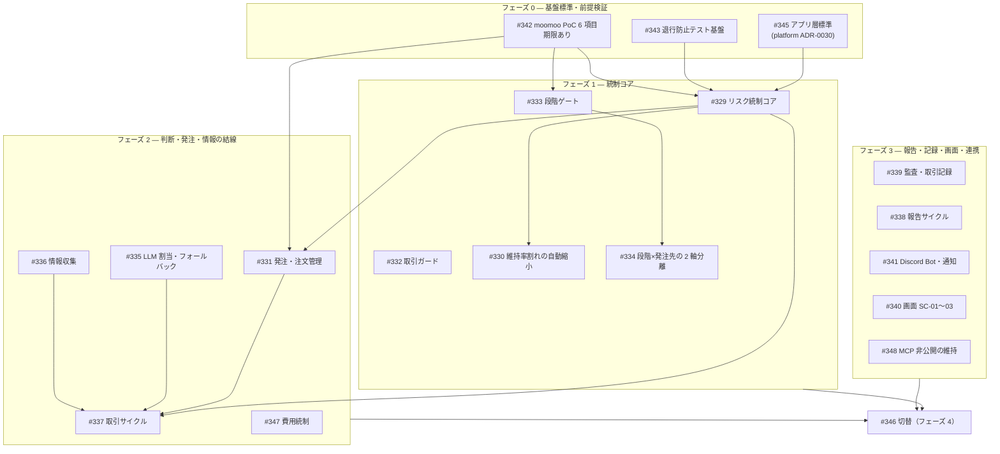

# 作業仕様書: 全面再実装（#344）の着手準備

## 起点となる計画書（トレーサビリティ）

- 機能要求（FR）: なし（本作業自体は再実装の**準備**であり機能を実装しない。NFR 相当）
- ユースケース（UC）: なし
- 画面（SC）: なし
- 関連 ADR: ADR-0016 / ADR-0017 / ADR-0018 / ADR-0019 / ADR-0020（本作業で submodule 経由で参照可能にした新規 ADR）
- 実装 ADR: [IADR-0126](../adr/IADR-0126_reimplementation-sequencing-and-pr-granularity.md)（再実装の実施順序・PR 粒度・受け入れゲート）
- 起点 issue: [#344](https://github.com/endazon/ai-stock-trading/issues/344)（親トラッキング）
- 計画側の起点: [project-planning PR #144](https://github.com/endazon/project-planning/pull/144)（2026-08-02 マージ）

## 目的・背景

計画リポジトリの大幅更新（project-planning#144）により、ADR-0016〜0020 の起案と FR-05 / FR-10 / FR-12 / FR-13 /
FR-19 / FR-20 ほかの改定が入った。利用者判断により**本リポジトリの実装をほぼ全面的に作り直す**
（既存実装は破棄可。ただし監査証跡・業務台帳は 7 年保持のため破棄不可。#346 で保全）。

本作業はその**着手準備**であり、以下の 3 点を確定させることを目的とする。実装コードは変更しない。

1. **計画書を参照可能な状態にする** — planning submodule を project-planning#144 マージ後の断面へ更新する
2. **再実装の実施順序・PR 粒度・受け入れゲートを確定する** — 20 件の子 issue をどの順で、どの単位の
   PR で、どの成果物とともに進めるかを機械的に判断できる形で残す（IADR-0126）
3. **実行環境の制約を洗い出し、検証経路を確定する** — 「どこでビルド・テストを実走するか」を
   曖昧にしたまま 20 件の PR を積むと、検証の抜けが後段で一括顕在化する

## 対象範囲

- 対象:
  - planning submodule の pin 更新（`aeb97c4` → `df8bce5`）
  - 再実装の実施計画（フェーズ・依存・ブランチ / PR 規約・必須成果物）の文書化
  - 実行環境の制約と検証経路の確認・記録
- 対象外:
  - 各子 issue の実装そのもの（#329〜#348。**1 issue = 1 PR** で別途実施する）
  - `CLAUDE.md` / `AGENTS.md` の技術スタック記述の更新（FluentAssertions → AwesomeAssertions 等。**#345 の範囲**）
  - `docs/tech/`（技術要件書）の新標準への更新（**#345 の範囲**）
  - 既存実装の削除・移行（**#346 の範囲**）

## 実施内容

### 1. planning submodule の更新（`aeb97c4` → `df8bce5`）

pin は project-planning#144 のマージ**前**（`aeb97c4`）を指していたため、本リポジトリからは新規 ADR-0016〜0020 も
改定後の FR も参照できない状態だった。`df8bce5`（project-planning#144 のマージコミット）へ更新した。

project-planning#144 が `projects/ai-stock-trading/` へ与えた差分は 35 ファイル・+2007 / −212 行で、主な内容は次のとおり。

| 区分 | 変更 |
| --- | --- |
| 新規 ADR | ADR-0016（空売りの段階解禁と専用統制）・ADR-0017（用途別 LLM のフォールバック方針）・ADR-0018（リスク既定値の確定単一値化・Stage 0 DD≤10%）・ADR-0019（moomoo PoC 6 項目）・ADR-0020（情報源の区分と欠測時の縮退） |
| 既存 ADR 改定 | ADR-0002 / 0003 / 0004 / 0007 / 0008 / 0014 / 0015 |
| 要求 | FR-05（注文状態に「拒否」追加）・FR-10（金額系上限の equity 割合化・空売り専用統制 8 項目・拒否理由 7 種・維持率割れの自動縮小）・FR-11（経費区分 7 種）・FR-12（内蔵 `paper` の位置づけと警告表示）・FR-13（発注先の画面変更）・FR-19（商品種別 3 値化）・FR-20（段階と発注先の 2 軸分離・Stage 1 集計からの `paper` 除外） |
| その他 | ユースケース・ワークフロー 3 種・画面（SC-01〜03）・モックアップ全 8 ファイル・技術検討 5 件・INDEX |

**副次効果（重要）**: `scripts/check-commit-messages.js` はコミット / PR 件名スコープの `ADR-xxxx` が
planning submodule に実在することを検査する。pin 更新前は `feat(ADR-0016)` 等が実在性検査を通らない
（submodule を取得する経路では失敗する）。子 issue の多くは起点 ID に ADR-0016〜0020 を含むため、
**本更新は 20 件の PR すべての前提**である。

### 2. 実施順序・依存関係

issue #344 のフェーズ定義を、依存関係のグラフとして確定する。**フェーズ内は並行可**。統制なしで
発注経路を動かさないため、統制コア（フェーズ 1）を判断・発注の結線（フェーズ 2）より先に完成させる。

### 3. 子 issue 一覧（起点 ID・優先度・推奨ブランチ名）

ブランチ名は `.claude/rules/traceability.md` の `<種別>/<起点ID>-<概要のケバブケース>` に従う。
起点 ID が複数の場合は**代表 1 件**をブランチ名に置き、コミット / PR 件名で併記する。

| フェーズ | issue | 種別 | 起点 ID（コミット / PR スコープ） | 優先度 | 推奨ブランチ名 |
| --- | --- | --- | --- | --- | --- |
| 0 | #345 | feat | `NFR,IADR-0001` | Must | `feat/NFR-backend-application-stack` |
| 0 | #343 | test | `NFR` | Must | `test/NFR-regression-test-foundation` |
| 0 | #342 | chore | `ADR-0019,ADR-0002` | Must | `chore/ADR-0019-moomoo-poc` |
| 1 | #329 | feat | `FR-10,ADR-0016,ADR-0018` | Must | `feat/FR-10-risk-control-core` |
| 1 | #332 | feat | `FR-19,ADR-0016` | Must | `feat/FR-19-trading-guards` |
| 1 | #330 | feat | `FR-10,UC-06` | Must | `feat/FR-10-maintenance-margin-auto-reduce` |
| 1 | #333 | feat | `FR-20,FR-15,ADR-0016,ADR-0018` | Must | `feat/FR-20-staged-gates` |
| 1 | #334 | feat | `FR-20,FR-12,FR-13` | Must | `feat/FR-20-stage-broker-provider-split` |
| 2 | #331 | feat | `FR-05,FR-10` | Must | `feat/FR-05-order-execution` |
| 2 | #335 | feat | `FR-04,ADR-0014,ADR-0015,ADR-0017` | Must | `feat/FR-04-llm-assignment-fallback` |
| 2 | #336 | feat | `FR-01,ADR-0020` | Must | `feat/FR-01-information-collection` |
| 2 | #337 | feat | `FR-02,FR-04` | Must | `feat/FR-02-trading-cycle` |
| 2 | #347 | feat | `NFR` | Must | `feat/NFR-cost-control` |
| 3 | #339 | feat | `FR-11,ADR-0016` | Must | `feat/FR-11-audit-and-trade-ledger` |
| 3 | #338 | feat | `FR-06,FR-07,FR-16` | Must | `feat/FR-06-reporting-cycle` |
| 3 | #341 | feat | `FR-09,FR-14` | Must | `feat/FR-09-discord-bot` |
| 3 | #340 | feat | `SC-01,SC-02,SC-03,FR-13` | Should | `feat/SC-01-screens` |
| 3 | #348 | chore | `ADR-0012` | Must | `chore/ADR-0012-mcp-exposure` |
| 4 | #346 | chore | `NFR,FR-11` | Must | `chore/NFR-cutover-plan` |

**稼働開始ゲート（フェーズ順とは別の条件）**: #339（監査）・#341（通知・kill switch）・#347（費用統制）は
フェーズ 2〜3 に配置されるが、**実取引（`SIMULATE` を含む）開始前に完成していること**を条件とする。
フェーズはコード依存の順序であり、稼働開始のゲートは「統制＋監査＋緊急停止＋費用統制が揃うこと」である。

### 4. 1 issue = 1 PR の運用規約

利用者指示により、**PR は issue ごとに 1 本**とする。詳細と根拠は [IADR-0126](../adr/IADR-0126_reimplementation-sequencing-and-pr-granularity.md) に記録した。要点は次のとおり。

- 1 issue につき 1 ブランチ・1 PR。複数 issue を 1 PR にまとめない。1 issue を複数 PR に割らない。
- PR 本文の冒頭に `Closes #<issue>` を記載し、マージで子 issue が閉じ、親 #344 のチェックリストが進む。
- PR 件名は `種別(起点ID): 要約`（`pr-title.yml` が機械検査する）。
- 依存する先行 issue が未マージの場合は着手しない（フェーズ順）。同フェーズ内は並行してよい。

### 5. 各 issue の必須成果物

着手前・完了前に揃える成果物を固定する。網羅裁定（[#211](https://github.com/endazon/ai-stock-trading/issues/211)・[作業仕様書 20260720](./20260720_required-spec-coverage-arbitration.md)）を再実装にもそのまま適用する。

| 成果物 | 全 issue 共通 | 備考 |
| --- | --- | --- |
| 作業仕様書 `docs/specs/<YYYYMMDD>_<issue>_<概要>.md` | **必須（着手前）** | 仕様書なし実装は禁止（CLAUDE.md） |
| xUnit テスト（起点 ID コメント付き） | **必須** | 受け入れ基準 → `[Fact]`/`[Theory]` の写像 |
| 実装 ADR `docs/adr/IADR-XXXX` | 重要な実装判断があれば必須 | 採番は先着尊重（衝突時は改番手順に従う） |
| 機能仕様書 `docs/functional/` | **FR-10 / 12 / 15 / 19 / 20 のみ必須** | 該当 issue: #329 / #330 / #332 / #333 / #334 |
| テスト仕様書 `docs/tests/` | 同上 | 1 文書が複数 FR をまとめてよい |
| 画面仕様書 `docs/screens/` | #340 で必須 | SC-01〜03 |
| 通信仕様書 `docs/api/` | API / IF を新設・改定する issue で必須 | #331 / #337 / #340 / #341 |
| データ仕様書 `docs/data/` | エンティティを新設・改定する issue で必須 | #339（経費区分 7 種）は必須 |
| 技術要件書 `docs/tech/` | #345 で更新 | リポ単位・原則 1 つ |
| 運用仕様書 `docs/operations/` | #342 / #346 で更新 | リポ単位・原則 1 つ |
| セキュリティ仕様書 `docs/security/` | #348 / #342 で更新 | リポ単位・原則 1 つ |

### 6. 検証経路（実行環境の制約）

**本セッションの実行環境には .NET SDK が導入されておらず、`dotnet` コマンドが存在しない。**
さらに、エージェントプロキシのネットワークポリシーが .NET SDK 配布ホスト
（`builds.dotnet.microsoft.com` / `dot.net`）への CONNECT を 403 で拒否するため、
**その場でのインストールもできない**（`.devcontainer/devcontainer.json` は `mcr.microsoft.com/devcontainers/dotnet:8.0`
を前提とするが、リモート実行環境はこのイメージではない）。

結果として `dotnet build` / `dotnet test` / `dotnet format` は**ローカルで実走できず**、`/verify` の
ビルド・テスト部分は CI（`.github/workflows/ci.yml` の `build-and-test` / `lint`）に依存する。

**この状態で 20 件の実装 PR を積むのは危険**（DoD の「ビルドが成功する」「テストが green」を PR 提出前に
自分で確認できない）ため、フェーズ 0 の #343（退行防止テスト基盤）に着手する前に、次のいずれかで
ローカル実走を回復させることを**前提条件**とする。

| 案 | 内容 | 判断 |
| --- | --- | --- |
| A | 実行環境のイメージを .NET 10 SDK 入りに変更する | **推奨**。恒久的・全セッションに効く |
| B | ネットワークポリシーで `builds.dotnet.microsoft.com` / `dot.net` / `api.nuget.org` を許可し、`scripts/setup.sh` に SDK 導入を追加する | 次善。セッション毎の導入時間が掛かる |
| C | CI のみで検証する | **非推奨**。PR 提出前検証が不可能になり DoD を満たせない |

本準備 PR 自体はコード変更を含まない（文書と submodule pin のみ）ため、CI の `doc-links` /
`commit-messages` / `pr-title` で十分に検証できる。

### 7. 期限のある作業

| issue | 期限 | 内容 | 影響 |
| --- | --- | --- | --- |
| #342 | **2026-08-15 目安** | Hetzner ToS の確認 | ホスティング前提（ADR-0006）の成否 |
| #342 | **2026-08-31** | moomoo PoC 6 項目（ADR-0019） | 空売り統制（#329 / #331 / #333）の最終化・Stage 1 起算の前提 |

#342 は他のどの issue よりも**リードタイムが読めない**（外部事業者の回答・実口座の挙動確認に依存する）。
フェーズ 0 の 3 件は並行可であるため、**#342 を最初に着手し、回答待ちの間に #345 / #343 を進める**。

## 受け入れ基準

- [x] planning submodule が project-planning#144 マージ後の断面（`df8bce5`）を指し、ADR-0016〜0020 がリポジトリから参照できる
- [x] 20 件の子 issue について、フェーズ・依存・優先度・起点 ID・推奨ブランチ名が一覧化されている
- [x] 「1 issue = 1 PR」の運用規約が IADR として記録され、PR 本文・件名の規約が明文化されている
- [x] 各 issue の必須成果物（作業仕様書・テスト・機能/テスト仕様書の必須範囲）が確定している
- [x] 実行環境の制約（.NET SDK 不在）と検証経路が記録され、フェーズ 0 着手前の前提条件が明示されている
- [x] 期限のある作業（#342）が特定され、着手順序に反映されている

## テスト方針

本作業は実装コードを含まないため、xUnit テストの追加はない。検証は CI の文書系ジョブで行う。

| 検査 | ジョブ | 本作業で検証される内容 |
| --- | --- | --- |
| `doc-links` | `ci.yml` | 本仕様書・IADR-0126 の相対リンク（planning submodule 内を含む）が解決する |
| `doc-links-planning` | `doc-links-planning.yml` | submodule pin 更新後の計画書リンクが解決する |
| `commit-messages` | `ci.yml` | 本 PR のコミット件名が `種別(起点ID): 要約` に適合する |
| `pr-title` | `pr-title.yml` | PR 件名が同規約に適合する |
| `security` | `security.yml` | 秘密情報の混入がない |

## 計画書との差異

- 差異: なし。本作業は計画書を**参照可能にする**ことと、実装側の進め方を確定することに限られ、
  計画書の内容に手を入れていない。

**なお ADR-0016〜0020 の状態は `Proposed` のままである**が、issue #344「進め方の原則 4」のとおり
決定内容は利用者裁定により確定しており（`/sync-impl` 未了による記録上の保留）、**実装は決定内容を正として
進めてよい**。この扱いは各子 issue の作業仕様書にも明記する。

## 未決事項

1. **ローカル検証環境（.NET SDK）の回復方法** — 上記 §6 の案 A / B / C のどれを採るか。**利用者判断が必要**。
   フェーズ 0 の #343 着手前に決める。未決のまま実装 PR を積むと DoD を満たせない。
2. **ADR-0016〜0020 の `Accepted` 昇格時期** — 計画側 `/sync-impl` の完了待ち。実装の進行は妨げないが、
   昇格時に決定内容の差分が出た場合は該当 issue の作業仕様書を追随させる。
3. **既存実装の破棄範囲の確定** — 「ほぼ全面的に作り直す」の具体的な削除対象は #346（切替計画）で確定する。
   フェーズ 1〜3 の各 issue は**既存コードを置き換える形**で進め、削除は #346 に集約する
   （途中で削除すると、切替前に稼働中の統制が欠ける期間が生じる）。

## 変更履歴

| 日付 | 内容 |
| --- | --- |
| 2026-08-02 | 初版作成（#344 の着手準備） |
