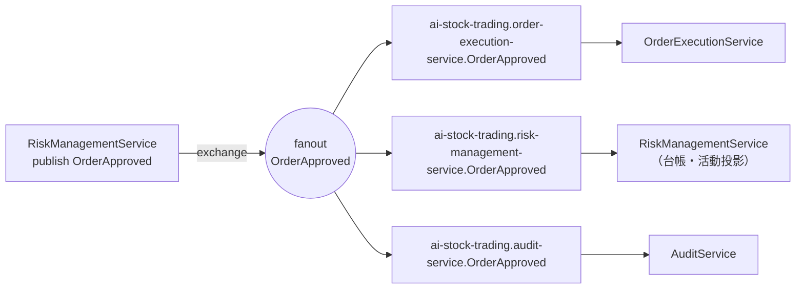

# 仕様書: MassTransit を Wolverine へ移行しローカルディスパッチを統一する（#354・第 1 段階）

> 本仕様書は実装着手前に作成した。#345 分割 4/4（#354）のうち **第 1 段階のみ**を対象とする。
> 第 2・第 3 段階の範囲も本書に定義するが、実施は別セッション（別 PR）とする。

## 起点となる計画書（トレーサビリティ）

- 機能要求（FR）: FR-03（市場監視）／FR-04（費用統制）／FR-10（リスク統制）／FR-17（全体前提条件）
- ユースケース（UC）: UC-01・UC-02（取引判断 → 発注）／UC-06（前提条件の変更）
- 非機能（NFR）: 保守性・ライセンス継続性（MassTransit v9 商用化・v8 の OSS サポートは 2026 年末まで）
- 関連 ADR:
  - 計画 [ADR-0013](../../planning/projects/ai-stock-trading/07_adr/ADR-0013_messaging-follow-wolverine-kafka.md)（Accepted・Wolverine 移行に追随する）
  - platform [ADR-0027](../../planning/projects/microservices-platform/07_adr/ADR-0027_messaging-wolverine.md)（Wolverine 移行。旧 ADR-0003 は Superseded）
  - platform [ADR-0028](../../planning/projects/microservices-platform/07_adr/ADR-0028_broker-rabbitmq-kafka.md)（RabbitMQ 継続・Kafka は用途が生じるまで導入しない）
  - platform [ADR-0030](../../planning/projects/microservices-platform/07_adr/ADR-0030_backend-application-libraries.md)（バックエンド標準ライブラリ棚卸し）
- 関連 IADR: [[IADR-0106]]（キュー名一意性・本移行で前提が失われる）／[[IADR-0129]]（本移行の設計判断）／[[IADR-0001]]／[[IADR-0128]]
- Issue: #354（#345 分割 4/4）。先行分割: #351（AwesomeAssertions）・#352（xUnit v3）・#353（標準プロジェクト構成）

## 目的・背景

MassTransit v9 は商用ライセンスへ移行し、OSS の v8 はセキュリティ修正が 2026 年末で終了する。本番稼働目標（2027 年前半）と無サポート期間が重なるため、計画 ADR-0013 は本ユニットのメッセージングを **Wolverine（MIT）** へ移行することを確定している。本 issue はその実装である。

**本 issue は #345 の 4 分割中で最高リスクである。**理由は、他の 3 件（アサーション・テストランナー・プロジェクト配置）が「ビルドが通れば意味も保たれる」性質だったのに対し、本件は **実行時の結線（ブローカのトポロジ＝どのキューがどの exchange に bind され、どのプロセスが受け取るか）が変わる**ためである。ビルドもテストも緑のまま、本番でだけメッセージが消える形の事故が起こり得る。

その事故は**実際に一度起きている（#258・[[IADR-0106]]）**。MassTransit の `DefaultEndpointNameFormatter` はキュー名を consumer クラス名だけから導くため、別サービスの同名 consumer（`TradeDecisionMadeConsumer` × 2）が同一キューを共有し、pub/sub のつもりが competing consumer（取り合い）に退行して、取引判断が承認・拒否・エラーのいずれにも現れず**無言で消えた**。現在は `scripts/check-consumer-endpoint-names.js`（実測 47 consumer を走査）が CI で再発を止めている。

**本移行はこの検査器の前提を丸ごと壊す。** Wolverine ではキュー名の導出にクラス名が一切関与しないためである（後述 §3）。よって本 issue の中心的な成果物は「Wolverine のコードへの置換」ではなく、**「pub/sub の意味（1 イベントが複数サービスへ届くこと）を保存したまま移行し、その保存を機械で検査し続けられる状態にすること」**である。

## 対象範囲

### 第 1 段階（本 PR・本仕様書の実施対象）

- 対象:
  1. 本作業仕様書と実装 ADR（[[IADR-0129]]）の作成
  2. Wolverine パッケージの選定・CPM への登録（MassTransit と**併存**させる）
  3. 共通配線ヘルパ（`WolverineExtensions`）の新設 — キュー名規則・fan-out 保存・再試行・DLQ をここに一元化する
  4. パイロット 2 サービスの移行: **ConfigurationService**（＋ `ConfigurationService.Client`）と **CostControlService**
  5. `scripts/check-consumer-endpoint-names.js` の**新旧併存対応**（移行済みサービスは新規則、未移行サービスは旧規則で検査する）
- 対象外（第 2・第 3 段階）:
  - 残り 9 サービス（Audit / Backtest / InformationCollection / MarketMonitor / Notification / OrderExecution / Report / RiskManagement / TradeDecision）と BFF の移行
  - `MassTransitExtensions`（`UseAiStockTradingRetry`）の削除、`Directory.Packages.props` からの MassTransit 削除、`check-banned-libraries.js` の PENDING → BANNED 昇格
  - Integration テスト（`Category=Integration`・Testcontainers）の追随
  - Kafka の導入（ADR-0013 が「用途が生じるまで導入しない」と明記。本 issue では触れない）
  - Mapperly / FluentValidation / Polly 等の他ライブラリ標準（#353 の対象外事項を踏襲）
  - `<Svc>WorkerWebApplicationFactory` の改名（#353 §12 未決事項 8 の据え置きを踏襲。移行に伴い**中身**は書き換えるが、名前は据え置く）

## 1. Wolverine パッケージの選定

nuget.org の実確認（2026-08-03・`api.nuget.org/v3-flatcontainer` の `index.json` を直接取得）による最新安定版:

| パッケージ | 版 | ライセンス | 用途 |
| --- | --- | --- | --- |
| `WolverineFx` | 6.24.5 | MIT | コア（メッセージング＋ローカルディスパッチ） |
| `WolverineFx.RabbitMQ` | 6.24.5 | MIT | RabbitMQ トランスポート |
| `WolverineFx.RuntimeCompilation` | 6.24.5 | MIT | ハンドラのランタイムコード生成（後述） |

- `net10.0` の依存グループを nuspec で確認済み（`Microsoft.Extensions.* 10.0.0` に対応。本リポの net10.0 と整合する）。
- `WolverineFx.RabbitMQ` は `WolverineFx.Newtonsoft` と `RabbitMQ.Client 7.1.2` を推移的に持ち込む。CPM の `CentralPackageTransitivePinningEnabled=true` は「中央で宣言した版に固定する」機能であり、未宣言の推移依存を禁止しない。よって追加宣言は不要である（実測で restore 成功）。
- **`WolverineFx.RuntimeCompilation` が必須である**ことは実測で判明した。Wolverine 6 系はコア本体からランタイムコンパイラ（Roslyn）を切り離しており、既定の `TypeLoadMode.Dynamic` のまま起動すると次の例外で**起動に失敗する**:
  > `Wolverine is running in TypeLoadMode.Dynamic, ... but no IAssemblyGenerator (Roslyn) is registered. Core WolverineFx no longer ships the runtime compiler.`

  代替は `dotnet run -- codegen write` による事前生成＋`TypeLoadMode.Static` だが、11 サービス分のコード生成成果物を管理する運用が増える。第 1 段階では `RuntimeCompilation` を参照する（判断根拠と再評価条件は [[IADR-0129]] 決定 6）。

## 2. 新旧対応表（MassTransit → Wolverine）

### 2.1 概念・API の対応

| MassTransit（現行） | Wolverine（移行後） | 備考・注意 |
| --- | --- | --- |
| `IConsumer<T>` を実装するクラス | 規約に合致する**ハンドラクラス＋メソッド** | インタフェース実装は不要。型名が `*Handler` / `*Consumer` で終わり、メソッド名が `Handle` / `Handles` / `Consume` / `Consumes` であれば発見される |
| `Task Consume(ConsumeContext<T> context)` | `Task Handle(T message, ...)` | `ConsumeContext<T>` は消える。メッセージ本体は第 1 引数、追加の依存はメソッド引数で受け取る（メソッドインジェクション） |
| `context.Message` | メソッド引数の `message` | |
| `context.CancellationToken` | メソッド引数 `CancellationToken` | Wolverine が注入する |
| `context.MessageId`（`Guid?`） | メソッド引数 `Envelope envelope` の `envelope.Id`（`Guid`・非 null） | 冪等性キーの型が変わる。**null 分岐が不要になる**（§7.2） |
| `context.Publish(msg)` | 引数の `IMessageBus bus` で `bus.PublishAsync(msg)`、または**カスケードメッセージ**（戻り値で返す） | 本移行では `IMessageBus` を明示注入する形に揃える（暗黙のカスケードは差分が読みにくいため採らない） |
| `x.AddConsumer<TConsumer>()` | 明示登録は**しない**（アセンブリ走査で発見） | 代わりに `opts.Discovery.IncludeAssembly(...)` でハンドラのあるアセンブリを指定する |
| `cfg.ConfigureEndpoints(ctx)` | `.UseConventionalRouting(...)` | キュー・exchange・binding を規約で生成する点は同じだが**規約の中身が違う**（§3） |
| `cfg.ReceiveEndpoint("name", e => ...)` | `opts.ListenToRabbitQueue("name")` | 明示宣言。本移行では使わない（規約に一本化する） |
| `IPublishEndpoint` / `IBus`（DI） | `IMessageBus`（DI） | `PublishAsync` / `SendAsync` / `InvokeAsync` |
| `IRequestClient<T>` / Request-Response | `bus.InvokeAsync<TResponse>(request)` | **本ユニットでは未使用**（実測 0 件）。移行対象なし |
| `cfg.UseMessageRetry(r => r.Intervals(2s,10s,30s))` | `opts.OnAnyException().RetryWithCooldown(2s,10s,30s).Then.MoveToErrorQueue()` | 間隔は同値を保つ |
| 再試行を使い切ると `<queue>_error` へ自動退避 | `.Then.MoveToErrorQueue()` ＋ 既定の共有 DLQ | **既定では全キュー共有の `wolverine-dead-letter-queue` に集約される**。本移行では `<queue>_error` を明示指定して現行の運用感覚を保つ（§3.4） |
| Outbox（`AddEntityFrameworkOutbox`。**本ユニットは未使用**） | Wolverine の durable inbox/outbox（`PersistMessagesWithPostgresql` 等） | 現行が未使用のため、本移行でも**導入しない**（振る舞いを変えないため）。導入は別 issue |
| `AddMassTransitTestHarness()` / `ITestHarness` | `Wolverine.Tracking`（`host.TrackActivity()` / `InvokeMessageAndWaitAsync`）＋ `StubAllExternalTransports()` / `services.DisableAllExternalWolverineTransports()` | §7 |
| `harness.Consumed.Any<T>()` | `session.Executed`（`ITrackedSession`） | |
| `harness.Published.Any<T>()` | `session.Sent`（宛先 URI も併せて検証できる） | MassTransit ハーネスより**強い**表明が書ける |
| `NewId.NextGuid()` | 同じ（`NewId` は Wolverine も推移依存として持つ） | テストの ID 生成はそのまま |
| ローカルディスパッチ（本ユニットは未使用。MediatR も不採用） | Wolverine のローカルキュー（`bus.InvokeAsync` / `local://` キュー） | platform ADR-0027 の「ローカルディスパッチも Wolverine に統一」に対応。**現状は該当コードが無いため新規導入しない** |

### 2.2 キュー名の導出規則の新旧対応表（本 issue の必須要求）

**すべて実測で確認した**（MassTransit 8.4.1 / Wolverine 6.24.5 を実際に構成して名前を印字した。思い込みではない）。

| 観点 | MassTransit 8.4.1（現行） | Wolverine 6.24.5（既定） | Wolverine（本移行で採る規則） |
| --- | --- | --- | --- |
| **キュー名の入力** | **consumer クラス名のみ**（namespace 非包含） | **メッセージ型のみ**（`NamingSource.FromMessageType`。既定の識別子は **namespace 込みの完全名**。ハンドラ型名は**一切関与しない**） | **サービス名 ＋ メッセージ型の短い名前** |
| 導出規則 | 末尾 `Consumer` を落としたクラス名 | `messageType.ToMessageTypeName()`（実測: `typeof(int)` → `System.Int32`） | `$"{ServiceName}.{messageType.Name}"` |
| 実測例（RiskManagement の取引判断購読） | `TradeDecisionMadeConsumer` → キュー **`TradeDecisionMade`** | ハンドラ名に関わらずキュー **`AiStockTrading.Shared.Contracts.Events.TradeDecisionMade`** | キュー **`ai-stock-trading.risk-management-service.TradeDecisionMade`** |
| 実測例（MarketMonitor の基準値更新） | `TradeDecisionMadeBaselineConsumer` → キュー **`TradeDecisionMadeBaseline`**（[[IADR-0106]] の改名による分離） | **`AiStockTrading.Shared.Contracts.Events.TradeDecisionMade`**（＝ RiskManagement と**同一**。改名による分離が無効化される） | **`ai-stock-trading.market-monitor-service.TradeDecisionMade`** |
| 交換機（exchange）名 | メッセージ型の URN（`:` 区切り）<br>`AiStockTrading.Shared.Contracts.Events:TradeDecisionMade` | メッセージ型の完全名（`.` 区切り）<br>`AiStockTrading.Shared.Contracts.Events.TradeDecisionMade`（**fanout**） | 既定のまま（fanout・全サービス共有） |
| binding key | （fanout のため実質不問） | メッセージ型の完全名 | 既定のまま |
| 同一サービス内で同じイベントを 2 つの関心事が購読 | **キューが 2 本**（クラス名が違うため）。再試行・DLQ も独立 | **キュー 1 本**を共有し、両ハンドラが同一メッセージに対して実行される | 同左（Wolverine の仕様。§6.2 で影響を評価） |
| 別サービスが同じイベントを購読 | クラス名が偶然一致すると**同一キュー＝競合**（#258） | **必ず同一キュー＝必ず競合**（構造的に発生する） | サービス名が接頭辞になるため**構造的に衝突不能** |
| 一意性の担保手段 | 命名規律＋静的検査（`check-consumer-endpoint-names.js`） | （既定では担保されない） | `ServiceName` の一意性のみ（静的検査で担保）。**短い型名を使うため、イベント型の短い名前が一意であることを前提とする**（実測: 契約は `AiStockTrading.Shared.Contracts/Events/` の 1 名前空間・1 型 1 ファイルで 21 件。構成上、重複し得ない） |

> **要点**: MassTransit の既定は「クラス名が同じだと**たまたま**衝突する」だったのに対し、**Wolverine の既定は「同じイベントを購読する別サービスは必ず衝突する」**。すなわち [[IADR-0106]] が施した改名（`TradeDecisionMadeBaselineConsumer`）は Wolverine では**まったく効かない**。既定のまま移行すると #258 が全 fan-out 経路（19 経路・§4）で同時に再発する。これが本移行の最大の事故シナリオである。

### 2.3 対応表を裏づけた実測手順（再現方法）

ローカルに RabbitMQ が無くても検証できる。`WolverineOptions` を構成したホストを起動し、接続失敗を捕捉してから `RabbitMqTransport` の `Queues` / `Exchanges` / `Bindings()` を印字する。実測ログの要点:

```
# 既定（UseConventionalRouting() のみ）※ この実測は検証用の型を root 名前空間に置いたため短名で出ている
queue=TradeDecisionMade  durable=True autoDelete=False listener=True
exchange='TradeDecisionMade' type=Fanout durable=True
binding BindingKey: TradeDecisionMade, Queue: TradeDecisionMade, ExchangeName: TradeDecisionMade

# 本移行の規則（QueueNameForListener でサービス名を前置）
queue=market-monitor.TradeDecisionMade  listener=True dlq=market-monitor.TradeDecisionMade_error
queue=market-monitor.OrderApproved      listener=True dlq=market-monitor.OrderApproved_error
exchange='TradeDecisionMade' type=Fanout      # ← exchange は共有されたまま
binding BindingKey: TradeDecisionMade, Queue: market-monitor.TradeDecisionMade, ExchangeName: TradeDecisionMade
```

> **識別子は既定では完全名である。**上の実測は検証用イベント型を root 名前空間に置いたため短名で出ているが、
> Wolverine の既定識別子は `messageType.ToMessageTypeName()`＝**namespace 込みの完全名**である
> （同じ実測で `typeof(int)` は `System.Int32` を返した）。実サービスで確認した宛先は
> `rabbitmq://exchange/AiStockTrading.Shared.Contracts.Events.AssumptionsChanged` であり、
> `ConfigurationService.Api.Tests` がこの文字列を固定している（思い込みではなく実行結果で固定する）。
> 本ユニットの契約はすべて `AiStockTrading.Shared.Contracts.Events` の 1 名前空間にあるため、
> **完全名でも短名でも「サービスを跨いで同一になる」という結論は変わらない**（＝既定のままでは必ず衝突する）。

- 既定の DLQ は全体で 1 本（`wolverine-dead-letter-queue`）。`ConfigureListeners` で `<queue>_error` を指定すると per-queue の DLQ になる（実測で確認）。
- MassTransit の exchange 名は `MessageUrn.ForType<T>()`（`urn:message:` を除いた部分）である。実測: `urn:message:AiStockTrading.Shared.Contracts.Events:TradeDecisionMade` → exchange `AiStockTrading.Shared.Contracts.Events:TradeDecisionMade`。

## 3. pub/sub の意味保存（fan-out 設計）

### 3.1 保存すべき性質

「1 つのイベントが、購読するすべてのサービスへ**それぞれ 1 通ずつ**届く」。退行の形は 2 つある。

- **退行 A（competing consumer）**: 複数サービスが 1 本のキューを共有し、ブローカが round-robin で配る。片方しか受け取らない（#258 の形）。
- **退行 B（ローカル閉じ込め）**: 発行元プロセス内にハンドラがあると、Wolverine の**既定**は発行を**プロセス内に閉じる**。ブローカへ出ないため、他サービスは**一通も**受け取らない。

### 3.2 退行 B は本ユニットで確実に発生する（実測）

Wolverine の既定（conventional local routing）では、発行しようとしたメッセージ型に**自プロセス内のハンドラが存在すると、ルートはローカルキューのみ**になる。実測:

```
routes for TradeDecisionMade: MessageRoute(local://tradedecisionmade/)     # 既定
（opts.Policies.DisableConventionalLocalRouting() を付けると RabbitMQ exchange の sender が選ばれる）
```

本ユニットには該当箇所が現に存在する。**RiskManagementService は `OrderApproved` を発行し、同時に `OrderApproved` を購読している**（`OrderApprovedLedgerConsumer` / `OrderApprovedActivityConsumer`）。既定のまま移行すると、承認された発注が RiskManagement のプロセス内で台帳計上されるだけで**OrderExecutionService へ一切届かず、発注が一件も執行されない**。ビルドもユニットテストも緑のまま起こる。

→ **`opts.Policies.DisableConventionalLocalRouting()` を全サービスで必須とする**（共通ヘルパに封じ込め、検査器で使用を強制する）。

### 3.3 採る構成

- **exchange**: メッセージ型名の **fanout** exchange 1 本（Wolverine 既定のまま）。発行側は型名 exchange へ publish する。
- **queue**: 購読側は `<ServiceName>.<メッセージ型名>` のキューを 1 本作り、上記 fanout exchange に bind する。
- 結果、1 イベント → 1 fanout exchange → 購読サービス数だけのキュー → 各サービスが**全件**受け取る。サービス名が接頭辞にあるため、**別サービスのキューと衝突する余地が構造的に無い**。



### 3.4 再試行・DLQ

- 再試行間隔は現行と同値（2s / 10s / 30s の 3 回）。`opts.OnAnyException().RetryWithCooldown(...).Then.MoveToErrorQueue()`。
- DLQ は **`<queue>_error`**（例 `ai-stock-trading.cost-control-service.LlmCostIncurred_error`）を明示指定し、MassTransit の `<queue>_error` と同じ「キュー単位で失敗が分離される」運用感覚を保つ。既定の共有 DLQ（`wolverine-dead-letter-queue`）には倒さない。
- キューは `durable=true` / `autoDelete=false`（Wolverine 既定。MassTransit の現行と同じ）。

### 3.5 fan-out 経路の実測列挙（移行後も維持すべき経路）

`scripts/check-consumer-endpoint-names.js` の走査結果（`IConsumer<T>` 実装 47 件）から機械的に集計した、イベント型 → 購読サービスの対応（2026-08-03 時点）。

| イベント型 | 購読サービス（＝移行後に必要なキュー本数） | 発行元 |
| --- | --- | --- |
| `AssumptionsChanged` | Audit / Notification / **CostControl**（※） | Configuration |
| `BacktestEvaluated` | Audit / RiskManagement | Backtest |
| `BrokerPositionsObserved` | Audit / RiskManagement | OrderExecution |
| `CostThresholdReached` | Audit / Notification | CostControl |
| `DailyPolicyUnconfirmed` | Audit / Notification | TradeDecision |
| `InformationCollected` | Audit / TradeDecision | InformationCollection |
| `LlmCostIncurred` | Audit / CostControl | TradeDecision |
| `OrderApproved` | Audit / OrderExecution / **RiskManagement（自己購読）** | RiskManagement |
| `OrderCancelled` | Audit / RiskManagement | OrderExecution |
| `OrderExecuted` | Audit / Notification / RiskManagement | OrderExecution |
| `OrderModified` | Audit / RiskManagement | OrderExecution |
| `OrderRejected` | Audit / Notification | RiskManagement |
| `PositionCloseRequested` | Audit のみ | RiskManagement |
| `PositionReconciliationDrift` | Audit / Notification | RiskManagement |
| `PriceMovementDetected` | Audit / TradeDecision | MarketMonitor |
| `ReportConfirmed` | Audit / Notification | Report |
| `ReportDraftPresented` | Audit / Notification | Report |
| `StageTransitioned` | Audit のみ | RiskManagement |
| `StopLossTriggered` | Audit / Notification / **RiskManagement（自己購読）** | MarketMonitor |
| `TradeDecisionMade` | Audit / MarketMonitor / RiskManagement | TradeDecision |
| `WithdrawalTriggered` | Audit / Notification | RiskManagement |

- **21 イベント型のうち 19 型が 2 サービス以上へ fan-out する。** 退行 A が起きれば、そのすべてが影響を受ける。
- ※ `AssumptionsChanged` の 3 件目は `ConfigurationService.Client` に置かれた共有 consumer（`AssumptionsChangedConsumer`）であり、**実際に登録しているのは CostControlService だけ**である（`x.AddConsumer<AssumptionsChangedConsumer>()` の実測は CostControl の 1 箇所）。現行の静的検査器はクラスの**置き場所**でサービスを判定するため、これを `ConfigurationService` に帰属させている。**既知の限界**であり §5.3 で扱う。
- `OrderApproved` / `StopLossTriggered` は**発行元サービス自身が購読している**（退行 B の直撃対象）。

## 4. 検査器の再構築方針（`scripts/check-consumer-endpoint-names.js`）

### 4.1 何が変わるか

| | 旧（MassTransit） | 新（Wolverine） |
| --- | --- | --- |
| 検査する不変条件 | consumer クラス名から導いたキュー名がサービス跨ぎで一意 | ① `ServiceName` 定数がサービス跨ぎで一意 ② 各サービスが共通ヘルパ経由で Wolverine を配線している（キュー名規則と `DisableConventionalLocalRouting` を迂回していない） |
| 静的に判定できる理由 | キュー名がクラス名だけで決まる | キュー名が「`ServiceName` 定数 ＋ メッセージ型名」だけで決まる |

### 4.2 新規則で静的に検査できること・できないこと

- **できる**:
  - `ServiceName` 定数の重複（＝キュー名前空間の衝突）。これが新世界における #258 相当の唯一の衝突経路である。
  - 共通ヘルパ（`UseAiStockTradingRabbitMq`）を通さず、素の `UseConventionalRouting(` / `ListenToRabbitQueue(` / `PrefixIdentifiers(` をサービス側で直接呼んでいること（＝規則の迂回）。
  - 移行済み／未移行の判定（`AddMassTransit(` があれば旧、`UseAiStockTradingRabbitMq(` があれば新）。両方あれば「移行途中の混在」として**失敗**させる。
- **できない（限界。テストで補う）**:
  - ハンドラが実際に発見されるか（アセンブリ走査の結果はランタイム依存）。→ 各サービスの xUnit で「起動したホストが期待したメッセージ型を扱う」ことを検証する。
  - 実ブローカ上の binding が期待どおりか。→ `Category=Integration`（CI の `integration.yml`）に委ねる。
  - `DisableConventionalLocalRouting` の**効果**（ルートが local に閉じないこと）。→ 共通ヘルパの xUnit で、ヘルパで構成したホストの `RoutingFor(型)` が local を含まないことを検証する。

### 4.3 新旧併存（移行期間中の暫定挙動）

- **除外リストは作らない。** サービス単位で `Program.cs` を読み、旧（MassTransit）／新（Wolverine）を自動判定し、それぞれの規則で検査する。移行が進むと旧側の対象が自然に減り、第 2 段階完了で旧規則の対象が 0 件になる。
- 旧規則の対象が 0 件になったこと自体は失敗にしない（第 3 段階で旧規則の検査コードごと削除する）。ただし**検査器が空振りしていないこと**（走査したサービス数の下限）を検査する（[[IADR-0127]]・[[IADR-0128]] 決定 6 と同じ「静かに失効する経路を塞ぐ」思想）。
- **暫定であることを検査器の冒頭コメントと出力に明記する**（`owningIssue: 354`）。

### 4.4 「正しく壊れる」ことの確認

`--self-test` に次のケースを追加する（検査器が実際に**落ちる**ことを自己試験する）。

1. 2 サービスが同じ `ServiceName` 定数を持つ → 検出する。
2. サービスが `UseAiStockTradingRabbitMq` を通さず素の `UseConventionalRouting(` を呼ぶ → 検出する。
3. 1 サービスが MassTransit と Wolverine を両方配線している → 検出する。
4. 旧規則（クラス名衝突）の既存 8 ケースは維持する（#258 の回帰）。

## 5. 段階分割

| 段階 | 内容 | 完了条件 |
| --- | --- | --- |
| **第 1 段階（本 PR）** | 仕様書・IADR・共通ヘルパ・パイロット 2 サービス・検査器の新旧併存対応 | ビルド 0 警告 / テスト合格数が移行前と同数 / 検査器（新旧）green |
| 第 2 段階 | 残り 9 サービス＋ BFF の移行。`MassTransitExtensions` の削除、CPM から MassTransit 削除 | 全サービスが Wolverine。`check-banned-libraries.js` の PENDING → BANNED 昇格 |
| 第 3 段階 | 検査器から旧規則を撤去。Integration テスト（Testcontainers・実 RabbitMQ）の追随と fan-out の実配線検証。IADR-0106 の Superseded 化、関連文書の表記更新 | `integration.yml` が green。文書の MassTransit 表記が残っていない |

- **`check-banned-libraries.js` の PENDING は第 2/3 段階完了まで PENDING のままとする。**MassTransit は第 1 段階終了時点でまだ 9 サービスが使用しており、BANNED に昇格させると CI が常時赤になる（同ファイルが明記する「移行前に登録して検査を無効化する運用は採らない」の裏返しとして、**移行未完了のものを BANNED にもしない**）。昇格は第 2 段階（全サービス移行完了）で行う。

## 6. パイロットの選定と設計

### 6.1 選定理由（代表性）

| サービス | consumer 数 | publish 箇所 | テストハーネス | 選定理由 |
| --- | --- | --- | --- | --- |
| **ConfigurationService** | 0（Api 本体）＋ `Client` に共有 consumer 1 | 1（`AssumptionsChanged`） | Api.Tests で `AddMassTransitTestHarness` ＋ `harness.Published`、Client.Tests で `AddMassTransitTestHarness(x => x.AddConsumer<...>)` ＋ `harness.Consumed` | **発行専用サービス**と**サービスを跨いで共有されるハンドラ**という 2 つの型を同時に含む。後者（`ConfigurationService.Client` の consumer が CostControl で登録される）は、キュー名の帰属がクラスの置き場所と一致しない唯一の箇所であり、検査器の限界（§3.5 ※）を実地で確かめられる |
| **CostControlService** | 2（自前 1 ＋ 共有 1） | 1（`CostThresholdReached`。**consumer の中からも発行する**） | Api.Tests（`harness.Published`）＋ Infrastructure.Tests（`harness.Consumed` / `harness.Published` / `harness.InactivityTask` / `NewId.NextGuid()` / `ctx.MessageId` 指定） | **購読 → 処理 → 再発行**という本ユニットの典型フローを最小規模で含む。`context.MessageId` による冪等化（at-least-once 対策）があり、`Envelope.Id` への移行を実地で確認できる。MassTransit ハーネスの利用形態がほぼ全種類（`Consumed` / `Published` / `InactivityTask` / MessageId 指定）出そろう |

2 サービスは依存関係で結ばれている（CostControl が `ConfigurationService.Client` の consumer を登録する）ため、**片方だけを移行することはできない**。この 2 件で 1 単位である。

### 6.2 同一サービス内で同じイベントを複数ハンドラが処理する件（第 2 段階への申し送り）

MassTransit ではキューが分かれるため、`OrderApprovedLedgerConsumer` の失敗は `OrderApprovedActivityConsumer` の再試行を引き起こさない。Wolverine では同一キュー・同一ハンドラチェーンになるため、**片方の失敗が両方の再実行を招く**。該当は RiskManagementService の `OrderApproved` / `OrderExecuted` の 2 経路（各 2 ハンドラ）。

- パイロット 2 サービスには該当が無いため、第 1 段階では扱わない。
- 第 2 段階で RiskManagementService を移行する際に、(a) 統合を受け入れる（各ハンドラを冪等にする）か (b) Wolverine の sticky handler で別エンドポイントへ分離するかを決め、IADR に記録する。**現行の `OrderActivityProjectionConsumers` は upsert 相当で冪等**に見えるが、実装を読んだうえで判断すること。

### 6.3 具体的な変更（第 1 段階）

- 共通: `backend/TestSupport/AiStockTrading.TestSupport.PlatformShim/Foundation/Extensions/WolverineExtensions.cs` を新設。
  - `AiStockTradingQueueNaming.QueueNameFor(serviceName, messageType)` — 純関数。キュー名規則の**単一の出所**。
  - `WolverineOptions.UseAiStockTradingRabbitMq(serviceName, connectionString)` — `ServiceName` 設定・ローカルルーティング無効化・再試行・conventional routing（キュー名・DLQ）を一括で適用する。**サービス側にトポロジの選択肢を残さない**のが要点である。
  - `MassTransitExtensions`（`UseAiStockTradingRetry`）は第 2 段階まで残す。
- ConfigurationService: `Program.cs`（`AddMassTransit` → `UseWolverine`）、`AssumptionsEndpoints.cs`（`IPublishEndpoint` → `IMessageBus`）、`ConfigurationService.Client` の consumer をハンドラへ、テスト 2 本を Wolverine の追跡ハーネスへ。
- CostControlService: `Program.cs`、`CostControlEndpoints.cs`、`LlmCostIncurredConsumer` → `LlmCostIncurredHandler`、テスト 2 本。
- 検査器: §4 のとおり。

## 7. テストハーネスの移行方針

### 7.1 「表明の意味を変えない書き換え」の基準

ハーネスが変わる以上テストコードの書き換えは不可避である。**合格数の維持が受け入れ条件**であるため、書き換えが「テストを通すための緩和」に化けないよう、次の基準を満たすものだけを許す。**基準を満たせない書き換えが必要になった場合は、書き換えずに人間へ判断を仰ぐ。**

1. **1 テスト → 1 テスト**。統合も分割もしない（合格数が変わる書き換えを禁止する）。
2. **テスト名を変えない**（日本語のテスト名がそのまま仕様の言明である。名前を変えるのは表明を変えるのと同じ）。
3. **表明の対象を変えない**。「発行された」を「発行しようとした」に落とさない。「消費された」を「ハンドラを直接呼んだ」に落とさない（＝メッセージングを経由しない直接呼び出しへの置換を禁止する）。
4. **期待値（数値・状態・件数）を 1 つも変えない**。
5. 上記を満たしたうえで、**表明が強くなる方向の変更は可**（例: 送信先 URI まで検証する）。
6. 書き換えたテストは**全件を PR 本文と本仕様書 §10 に列挙**し、旧表明 → 新表明の対応を書く。

### 7.2 具体的な写像

| 旧（MassTransit） | 新（Wolverine） | 意味の保存 |
| --- | --- | --- |
| `AddMassTransitTestHarness(x => x.AddConsumer<C>())` ＋ `harness.Start()` | `UseWolverine(opts => { opts.Discovery.IncludeAssembly(...); opts.StubAllExternalTransports(); })` でホストを起動 | どちらも「実ブローカ無しでハンドラを本物の経路で動かす」 |
| `harness.Bus.Publish(msg)` ＋ `harness.Consumed.Any<T>()` | `host.TrackActivity().InvokeMessageAndWaitAsync(msg)` ＋ `session.Executed` | 保存（メッセージを流してハンドラの実行を確認する） |
| `harness.Published.Any<T>()` | `session.Sent` に該当型が現れること（併せて宛先 `rabbitmq://exchange/<型名>` も検証可） | 強化 |
| `harness.InactivityTask`（バスがアイドルになるまで待つ） | `TrackActivity()` の完了（送受信が収束するまで待つ） | 保存 |
| `ctx.MessageId = messageId` で同一 ID を 2 回発行 | `new DeliveryOptions()` は ID を指定できないため、**`Envelope` を組み立てて同一 `Id` で 2 回流す**、または冪等ストアを直接検証する形へ | §10 で個別に判定する。**基準 3 を満たせない場合は書き換えずに相談する** |
| `factory.Services.GetRequiredService<ITestHarness>()`（WebApplicationFactory） | `factory.Services.TrackActivity().ExecuteAndWaitAsync(() => client.PutAsJsonAsync(...))`（`TrackActivity` は `IServiceProvider` 拡張でも提供される） | 保存 |
| `services.RemoveAll<IBusControl>(); services.AddMassTransitTestHarness();` | `services.DisableAllExternalWolverineTransports();` | 保存（実ブローカへ接続しない） |

### 7.3 ローカル環境の制約

- **この環境には Docker が無く、`Category=Integration`（Testcontainers で実 PostgreSQL / RabbitMQ を起動する 7 件）はローカルで実行できない。**
- ローカルで検証する範囲: `dotnet build` / `dotnet test --filter "Category!=Integration"` / `dotnet format --verify-no-changes` / Node 製検査器（`scripts.test.js`・`check-banned-libraries.js`・`check-consumer-endpoint-names.js`）／アーキテクチャテスト／本仕様書 §2 の実測（RabbitMQ へ接続せずトポロジのみを確認する手法）。
- CI（`integration.yml`・nightly / workflow_dispatch）へ委ねる範囲: 実 RabbitMQ 上での binding・fan-out・DLQ の実配線検証。**第 1 段階のパイロット 2 サービスは Integration テストの対象に含まれていない**（実測: 該当 7 件は OrderExecution / TradeDecision / RiskManagement / Keycloak 系）。したがって第 1 段階で `integration.yml` が壊れる経路は無いが、第 3 段階では必ず追随させる。

## 8. 受け入れ基準（第 1 段階）

- [x] 作業仕様書（本書）と実装 ADR（[[IADR-0129]]）がある
- [x] キュー名の導出規則の新旧対応表がある（§2.2）
- [x] fan-out 経路を機械的に列挙し、移行後の構成で維持されることを設計として示した（§3）
- [x] `dotnet build backend/backend.slnx` が 0 警告 0 エラー
- [x] `dotnet test --filter "Category!=Integration"` で**移行したサービスのテスト合格数が移行前と同数**
      （移行前 2260 / 移行後 2264。差分は共通ヘルパの新規テスト 4 件のみで、既存 51 アセンブリのうち
      `AiStockTrading.TestSupport.PlatformShim.Tests` 以外は 1 件も増減していない＝実測の差分比較で確認）
- [x] `dotnet format --verify-no-changes` が通る（差分なし）
- [x] `node scripts/scripts.test.js`（147 件）/ `check-banned-libraries.js` / `check-consumer-endpoint-names.js`
      （`--self-test` 23 件・実ツリー 11 サービス）が通る
- [x] アーキテクチャテスト（Domain 依存規律）が緑（`AiStockTrading.Architecture.Tests` 4 件）
- [x] 検査器が「正しく壊れる」ことを自己試験**と実ツリーの変異**で示した（§4.4）
- [x] MassTransit と Wolverine の**ビルド時併存**が成立している（第 2 段階まで混在するため）

## 9. 計画書との差異

- 差異: なし（ADR-0013 の決定に忠実。Kafka は導入しない）
- 補足として計画へ環流する候補（`/plan-feedback`）:
  1. platform ADR-0027 は Wolverine のランタイムコード生成に触れているが、**6 系でコンパイラ本体が別パッケージへ分離された**事実（`WolverineFx.RuntimeCompilation` 必須、または事前生成＋`TypeLoadMode.Static`）は計画側に記載が無い。運用（起動時間・コンテナサイズ）に影響するため計画へ知らせる価値がある。
  2. **Wolverine の既定は fan-out を壊す**（同じイベントを購読する別サービスが必ず同一キューを共有する／発行元にハンドラがあると発行がプロセス内に閉じる）という事実は、platform ADR-0027 の「移行手順を標準化できる」という前提に対する重要な但し書きである。基盤側の移行にも同じ罠があるため環流する。

## 10. 書き換えたテストの一覧（実装後に記入する）

書き換えは **6 テスト**（＋テスト補助 2 ファイル）である。**1 テスト → 1 テスト、テスト名は 1 文字も変えていない。**
移行した 2 サービスの合格数は移行前と完全に一致する（Configuration: 8/5/24/10/5、CostControl: 9/18/10/31）。

| ファイル | テスト名 | 旧表明 | 新表明 | 基準充足 |
| --- | --- | --- | --- | --- |
| `ConfigurationService.Client.Tests/AssumptionsChangedConsumerTests.cs` | `前提条件の変更でキャッシュを無効化する` | `harness.Bus.Publish` ＋ `harness.Consumed.Any<AssumptionsChanged>()` ＋ 無効化 1 回 | `host.TrackActivity().InvokeMessageAndWaitAsync` ＋ `session.Executed.MessagesOf<AssumptionsChanged>()` ＋ 無効化 1 回 | 1〜4 充足（期待値 `Be(1)` 不変） |
| `ConfigurationService.Api.Tests/AssumptionsEndpointsTests.cs` | `更新で_Version_が上がり_AssumptionsChanged_が発行され履歴に残る` | `harness.Published.Any<AssumptionsChanged>()` | `session.Sent.MessagesOf<AssumptionsChanged>()` **＋ 宛先 exchange の実測固定** | 1〜4 充足・5（強化）。PUT を追跡ブロックへ移したが、応答・版・履歴の表明は不変 |
| `CostControlService.Api.Tests/CostControlEndpointsTests.cs` | `LLM費用が80パーセント到達で_CostThresholdReached_発行_状態も_Throttled` | `harness.Published.Any<CostThresholdReached>()` | `session.Sent.MessagesOf<CostThresholdReached>()` | 1〜4 充足（`Throttled` / `2m` の表明は不変） |
| `CostControlService.Api.Tests/CostControlWiringTests.cs` | `費用統制は前提条件の変更を購読する` | DI から `AssumptionsChangedConsumer` が解決できる | `runtime.FindInvoker(typeof(AssumptionsChanged))` が `NoHandlerExecutor` でない | 1〜4 充足・5（強化）。**MassTransit は consumer を DI へ登録したが Wolverine は登録しないため、DI 解決という代理指標が成立しない。**「購読されているか」を直接見る形に置き換えた |
| `CostControlService.Infrastructure.Tests/LlmCostIncurredConsumerTests.cs` | `LlmCostIncurred_を_Llm_カテゴリで月次台帳へ計上する` / `同一_MessageId_の再配信では二重計上しない` / `別_MessageId_はそれぞれ計上される` / `しきい値の上方遷移で_CostThresholdReached_を発行する` / `計上に失敗したらマークを戻す` | `harness.Bus.Publish(msg, ctx => ctx.MessageId = id)` ＋ `Consumed` / `Published` / `InactivityTask` | `runtime.EnqueueDirectlyAsync([new Envelope(msg){ Id = id }])` を `TrackActivity()` で囲む ＋ `Executed` / `Sent` | 1〜4 充足・5（強化。宛先 exchange まで固定）。§7.2 の注意点は下記 |

**`ctx.MessageId` の写像について（§7.2 で「個別に判定する」としていた点の結論）**:
Wolverine の `PublishAsync` / `InvokeAsync` は封筒 ID を必ず自動採番し、**API から ID を指定できない**。
そのため「同一 ID の再到達（＝ブローカの再配信）」を表現するには封筒を明示して実行経路へ流すしかない。
`IWolverineRuntime.EnqueueDirectlyAsync` は公開 API であり、**実行経路（`HandlerPipeline`）は通常の受信と同じ**である
（ルーティング段だけを飛ばす）。よって表明の意味は保たれると判断した。ハンドラを直接 `new` して呼ぶ形
（§7.1 基準 3 が禁じる形）には**していない**。
なお `計上に失敗したらマークを戻す` だけは、旧テストが素の `AddMassTransitTestHarness`（再試行方針なし）を
使っていたのと同じ条件にするため、本番の再試行方針（2s/10s/30s）を適用しないホストで実行する。
本番配線のまま流すと 42 秒の再試行を待つことになり、旧テストと条件も所要時間も変わってしまう。

**テスト補助（テストではないため合格数に影響しない）**:

| ファイル | 変更 |
| --- | --- |
| `ConfigurationWorkerWebApplicationFactory` / `CostControlWorkerWebApplicationFactory` | `RemoveAll<IBusControl>()` ＋ `AddMassTransitTestHarness()` → `DisableAllExternalWolverineTransports()`（いずれも「実ブローカへ接続しない」） |

**新規テスト（移行の受け入れ条件そのものを守るために追加。合格数 +4）**:

| ファイル | テスト | 目的 |
| --- | --- | --- |
| `AiStockTrading.TestSupport.PlatformShim.Tests/WolverineTopologyTests.cs` | `キュー名はサービス名とメッセージ型名から導かれる` / `同じイベントでもサービスが違えばキュー名は衝突しない` / `デッドレターキュー名はキュー単位で分かれる` / `自分が購読している型の発行もブローカの共有_exchange_へ向かう` | IADR-0129 決定 1・3・5 を実行結果で固定する。とくに 4 つ目は「発行がプロセス内へ閉じない」＝ fan-out が壊れないことの回帰テストである |

## 11. 未決事項

1. 同一サービス内で同じイベント型を複数ハンドラが処理する箇所（§6.2）の扱い。第 2 段階で決める。
2. 移行期間中に**実環境へデプロイする**場合の相互運用。MassTransit の exchange 名（URN 形式 `AiStockTrading.Shared.Contracts.Events:X`）と Wolverine の exchange 名（完全名 `AiStockTrading.Shared.Contracts.Events.X`）は区切り文字が異なり、エンベロープ形式も異なるため、**混在状態をそのままデプロイするとサービス間の連携が切れる**。本リポジトリに自動デプロイのワークフローは無く（デプロイは `scripts/k8s-local-deploy.sh` の手動実行）、第 2 段階完了までデプロイしない運用で回避できる。回避できない場合は Wolverine 側の `UseMassTransitInterop()` と exchange 名の合わせ込みが必要であり、その判断は人間に委ねる（[[IADR-0129]] 決定 7）。
3. Wolverine のハンドラは**public でなければ発見されない**（実測: `internal sealed class ...Consumer` は発見されず `IndeterminateRoutesException`）。現行の consumer は大半が `internal sealed` であり、移行時に `public sealed` へ広げる。可視性を広げること自体の是非は第 2 段階で再確認する（`InternalsVisibleTo` で回避できるかは未検証）。[[IADR-0128]] 決定 4 は「実装型は internal のまま据え置き公開面を増やさない」としており、本移行はそれを一部崩す。第 2 段階で 45 consumer 分をまとめて判断する。
4. 同一サービス内で同じイベント型を複数ハンドラが処理する箇所の再試行意味変化（§6.2）。**パイロットには該当が無く、第 1 段階では検証できていない。**RiskManagementService の移行時に必ず扱うこと。
5. 旧キュー（`TradeDecisionMade` 等 47 本）はブローカ上に consumer 不在で残る。**削除手順は第 3 段階で運用仕様書へ書く**（本段階では未着手）。

---

## 12. 第 2 段階（残り全サービスの移行）

> 以下は第 2 段階（別 PR・別セッション）の実施記録である。第 1 段階の §1〜§11 は当時のまま残す。

### 12.1 実測した移行対象

第 1 段階終了時点の検査器出力（`node scripts/check-consumer-endpoint-names.js`）は
「Wolverine 移行済み 2 件 / MassTransit 未移行 8 件・consumer 45 件」であった。
**§5 の表と [[IADR-0129]] は「残り 9 サービス」と書いていたが、実測では 8 サービスである。**

- `BacktestService` は**メッセージングを一切持たない**（`AddMassTransit` も `IConsumer<T>` も `IPublishEndpoint` も 0 件。
  `BacktestEvaluatedFactory` は Stage 0 判定 → 契約イベントへの純写像のみで、発行の実駆動は go-live ホスト（#82 系）に未結線）。
  よって移行対象ではない。第 1 段階の「残り 9 サービス」は BacktestService を数え違えていた（本節が正）。
- BFF（`AiStockTrading.Bff`）もメッセージングを持たない（HTTP プロキシのみ）。第 1 段階の「＋ BFF」も対象外である。

移行対象（8 サービス）と実測値:

| サービス | consumer 数 | 発行箇所 | 備考 |
| --- | --- | --- | --- |
| InformationCollection | 0 | 1（`InformationCollected`） | 発行専用 |
| Report | 0 | 2（`ReportConfirmed`・`ReportDraftPresented`） | 発行専用。singleton からの発行あり |
| MarketMonitor | 1（`TradeDecisionMade`） | 2（`StopLossTriggered`・`PriceMovementDetected`） | |
| TradeDecision | 2（`PriceMovementDetected`・`InformationCollected`） | 4（`TradeDecisionMade` ×2 経路・`LlmCostIncurred`・`DailyPolicyUnconfirmed`） | 購読 → 再発行 |
| OrderExecution | 1（`OrderApproved`） | 5（`OrderExecuted` ×3 経路・`OrderModified`・`OrderCancelled`・`BrokerPositionsObserved`） | singleton からの発行あり |
| Notification | 10 | 0 | 購読専用 |
| Audit | 21 | 0 | 購読専用（最大） |
| RiskManagement | 10 | 8（`OrderApproved` ×3 経路・`OrderRejected`・`PositionCloseRequested`・`StageTransitioned`・`WithdrawalTriggered`・`PositionReconciliationDrift`） | **自己購読あり**・1 イベント 2 ハンドラあり |

### 12.2 書き換えたテストの一覧（§7.1 の基準に照らした旧 → 新の対応）

**基準（§7.1）の再掲**: 1 テスト → 1 テスト／テスト名不変／表明の対象を落とさない／期待値不変／強化のみ可。

#### InformationCollectionService

| ファイル | テスト名 | 旧表明 | 新表明 | 基準充足 |
| --- | --- | --- | --- | --- |
| `InformationCollectionService.Infrastructure.Tests/CollectionPollingServiceTests.cs` | `収集があれば_InformationCollected_を発行する` | `harness.Published.Any<InformationCollected>()` ＋ `ItemCount == 1` | `session.Sent.MessagesOf<InformationCollected>()` ＋ `ItemCount == 1` **＋ 宛先 exchange の実測固定** | 1〜4 充足・5（強化） |
| 同上 | `収集ゼロなら発行しない` | `harness.Published.Any<InformationCollected>()` が false | `session.Sent.MessagesOf<InformationCollected>()` が空 | 1〜4 充足 |
| 同上 | `費用統制が停止_Halted_なら収集があっても発行しない` | 同上（false） | 同上（空） | 1〜4 充足 |
| 同上 | `External_モードでは_in_process_巡回を行わない` | 常駐を 300ms 起動 → `harness.Published` が false | 常駐を 300ms 起動（追跡ブロック内）→ `session.Sent` が空 | 1〜4 充足（起動・待ち時間・停止の手順は不変） |

テスト補助（テストではないため合格数に影響しない）:

| ファイル | 変更 |
| --- | --- |
| `InformationCollectionWorkerWebApplicationFactory` / `CostControlGateSelectionTests` / `InformationSourceSelectionTests` / `KnowledgeBaseSinkSelectionTests` の各 private factory | `RemoveAll<IBusControl>()` ＋ `AddMassTransitTestHarness()` → `DisableAllExternalWolverineTransports()`（いずれも「実ブローカへ接続しない」） |

合格数: 12 / 4 / 11 / 61（Api / Application / Domain / Infrastructure）＝移行前と同数。

#### ReportService

| ファイル | テスト名 | 旧表明 | 新表明 | 基準充足 |
| --- | --- | --- | --- | --- |
| `ReportService.Api.Tests/ReportEndpointsTests.cs` | `ドラフト作成_確定で_ReportConfirmed_発行_daily_policy_照会` | `harness.Published.Any<ReportConfirmed>()` | `session.Sent.MessagesOf<ReportConfirmed>()` **＋ 宛先 exchange の実測固定** | 1〜4 充足・5（強化）。確定 POST を追跡ブロックへ移したが、応答・日報方針照会の表明は不変 |
| `ReportService.Api.Tests/ReportAutoGenerationWiringTests.cs` | `既定では提示通知がバスへ発行される経路が選ばれる` | `BeOfType<MassTransitReportDraftPresentedNotifier>()` | `BeOfType<MessageBusReportDraftPresentedNotifier>()` | 1〜4 充足。**実装型の改名に追随しただけ**（同一アダプタ。表明の意味は「既定でバス発行の実装が選ばれる」で不変） |

テスト補助:

| ファイル | 変更 |
| --- | --- |
| `ReportWorkerWebApplicationFactory` | `RemoveAll<IBusControl>()` ＋ `AddMassTransitTestHarness()` → `DisableAllExternalWolverineTransports()` |

実装側の特記:

- `MassTransitReportDraftPresentedNotifier` → **`MessageBusReportDraftPresentedNotifier`** に改名した（型名に旧ライブラリ名が残るため）。
- 本アダプタは **singleton** である。MassTransit の `IBus`（singleton）に対応する singleton の発行口は Wolverine に無い
  （**`IMessageBus` は scoped**。実測: singleton へ注入すると DI のスコープ検証で起動時に落ちる）。
  singleton からの発行は **singleton の `IWolverineRuntime` から `new MessageBus(runtime)`** で行う（Wolverine の想定用法）。
  この写像は OrderExecution / TradeDecision の常駐にも同じく適用する。
- `appsettings.json` の Serilog Override キー `"MassTransit": "Warning"` を `"Wolverine"` へ改めた
  （残すとログ抑制が無効化されたまま気づけない。**パイロット 2 サービス分の見落としも別コミットで是正した**）。

合格数: 35 / 100 / 127 / 65（Api / Application / Domain / Infrastructure）＝移行前と同数。

#### MarketMonitorService

| ファイル | テスト名 | 旧表明 | 新表明 | 基準充足 |
| --- | --- | --- | --- | --- |
| `MarketMonitorService.Infrastructure.Tests/ConsumerEndpointNameTests.cs` | `取引判断購読のキュー名がリスク統制のキューと衝突しない` | `DefaultEndpointNameFormatter.Instance.Consumer<TradeDecisionMadeBaselineConsumer>()` が `"TradeDecisionMadeBaseline"` であり `"TradeDecisionMade"` ではない | `WolverineExtensions.QueueNameFor("ai-stock-trading.market-monitor-service", typeof(TradeDecisionMade))` が `"ai-stock-trading.market-monitor-service.TradeDecisionMade"` であり、**RiskManagement の同型キュー名と等しくない** | 1〜4 充足。**不変条件（#258 の衝突が起きない）は同一で、根拠だけがクラス名 → ServiceName へ移った。**期待値の文字列はキュー名規則が変わった以上、規則の新しい値に追随せざるを得ない（表明の弱化ではない: 旧は 1 サービス側の名前だけを固定していたが、新は衝突相手のキュー名を実際に計算して不一致を確かめるため**強くなっている**） |
| `MarketMonitorService.Infrastructure.Tests/TradeDecisionMadeBaselineConsumerTests.cs` | `判断確定で対象銘柄の基準値を判断時点価格へ更新する` | `harness.Bus.Publish` ＋ `harness.Consumed.Any<TradeDecisionMade>()` ＋ 基準値 1234 | `host.TrackActivity().InvokeMessageAndWaitAsync` ＋ `session.Executed.MessagesOf<TradeDecisionMade>()` ＋ 基準値 1234 | 1〜4 充足 |
| `MarketMonitorService.Infrastructure.Tests/MonitorPollingServiceTests.cs` | `市場開場時に閾値超過なら価格変動イベントを発行する` / `市場閉場中はイベントを発行しない` / `損切りライン到達時に損切りイベントを発行する` / `同一巡回で損切りと変動が両方成立したとき両方を発行する` | `harness.Published.Any<T>()` が true / false | `session.Sent.MessagesOf<T>()` が非空 / 空 | 1〜4 充足（巡回の呼び出しを追跡ブロックへ移しただけ） |

テスト補助:

| ファイル | 変更 |
| --- | --- |
| `MonitorWorkerWebApplicationFactory` / `PositionStoreSelectionTests` の private factory | `RemoveAll<IBusControl>()` ＋ `AddMassTransitTestHarness(x => x.AddConsumer<TradeDecisionMadeBaselineConsumer>())` → `DisableAllExternalWolverineTransports()`（ハンドラの発見は `Program.cs` 側の配線が担うため、テスト側で購読を足す必要が無くなった） |

実装側の特記:

- `TradeDecisionMadeBaselineConsumer` → **`TradeDecisionMadeBaselineHandler`**（`public sealed`・[[IADR-0129]] 決定 9）。
- **[[IADR-0106]] の命名規律がここで機能要件でなくなった。**クラス名の `Baseline` は「MassTransit のキュー名を
  RiskManagement と分けるための機能要件」だったが、Wolverine ではキュー名にクラス名が関与しないため、
  **関心事を表す読みやすさのための命名に戻った**。ソースのコメントにその経緯を残した（名前を戻してよいという
  誤解も、名前で分離できるという誤解も生まないため）。

合格数: 18 / 23 / 9 / 17（Api / Application / Domain / Infrastructure）＝移行前と同数。

#### TradeDecisionService

| ファイル | テスト名 | 旧表明 | 新表明 | 基準充足 |
| --- | --- | --- | --- | --- |
| `TradeDecisionService.Infrastructure.Tests/PriceMovementDetectedConsumerTests.cs` | `方針ありでBuy判断ならTradeDecisionMadeを発行する` | `harness.Bus.Publish` ＋ `Consumed` ＋ `Published` ＋ `PositionEffect.Open` | `InvokeMessageAndWaitAsync` ＋ `session.Executed` ＋ `session.Sent` ＋ `PositionEffect.Open` **＋ 宛先 exchange の実測固定** | 1〜4 充足・5（強化） |
| 同上 | `休場日は判断せず発行しない_祝日ガード` / `確定済み日報が無ければ発行しない` | `Consumed` true ＋ `Published<TradeDecisionMade>` false | `session.Executed` 非空 ＋ `session.Sent` 空 | 1〜4 充足 |
| `TradeDecisionService.Infrastructure.Tests/InformationCollectedConsumerTests.cs` | `開場中は監視銘柄について判断し_TradeDecisionMade_を発行する` / `休場日は判断せず発行しない` / `一銘柄の失敗は他銘柄の処理を止めない_重複発注防止` / `監視銘柄が空なら発行しない` | `harness.Consumed` / `harness.Published`（件数 `ContainSingle`・銘柄 `7203`） | `session.Executed` / `session.Sent`（件数・銘柄の期待値は不変） | 1〜4 充足 |
| `TradeDecisionService.Infrastructure.Tests/PublishingLlmUsageReporterTests.cs` | `trade_decision_は_sonnet_5_の単価で計上する` / `報告書の種別ごとのモデルでも実効単価で計上する`（3 ケース）/ `未知のモデルは最大単価で計上する`（2 ケース）/ `単価未設定でも金額_0_で発行する` | `harness.Bus` を注入 ＋ `harness.Published.Select<LlmCostIncurred>().Single()` の金額・時刻 | スコープから解決した `IMessageBus` を注入 ＋ `session.Sent.MessagesOf<LlmCostIncurred>().Single()` の金額・時刻 | 1〜4 充足（金額の期待値は 1 つも変えていない） |
| `TradeDecisionService.Infrastructure.Tests/PublishingDailyPolicyUnconfirmedNotifierTests.cs` | `初回は営業日つきで発行する` / `同一営業日の再通知は抑止する` / `翌営業日には再通知する` | `harness.Bus` を注入 ＋ `harness.Published...HaveCount(1|2)` | `IWolverineRuntime` を注入 ＋ `session.Sent...HaveCount(1|2)`（通知の呼び出し順・回数・時刻の進め方は不変。追跡ブロックへ入れるため補助メソッドへ括り出した） | 1〜4 充足 |
| `TradeDecisionService.Api.Tests/LlmPricingWiringTests.cs` | `モデル別単価が計上額に反映される` / `表に無いモデルは最大単価で計上される` / `従来キーだけの構成は従来どおり計上される` / `単価未設定なら_0_円で計上される` | `ITestHarness` ＋ `harness.Published...Single().Amount` | `factory.Services.ExecuteAndWaitAsync` ＋ `session.Sent.MessagesOf<LlmCostIncurred>().Single().Amount` | 1〜4 充足 |

テスト補助:

| ファイル | 変更 |
| --- | --- |
| `TradeDecisionService.Api.Tests` の private `Factory` 11 個（`CurrentPriceProviderSelectionTests` ほか） | `RemoveAll<IBusControl>()` ＋ `AddMassTransitTestHarness(x => x.AddConsumer<PriceMovementDetectedConsumer>())` → `DisableAllExternalWolverineTransports()` |

実装側の特記:

- `PriceMovementDetectedConsumer` → **`PriceMovementDetectedHandler`**、`InformationCollectedConsumer` → **`InformationCollectedHandler`**（いずれも `public sealed`）。
- `PublishingLlmUsageReporter` は **scoped** なので `IPublishEndpoint` → `IMessageBus`（そのまま置換できる）。
- `PublishingDailyPolicyUnconfirmedNotifier` は **singleton** なので Report と同じく `IBus` → `IWolverineRuntime` ＋ `new MessageBus(runtime)`。
- **落とし穴（実測）**: ルーティングを構成せずに `StubAllExternalTransports()` だけのホストで発行すると、
  宛先が 1 つも無いため**送信そのものが起きず** `session.Sent` が空になる（例外にもならない）。
  発行を検証するテストは本番と同じ `UseAiStockTradingRabbitMq(...)` を通したうえで stub へ倒す必要がある。

合格数: 48 / 69 / 49 / 138（Api / Application / Domain / Infrastructure）＝移行前と同数。

#### OrderExecutionService

| ファイル | テスト名 | 旧表明 | 新表明 | 基準充足 |
| --- | --- | --- | --- | --- |
| `OrderExecutionService.Infrastructure.Tests/OrderApprovedConsumerTests.cs` | `承認注文を購読しOrderExecutedを発行する` | `harness.Consumed` ＋ `harness.Published` ＋ `DecisionId` / `Filled` / 台帳 1 件 | `session.Executed` ＋ `session.Sent` ＋ 同じ期待値 | 1〜4 充足 |
| 同上 | `同一OrderApprovedが再配送されても二重発注しない` | 同一メッセージを 2 回 publish ＋ `harness.InactivityTask` ＋ 消費 2 回 / 発注 1 回 / 台帳 1 件 | 同一メッセージを 2 回 `InvokeMessageAndWaitAsync` ＋ 2 セッションの実行数合計 2 回 / 発注 1 回 / 台帳 1 件 | 1〜4 充足（回数の期待値は不変） |
| `OrderExecutionService.Infrastructure.Tests/OrderAmendmentDispatcherTests.cs` | `取消すると_OrderCancelled_が発行される` / `訂正すると_OrderModified_が訂正前後の値つきで発行される` | `harness.Published...Single().Context.Message` の各フィールド | `session.Sent.MessagesOf<T>().Single()` の各フィールド（期待値不変） | 1〜4 充足 |
| 同上 | `適用に失敗したら発行しない` | 例外を表明 ＋ `harness.Published` が false | 例外の表明を追跡ブロック内へ移し（補助メソッド）＋ `session.Sent` が空 | 1〜4 充足（例外型・発行なしの両方を保つ） |
| `OrderExecutionService.Infrastructure.Tests/OrderFillPollingServiceTests.cs` | `終端化した約定はOrderExecutedとして発行される` / `照会不能では何も発行されず記録も変わらない` / `無効時はExecuteAsyncが照会せず即座に戻る` / `moomoo状態遷移が追跡経由で約定として届く` | `harness.Published.Any<OrderExecuted>(述語)` | `session.Sent.MessagesOf<OrderExecuted>()` ＋ 同じ述語 | 1〜4 充足 |
| `OrderExecutionService.Infrastructure.Tests/OrderReservationReconciliationServiceTests.cs` | `発注済み確定でOrderExecutedが発行される` / `不確定では何も発行されず据え置かれる` / `無効時はExecuteAsyncが走査せず即座に戻る` | 同上 | 同上 | 1〜4 充足 |
| `OrderExecutionService.Infrastructure.Tests/BrokerPositionSnapshotServiceTests.cs` | `観測した建玉を発行する` / `建玉ゼロでも観測として発行する` / `照会不能なら何も発行しない` / `無効化されていれば一度も照会しない` | 同上（`Positions.Count` / `ObservedAt` の述語つき） | 同上（述語は不変） | 1〜4 充足 |

テスト補助:

| ファイル | 変更 |
| --- | --- |
| `ExecutionWorkerWebApplicationFactory` | `RemoveAll<IBusControl>()` ＋ `AddMassTransitTestHarness(x => x.AddConsumer<OrderApprovedConsumer>())` → `DisableAllExternalWolverineTransports()` |

実装側の特記:

- `OrderApprovedConsumer` → **`OrderApprovedHandler`**（`public sealed`）。
  **[[IADR-0129]] 決定 3（`DisableConventionalLocalRouting`）の直接の受益者**である: `OrderApproved` は発行元の
  RiskManagementService 自身も購読しているため、既定のままだと発行がそのプロセス内に閉じ、本サービスへ一通も届かない
  （＝発注が一件も執行されない）。この事情を `Program.cs` とハンドラのコメントへ残した。
- **singleton の常駐 3 つ**（`OrderFillPollingService` / `OrderReservationReconciliationService` /
  `BrokerPositionSnapshotService`）は `IBus` → `IWolverineRuntime` ＋ `new MessageBus(runtime)`。
- `OrderAmendmentDispatcher`（scoped）は `IPublishEndpoint` → `IMessageBus`。
- **落とし穴（実測）**: `TrackedSessionConfiguration.ExecuteAndWaitAsync` は `Func<IMessageContext, Task>` と
  `Func<IMessageContext, ValueTask>` の両方を持つため、`async _ => ...` の**匿名 async ラムダは曖昧**になって
  コンパイルできない（CS0121）。デリゲート型を明示するか、`Task` を返す補助メソッドを経由する。

合格数: 1 / 73 / 7 / 123（Api / Application / Domain / Infrastructure）＝移行前と同数。

#### NotificationService

購読専用（10 ハンドラ・発行 0）。

| ファイル | テスト名 | 旧表明 | 新表明 | 基準充足 |
| --- | --- | --- | --- | --- |
| `NotificationService.Infrastructure.Tests/NotificationConsumersTests.cs` | `約定イベントは取引実行通知を送信する` / `拒否イベントは理由つきのリスク統制通知を送信する` / `前提条件変更イベントは設定変更通知を送信する` / `報告書確定イベントは確定通知を送信する` / `費用しきい値到達イベントは費用統制通知を送信する` / `損切りイベントは_Critical_通知を送信する` / `撤退基準到達イベントは自動停止つきで_Critical_通知を送信する` | `harness.Bus.Publish` ＋ `harness.Consumed.Any<T>()` ＋ `sender.Sent.Should().ContainSingle(述語)` | `InvokeMessageAndWaitAsync` ＋ `session.Executed.MessagesOf<T>()` ＋ **同じ `sender.Sent` の述語（1 文字も変えていない）** | 1〜4 充足 |

テスト補助:

| ファイル | 変更 |
| --- | --- |
| `NotificationWorkerWebApplicationFactory` | `RemoveAll<IBusControl>()` ＋ `AddMassTransitTestHarness(x => 6 件の AddConsumer)` → `DisableAllExternalWolverineTransports()` |
| `NotificationConsumersTests` の `Build()` | 7 件の `AddConsumer` 列挙 → `opts.Discovery.IncludeAssembly(...)` |

実装側の特記:

- `NotificationConsumers.cs` → **`NotificationHandlers.cs`**、10 クラスを `*NotificationConsumer` → `*NotificationHandler`（`public sealed`）。
- **移行によって消えた「テストと本番のズレ」**: MassTransit ではテスト側でも購読を列挙する必要があり、
  `NotificationWorkerWebApplicationFactory` は **6 件しか登録していなかった**（本番は 10 件）。
  Wolverine は明示登録を持たずアセンブリ走査で発見するため、テストの発見範囲が本番と同一になる。
  列挙のズレという事故の種そのものが構造的に消えた（列挙を減らしたのではなく、列挙を必要としなくなった）。

合格数: 1 / 113 / 69（Api / Application / Infrastructure）＝移行前と同数。

#### AuditService

購読専用（21 ハンドラ・発行 0。本ユニット最大の購読者）。

| ファイル | テスト名 | 旧表明 | 新表明 | 基準充足 |
| --- | --- | --- | --- | --- |
| `AuditService.Infrastructure.Tests/AuditConsumerCoverageTests.cs` | `全ドメインイベントに対応する監査コンシューマが存在する` | Audit アセンブリで `IConsumer<T>` を実装する型を集め、契約イベント全 21 種が含まれること | **本番と同じ発見範囲で Wolverine ホストを起こし**、各契約イベントの `runtime.FindInvoker(型)` が `NoHandlerExecutor` でないこと | 1〜4 充足・5（**強化**）。旧は「型の形」を見ていたため「クラスはあるが発見されない」（public でない・メソッド名が規約外）を見逃す。新は実行時の発見結果そのものを見る。`void` → `async Task` になったがテスト名は不変 |
| `AuditService.Infrastructure.Tests/AuditEventConsumersTests.cs` | `注文チェーンのイベントは同一_DecisionId_相関で記録される` / `訂正取消も同一_DecisionId_相関で注文チェーンに記録される` / `拒否イベントは理由つきで記録される` / `設定変更と報告書確定も監査台帳に記録される` / `費用しきい値到達と情報収集完了も監査台帳に記録される` / `段階遷移も監査台帳に記録される` / `撤退基準到達も段階ゲート相関で監査台帳に記録される` / `バックテストverdictも段階ゲート相関で監査台帳に記録される` / `市場イベントは_EventId_相関で記録される` | `harness.Bus.Publish` ×N ＋ `harness.Consumed.Any<T>()` ＋ 台帳の相関・種別 | `InvokeMessageAndWaitAsync` ×N ＋ `session.Executed.MessagesOf<T>()` ＋ **同じ台帳の表明** | 1〜4 充足 |

テスト補助:

| ファイル | 変更 |
| --- | --- |
| `AuditWorkerWebApplicationFactory` | `RemoveAll<IBusControl>()` ＋ `AddMassTransitTestHarness(x => 8 件の AddConsumer)` → `DisableAllExternalWolverineTransports()` |
| `AuditEventConsumersTests` の `BuildProvider` | 16 件の `AddConsumer` 列挙 → `opts.Discovery.IncludeAssembly(...)` |

実装側の特記:

- `AuditEventConsumers.cs` → **`AuditEventHandlers.cs`**、21 クラスを `*AuditConsumer` → `*AuditHandler`（`public sealed`）。
- **冪等キーの分岐が構造的に消えた**: 旧 `AuditConsumerHelper.MessageId(context)` は
  `context.MessageId ?? Guid.NewGuid()`（MassTransit の `MessageId` は `Guid?`）だった。
  すなわち **ID の無いメッセージが来ると毎回新しい ID を採番し、再送を重複記録していた**（冪等が黙って失効する経路）。
  Wolverine の `Envelope.Id` は `Guid`（非 null・送信時に必ず採番）であるため、この分岐ごと削除できた。
  補助クラス `AuditConsumerHelper` も不要になり削除した。
- **テストと本番のズレ**（Notification と同型）: `AuditWorkerWebApplicationFactory` は **8 件**、
  `AuditEventConsumersTests` は **16 件**しか購読を登録しておらず、本番の 21 件とずれていた。
  Wolverine では発見範囲が本番と同一になり、ズレそのものが消えた。

合格数: 6 / 21 / 13（Api / Application / Infrastructure）＝移行前と同数。

#### RiskManagementService

購読 10・発行 8 経路。**自己購読（`OrderApproved`）と 1 イベント 2 ハンドラを含む、本移行で最も危険なサービス**。

##### 未決事項 §11-1 / §11-4（1 イベント 2 ハンドラ）の結論

**(b) 統合を受け入れ、冪等性で意味を保つ**を採った（[[IADR-0129]] 決定 10 に根拠を記載）。要点のみ:

- (a)（sticky handler で分離実行）は `ListenToRabbitQueue` の明示宣言を要求し、[[IADR-0129]] 決定 4 と
  静的検査 N2（素の `ListenToRabbitQueue` の禁止）に正面から反するため採らなかった。
- 4 つの書き込みがいずれも冪等であることをコードで確認した（`Find` ガード ×2・単調 upsert・絶対値代入）。
- 両ハンドラは**同一の `RiskManagementDbContext`（同一 DB）**へ別テーブルを書くため、片方だけが恒久的に
  失敗する現実的な故障モードが無い。
- 併せて、`RecordModification` の `AmendmentCount++` が**再配信で二重計上する**（本移行が作ったものではない
  既存の非冪等）ことを記録した。単一ハンドラであり本移行で悪化しないため、別 issue で扱う。

##### 書き換えたテスト

| ファイル | テスト名 | 旧表明 | 新表明 | 基準充足 |
| --- | --- | --- | --- | --- |
| `RiskManagementService.Infrastructure.Tests/ConsumerEndpointNameTests.cs` | `取引判断購読のキュー名を固定する` | `DefaultEndpointNameFormatter...Consumer<TradeDecisionMadeConsumer>()` が `"TradeDecisionMade"` | `QueueNameFor(ServiceName, typeof(TradeDecisionMade))` が `"ai-stock-trading.risk-management-service.TradeDecisionMade"` **かつ MarketMonitor のキュー名と不一致** | 1〜4 充足・5（強化）。キュー名規則が変わったため期待文字列は追随するが、衝突相手との不一致を実計算で確かめる分だけ強い |
| 同上 | `本サービス内の各購読が互いに異なるキュー名を持つ` | 9 consumer クラスのエンドポイント名が一意 | 8 **イベント型**のキュー名が一意（Wolverine は 1 イベント型 = 1 キューであり、ハンドラ数ではなくイベント型数が母数になる） | 1〜4 充足。**母数が 9 → 8 に変わるのは規則の変化そのもの**（`OrderApproved` / `OrderExecuted` の 2 ハンドラが 1 キューを共有する）。この変化の妥当性は決定 10 が担保する |
| `RiskManagementService.Infrastructure.Tests/TradeDecisionMadeConsumerTests.cs` | `承認された注文は_OrderApproved_を発行する` / `kill_switch_起動中は_OrderRejected_を発行する` | `harness.Consumed` / `harness.Published`（拒否理由まで） | `session.Executed` / `session.Sent`（拒否理由の期待値は不変） | 1〜4 充足 |
| `RiskManagementService.Infrastructure.Tests/StopLossTriggeredConsumerTests.cs` | `損切りイベントで決済のOrderApprovedを発行する` / `kill_switch_起動中でも損切りは無条件に発行される` | 同上（`PositionEffect.Close` / `TradeSide.Sell`） | 同上（期待値は不変） | 1〜4 充足 |
| `RiskManagementService.Infrastructure.Tests/PortfolioLedgerConsumersTests.cs` | `承認から約定までを購読し台帳へ射影する` / `約定していない結果は台帳に載せない` / `部分約定は約定時点で台帳に載り全量約定で累積値へ更新される` / `部分約定のまま取消された注文も約定分が台帳に載る` / `同一注文の再送や少ない数量の後追いでは台帳が巻き戻らない` | `harness.Bus.Publish` ×N ＋ `harness.Consumed`（述語つき）＋ 台帳の数量・価格 | `InvokeMessageAndWaitAsync` ×N ＋ `session.Executed`（述語つき）＋ **同じ台帳の期待値** | 1〜4 充足 |
| `RiskManagementService.Infrastructure.Tests/OrderActivityProjectionConsumersTests.cs` | 3 テスト（承認→訂正→取消 / 承認→約定 / 承認なしの約定） | 同上 | 同上 | 1〜4 充足 |
| `RiskManagementService.Infrastructure.Tests/BacktestEvaluatedProjectionConsumerTests.cs` | 4 テスト（合格 verdict の射影・運用系フィールド保全 ほか） | 同上 | 同上 | 1〜4 充足 |
| `RiskManagementService.Infrastructure.Tests/BrokerPositionsObservedConsumerTests.cs` | `一致していれば乖離を発行しない` / `一度きりの乖離では発行しない` / `連続で同一の乖離なら双方の数量つきで発行する` / `台帳が空でもブローカにだけある建玉を検出する` / `建玉ゼロの観測で台帳側の建玉を乖離として検出する` / `是正の発注は行わない` | `harness.Published.Any<T>(述語)`。連続観測は `await harness.Consumed.Any<T>()` で 1 回目の消費完了を待ってから 2 回目を publish | 2 回の `InvokeMessageAndWaitAsync`（同期的に順序づくため明示の待ち合わせが不要）＋ 2 回目の `session.Sent`（述語は不変） | 1〜4 充足。`是正の発注は行わない` は旧がハーネス全体で見ていたため、**1 回目と 2 回目の両セッション**を検査する形にした（表明の範囲は同じ） |
| `RiskManagementService.Infrastructure.Tests/MoomooFillControlRegressionTests.cs` | 2 テスト（moomoo 経路の統制実効の回帰） | 同上 | 同上 | 1〜4 充足 |
| `RiskManagementService.Api.Tests/PositionCloseEndpointTests.cs` | `利用者は建玉を全量決済できる` | `ITestHarness` ＋ `OrderApproved` / `PositionCloseRequested` の述語 | `factory.Services.ExecuteAndWaitAsync` ＋ `session.Sent`（述語は不変） | 1〜4 充足 |
| `RiskManagementService.Api.Tests/StageGateEndpointsTests.cs` | `昇格受理時に_StageTransitioned_をバス発行する` / `拒否遷移では_StageTransitioned_を発行しない` | 同上 | 同上 | 1〜4 充足 |
| `RiskManagementService.Api.Tests/WithdrawalEvaluationServiceTests.cs` | 8 テスト（自動停止・冪等・休場ガード・ペーパー乖離の durable dedup ほか） | `ITestHarness` の**ホスト寿命にわたる累積**を数える（`NonHaltingCount`） | **複数回の巡回すべてを 1 つの追跡ブロックへ入れ**、`session.Sent` を数える（件数の期待値 1 / 2 / 0 は不変） | 1〜4 充足。累積の意味を保つため巡回をまとめてブロック内へ移した |

テスト補助:

| ファイル | 変更 |
| --- | --- |
| `RiskWorkerWebApplicationFactory` | `RemoveAll<IBusControl>()` ＋ `AddMassTransitTestHarness(x => x.AddConsumer<TradeDecisionMadeConsumer>())` → `DisableAllExternalWolverineTransports()` |
| 各 Infrastructure テストの `BuildProvider` | `AddMassTransitTestHarness(x => AddConsumer<...>)` → `opts.Discovery.DisableConventionalDiscovery().IncludeType<...>()`（**テストの対象範囲を旧テストと同一に保つ**ため、規約発見は止めて対象型だけを含める） |

実装側の特記:

- 7 ファイル・10 クラスを `*Consumer` → `*Handler`（`public sealed`）。
- `WithdrawalEvaluationService`（scoped スコープから解決）・`RiskControlEndpoints`（手仕舞い・段階遷移）は
  `IPublishEndpoint` → `IMessageBus`。
- **自己購読の危険が現実の経路として存在する**ことを `Program.cs` とハンドラのコメントに明記した
  （`OrderApproved` は本サービスが発行し本サービスが購読する。決定 3 が無ければ発注執行へ 1 通も届かない）。

合格数: 62 / 209 / 109 / 87（Api / Application / Domain / Infrastructure）＝移行前と同数。
