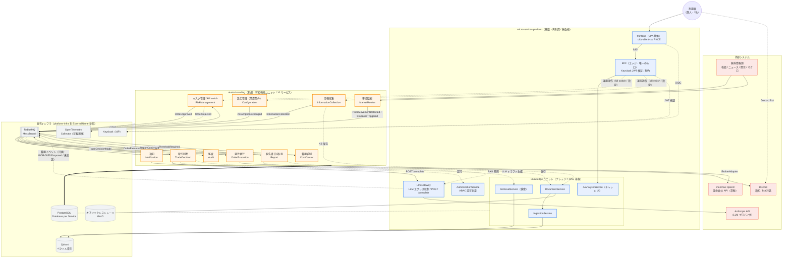
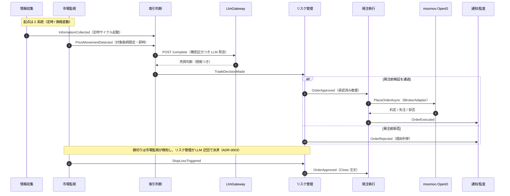

# システム構成図: ai-stock-trading（microservices-platform 拡張ユニット）

> 本書は生成 AI 株取引自動化ユニット（ai-stock-trading）を、その土台である
> microservices-platform（基盤）まで含めて俯瞰するシステム構成図である。上流計画書
> [`01_architecture-overview.md`](../../planning/projects/ai-stock-trading/06_technical/01_architecture-overview.md)（fixed）
> を、現時点の実装（10 サービス構成・LLM ゲートウェイ委譲）に合わせて詳細化した。計画上の新規 7 サービスに対し、
> 実装は監査（IADR-0019）・設定管理（IADR-0021）・費用統制（IADR-0027）を加えた 10 サービスへ拡張済みである。

## 起点となる計画書（トレーサビリティ）

- 技術検討: ai-stock-trading `06_technical/01_architecture-overview.md`、platform `06_technical/01_architecture-overview.md`
- ADR: [ADR-0001](../../planning/projects/ai-stock-trading/07_adr/ADR-0001_platform-reuse.md)（基盤再利用・無改修）、ADR-0002（証券会社アダプタ。計画リポ上 `Proposed`）、ADR-0003（損切り執行）
- 実装 ADR: IADR-0019（監査サービス）、IADR-0021（設定管理サービス）、IADR-0027（費用統制サービス）、IADR-0048（ローカル実行）、IADR-0052（k8s デプロイ）、IADR-0055（LLM 費用計測イベント。`Proposed`・未実装）
- 通信契約: [通信仕様書（イベント・ポート）](../api/events-and-ports.md)

## 読み方（凡例）

- **基盤（platform ユニット）** = microservices-platform。認証・認可・LLM エグレス統制・エッジ集約（BFF）・
  SPA 基盤・ナレッジ（RAG）を提供する再利用可能な土台。**本プロジェクトは基盤を一切改修しない**（ADR-0001）。
- **可変機能（ai-stock-trading ユニット）** = 本リポジトリ。取引ドメインの 10 サービスを、基盤の可変部分
  （イベント駆動パイプライン・ポート実装・コネクタ）として組み込む。
- 実線 = 実装済みの連携。破線 = 計画上の再利用で段階導入中の連携（RAG 参照・BFF 合成点等）。

## 全体システム構成図

## 取引サイクル（イベントフロー）

定時トリガー（`InformationCollected`）と価格変動トリガー（`PriceMovementDetected`）の 2 系統が、
同一の判断・発注パイプラインへ合流する。リスク統制（FR-10）は LLM 判断から独立した強制ポイントである。

## コンポーネント責務（実装 10 サービス）

| サービス | 起点 | 責務 | 主な発行イベント |
| --- | --- | --- | --- |
| InformationCollection | FR-01 | 無料情報源からの市況・ニュース・開示の取得・正規化・KB 保存 | `InformationCollected` |
| MarketMonitor | FR-03 | 監視銘柄の価格ポーリング、変動閾値・損切りライン検知 | `PriceMovementDetected` / `StopLossTriggered` |
| TradeDecision | FR-04 | 収集情報＋前提条件を文脈にした LLM 売買判断の生成（LlmGateway 委譲） | `TradeDecisionMade` |
| RiskManagement | FR-10 | 発注前の制約検証、損切りの機械的執行、kill switch | `OrderApproved` / `OrderRejected` |
| OrderExecution | FR-05 | 証券会社アダプタ経由の発注・注文状態追跡 | `OrderExecuted` |
| Report | FR-06 | 日報 / 週報 / 月報の集計・ドラフト生成・対話的確定 | `ReportConfirmed` |
| Notification | FR-09, FR-14 | イベント購読 → Discord 送信、Discord Bot 対話の中継（報告書質疑・kill switch 起動） | — |
| Configuration | FR-13 | 全体前提条件・取引ガード設定の管理（監視銘柄・閾値・上限の変更） | `AssumptionsChanged` |
| CostControl | NFR | LLM/運用費用のしきい値監視と統制状態遷移 | `CostThresholdReached` |
| Audit | FR-11 | 全イベントの監査記録 | — |

> Backtest は Worker としてデプロイされない補助サービス（過去データ検証用）。実 LLM・実市場データ・実発注・
> 外部送信は既定 no-op（fail-safe）で、`.env` の明示設定時のみ有効化される（IADR-0048）。

## デプロイ構成

- **ローカル（dev）**: docker-compose（IADR-0048）。`postgres` / `rabbitmq` / `keycloak` / `otel-collector`
  ＋ 10 Worker。全 Worker は Web SDK（`:8080`）で `/health/ready` を公開し、ホストへはポート非公開。
- **本番 / k8s**: Kubernetes（IADR-0052）。Helm chart `deploy/helm/ai-stock-trading`。共有インフラ
  （Postgres/RabbitMQ/Keycloak/otel）は platform の `platform-infra` を **ExternalName** で参照し、
  基盤側と共有する。moomoo OpenD は常駐コンテナ（`deploy/opend/`・IADR-0053）。実アダプタは
  SIMULATE（仮想売買）まで実装済みで、実弾発注は別ゲートで抑止する（ADR-0002 は計画リポ上まだ
  `Proposed`、実装判断は IADR-0056）。
- **機密**: moomoo 資格情報 / Discord Webhook は Vault/Secrets（ADR-0006）。**LLM プロバイダ鍵は AST では
  扱わない**（鍵は MSP の LlmGateway 側が保持し、AST は `LlmGateway:BaseUrl` 経由でゲートウェイを呼ぶだけ。
  ADR-0010 / IADR-0062 決定6）。

## 関連仕様

- 通信仕様書: [取引ドメインの通信契約（イベント・ポート）](../api/events-and-ports.md)
- 技術要件書: [tech-requirements.md](./tech-requirements.md)
- 上流計画（fixed）: [ai-stock-trading アーキテクチャ概要](../../planning/projects/ai-stock-trading/06_technical/01_architecture-overview.md)
