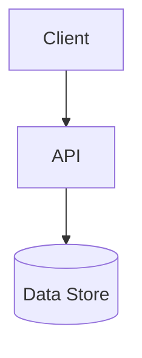

<!-- trace:
ids: []
adrs: [MSP:ADR-0019, MSP:ADR-0030]
iadrs: [IADR-0046, IADR-0048, IADR-0052, IADR-0053, IADR-0128, IADR-0259, IADR-0260, IADR-0263, IADR-0264, MSP:IADR-0282]
specs: [20260828_w9f4_vsa-migration-policy-and-docs]
issues: [#352, #353, #526, #527, #528]
-->


# 技術要件書

> 必須ドキュメント（リポジトリ単位）。本リポジトリの技術要件を定める。雛形は `docs/templates/tech_requirements_template.md`。
> **未記入のまま放置しない**。技術スタック・アーキテクチャ・非機能の実現方針を埋めること。確定判断は実装ADR（`.ai-context/adr/`）に残す。

## 本書が受け持つ範囲

- 技術検討: 基盤（platform）のバックエンドアプリケーションスタック（fixed・§プロジェクト構成）
- 関連する計画 ADR / 非機能要件: 基盤のアプリ層ライブラリ標準、およびユニット第一のリポジトリ構成／
  実装側では「ユニットリポジトリレイアウト（ルート直下 `backend/`・import-chain フォールバック props）」を採る。
  サービス単位のプロジェクト構成は、基盤側の方針転換に合わせて**単一プロジェクト＋VSA/DDD**へ移行中である
  （下記「プロジェクト構成」参照。逸脱ではなく基盤との整合）。

## 技術スタック

| 区分 | 採用 | バージョン | 備考 |
| --- | --- | --- | --- |
| 言語 |  |  |  |
| フレームワーク |  |  |  |
| データストア |  |  |  |
| インフラ / 実行環境 |  |  |  |

## アーキテクチャ概要



## 非機能要件の実現方針

| 区分 | 目標 | 実現方針 |
| --- | --- | --- |
| 性能 |  |  |
| 可用性 |  |  |
| セキュリティ |  |  |
| 運用・保守 |  |  |
| 拡張性 |  |  |

## プロジェクト構成（サービス単位）

**単一プロジェクト＋VSA/DDD 構成が目標であり、移行はサービス単位で行うため新旧が混在する期間がある**
（触る前に必ず現物を見る）。旧構成は基盤（platform）のアプリ層ライブラリ標準とバックエンドアプリケーション
スタック（fixed）が定めていた 7 標準（`Api` / `Application` / `Domain` / `Infrastructure` / `Contracts` /
`SharedKernel` / `Tests`）の実体化だったが、**基盤側もこの実体化を撤回し**、同じ単一プロジェクト＋VSA へ
移行している。したがって本移行は基盤標準からの逸脱ではなく、基盤との整合である。

### 目標構成（新）

```text
backend/Services/<Name>/
 ├── <Name>.csproj              # 単一プロジェクト（.Api 接尾辞なし）
 ├── Program.cs / appsettings*.json
 ├── Features/<集約>/           # Vertical Slice: Endpoint / Command|Query / Handler（操作単位の 3 段分割は採らない）
 ├── Domain/                    # エンティティ・値オブジェクト（外部依存ゼロ）
 ├── Infrastructure/{Persistence,Authentication,Messaging,ExternalServices}
 ├── Hosted/                    # BackgroundService（ルート直下）
 ├── Common/
 └── Tests/
      └── <Name>.Tests.csproj   # サービスにつき 1 プロジェクト
```

### 旧構成（未移送のサービスに残る）

```text
backend/Services/<Svc>/
 ├── src/
 │    ├── <Svc>.Api / .Application / .Domain（実体があるもののみ）/ .Infrastructure
 └── tests/
      └── <Svc>.<Layer>.Tests   # 本番プロジェクトと 1:1
```

| 標準 | 本リポジトリでの実体（新 / 旧） |
| --- | --- |
| サービス本体 | 新: `Services/<Name>/<Name>.csproj`（単一）／旧: `Services/<Svc>/src/<Svc>.<Layer>`（11 サービス。`Domain` は実体のある 9 サービスのみ） |
| Contracts | `backend/Shared/AiStockTrading.Shared.Contracts`（**ユニット単位で 1 つ**。新旧とも不変。サービス間共有のイベント契約の置き場） |
| SharedKernel | `backend/Shared/AiStockTrading.Shared.Kernel`（**実体あり**。サービスを跨いで消費される取引前提条件の型を持つ。依存グラフの葉であることをアーキテクチャテストが強制する） |
| Tests | 新: `Services/<Name>/Tests/<Name>.Tests.csproj`（サービスにつき 1）／旧: `Services/<Svc>/tests/<Svc>.<Layer>.Tests` ＋ 横断 `backend/Tests/{Architecture,Integration}.Tests`（実測。`PlanConformance.Tests` は `docs/tests/README.md` に記述があるが `backend/Tests/` に実体は無い。VSA 移行とは独立した既存の齟齬であり、本書はこの行を実測に合わせるに留め、`docs/tests/README.md` 側の是正は別途起票する） |
| （標準外） | **無し。** かつて設定サービスが持っていた「他サービスへ公開するクライアントライブラリ」は 2026-08-29 に廃止し、呼び出し元 2 サービスの `Infrastructure/ExternalServices/` へ吸収した（#526） |

- **サービスのルート名前空間は基盤と同じ規則で `<Name>Service` である**（`RiskManagementService.Domain` /
  `AuditService.Infrastructure.Persistence`）。`.Foundation` / `.Composable` の名前空間セグメントは持たない。
  **移送波は 11 サービスすべてで完了しており、`backend/Services/` 配下に `Foundation/` `Composable/` フォルダは
  1 つも残っていない**（残るのは据え置き集合の `backend/Shared/` と `backend/TestSupport/` の配下のみ）。
  **サービスのアセンブリ名・プロジェクト名は `<Name>Service` に統一された**（1 サービス = 本体 1 本 ＋ `Tests` 1 本）。
- **共有物の名前空間は `AiStockTrading.Shared.*` / `AiStockTrading.TestSupport.*` のまま据え置く**
  （横断テストの `AiStockTrading.Architecture.Tests` / `AiStockTrading.IntegrationTests` / `AiStockTrading.Bff.Endpoints` も同じ）。
  基盤も `Platform.Shared.*` を据え置いている。
- サービスのルート名前空間と同名だったアプリケーションサービス 6 クラスは `<Svc>AppService` へ改名した
  （同名だと、そのクラスが可視な場所から修飾名 `<Svc>Service.Domain.X` を書いたときにコンパイルできない）。
- **層の依存規律は csproj の静的解析（旧構成）とソース走査（新構成）を二重化して機械的に強制する**
  （`backend/Tests/AiStockTrading.Architecture.Tests`）。旧構成側の検査は (1) `Domain` の `PackageReference` が
  0 件 (2) `ProjectReference` が許可リスト内 (3) 推移閉包上のすべてのプロジェクトも `PackageReference` 0 件
  (4) 発見した `Domain` が一定数以上、の 4 点。新構成側はプロジェクト境界が無いため `Domain/` フォルダ配下の
  `using` を走査する（許可リスト方式・CPM 由来のパッケージ名から迂回トークンを導出）。**NsDepCop は導入しない**
  （移行元・移行先の基盤とも未導入であることを実地に確認したため）。
- コンテナのエントリポイントは単一 `backend/Dockerfile` を `SERVICE_PROJECT` / `SERVICE_DLL` で切り替える
  （`docker-compose.yml` / `scripts/k8s-local-images.sh` と同一の build args）。
- 総プロジェクト数は移行前で **99**（`backend/backend.slnx` 実測）。移行完了後はサービス本体・テストとも
  大きく減る見込みで、規模の実測は作業仕様書側（サービス移送時の PR）で都度更新する。

## 開発・ビルド・テスト・デプロイ

- **ビルド/テスト/整形**: `dotnet build|test backend/backend.slnx` / `dotnet format`（net10.0・**xUnit v3**（`xunit.v3`）+ AwesomeAssertions。実行は VSTest 経路＝`Microsoft.NET.Test.Sdk` + `xunit.runner.visualstudio` 3.x・#352）。
- **実行環境（dev）**: docker-compose／ ローカル k8s（k3d・Rancher Desktop 内蔵 k3s）。
- **デプロイ**: Kubernetes。Helm chart `deploy/helm/ai-stock-trading`（10 Worker）。共有インフラ（Postgres/RabbitMQ/Keycloak/otel）は MSP `platform-infra` を ExternalName で参照。イメージは `scripts/k8s-local-images.sh`（Rancher=nerdctl / Docker Desktop=k3d import・自動判定）。
- **moomoo OpenD**: 常駐コンテナ（`deploy/opend/`。ダウンロード方式の Docker Image を常駐させ、k8s へはオプトイン配備する）。
- **CI**: lint/build/test/coverage・gitleaks/dependency-review・commit-messages（`.github/workflows/`）。

## 未決事項
