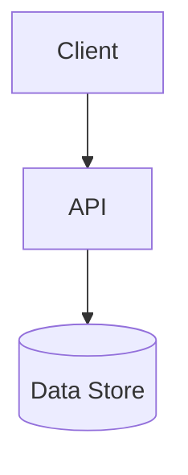

# 技術要件書

> 必須ドキュメント（リポジトリ単位）。本リポジトリの技術要件を定める。雛形は `docs/templates/tech_requirements_template.md`。
> **未記入のまま放置しない**。技術スタック・アーキテクチャ・非機能の実現方針を埋めること。確定判断は実装ADR（`docs/adr/`）に残す。

## 起点となる計画書（トレーサビリティ）

- 技術検討（06_technical）:
- 関連 ADR / 非機能要件（NFR）:

## 技術スタック

| 区分 | 採用 | バージョン | 備考 |
| --- | --- | --- | --- |
| 言語 |  |  |  |
| フレームワーク |  |  |  |
| データストア |  |  |  |
| インフラ / 実行環境 |  |  |  |

## アーキテクチャ概要

## 非機能要件の実現方針

| 区分 | 目標 | 実現方針 |
| --- | --- | --- |
| 性能 |  |  |
| 可用性 |  |  |
| セキュリティ |  |  |
| 運用・保守 |  |  |
| 拡張性 |  |  |

## 開発・ビルド・テスト・デプロイ

- **ビルド/テスト/整形**: `dotnet build|test backend/backend.slnx` / `dotnet format`（net10.0・xUnit）。
- **実行環境（dev）**: docker-compose（IADR-0048）／ ローカル k8s（k3d・Rancher Desktop 内蔵 k3s。microservices-platform#266）。
- **デプロイ**: Kubernetes（IADR-0052）。Helm chart `deploy/helm/ai-stock-trading`（10 Worker）。共有インフラ（Postgres/RabbitMQ/Keycloak/otel）は MSP `platform-infra` を ExternalName で参照。イメージは `scripts/k8s-local-images.sh`（Rancher=nerdctl / Docker Desktop=k3d import・自動判定）。
- **moomoo OpenD**: 常駐コンテナ（`deploy/opend/`・IADR-0053・常駐モデル）。
- **CI**: lint/build/test/coverage・gitleaks/dependency-review・commit-messages（`.github/workflows/`）。

## 未決事項
