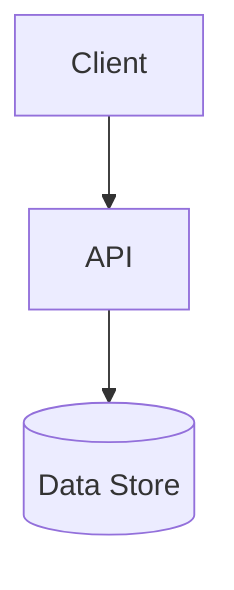

<!-- trace:
ids: []
adrs: []
iadrs: [IADR-0046, IADR-0048, IADR-0052, IADR-0128]
specs: [12_backend-application-stack, ADR-0019_unit-first-repo-structure, ADR-0030_backend-application-libraries]
issues: []
-->


# 技術要件書

> 必須ドキュメント（リポジトリ単位）。本リポジトリの技術要件を定める。雛形は `docs/templates/tech_requirements_template.md`。
> **未記入のまま放置しない**。技術スタック・アーキテクチャ・非機能の実現方針を埋めること。確定判断は実装ADR（`docs/adr/`）に残す。

## 起点となる計画書（トレーサビリティ）

- 技術検討（06_technical）: platform 12_backend-application-stack（計画リポ）（fixed・§プロジェクト構成）
- 関連 ADR / 非機能要件（NFR）: platform ADR-0030（アプリ層ライブラリ標準）・ADR-0019（ユニット第一構成）／
  実装 ADR IADR-0128: 標準プロジェクト構成は「Worker を Api / Infrastructure に割り、実体のある層だけを作る」形で実現する（標準プロジェクト構成）・IADR-0046: ユニットリポジトリレイアウト（ルート直下 backend/・import-chain フォールバック props）を採る（ユニットリポジトリレイアウト）

## 技術スタック

| 区分 | 採用 | バージョン | 備考 |
| --- | --- | --- | --- |
| 言語 |  |  |  |
| フレームワーク |  |  |  |
| データストア |  |  |  |
| インフラ / 実行環境 |  |  |  |

## アーキテクチャ概要



## 非機能要件の実現方針

| 区分 | 目標 | 実現方針 |
| --- | --- | --- |
| 性能 |  |  |
| 可用性 |  |  |
| セキュリティ |  |  |
| 運用・保守 |  |  |
| 拡張性 |  |  |

## プロジェクト構成（サービス単位）

platform **ADR-0030** / 12_backend-application-stack（計画リポ）（fixed）が定めた 7 標準
（`Api` / `Application` / `Domain` / `Infrastructure` / `Contracts` / `SharedKernel` / `Tests`）へ、
**実体があるものだけを作る**方針で揃える（IADR-0128: 標準プロジェクト構成は「Worker を Api / Infrastructure に割り、実体のある層だけを作る」形で実現する・#353）。
旧構成の `<Svc>.Worker`（ホストと技術詳細の同居）は廃止し、`Api` と `Infrastructure` に割った。

```text
backend/Services/<Svc>/
 ├── src/
 │    ├── <Svc>.Api             # Program.cs・appsettings*.json・Foundation/Endpoints（この 3 種類だけ）
 │    ├── <Svc>.Application     # ユースケース・ポート定義
 │    ├── <Svc>.Domain          # エンティティ・値オブジェクト（外部依存ゼロ。実体が無いサービスは作らない）
 │    └── <Svc>.Infrastructure  # EF Core・Migration・メッセージング consumer・外部 API アダプタ（上記以外すべて）
 └── tests/
      └── <Svc>.<Layer>.Tests   # 本番プロジェクトと 1:1
```

| 標準 | 本リポジトリでの実体 |
| --- | --- |
| Api / Application / Domain / Infrastructure | `backend/Services/<Svc>/src/<Svc>.<Layer>`（11 サービス。`Domain` は実体のある 9 サービスのみ） |
| Contracts | `backend/Shared/AiStockTrading.Shared.Contracts`（**ユニット単位で 1 つ**。サービス個別には作らない＝platform ADR-0019 決定 4。サービス間共有のイベント契約の置き場） |
| SharedKernel | **作らない**（`Result` / `Error` 型が未導入。ADR-0030 の但し書き「過度な共通化は避ける」に従う。導入は別 issue） |
| Tests | `backend/Services/<Svc>/tests/<Svc>.<Layer>.Tests` ＋ 横断 `backend/Tests/{Architecture,PlanConformance,Integration}.Tests` |
| （標準外） | `ConfigurationService.Client`＝他サービスへ公開するクライアントライブラリ。7 標準のどの層にも当たらないため第 8 のプロジェクトとして残す |

- 名前空間・アセンブリ名は `AiStockTrading.<Short>.<Layer>[.<下位階層>]`（`<Short>` = サービス名から接尾辞 `Service` を除いたもの）。
- **層の依存規律はアーキテクチャテストで機械的に強制する**（`backend/Tests/AiStockTrading.Architecture.Tests`。csproj の静的解析）。
  検査は (1) `Domain` の `PackageReference` が 0 件 (2) `ProjectReference` が許可リスト（`*.Domain` / `*.SharedKernel` /
  `AiStockTrading.Shared.Contracts`）内 (3) **推移閉包上のすべてのプロジェクトも `PackageReference` 0 件**（迂回の遮断）
  (4) 発見した `Domain` が 9 件以上（探索が空振りしたまま緑になるのを防ぐ）の 4 点。
- コンテナのエントリポイントは単一 `backend/Dockerfile` を `SERVICE_PROJECT` / `SERVICE_DLL`（＝`<Svc>.Api`）で切り替える
  （`docker-compose.yml` / `scripts/k8s-local-images.sh` と同一の build args）。
- 総プロジェクト数は **99**（`backend/backend.slnx` 実測）。

## 開発・ビルド・テスト・デプロイ

- **ビルド/テスト/整形**: `dotnet build|test backend/backend.slnx` / `dotnet format`（net10.0・**xUnit v3**（`xunit.v3`）+ AwesomeAssertions。実行は VSTest 経路＝`Microsoft.NET.Test.Sdk` + `xunit.runner.visualstudio` 3.x・#352）。
- **実行環境（dev）**: docker-compose／ ローカル k8s（k3d・Rancher Desktop 内蔵 k3s。MSP#266）。
- **デプロイ**: Kubernetes。Helm chart `deploy/helm/ai-stock-trading`（10 Worker）。共有インフラ（Postgres/RabbitMQ/Keycloak/otel）は MSP `platform-infra` を ExternalName で参照。イメージは `scripts/k8s-local-images.sh`（Rancher=nerdctl / Docker Desktop=k3d import・自動判定）。
- **moomoo OpenD**: 常駐コンテナ（`deploy/opend/`・IADR-0053・常駐モデル）。
- **CI**: lint/build/test/coverage・gitleaks/dependency-review・commit-messages（`.github/workflows/`）。

## 未決事項
